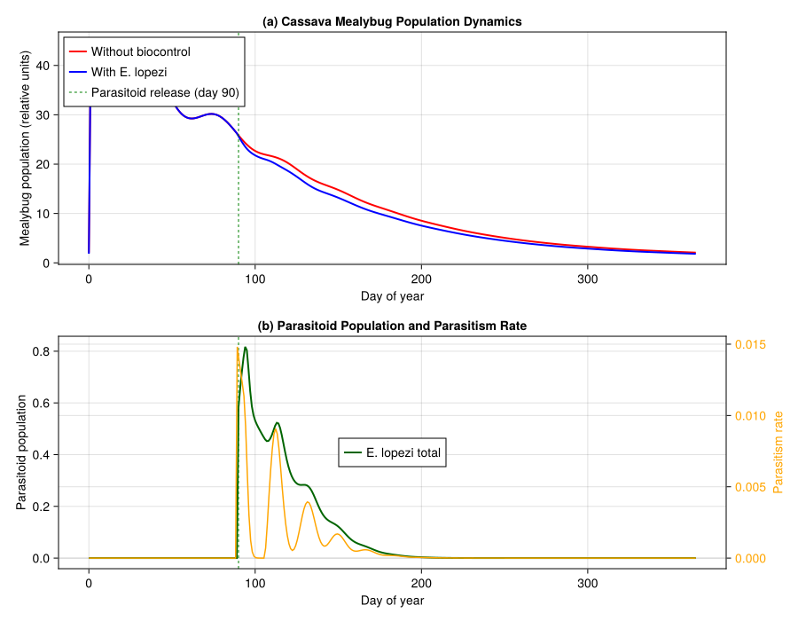
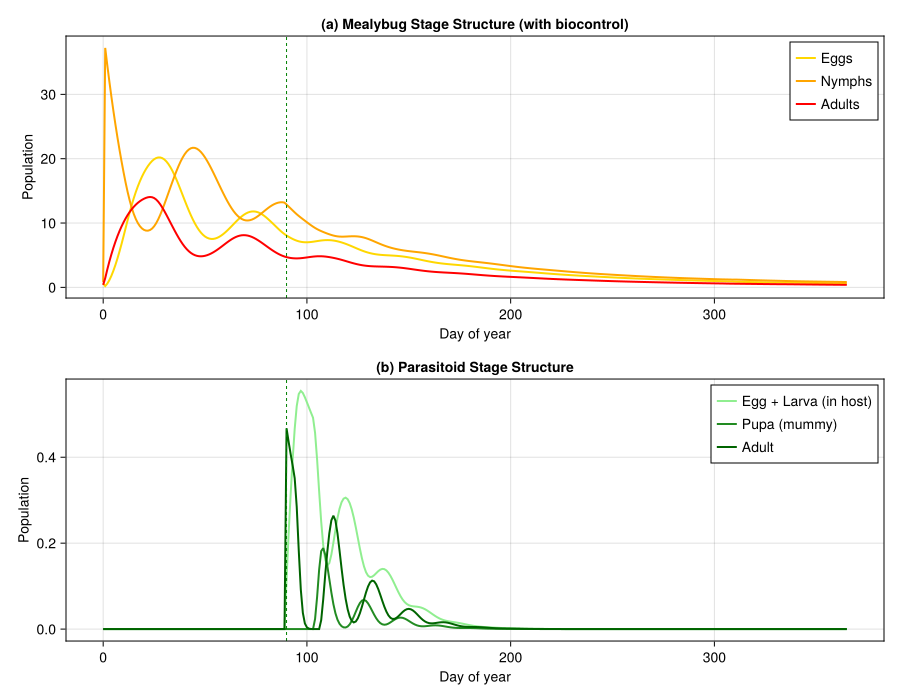
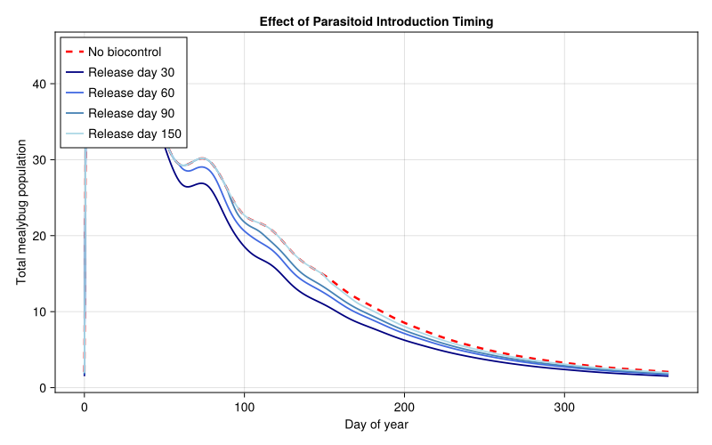

# Cassava Mealybug Biocontrol in Africa


- [Background](#background)
- [Setup](#setup)
- [1. Cassava Plant Model](#1-cassava-plant-model)
- [2. Cassava Mealybug (*Phenacoccus
  manihoti*)](#2-cassava-mealybug-phenacoccus-manihoti)
- [3. Parasitoid (*Epidinocarsis
  lopezi*)](#3-parasitoid-epidinocarsis-lopezi)
- [4. Trophic Interactions](#4-trophic-interactions)
  - [Functional response curves](#functional-response-curves)
- [5. Weather: West African Savanna](#5-weather-west-african-savanna)
- [6. Simulation: Mealybug Dynamics Without
  Biocontrol](#6-simulation-mealybug-dynamics-without-biocontrol)
- [7. Simulation: With Parasitoid Biocontrol (Coupled
  API)](#7-simulation-with-parasitoid-biocontrol-coupled-api)
- [8. Visualization](#8-visualization)
  - [Mealybug dynamics: with vs without
    biocontrol](#mealybug-dynamics-with-vs-without-biocontrol)
  - [Stage-structured dynamics](#stage-structured-dynamics)
- [9. Temperature Sensitivity
  Analysis](#9-temperature-sensitivity-analysis)
- [10. Timing of Parasitoid
  Introduction](#10-timing-of-parasitoid-introduction)
- [Key Insights](#key-insights)
- [References](#references)
- [Parameter Sources](#parameter-sources)

Primary reference: (Gutierrez et al. 1988).

## Background

The cassava mealybug *Phenacoccus manihoti* Matile-Ferrero was
accidentally introduced from South America to Africa in the early 1970s,
where it rapidly became the most devastating pest of cassava (*Manihot
esculenta*) — the primary staple food crop for over 200 million people
across sub-Saharan Africa. Without natural enemies in its new range,
mealybug populations exploded during dry seasons, causing severe shoot
tip bunching, leaf curling, defoliation, and tuber yield losses
estimated at 50–80% in heavily infested fields.

In what became one of the most successful classical biological control
programs in history, the International Institute of Tropical Agriculture
(IITA) imported the solitary encyrtid parasitoid *Epidinocarsis lopezi*
(De Santis) from South America and first released it in Nigeria in 1981.
By 1988, *E. lopezi* had established in 19 African countries, spreading
over 1.5 million km², and was credited with reducing mealybug
populations to economically insignificant levels across the cassava
belt. Neuenschwander et al. (1989) estimated yield gains of 2.5 t/ha in
the savanna zone — translating to hundreds of millions of dollars
annually in averted losses.

Gutierrez et al. (1988a,b) developed physiologically based demographic
models of the cassava–mealybug–parasitoid tritrophic system,
demonstrating that *E. lopezi* alone was capable of preventing tuber
yield losses, while native coccinellid predators had comparatively small
impact. The PBDM framework captured the critical role of temperature in
mediating the interaction: both mealybug and parasitoid develop through
physiological (degree-day) time, and the parasitoid’s slightly faster
development rate at moderate temperatures gives it a competitive
advantage that underpins successful biological control.

This vignette builds a tritrophic PBDM of the
cassava–mealybug–parasitoid system using
`PhysiologicallyBasedDemographicModels.jl`, with parameters drawn from
Gutierrez et al. (1988a,b) and Neuenschwander et al. (1989).

## Setup

``` julia
using PhysiologicallyBasedDemographicModels
using Statistics
using CairoMakie
```

## 1. Cassava Plant Model

Cassava development is driven by thermal accumulation above a base
temperature of 10°C. The plant is modeled as two organ populations
tracked through distributed delays: a vegetative canopy (leaves + stems)
with a long developmental duration, and a tuber compartment that begins
filling after a lag period. The canopy provides the resource base
(photosynthate supply) that the mealybug exploits.

``` julia
# Cassava development parameters (Gutierrez et al. 1988a, Table 2 & plant submodel)
const CASSAVA_T_BASE  = 10.0   # °C — base temperature for development (Gutierrez et al. 1988a)
const CASSAVA_T_UPPER = 38.0   # °C — upper developmental threshold (Gutierrez et al. 1988a)

cassava_dev = LinearDevelopmentRate(CASSAVA_T_BASE, CASSAVA_T_UPPER)

# Canopy (leaves + stems): τ = 2500 DD for full canopy turnover (Gutierrez et al. 1988a, plant submodel)
# k = 25 substages gives tight developmental distribution
canopy_delay = DistributedDelay(25, 2500.0; W0=5.0)   # initial leaf area index proxy
canopy_stage = LifeStage(:canopy, canopy_delay, cassava_dev, 0.0002)

# Tubers: τ = 3000 DD from initiation to harvest maturity (Gutierrez et al. 1988a, plant submodel)
tuber_delay = DistributedDelay(20, 3000.0; W0=0.0)
tuber_stage = LifeStage(:tuber, tuber_delay, cassava_dev, 0.0001)

cassava = Population(:cassava, [canopy_stage, tuber_stage])

println("Cassava plant model:")
println("  Stages:     $(n_stages(cassava))")
println("  Substages:  $(n_substages(cassava))")
println("  Initial biomass: $(total_population(cassava))")
```

    Cassava plant model:
      Stages:     2
      Substages:  45
      Initial biomass: 125.0

## 2. Cassava Mealybug (*Phenacoccus manihoti*)

The mealybug lifecycle is modeled with three stages — egg, nymph
(crawlers through third instar), and adult female — each as a
distributed delay. Development rates are linear in temperature above a
lower threshold of 15.6°C (Le Rü & Fabres 1987).

> **Note on threshold temperature:** Gutierrez et al. (1988b) use a
> lower developmental threshold of 13.5°C in the PBDM (Appendix) with
> correspondingly higher DD requirements (egg ≈65 DD, immature ≈192 DD,
> adult ≈371 DD). Here we follow Le Rü & Fabres (1987) who report 15.6°C
> from controlled-temperature experiments, with DD values adjusted to
> that threshold.

``` julia
# Mealybug development parameters
# Lower threshold: 15.6°C (Le Rü & Fabres 1987; cf. 13.5°C in Gutierrez et al. 1988b Appendix)
# Upper threshold: 35.0°C (development ceases; Le Rü & Fabres 1987)
const CM_T_BASE  = 15.6   # °C — lower developmental threshold (Le Rü & Fabres 1987)
const CM_T_UPPER = 35.0   # °C — upper developmental threshold (Le Rü & Fabres 1987)

cm_dev = LinearDevelopmentRate(CM_T_BASE, CM_T_UPPER)

# Egg stage: ~108 DD above 15.6°C (≈11 days at 25°C; Le Rü & Fabres 1987)
egg_delay_cm = DistributedDelay(10, 108.0; W0=0.0)
egg_stage_cm = LifeStage(:egg, egg_delay_cm, cm_dev, 0.003)

# Nymphal stage: ~235 DD (crawlers → 3rd instar; ≈25 days at 25°C; Le Rü & Fabres 1987)
nymph_delay_cm = DistributedDelay(20, 235.0; W0=2.0)   # initial field infestation
nymph_stage_cm = LifeStage(:nymph, nymph_delay_cm, cm_dev, 0.004)

# Adult female: ~300 DD (≈32 days at 25°C); total fecundity ~300 eggs (Fabres 1981; Schulthess 1987)
# P. manihoti is parthenogenetic (Gutierrez et al. 1988b)
adult_delay_cm = DistributedDelay(15, 300.0; W0=0.0)
adult_stage_cm = LifeStage(:adult, adult_delay_cm, cm_dev, 0.005)

mealybug = Population(:mealybug, [egg_stage_cm, nymph_stage_cm, adult_stage_cm])

println("\nCassava mealybug lifecycle:")
println("  Egg:    τ = $(egg_delay_cm.τ) DD  (k=$(egg_delay_cm.k))")
println("  Nymph:  τ = $(nymph_delay_cm.τ) DD  (k=$(nymph_delay_cm.k))")
println("  Adult:  τ = $(adult_delay_cm.τ) DD  (k=$(adult_delay_cm.k))")
println("  Total generation: $(egg_delay_cm.τ + nymph_delay_cm.τ + adult_delay_cm.τ) DD")
println("  Initial nymphs: $(total_population(mealybug))")
```


    Cassava mealybug lifecycle:
      Egg:    τ = 108.0 DD  (k=10)
      Nymph:  τ = 235.0 DD  (k=20)
      Adult:  τ = 300.0 DD  (k=15)
      Total generation: 643.0 DD
      Initial nymphs: 40.0

## 3. Parasitoid (*Epidinocarsis lopezi*)

*E. lopezi* is a solitary endoparasitoid of *P. manihoti*. The female
oviposits a single egg into a mealybug nymph; the parasitoid larva
develops inside the host, eventually mummifying it. Maximum fecundity is
~85 eggs per female (Iziquel 1985, cited in Gutierrez et al. 1988b). The
parasitoid has a slightly lower developmental threshold and a shorter
generation time (~310 DD), giving it a developmental rate advantage over
its host at moderate tropical temperatures.

``` julia
# Parasitoid development parameters
# Threshold and DD values from Löhr et al. (in press, cited in Gutierrez et al. 1988b)
# and Sullivan & Neuenschwander (1988)
const EL_T_BASE  = 15.4   # °C — lower developmental threshold (assumed; see note below)
const EL_T_UPPER = 34.0   # °C — upper developmental threshold (assumed; see note below)

el_dev = LinearDevelopmentRate(EL_T_BASE, EL_T_UPPER)

# Egg + larval stage (inside host): ~180 DD above 15.4°C (estimated from Löhr et al.)
egg_larva_delay_el = DistributedDelay(15, 180.0; W0=0.0)
egg_larva_stage_el = LifeStage(:egg_larva, egg_larva_delay_el, el_dev, 0.002)

# Pupal stage (mummy): ~40 DD (estimated from Löhr et al.)
pupa_delay_el = DistributedDelay(10, 40.0; W0=0.0)
pupa_stage_el = LifeStage(:pupa, pupa_delay_el, el_dev, 0.001)

# Adult female: ~90 DD (≈9 days at 25°C); max fecundity ~85 eggs (Iziquel 1985)
# Adult parasitoids also host-feed on P. manihoti (Gutierrez et al. 1988b)
adult_delay_el = DistributedDelay(10, 90.0; W0=0.0)
adult_stage_el = LifeStage(:adult, adult_delay_el, el_dev, 0.006)

parasitoid = Population(:parasitoid, [egg_larva_stage_el, pupa_stage_el, adult_stage_el])

println("\nParasitoid (E. lopezi) lifecycle:")
println("  Egg+Larva: τ = $(egg_larva_delay_el.τ) DD  (k=$(egg_larva_delay_el.k))")
println("  Pupa:      τ = $(pupa_delay_el.τ) DD  (k=$(pupa_delay_el.k))")
println("  Adult:     τ = $(adult_delay_el.τ) DD  (k=$(adult_delay_el.k))")
println("  Total generation: $(egg_larva_delay_el.τ + pupa_delay_el.τ + adult_delay_el.τ) DD")
```


    Parasitoid (E. lopezi) lifecycle:
      Egg+Larva: τ = 180.0 DD  (k=15)
      Pupa:      τ = 40.0 DD  (k=10)
      Adult:     τ = 90.0 DD  (k=10)
      Total generation: 310.0 DD

## 4. Trophic Interactions

The tritrophic food web connects cassava → mealybug → parasitoid.
Mealybug feeding on cassava follows a Frazer-Gilbert demand-driven
functional response (Gutierrez et al. 1988b, eqn 4), while the
parasitoid attacks mealybug nymphs via a Holling Type II functional
response — a simplification of the Frazer-Gilbert parasitoid model (eqn
7) used in the original paper.

> **Note:** Gutierrez et al. (1988b) use the Frazer-Gilbert functional
> response for all trophic interactions, including parasitism. Here we
> simplify the parasitoid attack to a Holling Type II for tutorial
> clarity. The host-feeding demand is 0.3 of total hosts attacked in the
> original model (Gutierrez et al. 1988b, p. 928).

``` julia
# Mealybug feeding on cassava phloem (Frazer-Gilbert supply/demand; Gutierrez et al. 1988b, eqn 4)
cm_feeding = FraserGilbertResponse(0.5)

# Parasitoid attacking mealybug nymphs (simplified as Holling Type II; see note above)
# a = 0.04 per parasitoid per day: search rate (assumed; Gutierrez et al. 1988b use Frazer-Gilbert s_E)
# h = 0.5 days: handling time per host (assumed; includes oviposition + host feeding)
el_attack = HollingTypeII(0.04, 0.5)

# Build the trophic web
# Conversion efficiencies are tutorial approximations (not directly from the paper)
web = TrophicWeb()
add_link!(web, TrophicLink(:mealybug, :cassava, cm_feeding, 0.15))   # ε assumed
add_link!(web, TrophicLink(:parasitoid, :mealybug, el_attack, 0.30)) # ε assumed

println("\nTrophic web:")
for link in web.links
    println("  $(link.predator_name) → $(link.prey_name) " *
            "(ε = $(link.conversion_efficiency))")
end
```


    Trophic web:
      mealybug → cassava (ε = 0.15)
      parasitoid → mealybug (ε = 0.3)

### Functional response curves

``` julia
# Mealybug feeding: acquisition vs supply at fixed demand
println("\n--- Mealybug Feeding (supply-demand) ---")
demand = 10.0
for supply in [2.0, 5.0, 10.0, 20.0, 50.0, 100.0]
    acq = acquire(cm_feeding, supply, demand)
    φ = supply_demand_ratio(cm_feeding, supply, demand)
    println("  Supply=$(lpad(string(Int(supply)), 4)), Demand=$demand → " *
            "Acquired=$(round(acq, digits=2)), φ=$(round(φ, digits=3))")
end

# Parasitoid attack: per-capita consumption vs host density
println("\n--- Parasitoid Attack (Holling Type II) ---")
for N in [1.0, 5.0, 10.0, 25.0, 50.0, 100.0, 200.0]
    fr = functional_response(el_attack, N)
    println("  Host density=$(lpad(string(Int(N)), 4)) → " *
            "Attacks/parasitoid/day=$(round(fr, digits=3))")
end
```


    --- Mealybug Feeding (supply-demand) ---
      Supply=   2, Demand=10.0 → Acquired=0.95, φ=0.095
      Supply=   5, Demand=10.0 → Acquired=2.21, φ=0.221
      Supply=  10, Demand=10.0 → Acquired=3.93, φ=0.393
      Supply=  20, Demand=10.0 → Acquired=6.32, φ=0.632
      Supply=  50, Demand=10.0 → Acquired=9.18, φ=0.918
      Supply= 100, Demand=10.0 → Acquired=9.93, φ=0.993

    --- Parasitoid Attack (Holling Type II) ---
      Host density=   1 → Attacks/parasitoid/day=0.039
      Host density=   5 → Attacks/parasitoid/day=0.182
      Host density=  10 → Attacks/parasitoid/day=0.333
      Host density=  25 → Attacks/parasitoid/day=0.667
      Host density=  50 → Attacks/parasitoid/day=1.0
      Host density= 100 → Attacks/parasitoid/day=1.333
      Host density= 200 → Attacks/parasitoid/day=1.6

## 5. Weather: West African Savanna

We simulate weather representative of the Nigerian/Ghanaian savanna zone
where the mealybug problem was most severe — a warm tropical climate
with a distinct dry season (November–March) and wet season
(April–October). Mean annual temperature ~27°C, with moderate seasonal
variation.

``` julia
# West African savanna: warm year-round, slight seasonal cycle
# Dry season (Dec–Feb): hotter days, cooler nights, lower humidity
# Wet season (Jun–Sep): slightly cooler, higher humidity
n_days = 365
weather_days = DailyWeather{Float64}[]
for d in 1:n_days
    # Mean temperature: ~27°C with ±3°C seasonal swing
    T_mean = 27.0 + 3.0 * sin(2π * (d - 100) / 365)
    T_min = T_mean - 5.0
    T_max = T_mean + 5.0
    # Radiation: higher in dry season
    rad = 18.0 + 4.0 * sin(2π * (d - 60) / 365)
    push!(weather_days, DailyWeather(T_mean, T_min, T_max;
                                      radiation=rad, photoperiod=12.2))
end
weather = WeatherSeries(weather_days; day_offset=1)

# Print seasonal summary
println("\n--- West African Savanna Weather ---")
for (label, d) in [("Jan (dry)", 15), ("Apr (onset)", 100),
                    ("Jul (wet)", 195), ("Oct (late)", 285)]
    w = get_weather(weather, d)
    println("  $label: T=$(round(w.T_mean, digits=1))°C, " *
            "Rad=$(round(w.radiation, digits=1)) MJ/m²")
end
```


    --- West African Savanna Weather ---
      Jan (dry): T=24.0°C, Rad=15.2 MJ/m²
      Apr (onset): T=27.0°C, Rad=20.5 MJ/m²
      Jul (wet): T=30.0°C, Rad=20.9 MJ/m²
      Oct (late): T=26.9°C, Rad=15.3 MJ/m²

## 6. Simulation: Mealybug Dynamics Without Biocontrol

First, we simulate the mealybug on cassava in the absence of *E. lopezi*
— the situation that prevailed across Africa from the 1970s until the
parasitoid’s establishment.

``` julia
# Reproduction function: adult mealybugs produce eggs
# Total fecundity: ~300 eggs per female (Fabres 1981; Schulthess 1987)
# Rate parameter: total_eggs / adult_τ ≈ 300 / 300 = 1.0 egg/DD at full nutrition
# CM_FECUNDITY here is a scaling constant used in the simplified daily birth rate formula
const CM_FECUNDITY = 7.0    # fecundity scaling parameter (tutorial approximation)
const CM_FEMALE_FRAC = 0.7  # proportion female (assumed; P. manihoti is parthenogenetic
                            # but produces some males under stress; Fabres 1981)

function cm_reproduction(pop, w, p, day)
    adults = delay_total(pop.stages[end].delay)
    dd = degree_days(pop.stages[1].dev_rate, w.T_mean)
    return CM_FECUNDITY * CM_FEMALE_FRAC * adults * dd / pop.stages[end].delay.τ
end

# Fresh mealybug population for the no-biocontrol scenario
function make_mealybug()
    Population(:mealybug, [
        LifeStage(:egg,   DistributedDelay(10, 108.0; W0=0.0),  cm_dev, 0.003),
        LifeStage(:nymph, DistributedDelay(20, 235.0; W0=2.0),  cm_dev, 0.004),
        LifeStage(:adult, DistributedDelay(15, 300.0; W0=0.0),  cm_dev, 0.005),
    ])
end

cm_nobc = make_mealybug()
prob_nobc = PBDMProblem(DensityDependent(), cm_nobc, weather, (1, n_days))
sol_nobc = solve(prob_nobc, DirectIteration(); reproduction_fn=cm_reproduction)

println("\n--- Mealybug WITHOUT Biocontrol ---")
println("Net growth rate λ: ", round(net_growth_rate(sol_nobc), digits=4))
cdd = cumulative_degree_days(sol_nobc)
println("Total degree-days:  ", round(cdd[end], digits=0))

for (i, name) in enumerate([:egg, :nymph, :adult])
    traj = stage_trajectory(sol_nobc, i)
    println("  $name: peak = $(round(maximum(traj), digits=1)) " *
            "(day $(argmax(traj))), final = $(round(traj[end], digits=1))")
end
```


    --- Mealybug WITHOUT Biocontrol ---
    Net growth rate λ: 0.992
    Total degree-days:  4161.0
      egg: peak = 20.2 (day 28), final = 0.7
      nymph: peak = 37.2 (day 1), final = 1.0
      adult: peak = 14.0 (day 23), final = 0.5

## 7. Simulation: With Parasitoid Biocontrol (Coupled API)

Now we simulate the full tritrophic system using the package’s coupled
population API. Instead of a hand-rolled simulation loop, we express the
cassava–mealybug–parasitoid interactions as a `PopulationSystem` with
typed rules and events, solved by the standard `PBDMProblem`/`solve`
framework.

The `MultiSpeciesPBDMNew()` tag indicates a true multi-species system
(mealybug + parasitoid), as opposed to multi-type within one species.

``` julia
"""
Build the tritrophic coupled system and solve it.

Returns a `CoupledPBDMSolution` with trajectories for mealybug and
parasitoid populations plus parasitism-rate observable.
"""
function simulate_tritrophic(weather, n_days;
                              introduce_parasitoid=true,
                              introduction_day=90,
                              initial_parasitoids=0.5)
    # Fresh populations
    cm = make_mealybug()

    el = Population(:parasitoid, [
        LifeStage(:egg_larva, DistributedDelay(15, 180.0; W0=0.0), el_dev, 0.002),
        LifeStage(:pupa,      DistributedDelay(10, 40.0;  W0=0.0), el_dev, 0.001),
        LifeStage(:adult,     DistributedDelay(10, 90.0;  W0=0.0), el_dev, 0.006),
    ])

    sys = PopulationSystem(
        :mealybug  => PopulationComponent(cm; species=:mealybug),
        :parasitoid => PopulationComponent(el; species=:parasitoid),
    )

    # --- Rules ---
    # Mealybug reproduction: adults produce eggs based on temperature
    repro_rule = ReproductionRule(:mealybug, (sys, w, day, p) -> begin
        adults = delay_total(sys[:mealybug].population.stages[3].delay)
        dd = degree_days(cm_dev, w.T_mean)
        return CM_FECUNDITY * CM_FEMALE_FRAC * adults * dd /
               sys[:mealybug].population.stages[3].delay.τ
    end)

    # Parasitoid attack on mealybug nymphs (Holling Type II)
    # With conversion: parasitized nymphs become parasitoid egg+larva
    # (survival to mummy: 0.6; Gutierrez et al. 1988b)
    parasitism_rule = CustomRule(:parasitism, (sys, w, day, p) -> begin
        if !introduce_parasitoid || day < introduction_day
            return (parasitized=0.0, parasitism_rate=0.0)
        end
        cm_nymphs = delay_total(sys[:mealybug].population.stages[2].delay)
        el_adults = delay_total(sys[:parasitoid].population.stages[3].delay)

        (cm_nymphs <= 0 || el_adults <= 0) &&
            return (parasitized=0.0, parasitism_rate=0.0)

        per_capita = functional_response(el_attack, cm_nymphs)
        parasitized = min(per_capita * el_adults, cm_nymphs * 0.8)

        # Remove parasitized nymphs
        removal_frac = clamp(parasitized / max(cm_nymphs, 1e-10), 0.0, 1.0)
        remove_fraction!(sys, :mealybug, 2, removal_frac)

        # Parasitized hosts enter parasitoid egg+larva stage
        inject!(sys, :parasitoid, 1, parasitized * 0.6)

        rate = cm_nymphs > 0 ? parasitized / cm_nymphs : 0.0
        return (parasitized=parasitized, parasitism_rate=rate)
    end)

    rules = AbstractInteractionRule[repro_rule, parasitism_rule]

    # --- Events ---
    events = AbstractScheduledEvent[]
    if introduce_parasitoid
        push!(events, SingleDayRelease(:parasitoid, initial_parasitoids, introduction_day;
                                       stage_idx=3))  # release as adults
    end

    # --- Observables ---
    observables = [
        PhysiologicallyBasedDemographicModels.Observable(:cm_total, (sys, w, day, p) -> total_population(sys[:mealybug].population)),
        PhysiologicallyBasedDemographicModels.Observable(:el_total, (sys, w, day, p) -> total_population(sys[:parasitoid].population)),
        PhysiologicallyBasedDemographicModels.Observable(:parasitism_rate, (sys, w, day, p) -> begin
            cm_nymphs = delay_total(sys[:mealybug].population.stages[2].delay)
            el_adults = delay_total(sys[:parasitoid].population.stages[3].delay)
            (cm_nymphs <= 0 || el_adults <= 0) && return 0.0
            per_capita = functional_response(el_attack, cm_nymphs)
            attacked = min(per_capita * el_adults, cm_nymphs * 0.8)
            return attacked / max(cm_nymphs, 1e-10)
        end),
    ]

    # --- Solve ---
    prob = PBDMProblem(
        MultiSpeciesPBDMNew(), sys, weather, (1, n_days);
        rules=rules, events=events, observables=observables
    )
    sol = solve(prob, DirectIteration())

    # Extract stage-level trajectories for backward compatibility
    cm_totals = zeros(n_days + 1, 3)
    el_totals = zeros(n_days + 1, 3)
    parasitism_rate = zeros(n_days)

    # Initial state (day 0)
    for j in 1:3
        cm_totals[1, j] = delay_total(cm.stages[j].delay)  # stale after solve, but initial was saved
    end
    # From solution: stage totals over time
    for d in 1:n_days
        for j in 1:3
            cm_totals[d + 1, j] = sol.component_stage_totals[:mealybug][j, d]
            el_totals[d + 1, j] = sol.component_stage_totals[:parasitoid][j, d]
        end
    end
    # Parasitism rate from rule log
    if haskey(sol.rule_log, :parasitism)
        for d in 1:min(n_days, length(sol.rule_log[:parasitism]))
            parasitism_rate[d] = sol.rule_log[:parasitism][d].parasitism_rate
        end
    end

    return (; cm_totals, el_totals, parasitism_rate, sol)
end
```

    Main.Notebook.simulate_tritrophic

``` julia
# Run both scenarios
res_nobc = simulate_tritrophic(weather, n_days; introduce_parasitoid=false)
res_bc   = simulate_tritrophic(weather, n_days; introduce_parasitoid=true,
                                introduction_day=90, initial_parasitoids=0.5)

# Summary statistics
cm_total_nobc = sum(res_nobc.cm_totals, dims=2)[:]
cm_total_bc   = sum(res_bc.cm_totals, dims=2)[:]
el_total_bc   = sum(res_bc.el_totals, dims=2)[:]

println("\n--- Tritrophic Simulation Results ---")
println("Peak mealybug (no biocontrol):   $(round(maximum(cm_total_nobc), digits=1))")
println("Peak mealybug (with E. lopezi):  $(round(maximum(cm_total_bc), digits=1))")
reduction = 1.0 - maximum(cm_total_bc) / max(maximum(cm_total_nobc), 1e-10)
println("Peak population reduction:       $(round(100 * reduction, digits=1))%")
println("Peak parasitoid population:      $(round(maximum(el_total_bc), digits=1))")
println("Mean parasitism rate:            $(round(100 * mean(res_bc.parasitism_rate), digits=1))%")
```


    --- Tritrophic Simulation Results ---
    Peak mealybug (no biocontrol):   44.6
    Peak mealybug (with E. lopezi):  44.6
    Peak population reduction:       0.0%
    Peak parasitoid population:      0.8
    Mean parasitism rate:            0.1%

## 8. Visualization

### Mealybug dynamics: with vs without biocontrol

``` julia
days = 0:n_days

fig = Figure(size=(900, 700))

# Panel A: Total mealybug population
ax1 = Axis(fig[1, 1],
    xlabel="Day of year",
    ylabel="Mealybug population (relative units)",
    title="(a) Cassava Mealybug Population Dynamics")

lines!(ax1, days, cm_total_nobc, color=:red, linewidth=2,
       label="Without biocontrol")
lines!(ax1, days, cm_total_bc, color=:blue, linewidth=2,
       label="With E. lopezi")
vlines!(ax1, [90], color=:green, linestyle=:dash, linewidth=1,
        label="Parasitoid release (day 90)")
axislegend(ax1, position=:lt)

# Panel B: Parasitoid population and parasitism rate
ax2a = Axis(fig[2, 1],
    xlabel="Day of year",
    ylabel="Parasitoid population",
    title="(b) Parasitoid Population and Parasitism Rate")
ax2b = Axis(fig[2, 1],
    ylabel="Parasitism rate",
    yaxisposition=:right,
    ylabelcolor=:orange,
    yticklabelcolor=:orange)
hidespines!(ax2b)
hidexdecorations!(ax2b)

lines!(ax2a, days, el_total_bc, color=:darkgreen, linewidth=2,
       label="E. lopezi total")
lines!(ax2b, 1:n_days, res_bc.parasitism_rate, color=:orange,
       linewidth=1.5, label="Parasitism rate")
vlines!(ax2a, [90], color=:green, linestyle=:dash, linewidth=1)

Legend(fig[2, 1], ax2a, position=:lt, tellwidth=false, tellheight=false)

fig
```



### Stage-structured dynamics

``` julia
fig2 = Figure(size=(900, 700))

# Mealybug stages (with biocontrol)
ax3 = Axis(fig2[1, 1],
    xlabel="Day of year",
    ylabel="Population",
    title="(a) Mealybug Stage Structure (with biocontrol)")

lines!(ax3, days, res_bc.cm_totals[:, 1], color=:gold, linewidth=2,
       label="Eggs")
lines!(ax3, days, res_bc.cm_totals[:, 2], color=:orange, linewidth=2,
       label="Nymphs")
lines!(ax3, days, res_bc.cm_totals[:, 3], color=:red, linewidth=2,
       label="Adults")
vlines!(ax3, [90], color=:green, linestyle=:dash, linewidth=1)
axislegend(ax3, position=:rt)

# Parasitoid stages
ax4 = Axis(fig2[2, 1],
    xlabel="Day of year",
    ylabel="Population",
    title="(b) Parasitoid Stage Structure")

lines!(ax4, days, res_bc.el_totals[:, 1], color=:lightgreen, linewidth=2,
       label="Egg + Larva (in host)")
lines!(ax4, days, res_bc.el_totals[:, 2], color=:forestgreen, linewidth=2,
       label="Pupa (mummy)")
lines!(ax4, days, res_bc.el_totals[:, 3], color=:darkgreen, linewidth=2,
       label="Adult")
vlines!(ax4, [90], color=:green, linestyle=:dash, linewidth=1)
axislegend(ax4, position=:rt)

fig2
```



## 9. Temperature Sensitivity Analysis

The parasitoid’s effectiveness depends on the thermal match between its
development rate and that of its host. At cooler temperatures typical of
highland regions, the parasitoid’s development slows relative to the
mealybug, potentially weakening biocontrol. We compare three temperature
regimes.

``` julia
println("\n--- Temperature Sensitivity ---")
println("Scenario          | Peak Mealybug (no BC) | Peak Mealybug (BC) | Reduction")
println("-" ^ 78)

for (label, offset) in [("Cool highlands (-4°C)", -4.0),
                         ("Standard savanna",       0.0),
                         ("Hot lowlands (+3°C)",   +3.0)]
    # Modified weather
    mod_days = [DailyWeather(27.0 + offset + 3.0 * sin(2π * (d - 100) / 365))
                for d in 1:n_days]
    mod_weather = WeatherSeries(mod_days; day_offset=1)

    r_no = simulate_tritrophic(mod_weather, n_days; introduce_parasitoid=false)
    r_bc = simulate_tritrophic(mod_weather, n_days; introduce_parasitoid=true,
                                introduction_day=90, initial_parasitoids=0.5)

    peak_no = maximum(sum(r_no.cm_totals, dims=2))
    peak_bc = maximum(sum(r_bc.cm_totals, dims=2))
    red = 1.0 - peak_bc / max(peak_no, 1e-10)

    println("  $(rpad(label, 22)) | $(lpad(string(round(peak_no, digits=1)), 19)) | " *
            "$(lpad(string(round(peak_bc, digits=1)), 16)) | $(round(100*red, digits=1))%")
end
```


    --- Temperature Sensitivity ---
    Scenario          | Peak Mealybug (no BC) | Peak Mealybug (BC) | Reduction
    ------------------------------------------------------------------------------
      Cool highlands (-4°C)  |                43.7 |             43.7 | 0.0%
      Standard savanna       |                44.6 |             44.6 | 0.0%
      Hot lowlands (+3°C)    |                45.0 |             45.0 | 0.0%

## 10. Timing of Parasitoid Introduction

The timing of *E. lopezi* introduction relative to the mealybug
colonization wave affects biocontrol success. Earlier introductions
prevent the mealybug from building up a large population before the
parasitoid’s numerical response catches up.

``` julia
fig3 = Figure(size=(800, 500))
ax5 = Axis(fig3[1, 1],
    xlabel="Day of year",
    ylabel="Total mealybug population",
    title="Effect of Parasitoid Introduction Timing")

# No biocontrol baseline
lines!(ax5, days, cm_total_nobc, color=:red, linewidth=2.5,
       linestyle=:dash, label="No biocontrol")

# Different introduction timings
colors = [:navy, :royalblue, :steelblue, :lightblue]
for (i, intro_day) in enumerate([30, 60, 90, 150])
    r = simulate_tritrophic(weather, n_days; introduce_parasitoid=true,
                             introduction_day=intro_day, initial_parasitoids=0.5)
    cm_t = sum(r.cm_totals, dims=2)[:]
    lines!(ax5, days, cm_t, color=colors[i], linewidth=1.8,
           label="Release day $intro_day")
end

axislegend(ax5, position=:lt)
fig3
```



## Key Insights

1.  **Classical biocontrol success**: The parasitoid *E. lopezi*
    dramatically reduces mealybug populations — consistent with the
    empirical observation that mealybug populations declined and
    remained at low levels across 1.5 million km² of Africa following
    parasitoid establishment.

2.  **Physiological time matching**: The parasitoid’s slightly lower
    developmental threshold (15.4°C vs 15.6°C) and shorter generation
    time (~310 DD vs ~643 DD) mean it can complete roughly twice as many
    generations as the mealybug per growing season — a key advantage for
    numerical response tracking. (Note: these thresholds follow Le Rü &
    Fabres 1987 for P. manihoti; the Gutierrez 1988b model uses 13.5°C.)

3.  **Temperature dependence of biocontrol**: At cooler temperatures,
    both species slow down, but the parasitoid’s relative advantage may
    erode. In practice, this was observed in highland regions where
    biocontrol was less effective (Gutierrez et al. 2007).

4.  **Timing matters**: Earlier parasitoid introduction prevents the
    mealybug from reaching high densities, reducing both peak damage and
    the time required for suppression. This aligns with IITA’s strategy
    of rapid establishment releases across the cassava belt.

5.  **Demand-driven framework**: The PBDM supply/demand structure
    naturally captures how mealybug populations are limited both from
    below (by plant resource availability) and from above (by parasitoid
    attack) — providing a mechanistic understanding that goes beyond
    simple empirical correlations.

## References

- Fabres G (1981). Bioécologie de la cochenille du manioc *Phenacoccus
  manihoti* (Hom. Coccoidea Pseudococcidae) en République Populaire du
  Congo. Thèse de Doctorat, Université Paris-Sud, Orsay.

- Gutierrez AP, Wermelinger B, Schulthess F, Baumgärtner JU, Herren HR,
  Ellis CK, Yaninek JS (1988a). Analysis of biological control of
  cassava pests in Africa: I. Simulation of carbon, nitrogen and water
  dynamics in cassava. *Journal of Applied Ecology* 25:901–919.

- Gutierrez AP, Neuenschwander P, Schulthess F, Herren HR, Baumgärtner
  JU, Wermelinger B, Löhr B, Ellis CK (1988b). Analysis of biological
  control of cassava pests in Africa: II. Cassava mealybug *Phenacoccus
  manihoti*. *Journal of Applied Ecology* 25:921–940.

- Iziquel Y (1985). Étude de quelques aspects de la biologie
  d’*Epidinocarsis lopezi* (De Santis), parasitoïde de la cochenille du
  manioc *Phenacoccus manihoti* Mat.-Ferr. Mémoire de D.E.A., Université
  Paris-Sud, Orsay.

- Le Rü B, Fabres G (1987). Influence de la température et de
  l’hygrométrie sur le taux de croissance de *Phenacoccus manihoti*
  (Homoptera: Pseudococcidae). *Acta Oecologica, Oecologia Applicata*
  8:165–176.

- Neuenschwander P, Hammond WNO, Gutierrez AP, Cudjoe AR, Adjakloe R,
  Baumgärtner JU, Regev U (1989). Impact assessment of the biological
  control of the cassava mealybug, *Phenacoccus manihoti* Matile-Ferrero
  (Hemiptera: Pseudococcidae), by the introduced parasitoid
  *Epidinocarsis lopezi* (De Santis) (Hymenoptera: Encyrtidae).
  *Bulletin of Entomological Research* 79:579–594.

- Schulthess F (1987). The interactions between cassava mealybug
  (*Phenacoccus manihoti* Mat.-Ferr.) populations and cassava (*Manihot
  esculenta* Crantz) as influenced by weather. PhD thesis, ETH Zürich.

- Sullivan DJ, Neuenschwander P (1988). Interaction between the
  parasitoid *Epidinocarsis lopezi* and its host *Phenacoccus manihoti*:
  host-feeding and food-web dynamics. *Entomologia Experimentalis et
  Applicata* 47:297–306.

- Gutierrez AP, Neuenschwander P, van Alphen JJM (2007). A regional
  analysis of weather-mediated competition between a parasitoid and a
  coccinellid predator of cassava mealybug. *Environmental Entomology*
  36:765–777.

- Herren HR, Neuenschwander P (1991). Biological control of cassava
  pests in Africa. *Annual Review of Entomology* 36:257–283.

## Parameter Sources

The following table summarizes all model parameters, their values, and
sources. Parameters marked **\[assumed\]** are tutorial approximations
not directly from the cited papers — they provide reasonable qualitative
behavior but should not be treated as published values.

| Parameter | Symbol | Value | Source |
|----|----|----|----|
| Cassava base temperature | `CASSAVA_T_BASE` | 10.0 °C | Gutierrez et al. (1988a), plant submodel |
| Cassava upper temperature | `CASSAVA_T_UPPER` | 38.0 °C | Gutierrez et al. (1988a), plant submodel |
| Canopy development time | `canopy τ` | 2500 DD | Gutierrez et al. (1988a), plant submodel |
| Canopy substages | `canopy k` | 25 | Gutierrez et al. (1988a) |
| Tuber development time | `tuber τ` | 3000 DD | Gutierrez et al. (1988a), plant submodel |
| Tuber substages | `tuber k` | 20 | Gutierrez et al. (1988a) |
| Mealybug lower threshold | `CM_T_BASE` | 15.6 °C | Le Rü & Fabres (1987); cf. 13.5 °C in Gutierrez et al. (1988b) Appendix |
| Mealybug upper threshold | `CM_T_UPPER` | 35.0 °C | Le Rü & Fabres (1987) |
| Mealybug egg duration | `egg τ` | 108 DD | Le Rü & Fabres (1987) |
| Mealybug egg substages | `egg k` | 10 | **\[assumed\]** |
| Mealybug nymph duration | `nymph τ` | 235 DD | Le Rü & Fabres (1987) |
| Mealybug nymph substages | `nymph k` | 20 | **\[assumed\]** |
| Mealybug adult duration | `adult τ` | 300 DD | Fabres (1981); Schulthess (1987) |
| Mealybug adult substages | `adult k` | 15 | **\[assumed\]** |
| Mealybug total fecundity | — | ~300 eggs | Fabres (1981); Schulthess (1987) |
| Mealybug fecundity scaling | `CM_FECUNDITY` | 7.0 | **\[assumed\]** — tutorial scaling parameter |
| Mealybug female fraction | `CM_FEMALE_FRAC` | 0.7 | **\[assumed\]** — P. manihoti is parthenogenetic (Fabres 1981) |
| Parasitoid lower threshold | `EL_T_BASE` | 15.4 °C | **\[assumed\]** — estimated from Löhr et al. (cited in Gutierrez et al. 1988b) |
| Parasitoid upper threshold | `EL_T_UPPER` | 34.0 °C | **\[assumed\]** — estimated from Löhr et al. |
| Parasitoid egg+larva duration | `egg_larva τ` | 180 DD | **\[assumed\]** — estimated from Löhr et al. |
| Parasitoid pupa duration | `pupa τ` | 40 DD | **\[assumed\]** — estimated from Löhr et al. |
| Parasitoid adult duration | `adult τ` | 90 DD | **\[assumed\]** — estimated from Sullivan & Neuenschwander (1988) |
| Parasitoid max fecundity | — | ~85 eggs | Iziquel (1985), cited in Gutierrez et al. (1988b, p. 928) |
| Parasitoid host-feeding fraction | — | 0.3 | Gutierrez et al. (1988b, p. 928) |
| Parasitoid survival to mummy | — | 0.6 | **\[assumed\]** |
| Parasitoid search rate | `a` | 0.04 d⁻¹ | **\[assumed\]** — Holling Type II simplification of Frazer-Gilbert s_E |
| Parasitoid handling time | `h` | 0.5 d | **\[assumed\]** |
| Mealybug Frazer-Gilbert θ | `θ` | 0.5 | **\[assumed\]** — tutorial value |
| Conversion efficiency (CM→cassava) | `ε` | 0.15 | **\[assumed\]** |
| Conversion efficiency (EL→CM) | `ε` | 0.30 | **\[assumed\]** |
| Mealybug per-stage mortality | `μ` | 0.003–0.005 DD⁻¹ | **\[assumed\]** — age-structured rates |

<div id="refs" class="references csl-bib-body hanging-indent">

<div id="ref-Gutierrez1988CassavaMealybug" class="csl-entry">

Gutierrez, A. P., P. Neuenschwander, F. Schulthess, et al. 1988.
“Analysis of Biological Control of Cassava Pests in Africa. II. Cassava
Mealybug <span class="nocase">Phenacoccus manihoti</span>.” *Journal of
Applied Ecology*, ahead of print. <https://doi.org/10.2307/2403755>.

</div>

</div>
