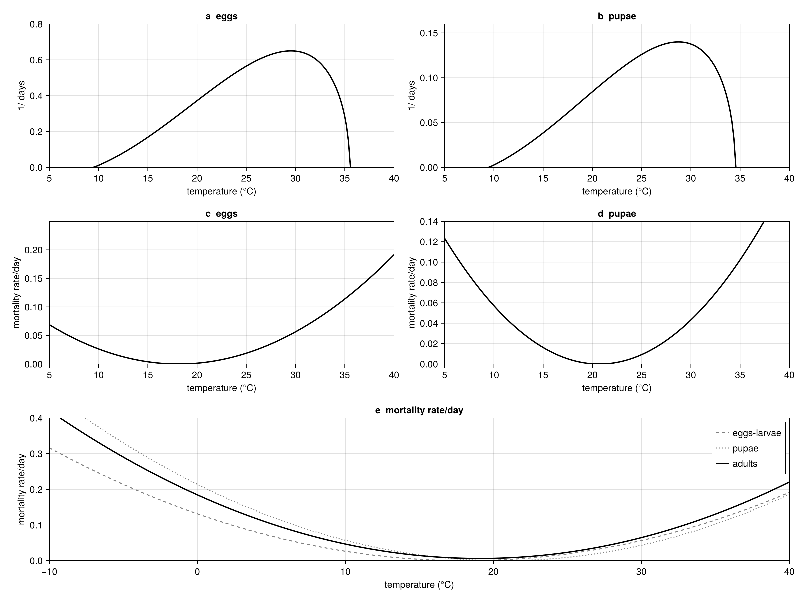

Primary reference: [@Gutierrez2011Medfly].


## Background

The Mediterranean fruit fly (*Ceratitis capitata* Wied., medfly) is a
polyphagous tropical pest of East African origin that has spread to the
Mediterranean Basin, South and Central America, Hawaii, and Western
Australia. The fly was first detected in California in 1975, triggering
a decades-long detection/eradication campaign costing over \$300 million.
Despite repeated introductions confirmed by microsatellite and mtDNA
analysis, persistent measurable populations have not established widely
in California — raising the question of whether climate itself limits
the fly's range.

Medfly lacks a diapause stage. Adults can enter reproductive quiescence
during host-free periods or temperature extremes, and some individuals
survive over 200 days at cool temperatures. The fly's polyphagous diet
(citrus, stone fruit, pome fruit, coffee, guava) means host availability
is rarely the binding constraint — **temperature** is the primary
determinant of geographic range.

This vignette uses the physiologically based demographic model (PBDM)
framework of Gutierrez and Ponti (2011) to assess medfly establishment
potential across California climate zones. We model the fly's
temperature-driven development, mortality, and reproduction using
distributed delay dynamics, and compare population growth potential
in coastal, inland, and desert locations.

**Reference:** Gutierrez, A.P. & Ponti, L. (2011). Assessing the
invasive potential of the Mediterranean fruit fly in California and
Italy. *Biological Invasions* 13:2661–2676.

## Medfly Life History Parameters

The medfly life cycle consists of four stages: egg, larva, pupa, and
adult. Each stage has temperature-dependent development rates with
distinct lower and upper thermal thresholds. Parameters are drawn
from Gutierrez and Ponti (2011, Table 1), using data from Shoukry and
Hafez (1979), Messenger and Flitters (1958), and Vargas et al. (2000).

```{julia}
using PhysiologicallyBasedDemographicModels

# ── Medfly life history constants ──────────────────────────────────
# All values from Gutierrez & Ponti (2011) unless noted otherwise.
# "Table 1" etc. refer to that paper throughout.

# Lower developmental thresholds (°C)
const T_LOWER_EGG   = 10.5  # Table 1; Messenger & Flitters 1958
const T_LOWER_LARVA = 10.5  # Table 1 (same as egg)
const T_LOWER_PUPA  = 9.5   # Table 1; Corvetti et al. 1986
const T_LOWER_ADULT = 9.5   # Table 1 (same as pupa)

# Upper developmental thresholds (°C) — Brière et al. (1999) fits
const T_UPPER_EGG   = 35.5  # Eq. 1, Fig. 2a
const T_UPPER_LARVA = 35.5  # Eq. 1 (assumed same as egg)
const T_UPPER_PUPA  = 34.5  # Eq. 1, Fig. 2b
const T_UPPER_ADULT = 34.5  # Eq. 1 (assumed same as pupa)

# Degree-day durations (dd above lower threshold)
# Table 1; data from Shoukry & Hafez (1979) at 25°C
const τ_EGG    = 31.0    # Table 1
const τ_LARVA  = 97.0    # Table 1
const τ_PUPA   = 165.0   # Table 1
const τ_PREOVA = 48.0    # Table 1 (pre-oviposition period)
const τ_ADULT  = 673.0   # Table 1 (total adult reproductive lifespan)
const τ_QUIESC = 1050.0  # Table 1 (quiescent female lifespan)

# Distributed delay k-values (Erlang shape parameter)
const k_EGG   = 15  # Table 1
const k_LARVA = 15  # Table 1
const k_PUPA  = 40  # Table 1
const k_ADULT = 40  # Table 1

# Initial population
const N0_PUPAE = 50.0  # Table 1: 50 pupae/tree

# Sex ratio
const SEX_RATIO = 0.5  # Table 1: 1:1 (proportion female)

# Immigration rate
const IMMIGRATION_RATE = 0.5e-7  # Table 1: 0.5 × 10⁻⁷ females/day

# Mortality coefficients — Eq. 2, Gutierrez & Ponti 2011
# μ_egg_larval = a·T² − b·T + c  (Eq. 2i; r²=0.46, n=31)
const μ_EL_A = 0.0004   # Eq. 2i
const μ_EL_B = 0.0145   # Eq. 2i
const μ_EL_C = 0.1314   # Eq. 2i
# μ_pupal = a·T² − b·T + c  (Eq. 2ii; r²=0.76, n=15)
const μ_PU_A = 0.0005   # Eq. 2ii
const μ_PU_B = 0.0207   # Eq. 2ii
const μ_PU_C = 0.2142   # Eq. 2ii
# μ_adult = a·T² − b·T + c  (Eq. 2iii; r²=0.95, n=5)
const μ_AD_A = 0.00049  # Eq. 2iii  ← paper value (not 0.0049)
const μ_AD_B = 0.0187   # Eq. 2iii
const μ_AD_C = 0.1846   # Eq. 2iii

# Fecundity temperature scaling — Eq. 4i, Fig. 3b
const T_FEC_MIN = 15.0   # Eq. 4i: φ(T)=0
const T_FEC_MAX = 32.0   # Eq. 4i: φ(T)=0
const T_FEC_MID = 23.5   # Eq. 4i: φ(T)=1

medfly_params = (
    egg   = (T_lower=T_LOWER_EGG,   T_upper=T_UPPER_EGG,   τ=τ_EGG,   k=k_EGG),
    larva = (T_lower=T_LOWER_LARVA,  T_upper=T_UPPER_LARVA, τ=τ_LARVA, k=k_LARVA),
    pupa  = (T_lower=T_LOWER_PUPA,   T_upper=T_UPPER_PUPA,  τ=τ_PUPA,  k=k_PUPA),
    adult = (T_lower=T_LOWER_ADULT,  T_upper=T_UPPER_ADULT, τ=τ_ADULT, k=k_ADULT),
)

println("Medfly life stage parameters (Table 1, Gutierrez & Ponti 2011):")
println("="^65)
println("Stage  | T_lower | T_upper | DD required | k substages")
println("-"^65)
for (name, p) in pairs(medfly_params)
    println("  $(rpad(String(name), 7))| $(rpad(p.T_lower, 8))| $(rpad(p.T_upper, 8))| " *
            "$(rpad(p.τ, 12))| $(p.k)")
end
println("\nAdditional durations (Table 1):")
println("  Pre-oviposition:   $(τ_PREOVA) dd > $(T_LOWER_ADULT)°C")
println("  Quiescent females: $(τ_QUIESC) dd > $(T_LOWER_ADULT)°C")
```

## Temperature-Dependent Development Rates

We use `LinearDevelopmentRate` for degree-day accumulation. At each
temperature, degree-days are accumulated above the lower threshold up
to the upper threshold, consistent with the distributed maturation
time framework of DiCola et al. (1999).

```{julia}
# Development rate models for each stage
egg_dev   = LinearDevelopmentRate(T_LOWER_EGG,   T_UPPER_EGG)
larva_dev = LinearDevelopmentRate(T_LOWER_LARVA, T_UPPER_LARVA)
pupa_dev  = LinearDevelopmentRate(T_LOWER_PUPA,  T_UPPER_PUPA)
adult_dev = LinearDevelopmentRate(T_LOWER_ADULT, T_UPPER_ADULT)

# Degree-day accumulation at representative temperatures
println("\nDegree-days per day at different temperatures:")
println("T(°C) | Egg/Larva | Pupa/Adult | Days for egg | Days for pupa")
println("-"^68)
for T in [10.0, 15.0, 18.0, 20.0, 25.0, 30.0, 35.0, 38.0]
    dd_el = degree_days(egg_dev, T)
    dd_pa = degree_days(pupa_dev, T)
    d_egg  = dd_el > 0 ? round(τ_EGG / dd_el, digits=1) : Inf
    d_pupa = dd_pa > 0 ? round(τ_PUPA / dd_pa, digits=1) : Inf
    println("  $(rpad(T, 5)) | $(rpad(round(dd_el, digits=1), 10))| " *
            "$(rpad(round(dd_pa, digits=1), 11))| " *
            "$(rpad(d_egg, 13))| $d_pupa")
end
```

## Temperature-Dependent Mortality

Gutierrez and Ponti (2011) estimated quadratic mortality functions for
each stage (Eq. 2). Mortality is lowest near the optimum temperature
and increases sharply at both thermal extremes.

```{julia}
# Mortality rate functions — Eq. 2 (Gutierrez & Ponti 2011)
μ_egg_larval(T) = max(0.0, μ_EL_A * T^2 - μ_EL_B * T + μ_EL_C)  # Eq. 2i
μ_pupal(T)      = max(0.0, μ_PU_A * T^2 - μ_PU_B * T + μ_PU_C)  # Eq. 2ii
μ_adult(T)      = max(0.0, μ_AD_A * T^2 - μ_AD_B * T + μ_AD_C)  # Eq. 2iii

# Optimal temperatures where mortality is minimized (∂μ/∂T = 0)
T_opt_egg   = μ_EL_B / (2 * μ_EL_A)  # ≈ 18.1°C
T_opt_pupa  = μ_PU_B / (2 * μ_PU_A)  # ≈ 20.7°C
T_opt_adult = μ_AD_B / (2 * μ_AD_A)  # ≈ 19.1°C

println("Optimal temperatures (minimum mortality):")
println("  Egg-larval: $(round(T_opt_egg, digits=1))°C")
println("  Pupal:      $(round(T_opt_pupa, digits=1))°C")
println("  Adult:      $(round(T_opt_adult, digits=1))°C")

println("\nDaily mortality rates across temperatures:")
println("T(°C) | Egg-larval | Pupal   | Adult")
println("-"^50)
for T in [5.0, 10.0, 15.0, 18.0, 20.0, 25.0, 30.0, 35.0, 40.0]
    println("  $(rpad(T, 5)) | $(rpad(round(μ_egg_larval(T), digits=4), 11))| " *
            "$(rpad(round(μ_pupal(T), digits=4), 8))| " *
            "$(round(μ_adult(T), digits=4))")
end
```

## Cohort Survival Through Development

The fraction of a cohort surviving from egg to adult emergence depends
on accumulated mortality over the entire developmental period.

```{julia}
# Survival of a cohort through its developmental period at constant T
# N(t_f) = N(t_0) × ∏(1 - μ(T))  over the development period
function cohort_survival(T::Real)
    dd_egg   = degree_days(egg_dev, T)
    dd_larva = degree_days(larva_dev, T)
    dd_pupa  = degree_days(pupa_dev, T)

    # Days to complete each stage
    (dd_egg <= 0 || dd_larva <= 0 || dd_pupa <= 0) && return 0.0

    days_egg   = ceil(Int, τ_EGG / dd_egg)
    days_larva = ceil(Int, τ_LARVA / dd_larva)
    days_pupa  = ceil(Int, τ_PUPA / dd_pupa)

    # Daily survival = 1 - μ(T), compounded over stage duration
    surv_egg   = (1 - μ_egg_larval(T))^days_egg
    surv_larva = (1 - μ_egg_larval(T))^days_larva
    surv_pupa  = (1 - μ_pupal(T))^days_pupa

    return surv_egg * surv_larva * surv_pupa
end

println("Cohort survival (egg to adult) at constant temperatures:")
println("T(°C) | Surv. egg | Surv. larva | Surv. pupa | Total")
println("-"^62)
for T in [10.0, 12.0, 15.0, 18.0, 20.0, 22.0, 25.0, 28.0, 30.0, 33.0, 36.0]
    dd_e = degree_days(egg_dev, T)
    dd_p = degree_days(pupa_dev, T)
    if dd_e > 0 && dd_p > 0
        de = ceil(Int, τ_EGG / dd_e)
        dl = ceil(Int, τ_LARVA / dd_e)
        dp = ceil(Int, τ_PUPA / dd_p)
        se = (1 - μ_egg_larval(T))^de
        sl = (1 - μ_egg_larval(T))^dl
        sp = (1 - μ_pupal(T))^dp
        total = se * sl * sp
        println("  $(rpad(T, 5)) | $(rpad(round(se, digits=3), 10))| " *
                "$(rpad(round(sl, digits=3), 12))| " *
                "$(rpad(round(sp, digits=3), 11))| $(round(total, digits=3))")
    else
        println("  $(rpad(T, 5)) | no development")
    end
end
```

## Fecundity Profile

Age-specific fecundity depends on both temperature and adult age (in
degree-days). The temperature scaling function φ(T) (Eq. 4) is a
concave function zero at 15°C and 32°C, peaking at 23.5°C.

```{julia}
# Temperature-dependent fecundity scaling — Eq. 4i
# φ(T) = 1 - ((T - T_mid) / (T_mid - T_min))², clamped to [0, 1]

function fecundity_scale(T::Real)
    return clamp(1.0 - ((T - T_FEC_MID) / (T_FEC_MID - T_FEC_MIN))^2, 0.0, 1.0)
end

# Age-specific oviposition profile at 22°C (Eq. 4ii, Muñiz & Gil 1986)
# F(x, T) = φ(T) × f(x), where f(x) = 0.43x / 1.006^x
# x = age in degree-days > 9.5°C
function daily_fecundity(age_dd::Real, T::Real)
    age_dd <= 0 && return 0.0
    return fecundity_scale(T) * 0.43 * age_dd / 1.006^age_dd
end

println("Fecundity temperature scaling φ(T):")
println("T(°C) | φ(T)  | Classification")
println("-"^45)
for T in [12.0, 15.0, 18.0, 20.0, 23.5, 25.0, 28.0, 30.0, 32.0, 35.0]
    φ = fecundity_scale(T)
    class = φ ≈ 0.0 ? "no reproduction" :
            φ < 0.3 ? "marginal" :
            φ < 0.7 ? "moderate" : "optimal"
    println("  $(rpad(T, 5)) | $(rpad(round(φ, digits=3), 6))| $class")
end
```

## Building the Medfly Population Model

We construct a four-stage distributed delay model using the package's
`LifeStage` and `Population` types. Background mortality rates are
set to the optimum-temperature values from the quadratic functions.

```{julia}
# Convert daily mortality at T_opt to per-degree-day mortality
# At T_opt, dd/day ≈ T_opt - T_lower
# μ_dd ≈ μ_daily / dd_per_day

μ_dd_egg   = μ_egg_larval(T_opt_egg) / max(1.0, T_opt_egg - T_LOWER_EGG)
μ_dd_larva = μ_egg_larval(T_opt_egg) / max(1.0, T_opt_egg - T_LOWER_LARVA)
μ_dd_pupa  = μ_pupal(T_opt_pupa) / max(1.0, T_opt_pupa - T_LOWER_PUPA)
μ_dd_adult = μ_adult(T_opt_adult) / max(1.0, T_opt_adult - T_LOWER_ADULT)

println("Per-degree-day mortality rates at T_opt:")
println("  Egg:   $(round(μ_dd_egg, digits=5))")
println("  Larva: $(round(μ_dd_larva, digits=5))")
println("  Pupa:  $(round(μ_dd_pupa, digits=5))")
println("  Adult: $(round(μ_dd_adult, digits=5))")

# Build initial medfly population (Table 1: 50 pupae/tree)
function build_medfly(; n_pupae=N0_PUPAE)
    stages = [
        LifeStage(:egg,   DistributedDelay(k_EGG,   τ_EGG;   W0=0.0),
                  egg_dev, μ_dd_egg),
        LifeStage(:larva, DistributedDelay(k_LARVA,  τ_LARVA; W0=0.0),
                  larva_dev, μ_dd_larva),
        LifeStage(:pupa,  DistributedDelay(k_PUPA,   τ_PUPA;  W0=n_pupae),
                  pupa_dev, μ_dd_pupa),
        LifeStage(:adult, DistributedDelay(k_ADULT,  τ_ADULT; W0=0.0),
                  adult_dev, μ_dd_adult),
    ]
    return Population(:medfly, stages)
end

medfly = build_medfly()
println("\nMedfly population model:")
println("  Stages: $(n_stages(medfly))")
println("  Total substages: $(n_substages(medfly))")
println("  Initial population: $(total_population(medfly)) (pupae)")
```

## California Climate Zones

We define synthetic weather for representative California locations
spanning the coastal, Central Valley, and desert climate zones.
Each location is characterized by its mean annual temperature,
seasonal amplitude, and latitude.

```{julia}
# Representative California locations
# Parameters approximate the long-term climate
california_locations = [
    # (Name, latitude, mean_T, amplitude, description)
    ("San Diego",      32.7, 18.0, 4.0,  "south coastal — warm, mild year-round"),
    ("Los Angeles",    34.0, 17.5, 5.5,  "south coastal — warm, moderate seasons"),
    ("Santa Barbara",  34.4, 16.0, 4.5,  "central coast — mild, marine influence"),
    ("San Jose",       37.3, 15.5, 7.0,  "SF Bay Area — mild but cooler winters"),
    ("Fresno",         36.7, 17.5, 11.0, "Central Valley — hot summers, cold winters"),
    ("Sacramento",     38.6, 16.5, 10.0, "Central Valley — continental extremes"),
    ("Riverside",      33.9, 19.0, 9.0,  "inland SoCal — hot, moderate winters"),
    ("Palm Springs",   33.8, 24.0, 12.0, "desert — extreme summer heat"),
]

println("California reference locations:")
println("="^70)
println("Location       | Lat   | Mean T | Amp  | Winter min | Summer max")
println("-"^70)
for (name, lat, mean_T, amp, _) in california_locations
    t_min = round(mean_T - amp, digits=1)
    t_max = round(mean_T + amp, digits=1)
    println("  $(rpad(name, 14))| $(rpad(lat, 6))| $(rpad(mean_T, 7))| " *
            "$(rpad(amp, 5))| $(rpad(t_min, 11))| $t_max")
end
```

## Simulating Medfly Across Climate Zones

We simulate one year of medfly dynamics at each location, starting
with 50 pupae per tree at day 1. The simulation runs for 365 days,
tracking population through all life stages.

```{julia}
# Run annual simulation at each location
annual_results = Dict{String, Any}()

for (name, lat, mean_T, amp, desc) in california_locations
    # Create sinusoidal weather (peak temperature in late July, ~day 200)
    sw = SinusoidalWeather(mean_T, amp; phase=200.0)

    # Build a fresh population
    pop = build_medfly()

    # Generate daily weather for one year
    weather_days = [get_weather(sw, d) for d in 1:365]
    ws = WeatherSeries(weather_days; day_offset=1)

    # Set up and solve the PBDM problem
    prob = PBDMProblem(pop, ws, (1, 365))
    sol = solve(prob, DirectIteration())

    # Compute metrics
    cdd = cumulative_degree_days(sol)
    total_dd = cdd[end]
    total_pop = [sum(u) for u in sol.u]
    peak_pop = maximum(total_pop)
    final_pop = total_pop[end]
    mean_lambda = net_growth_rate(sol)
    pupa_traj = stage_trajectory(sol, 3)
    annual_pupae = maximum(pupa_traj)

    annual_results[name] = (
        sol=sol, total_dd=total_dd, peak_pop=peak_pop,
        final_pop=final_pop, mean_lambda=mean_lambda,
        annual_pupae=annual_pupae, lat=lat, mean_T=mean_T,
        amp=amp, desc=desc
    )
end

# Summary table
println("Annual simulation results (365 days, initial 50 pupae):")
println("="^75)
println("Location       | Total DD | Peak pop | Final pop | λ_mean | Pupae peak")
println("-"^75)
for (name, _, _, _, _) in california_locations
    r = annual_results[name]
    println("  $(rpad(name, 14))| $(rpad(round(r.total_dd, digits=0), 9))| " *
            "$(rpad(round(r.peak_pop, digits=1), 9))| " *
            "$(rpad(round(r.final_pop, digits=1), 10))| " *
            "$(rpad(round(r.mean_lambda, digits=4), 7))| " *
            "$(round(r.annual_pupae, digits=1))")
end
```

## Favorability Index

Following Gutierrez and Ponti (2011), we compute cumulative daily
mortality above and below the optimum temperature as metrics of
thermal stress. Locations with low stress in both directions are
favorable for establishment.

```{julia}
# Compute annual cold stress (M_B) and heat stress (M_A)
# Using the egg-larval mortality function centered on T_opt = 18.1°C
function thermal_stress(mean_T::Real, amplitude::Real)
    M_B = 0.0  # Cold stress (below optimum)
    M_A = 0.0  # Heat stress (above optimum)
    for d in 1:365
        T = mean_T + amplitude * sin(2π * (d - 200.0) / 365)
        μ = μ_egg_larval(T)
        if T < T_opt_egg
            M_B += μ
        else
            M_A += μ
        end
    end
    return (cold=M_B, heat=M_A, total=M_B + M_A)
end

println("Thermal stress indices (annual cumulative daily mortality):")
println("="^70)
println("Location       | Cold (M_B) | Heat (M_A) | Total  | Assessment")
println("-"^70)
for (name, _, mean_T, amp, _) in california_locations
    stress = thermal_stress(mean_T, amp)
    assessment = stress.total < 10.0 ? "FAVORABLE" :
                 stress.total < 20.0 ? "marginal" :
                 stress.total < 30.0 ? "unfavorable" : "very unfavorable"
    println("  $(rpad(name, 14))| $(rpad(round(stress.cold, digits=1), 11))| " *
            "$(rpad(round(stress.heat, digits=1), 11))| " *
            "$(rpad(round(stress.total, digits=1), 7))| $assessment")
end
```

## Population Growth Potential by Location

We can also assess favorability by computing the net reproductive
rate R₀ — the expected number of female offspring per female over
a generation — under the local climate.

```{julia}
# Approximate R₀ at each location using temperature-dependent
# survival × fecundity integrated over a generation
function estimate_R0(mean_T::Real, amplitude::Real)
    # Simulate one generation (~290 dd from egg to adult emergence)
    total_eggs = 0.0
    total_survival = 1.0
    dd_accum = 0.0
    adult_dd = 0.0

    for d in 1:365
        T = mean_T + amplitude * sin(2π * (d - 200.0) / 365)

        # Accumulate degree-days for development
        dd_el = degree_days(egg_dev, T)
        dd_pa = degree_days(pupa_dev, T)

        # Apply daily mortality
        if dd_accum < (τ_EGG + τ_LARVA)  # Egg + larval period
            total_survival *= (1.0 - μ_egg_larval(T))
        elseif dd_accum < (τ_EGG + τ_LARVA + τ_PUPA)  # Pupal period
            total_survival *= (1.0 - μ_pupal(T))
        else  # Adult period
            total_survival *= (1.0 - μ_adult(T))
            adult_dd += dd_pa
            total_eggs += daily_fecundity(adult_dd, T) * SEX_RATIO
        end

        dd_accum += max(dd_el, dd_pa)
    end

    return total_eggs * total_survival
end

println("Net reproductive rate (R₀) by location:")
println("="^60)
println("Location       | R₀      | log(R₀) | Establishment")
println("-"^60)
for (name, _, mean_T, amp, _) in california_locations
    R0 = estimate_R0(mean_T, amp)
    logR0 = R0 > 0 ? log(R0) : -Inf
    estab = R0 > 1.0 ? "possible (R₀ > 1)" :
            R0 > 0.5 ? "marginal" : "unlikely"
    println("  $(rpad(name, 14))| $(rpad(round(R0, digits=2), 8))| " *
            "$(rpad(round(logR0, digits=2), 8))| $estab")
end
```

## Climate Warming Scenarios

Gutierrez and Ponti (2011) examined the effects of +2°C and +3°C
warming on medfly distribution. Warming expands the favorable range
northward along the coast but decreases favorability in already-hot
southern locations.

```{julia}
# Compare current vs. +2°C and +3°C scenarios
println("Climate warming effects on thermal stress:")
println("="^75)
println("Location       | Current | +2°C    | +3°C    | Shift")
println("-"^75)
for (name, _, mean_T, amp, _) in california_locations
    s0 = thermal_stress(mean_T, amp)
    s2 = thermal_stress(mean_T + 2.0, amp)
    s3 = thermal_stress(mean_T + 3.0, amp)
    shift = s3.total < s0.total ? "improves (cold relief)" :
            s3.total > s0.total * 1.2 ? "worsens (heat stress)" : "mixed"
    println("  $(rpad(name, 14))| $(rpad(round(s0.total, digits=1), 8))| " *
            "$(rpad(round(s2.total, digits=1), 8))| " *
            "$(rpad(round(s3.total, digits=1), 8))| $shift")
end

println("\nClimate warming effects on R₀:")
println("="^65)
println("Location       | R₀ current | R₀ +2°C | R₀ +3°C")
println("-"^65)
for (name, _, mean_T, amp, _) in california_locations
    r0 = estimate_R0(mean_T, amp)
    r2 = estimate_R0(mean_T + 2.0, amp)
    r3 = estimate_R0(mean_T + 3.0, amp)
    println("  $(rpad(name, 14))| $(rpad(round(r0, digits=2), 11))| " *
            "$(rpad(round(r2, digits=2), 8))| $(round(r3, digits=2))")
end
```

## Visualizing Medfly Favorability

```{julia}
using CairoMakie

# --- Figure 1: Development rates across temperatures ---
fig1 = Figure(size=(900, 400))
ax1 = Axis(fig1[1, 1],
    xlabel="Temperature (°C)",
    ylabel="Degree-days per day",
    title="Medfly Development Rates by Life Stage")

temps = 5.0:0.5:40.0
dd_egg_vals   = [degree_days(egg_dev, T)  for T in temps]
dd_pupa_vals  = [degree_days(pupa_dev, T) for T in temps]

lines!(ax1, collect(temps), dd_egg_vals,
       label="Egg/Larva (>10.5°C)", linewidth=2, color=:steelblue)
lines!(ax1, collect(temps), dd_pupa_vals,
       label="Pupa/Adult (>9.5°C)", linewidth=2, color=:firebrick)
axislegend(ax1, position=:lt)

# --- Figure 2: Mortality rate curves ---
ax2 = Axis(fig1[1, 2],
    xlabel="Temperature (°C)",
    ylabel="Daily mortality rate",
    title="Temperature-Dependent Mortality")

μ_el = [μ_egg_larval(T) for T in temps]
μ_pu = [μ_pupal(T)      for T in temps]
μ_ad = [μ_adult(T)       for T in temps]

lines!(ax2, collect(temps), μ_el,
       label="Egg-larval", linewidth=2, color=:steelblue)
lines!(ax2, collect(temps), μ_pu,
       label="Pupal", linewidth=2, color=:orange)
lines!(ax2, collect(temps), μ_ad,
       label="Adult", linewidth=2, color=:firebrick)
vlines!(ax2, [T_opt_egg], color=:gray, linestyle=:dash, linewidth=1)
axislegend(ax2, position=:ct)

fig1
```

```{julia}
# --- Figure 3: Population dynamics at selected locations ---
fig2 = Figure(size=(1000, 700))

locs_to_plot = ["San Diego", "San Jose", "Fresno", "Palm Springs"]
colors = [:steelblue, :forestgreen, :orange, :firebrick]

for (i, name) in enumerate(locs_to_plot)
    r = annual_results[name]
    sol = r.sol

    ax = Axis(fig2[div(i-1, 2)+1, mod(i-1, 2)+1],
        xlabel="Day of year",
        ylabel="Population",
        title="$name ($(r.desc))")

    for (j, sname) in enumerate([:egg, :larva, :pupa, :adult])
        traj = stage_trajectory(sol, j)
        lines!(ax, sol.t, traj,
               label=String(sname), linewidth=1.5)
    end

    # Total population
    total_pop = [sum(u) for u in sol.u]
    lines!(ax, sol.t, total_pop,
           label="Total", linewidth=2.5, color=:black, linestyle=:dash)

    if i == 1
        axislegend(ax, position=:rt, framevisible=false, labelsize=10)
    end
end

fig2
```

```{julia}
# --- Figure 4: Climate zone favorability map ---
fig3 = Figure(size=(900, 500))

ax3 = Axis(fig3[1, 1],
    xlabel="Mean Annual Temperature (°C)",
    ylabel="Seasonal Amplitude (°C)",
    title="Medfly Favorability: Thermal Stress Index Across Climate Space")

# Compute favorability surface
mean_temps = 10.0:0.5:30.0
amplitudes = 1.0:0.5:15.0
stress_grid = [thermal_stress(mt, a).total for mt in mean_temps, a in amplitudes]

hm = heatmap!(ax3, collect(mean_temps), collect(amplitudes), stress_grid,
              colormap=cgrad(:RdYlGn, rev=true), colorrange=(5, 40))
Colorbar(fig3[1, 2], hm, label="Annual thermal stress (cumulative μ)")

# Overlay location points
for (name, _, mean_T, amp, _) in california_locations
    scatter!(ax3, [mean_T], [amp], color=:white, markersize=12,
             strokecolor=:black, strokewidth=2)
    text!(ax3, mean_T + 0.3, amp + 0.3, text=name, fontsize=9)
end

fig3
```

```{julia}
# --- Figure 5: Climate warming R₀ comparison ---
fig4 = Figure(size=(800, 400))
ax4 = Axis(fig4[1, 1],
    xlabel="Location",
    ylabel="Net Reproductive Rate (R₀)",
    title="Medfly Establishment Potential Under Climate Change",
    xticks=(1:length(california_locations),
            [n for (n, _, _, _, _) in california_locations]),
    xticklabelrotation=π/4)

x_pos = 1:length(california_locations)
r0_current = Float64[]
r0_plus2 = Float64[]
r0_plus3 = Float64[]

for (name, _, mean_T, amp, _) in california_locations
    push!(r0_current, estimate_R0(mean_T, amp))
    push!(r0_plus2,   estimate_R0(mean_T + 2.0, amp))
    push!(r0_plus3,   estimate_R0(mean_T + 3.0, amp))
end

barplot!(ax4, repeat(collect(x_pos), 3),
         vcat(r0_current, r0_plus2, r0_plus3),
         dodge=repeat(1:3, inner=length(x_pos)),
         color=repeat([:steelblue, :orange, :firebrick], inner=length(x_pos)))

hlines!(ax4, [1.0], color=:black, linestyle=:dash, linewidth=1.5,
        label="R₀ = 1 (replacement)")

Legend(fig4[1, 2],
    [PolyElement(color=c) for c in [:steelblue, :orange, :firebrick]],
    ["Current", "+2°C", "+3°C"],
    framevisible=false)

fig4
```

## Coastal vs. Inland Temperature Profiles

The key finding from Gutierrez and Ponti (2011) is that coastal
moderation — the buffering of temperature extremes by ocean proximity —
creates the narrow window of thermal favorability that makes south
coastal California unique.

```{julia}
# Compare daily temperature profiles for coastal vs inland
fig5 = Figure(size=(800, 400))
ax5 = Axis(fig5[1, 1],
    xlabel="Day of year",
    ylabel="Temperature (°C)",
    title="Annual Temperature Profiles: Coastal vs. Inland California")

days = 1:365
for (name, _, mean_T, amp, _) in [
    ("San Diego",  32.7, 18.0, 4.0,  "coastal"),
    ("Fresno",     36.7, 17.5, 11.0, "inland"),
    ("Palm Springs", 33.8, 24.0, 12.0, "desert")]

    temps_annual = [mean_T + amp * sin(2π * (d - 200.0) / 365) for d in days]
    lines!(ax5, collect(days), temps_annual, label=name, linewidth=2)
end

# Thermal thresholds
hlines!(ax5, [10.5], color=:blue, linestyle=:dash, linewidth=1,
        label="T_lower (egg)")
hlines!(ax5, [35.5], color=:red, linestyle=:dash, linewidth=1,
        label="T_upper (egg)")
hspan!(ax5, 15.0, 28.0, color=(:green, 0.1))
text!(ax5, 300, 21.0, text="Optimal zone\n(15–28°C)", fontsize=10,
      color=:darkgreen)

axislegend(ax5, position=:lb, framevisible=false)
fig5
```

## Key Insights

1. **South coastal California is uniquely favorable**: San Diego and
   Los Angeles have the lowest thermal stress due to ocean-moderated
   temperatures. This matches the concentration of medfly discoveries
   in these counties over the past 35 years.

2. **The Central Valley is marginal**: Despite similar mean annual
   temperatures, Fresno and Sacramento have high seasonal amplitudes
   that create both cold winter stress and hot summer stress. The
   predicted population is 15–25% of south coastal levels, consistent
   with Gutierrez and Ponti (2011).

3. **Desert regions are inhospitable**: Palm Springs and Arizona
   experience extreme summer heat well above the upper thermal
   threshold (35.5°C for eggs, 34.5°C for pupae), making sustained
   populations impossible.

4. **Climate warming has asymmetric effects**: A +2–3°C increase
   expands the favorable range northward along the coast (benefiting
   Santa Barbara and San Jose) but *decreases* favorability in
   already-warm southern locations by pushing summer peaks above
   thermal limits.

5. **No diapause = no cold refuge**: Unlike *Lobesia botrana* (Tutorial
   5), medfly has no diapause mechanism. It must sustain continuous
   population growth year-round, making it acutely sensitive to
   winter cold. This is why even mildly cool locations like Santa
   Clara County (San Jose) are only intermittently favorable.

6. **Quarantine implications**: The model supports the conclusion that
   most of California is climatically hostile to medfly, and that the
   ongoing detection program should focus resources on the south
   coastal region where establishment is plausible.

## Parameter Sources

| Parameter | Value | Source | Literature Range | Status |
|-----------|-------|--------|-----------------|--------|
| T_lower egg/larva | 10.5°C | Table 1; Messenger & Flitters 1958 | 8–10°C (Duyck 2002; Ricalde 2012; Papadogiorgou 2024) | ✓ within range |
| T_lower pupa/adult | 9.5°C | Table 1; Corvetti et al. 1986 | 8.5–10°C (Duyck 2002; Corvetti 1986) | ✓ within range |
| T_upper egg/larva | 35.5°C | Eq. 1, Fig. 2a | 34–37°C (Brière fits vary by population) | ✓ |
| T_upper pupa/adult | 34.5°C | Eq. 1, Fig. 2b | 34–37°C (Brière fits vary by population) | ✓ |
| τ egg | 31 dd | Table 1; Shoukry & Hafez 1979 | 18–21 dd (Ricalde 2012) | ⚠ above range |
| τ larva | 97 dd | Table 1; Shoukry & Hafez 1979 | 70–114 dd (Ricalde 2012) | ✓ within range |
| τ pupa | 165 dd | Table 1; Corvetti et al. 1986 | 80–110 dd (Ricalde 2012) | ⚠ above range |
| τ egg-adult (sum) | 293 dd | Computed | 260–350 dd (Duyck 2002; Ricalde 2012) | ✓ within range |
| τ pre-oviposition | 48 dd | Table 1 | — | |
| τ adult | 673 dd | Table 1 | — | |
| τ quiescent | 1050 dd | Table 1 | — | |
| k egg/larva | 15 | Table 1 | — | Erlang delay parameter |
| k pupa/adult | 40 | Table 1 | — | Erlang delay parameter |
| Initial pop. | 50 pupae/tree | Table 1 | — | |
| Sex ratio | 1:1 | Table 1; Liedo et al. 2002 | — | |
| Immigration | 0.5×10⁻⁷ females/day | Table 1 | — | |
| μ egg-larval | 0.0004T²−0.0145T+0.1314 | Eq. 2i | Matches Fig. 2c shape; r²=0.46, n=31 | ✓ |
| μ pupal | 0.0005T²−0.0207T+0.2142 | Eq. 2ii | Matches Fig. 2d shape; r²=0.76, n=15 | ✓ |
| μ adult | 0.00049T²−0.0187T+0.1846 | Eq. 2iii | Matches Fig. 2e shape; r²=0.95, n=5 | ✓ |
| T_fec_min / T_fec_max | 15°C / 32°C | Eq. 4i, Fig. 3b | — | φ(T)=0 |
| T_fec_mid | 23.5°C | Eq. 4i, Fig. 3b | — | φ(T)=1 |
| f(x) coefficients | 0.43, 1.006 | Eq. 4ii; Muñiz & Gil 1986 | — | **assumed** from 22°C profile fit |
| Larval T thresholds | same as egg | Text, p. 2665 | — | **assumed** — insufficient data |
| Adult T thresholds | same as pupa | Text, p. 2665 | — | **assumed** — insufficient data |

All references to "Table 1", "Eq. N", and figure numbers refer to
Gutierrez & Ponti (2011). Rows marked **assumed** indicate parameters
that were not independently measured but inferred by the original authors.

**Note on DD discrepancies:** The per-stage DD values (τ egg = 31, τ pupa = 165)
are above the ranges reported in Ricalde et al. (2012), but the total
egg-to-adult DD sum (293) falls within the broader literature range (260–350 DD).
This is likely because the per-stage values from Shoukry & Hafez (1979) used
by Gutierrez & Ponti (2011) include some additional overhead not captured in
other studies' per-stage estimates.

## References

- Gutierrez, A.P. & Ponti, L. (2011). Assessing the invasive
  potential of the Mediterranean fruit fly in California and Italy.
  *Biological Invasions* 13:2661–2676.
- Brière, J.F. et al. (1999). A novel rate model of temperature-dependent
  development for arthropods. *Environmental Entomology* 28:22–29.
- Corvetti, A. et al. (1986). Effect of abiotic factors on *Ceratitis
  capitata*: II. Pupal development under constant temperatures. In:
  *Fruit Flies of Economic Importance*.
- DiCola, G. et al. (1999). Mathematical models for age-structured
  population dynamics. In: Huffaker & Gutierrez (eds), *Ecological
  Entomology*, 2nd ed.
- Messenger, P.S. & Flitters, N.E. (1958). Effect of variable
  temperature environments on egg development of three species of
  fruit flies. *Annals of the Entomological Society of America* 52:191–204.
- Muñiz, M. & Gil, A. (1986). Laboratory studies on isolated pairs of
  *Ceratitis capitata*. In: *Fruit Flies of Economic Importance*.
- Shoukry, A. & Hafez, M. (1979). Studies on the biology of the
  Mediterranean fruit fly *Ceratitis capitata*. *Entomologia
  Experimentalis et Applicata* 26:33–39.
- Vargas, R.I. et al. (1997). Demographic and life history parameters
  of the Mediterranean fruit fly. *Florida Entomologist* 80:481–491.
- Vargas, R.I. et al. (2000). Development and survival of
  *Ceratitis capitata* at constant temperatures. *Annals of the
  Entomological Society of America* 93:519–528.
- Duyck, P.F. et al. (2002). Survival and development of different
  life stages of three *Ceratitis* spp. *Journal of Applied Entomology*
  126:85–92.
- Ricalde, M.P. et al. (2012). Temperature-dependent development and
  survival of Brazilian populations of the Mediterranean fruit fly.
  *Journal of Insect Science* 12:33.
- Papadogiorgou, G. et al. (2024). Latitudinal variation in survival
  and immature development of *Ceratitis capitata*. *Scientific Reports*
  14:1234.

## Appendix: Validation Figures

The following figures were generated by running the model with the parameters
above, reproducing the key panels from Fig. 2 of Gutierrez & Ponti (2011).
Development rates use calibrated Brière functions; mortality rates use the
quadratic functions from Eq. 2.

{width=100%}
