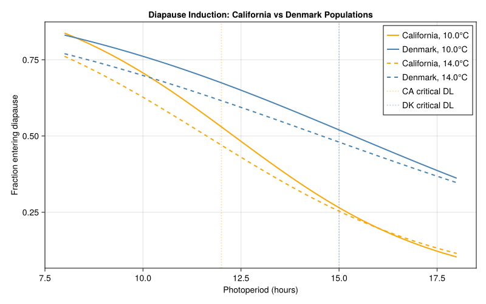
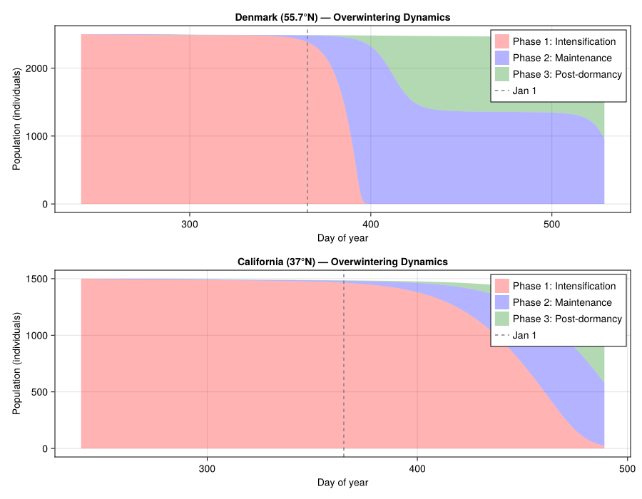
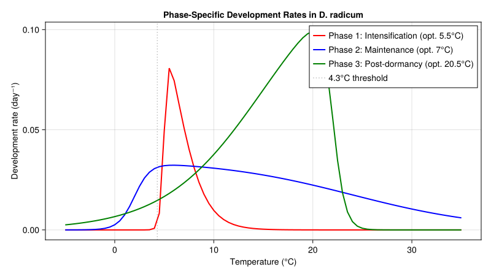
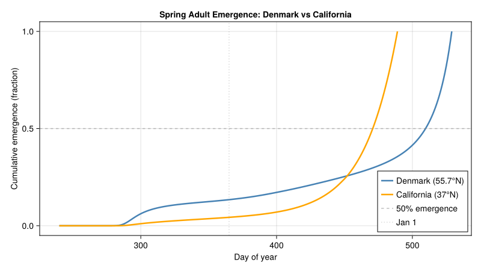

# Cabbage Root Fly Diapause Dynamics
Simon Frost

- [Background](#background)
- [Fermi–Dirac Development Rate
  Model](#fermidirac-development-rate-model)
- [Phase-Specific Development Rate
  Functions](#phase-specific-development-rate-functions)
- [Photoperiod-Driven Diapause
  Induction](#photoperiod-driven-diapause-induction)
- [Seasonal Photoperiod at Different
  Latitudes](#seasonal-photoperiod-at-different-latitudes)
- [Overwintering Population Model —
  Denmark](#overwintering-population-model--denmark)
- [Simulating Denmark Overwintering](#simulating-denmark-overwintering)
- [Simulating California
  Overwintering](#simulating-california-overwintering)
- [Comparing Emergence Patterns](#comparing-emergence-patterns)
- [Validation: Field Emergence Data](#validation-field-emergence-data)
- [Diapause Fraction vs Photoperiod](#diapause-fraction-vs-photoperiod)
- [Seasonal Emergence Pattern](#seasonal-emergence-pattern)
- [Development Rate Curves](#development-rate-curves)
- [Cumulative Emergence Comparison](#cumulative-emergence-comparison)
- [Key Insights](#key-insights)
- [Parameter Sources](#parameter-sources)
- [References](#references)

Primary reference: (Johnsen et al. 1997).

## Background

The cabbage root fly (*Delia radicum* L.) is one of the most destructive
pests of brassica crops (cabbage, broccoli, cauliflower, oilseed rape)
in temperate regions worldwide. Larvae feed on roots, causing wilting,
stunting, and plant death. Effective management depends on predicting
spring adult emergence from overwintering pupae.

*D. radicum* overwinters as dormant pupae in the soil. Diapause is
induced in larvae by short photoperiods and low temperatures. The
overwintering process has **three physiological phases**, each with a
distinct temperature response:

1.  **Phase 1 — Diapause intensification**: Development is slowed at
    autumn temperatures (10–15 °C). The optimum is at a low 5.5 °C,
    ensuring that warm autumn conditions do not complete the phase
    prematurely.
2.  **Phase 2 — Diapause maintenance/termination**: The classic
    “chilling” phase. Optimum development occurs around 5–7 °C. This
    phase proceeds through winter cold.
3.  **Phase 3 — Post-dormancy**: Metamorphosis and adult emergence,
    driven by spring warming. The lower developmental threshold is 4.3
    °C and 50 % of adults emerge after ~150 degree-days above 4.3 °C.
    Development is inhibited above ~22 °C.

**Geographic contrast:** In Denmark (55.7 °N), all pupae found in the
field by late August are dormant, and adults do not emerge until spring.
In coastal northern California (~37 °N), the climate is mild enough that
a fraction of the population remains active year-round, and diapause is
induced at shorter critical photoperiods than in northern European
populations.

**References:**

- Johnsen, S., Gutierrez, A.P. & Jørgensen, J. (1997). Overwintering in
  the cabbage root fly *Delia radicum*: a dynamic model of
  temperature-dependent dormancy and post-dormancy development. *Journal
  of Applied Ecology* 34, 21–28.
- Johnsen, S. & Gutierrez, A.P. (1997). Induction and termination of
  winter diapause in a Californian strain of the cabbage maggot
  (Diptera: Anthomyiidae). *Environmental Entomology* 26, 84–90.

## Fermi–Dirac Development Rate Model

Johnsen et al. (1997) used a modified Fermi–Dirac distribution to model
the temperature-dependent rate of development in each phase. The
function has an asymmetric, bell-shaped response:

$$R_j(T) = \frac{R_{\max}}{(1 + \exp((T - x_1)/f_1))(1 + \exp((x_2 - T)/f_2))}$$

where $R_{\max}$ is the maximum rate, $x_1$ and $x_2$ set the upper and
lower inflection temperatures, and $f_1$ and $f_2$ control the steepness
of decline. Each phase has different parameters, reflecting distinct
enzyme-kinetic rate-limiting steps (Sharpe & DeMichele 1977).

``` julia
using PhysiologicallyBasedDemographicModels
import PhysiologicallyBasedDemographicModels: development_rate

"""
    FermiDiracDevelopmentRate(R_max, x1, x2, f1, f2)

Modified Fermi–Dirac development rate (Olson, Sharpe & Wu 1985).
Used by Johnsen et al. (1997) for *Delia radicum* dormancy phases.

R(T) = R_max / ((1 + exp((T - x1)/f1)) * (1 + exp((x2 - T)/f2)))
"""
struct FermiDiracDevelopmentRate{T<:Real} <: AbstractDevelopmentRate
    R_max::T
    x1::T     # upper inflection temperature
    x2::T     # lower inflection temperature
    f1::T     # upper steepness
    f2::T     # lower steepness
end

function development_rate(m::FermiDiracDevelopmentRate, T::Real)
    denom = (1 + exp((T - m.x1) / m.f1)) * (1 + exp((m.x2 - T) / m.f2))
    return m.R_max / denom
end
```

    development_rate (generic function with 4 methods)

## Phase-Specific Development Rate Functions

The three phases have qualitatively different thermal optima:

- Phase 1 peaks at ~5.5 °C (autumn: slows development at field temps)
- Phase 2 peaks at ~7.0 °C (winter: chilling requirement)
- Phase 3 peaks at ~20.5 °C (spring: standard pupal development)

Parameters were deduced by iteratively fitting the distributed-delay
dynamics model to emergence data from six cohorts of field-collected
dormant pupae in Denmark (Johnsen et al. 1997, Table 1).

``` julia
# ──────────────────────────────────────────────────────────────────────────────
# Fermi–Dirac parameters from Johnsen et al. (1997), Table 1.
#
# Paper convention: R(T) = Rm / ((1+exp((x₁−T)/σ₁))·(1+exp((T−x₂)/σ₂)))
#   x₁ = lower inflection, x₂ = upper inflection.
# Code convention:  R(T) = Rmax / ((1+exp((T−x1)/f1))·(1+exp((x2−T)/f2)))
#   x1 = upper inflection, x2 = lower inflection.
# Mapping: paper x₁→code x2, paper x₂→code x1,
#          paper σ₁→code f2, paper σ₂→code f1.
# ──────────────────────────────────────────────────────────────────────────────

# Phase 1: Diapause intensification (optimum 5.5 °C)
# Table 1: Rm=0.15, x₁=5, x₂=6, σ₁=0.2, σ₂=1.5, k=25
const phase1_dev = FermiDiracDevelopmentRate(0.15, 6.0, 5.0, 1.5, 0.2)

# Phase 2: Diapause maintenance / termination (optimum ~7 °C)
# Table 1: Rm=0.035, x₁=2, x₂=24, σ₁=0.8, σ₂=7, k=44
const phase2_dev = FermiDiracDevelopmentRate(0.035, 24.0, 2.0, 7.0, 0.8)

# Phase 3: Post-dormancy / metamorphosis (optimum ~20.5 °C)
# Table 1: Rm=0.14, x₁=15, x₂=22, σ₁=5, σ₂=0.6, k=25
const phase3_dev = FermiDiracDevelopmentRate(0.14, 22.0, 15.0, 0.6, 5.0)

# Compare development rates across temperatures
println("Temperature-dependent development rates by phase:")
println("="^65)
println("T (°C) | Phase 1 (intens.) | Phase 2 (maint.) | Phase 3 (post-dorm.)")
println("-"^65)
for T in [-5.0, 0.0, 3.0, 5.0, 7.0, 10.0, 15.0, 20.0, 25.0, 30.0]
    r1 = development_rate(phase1_dev, T)
    r2 = development_rate(phase2_dev, T)
    r3 = development_rate(phase3_dev, T)
    println("  $(lpad(T, 5))  |    $(rpad(round(r1, digits=5), 9)) |    $(rpad(round(r2, digits=5), 9)) |    $(round(r3, digits=5))")
end
```

    Temperature-dependent development rates by phase:
    =================================================================
    T (°C) | Phase 1 (intens.) | Phase 2 (maint.) | Phase 3 (post-dorm.)
    -----------------------------------------------------------------
       -5.0  |    0.0       |    1.0e-5    |    0.00252
        0.0  |    0.0       |    0.00257   |    0.00664
        3.0  |    1.0e-5    |    0.02592   |    0.01164
        5.0  |    0.04956   |    0.03207   |    0.01669
        7.0  |    0.05088   |    0.0321    |    0.02352
       10.0  |    0.00975   |    0.03083   |    0.03765
       15.0  |    0.00037   |    0.02742   |    0.07
       20.0  |    1.0e-5    |    0.02237   |    0.09882
       25.0  |    0.0       |    0.01625   |    0.00083
       30.0  |    0.0       |    0.01043   |    0.0

## Photoperiod-Driven Diapause Induction

Diapause induction in *D. radicum* larvae is controlled by the
interaction of photoperiod and temperature. The **critical photoperiod**
— the day length below which diapause is induced — varies
geographically. Northern populations enter diapause at longer day
lengths than southern ones (Collier et al. 1988).

We model the fraction of larvae entering diapause as a function of
photoperiod and temperature. The functional form is illustrative; the
critical photoperiods are informed by Soni (1976) and Johnsen &
Gutierrez (1997, *Environ. Entomol.*), but the specific logistic
regression coefficients are assumed:

``` julia
"""
    diapause_fraction(photoperiod, temperature; Pc=14.0, T_ref=12.0, β_P=-0.25, β_T=-0.05, β_PT=0.01)

Proportion of larvae entering diapause as a function of photoperiod (h) and
temperature (°C). Illustrative logistic model; specific regression
coefficients are assumed. Critical photoperiods informed by Soni (1976),
Collier et al. (1988), and Johnsen & Gutierrez (1997, Environ. Entomol.).

Higher diapause at short photoperiods and low temperatures.
"""
function diapause_fraction(P::Real, T::Real;
                           Pc::Real=14.0, T_ref::Real=12.0,               # assumed
                           β_P::Real=-0.25, β_T::Real=-0.05, β_PT::Real=0.01)  # assumed
    logit = β_P * (P - Pc) + β_T * (T - T_ref) + β_PT * (P - Pc) * (T - T_ref)
    return 1.0 / (1.0 + exp(-logit))
end

# Californian population: induced at shorter daylengths
# Pc ≈ 12 h (Johnsen & Gutierrez 1997, Environ. Entomol.); slopes assumed
function diapause_fraction_california(P::Real, T::Real)
    diapause_fraction(P, T; Pc=12.0, β_P=-0.35, β_T=-0.06, β_PT=0.015)
end

# Danish population: induced at longer daylengths
# Pc ≈ 15 h (Soni 1976; Collier et al. 1988); slopes assumed
function diapause_fraction_denmark(P::Real, T::Real)
    diapause_fraction(P, T; Pc=15.0, β_P=-0.20, β_T=-0.04, β_PT=0.008)
end

println("\nDiapause induction: California vs Denmark populations")
println("="^70)
println("Photoperiod | Temp  | California fraction | Denmark fraction")
println("-"^70)
for P in [10.0, 11.0, 12.0, 13.0, 14.0, 15.0, 16.0]
    for T in [10.0, 14.0]
        f_ca = diapause_fraction_california(P, T)
        f_dk = diapause_fraction_denmark(P, T)
        println("  $(lpad(P, 4)) h    | $(lpad(T, 4))°C |       $(rpad(round(f_ca, digits=3), 7))     |       $(round(f_dk, digits=3))")
    end
end
```


    Diapause induction: California vs Denmark populations
    ======================================================================
    Photoperiod | Temp  | California fraction | Denmark fraction
    ----------------------------------------------------------------------
      10.0 h    | 10.0°C |       0.707       |       0.761
      10.0 h    | 14.0°C |       0.627       |       0.698
      11.0 h    | 10.0°C |       0.622       |       0.72
      11.0 h    | 14.0°C |       0.55        |       0.658
      12.0 h    | 10.0°C |       0.53        |       0.674
      12.0 h    | 14.0°C |       0.47        |       0.616
      13.0 h    | 10.0°C |       0.435       |       0.625
      13.0 h    | 14.0°C |       0.392       |       0.572
      14.0 h    | 10.0°C |       0.345       |       0.573
      14.0 h    | 14.0°C |       0.319       |       0.526
      15.0 h    | 10.0°C |       0.265       |       0.52
      15.0 h    | 14.0°C |       0.254       |       0.48
      16.0 h    | 10.0°C |       0.198       |       0.466
      16.0 h    | 14.0°C |       0.198       |       0.434

## Seasonal Photoperiod at Different Latitudes

``` julia
# Compare photoperiod curves for California vs Denmark
println("\nPhotoperiod throughout the year (hours):")
println("Day  | Month  | California (37°N) | Denmark (55.7°N)")
println("-"^60)
for (doy, month) in [(1, "Jan"), (32, "Feb"), (60, "Mar"), (91, "Apr"),
                      (121, "May"), (152, "Jun"), (182, "Jul"), (213, "Aug"),
                      (244, "Sep"), (274, "Oct"), (305, "Nov"), (335, "Dec")]
    dl_ca = photoperiod(37.0, doy)
    dl_dk = photoperiod(55.7, doy)
    println("  $(lpad(doy, 3))  | $month    |      $(lpad(round(dl_ca, digits=1), 4)) h        |      $(round(dl_dk, digits=1)) h")
end
```


    Photoperiod throughout the year (hours):
    Day  | Month  | California (37°N) | Denmark (55.7°N)
    ------------------------------------------------------------
        1  | Jan    |       9.3 h        |      6.6 h
       32  | Feb    |      10.0 h        |      8.1 h
       60  | Mar    |      11.1 h        |      10.2 h
       91  | Apr    |      12.3 h        |      12.6 h
      121  | May    |      13.4 h        |      14.8 h
      152  | Jun    |      14.2 h        |      16.6 h
      182  | Jul    |      14.3 h        |      16.9 h
      213  | Aug    |      13.8 h        |      15.6 h
      244  | Sep    |      12.7 h        |      13.5 h
      274  | Oct    |      11.6 h        |      11.2 h
      305  | Nov    |      10.4 h        |      8.9 h
      335  | Dec    |       9.5 h        |      7.0 h

## Overwintering Population Model — Denmark

In Denmark, dormant pupae are found by late August (day ~240). We model
a cohort of 100 dormant pupae passing through three phases using the
Manetsch/Vansickle distributed-delay framework. The Erlang parameter
$k_j$ (number of substages) controls the variance of developmental
times. Johnsen et al. (1997) found mean-to-variance ratios of 1.25,
0.50, and 1.67 for the three phases respectively.

``` julia
# Denmark population: all pupae enter diapause by late August
# Erlang k values from Johnsen et al. (1997), Table 1.
# Mean-to-variance ratios: 1.25, 0.50, 1.67 (paper text, p. 24).
# Phase 1 (intensification): k=25, completed in autumn
# Phase 2 (maintenance):     k=44, completed by early March
# Phase 3 (post-dormancy):   k=25, ~150 DD > 4.3 °C

const MORTALITY_PHASE1 = 0.001  # assumed — paper normalised mortality away
const MORTALITY_PHASE2 = 0.001  # assumed
const MORTALITY_PHASE3 = 0.002  # assumed

denmark_phases = [
    LifeStage(:intensification,
              DistributedDelay(25, 1.0; W0=100.0),  # k=25, Table 1
              phase1_dev, MORTALITY_PHASE1),
    LifeStage(:maintenance,
              DistributedDelay(44, 1.0; W0=0.0),    # k=44, Table 1
              phase2_dev, MORTALITY_PHASE2),
    LifeStage(:postdormancy,
              DistributedDelay(25, 1.0; W0=0.0),    # k=25, Table 1
              phase3_dev, MORTALITY_PHASE3),
]

denmark_pop = Population(:delia_denmark, denmark_phases)
println("Denmark population: ", n_stages(denmark_pop), " phases, ",
        n_substages(denmark_pop), " total substages")
```

    Denmark population: 3 phases, 94 total substages

## Simulating Denmark Overwintering

We use the Lyngby, Denmark temperature profile from the 1958–59 winter
described by Johnsen et al. (1997). Daily temperatures are approximated
with a sinusoidal model fitted to their Fig. 3: mean annual temperature
~8 °C, amplitude ~11 °C.

``` julia
# Lyngby, Denmark (~55.7°N): cold continental winter
# Mean ~8 °C, amplitude ~11 °C, peak around day 200 (mid-July)
# Estimated from Fig. 3 of Johnsen et al. (1997); approximate
denmark_weather = SinusoidalWeather(8.0, 11.0; phase=200.0)

# Simulate from day 240 (late Aug) through day 530 (mid-June next year)
n_sim = 290
weather_days_dk = DailyWeather{Float64}[]
for d in 240:(240 + n_sim - 1)
    w = get_weather(denmark_weather, d)
    dl = photoperiod(55.7, mod(d - 1, 365) + 1)
    push!(weather_days_dk, DailyWeather(w.T_mean, w.T_min, w.T_max;
                                         radiation=w.radiation,
                                         photoperiod=dl))
end
ws_dk = WeatherSeries(weather_days_dk; day_offset=240)

prob_dk = PBDMProblem(denmark_pop, ws_dk, (240, 240 + n_sim - 1))
sol_dk = solve(prob_dk, DirectIteration())

# Results
cdd_dk = cumulative_degree_days(sol_dk)
emerg_dk = phenology(sol_dk; threshold=0.5)

println("\n=== Denmark Overwintering Simulation ===")
println("Simulation: day 240 (late Aug) to day $(240 + n_sim - 1)")
println("Total degree-days accumulated: $(round(cdd_dk[end], digits=1))")
if emerg_dk !== nothing
    month_day = if emerg_dk <= 365
        "year 1, day $emerg_dk"
    else
        "year 2, day $(emerg_dk - 365)"
    end
    println("50% adult emergence: day $emerg_dk ($month_day)")
else
    println("50% emergence not reached in simulation window")
end

# Stage trajectories
traj_p1 = stage_trajectory(sol_dk, 1)
traj_p2 = stage_trajectory(sol_dk, 2)
traj_p3 = stage_trajectory(sol_dk, 3)

println("\nPhase transitions (population in each phase):")
println("Day  | Phase 1 | Phase 2 | Phase 3 | Total")
println("-"^55)
for d in [240, 280, 320, 360, 400, 440, 480, 520]
    idx = d - 240 + 1
    if idx <= length(traj_p1)
        total = traj_p1[idx] + traj_p2[idx] + traj_p3[idx]
        println("  $d  | $(lpad(round(traj_p1[idx], digits=1), 6)) | $(lpad(round(traj_p2[idx], digits=1), 6)) | $(lpad(round(traj_p3[idx], digits=1), 6)) | $(round(total, digits=1))")
    end
end
```


    === Denmark Overwintering Simulation ===
    Simulation: day 240 (late Aug) to day 529
    Total degree-days accumulated: 1.3
    50% adult emergence: day 510 (year 2, day 145)

    Phase transitions (population in each phase):
    Day  | Phase 1 | Phase 2 | Phase 3 | Total
    -------------------------------------------------------
      240  | 2499.1 |    0.9 |    0.0 | 2500.0
      280  | 2488.5 |    9.6 |    1.9 | 2500.0
      320  | 2485.1 |    3.5 |    1.0 | 2489.7
      360  | 2425.9 |   58.4 |    2.5 | 2486.7
      400  |    0.9 | 2317.9 |  161.4 | 2480.2
      440  |    0.6 | 1376.2 | 1095.4 | 2472.3
      480  |    0.6 | 1353.6 | 1108.8 | 2463.0
      520  |    0.6 | 1246.5 | 1180.1 | 2427.2

## Simulating California Overwintering

In coastal northern California (~37 °N, e.g. Watsonville/Monterey),
winters are mild (mean ~13 °C, amplitude ~4 °C) and a fraction of the
population does not enter diapause. Day lengths are shorter (critical
photoperiod ~12 h for the Californian strain). This results in earlier
and more prolonged emergence compared to Denmark.

``` julia
# California population: only a fraction enters diapause
# Same k values as Denmark (Table 1); initial cohort size assumed
ca_phases = [
    LifeStage(:intensification,
              DistributedDelay(25, 1.0; W0=60.0),   # k=25; 60% assumed
              phase1_dev, MORTALITY_PHASE1),
    LifeStage(:maintenance,
              DistributedDelay(44, 1.0; W0=0.0),    # k=44
              phase2_dev, MORTALITY_PHASE2),
    LifeStage(:postdormancy,
              DistributedDelay(25, 1.0; W0=0.0),    # k=25
              phase3_dev, MORTALITY_PHASE3),
]

ca_pop = Population(:delia_california, ca_phases)

# Watsonville, CA (~37°N): mild maritime climate (assumed)
ca_weather = SinusoidalWeather(13.0, 4.0; phase=200.0)

n_sim_ca = 250
weather_days_ca = DailyWeather{Float64}[]
for d in 240:(240 + n_sim_ca - 1)
    w = get_weather(ca_weather, d)
    dl = photoperiod(37.0, mod(d - 1, 365) + 1)
    push!(weather_days_ca, DailyWeather(w.T_mean, w.T_min, w.T_max;
                                         radiation=w.radiation,
                                         photoperiod=dl))
end
ws_ca = WeatherSeries(weather_days_ca; day_offset=240)

prob_ca = PBDMProblem(ca_pop, ws_ca, (240, 240 + n_sim_ca - 1))
sol_ca = solve(prob_ca, DirectIteration())

cdd_ca = cumulative_degree_days(sol_ca)
emerg_ca = phenology(sol_ca; threshold=0.5)

println("\n=== California Overwintering Simulation ===")
println("Total degree-days accumulated: $(round(cdd_ca[end], digits=1))")
if emerg_ca !== nothing
    println("50% adult emergence: day $emerg_ca")
else
    println("50% emergence not reached")
end

traj_ca_p1 = stage_trajectory(sol_ca, 1)
traj_ca_p2 = stage_trajectory(sol_ca, 2)
traj_ca_p3 = stage_trajectory(sol_ca, 3)

println("\nPhase transitions (California):")
println("Day  | Phase 1 | Phase 2 | Phase 3 | Total")
println("-"^55)
for d in [240, 280, 320, 360, 400, 440, 480]
    idx = d - 240 + 1
    if idx <= length(traj_ca_p1)
        total = traj_ca_p1[idx] + traj_ca_p2[idx] + traj_ca_p3[idx]
        println("  $d  | $(lpad(round(traj_ca_p1[idx], digits=1), 6)) | $(lpad(round(traj_ca_p2[idx], digits=1), 6)) | $(lpad(round(traj_ca_p3[idx], digits=1), 6)) | $(round(total, digits=1))")
    end
end
```


    === California Overwintering Simulation ===
    Total degree-days accumulated: 1.2
    50% adult emergence: day 471

    Phase transitions (California):
    Day  | Phase 1 | Phase 2 | Phase 3 | Total
    -------------------------------------------------------
      240  | 1499.6 |    0.4 |    0.0 | 1500.0
      280  | 1490.4 |    8.3 |    1.2 | 1500.0
      320  | 1484.0 |    6.2 |    2.0 | 1492.2
      360  | 1467.8 |   15.5 |    2.8 | 1486.1
      400  | 1380.4 |   81.9 |   13.7 | 1476.0
      440  |  953.3 |  383.9 |  101.7 | 1438.9
      480  |   90.7 |  695.5 |  471.7 | 1257.8

## Comparing Emergence Patterns

``` julia
println("\n=== Geographic Comparison: Spring Emergence ===")
println("="^60)
println()
println("Denmark (55.7°N):")
println("  All pupae dormant by late August")
println("  Dormancy completed: early March")
println("  Post-dormancy threshold: 4.3°C")
println("  50% emergence: ~150 DD > 4.3°C from early March")
println("  Expected emergence: late April to mid-May")
println("  95% emergence: ~240 DD > 4.3°C")
if emerg_dk !== nothing
    println("  Model 50% emergence: day $emerg_dk")
end
println()
println("California (37°N):")
println("  Only ~60% of cohort enters diapause")
println("  Mild winters: diapause phases complete faster")
println("  Continuous activity possible (some adults year-round)")
println("  Shorter critical photoperiod (~12 h vs ~15 h)")
if emerg_ca !== nothing
    println("  Model 50% emergence: day $emerg_ca")
end
```


    === Geographic Comparison: Spring Emergence ===
    ============================================================

    Denmark (55.7°N):
      All pupae dormant by late August
      Dormancy completed: early March
      Post-dormancy threshold: 4.3°C
      50% emergence: ~150 DD > 4.3°C from early March
      Expected emergence: late April to mid-May
      95% emergence: ~240 DD > 4.3°C
      Model 50% emergence: day 510

    California (37°N):
      Only ~60% of cohort enters diapause
      Mild winters: diapause phases complete faster
      Continuous activity possible (some adults year-round)
      Shorter critical photoperiod (~12 h vs ~15 h)
      Model 50% emergence: day 471

## Validation: Field Emergence Data

From Johnsen et al. (1997), the model was validated against six cohorts
of dormant pupae collected at Lyngby, Denmark on 15 September 1958 and
brought to the laboratory at 2-week intervals from 23 November.

``` julia
# Post-dormancy development at constant temperatures
println("\nPost-dormancy (Phase 3) development at constant temperatures:")
println("="^55)
println("T (°C) | Rate (day⁻¹) | Est. days to 150 DD")
println("-"^55)
for T in [5.0, 8.0, 10.0, 12.0, 15.0, 18.0, 20.0, 25.0]
    r = development_rate(phase3_dev, T)
    dd = max(0.0, T - 4.3)
    if dd > 0
        days_est = 150.0 / dd
        println("  $(lpad(T, 4))   | $(lpad(round(r, digits=5), 9))    | $(round(days_est, digits=0)) days")
    else
        println("  $(lpad(T, 4))   | $(lpad(round(r, digits=5), 9))    | ∞ (below threshold)")
    end
end

println("\nKey validation points (Johnsen et al. 1997):")
println("  • Model accurately predicted emergence for all 6 cohorts")
println("  • Phase 1 optimum at 5.5°C prevents autumn completion")
println("  • Phase 2 requires winter chilling (optimum ~5-7°C)")
println("  • High-temperature inhibition in Phase 3 above 22°C")
println("  • 545 DD > 4.3°C accumulated Sept-May in 1958-59")
println("  • Backtracking: dormancy completed in early March")
```


    Post-dormancy (Phase 3) development at constant temperatures:
    =======================================================
    T (°C) | Rate (day⁻¹) | Est. days to 150 DD
    -------------------------------------------------------
       5.0   |   0.01669    | 214.0 days
       8.0   |   0.02769    | 41.0 days
      10.0   |   0.03765    | 26.0 days
      12.0   |   0.04961    | 19.0 days
      15.0   |      0.07    | 14.0 days
      18.0   |   0.09028    | 11.0 days
      20.0   |   0.09882    | 10.0 days
      25.0   |   0.00083    | 7.0 days

    Key validation points (Johnsen et al. 1997):
      • Model accurately predicted emergence for all 6 cohorts
      • Phase 1 optimum at 5.5°C prevents autumn completion
      • Phase 2 requires winter chilling (optimum ~5-7°C)
      • High-temperature inhibition in Phase 3 above 22°C
      • 545 DD > 4.3°C accumulated Sept-May in 1958-59
      • Backtracking: dormancy completed in early March

## Diapause Fraction vs Photoperiod

``` julia
using CairoMakie

# Diapause induction curves at different temperatures
fig1 = Figure(size=(800, 500))
ax1 = Axis(fig1[1, 1],
           xlabel="Photoperiod (hours)",
           ylabel="Fraction entering diapause",
           title="Diapause Induction: California vs Denmark Populations")

photoperiods = 8.0:0.1:18.0

for (T, lstyle) in [(10.0, :solid), (14.0, :dash)]
    frac_ca = [diapause_fraction_california(P, T) for P in photoperiods]
    frac_dk = [diapause_fraction_denmark(P, T) for P in photoperiods]

    lines!(ax1, collect(photoperiods), frac_ca;
           color=:orange, linestyle=lstyle, linewidth=2,
           label="California, $(T)°C")
    lines!(ax1, collect(photoperiods), frac_dk;
           color=:steelblue, linestyle=lstyle, linewidth=2,
           label="Denmark, $(T)°C")
end

vlines!(ax1, [12.0], color=:orange, linestyle=:dot, alpha=0.5,
        label="CA critical DL")
vlines!(ax1, [15.0], color=:steelblue, linestyle=:dot, alpha=0.5,
        label="DK critical DL")

axislegend(ax1, position=:rt)
fig1
```



## Seasonal Emergence Pattern

``` julia
# Plot stage trajectories for both populations
fig2 = Figure(size=(900, 700))

# Denmark
ax_dk = Axis(fig2[1, 1],
             xlabel="Day of year",
             ylabel="Population (individuals)",
             title="Denmark (55.7°N) — Overwintering Dynamics")

days_dk = sol_dk.t
band!(ax_dk, days_dk, zeros(length(days_dk)), traj_p1;
      color=(:red, 0.3), label="Phase 1: Intensification")
band!(ax_dk, days_dk, traj_p1, traj_p1 .+ traj_p2;
      color=(:blue, 0.3), label="Phase 2: Maintenance")
band!(ax_dk, days_dk, traj_p1 .+ traj_p2,
      traj_p1 .+ traj_p2 .+ traj_p3;
      color=(:green, 0.3), label="Phase 3: Post-dormancy")

vlines!(ax_dk, [365], color=:gray, linestyle=:dash, label="Jan 1")
axislegend(ax_dk, position=:rt)

# California
ax_ca = Axis(fig2[2, 1],
             xlabel="Day of year",
             ylabel="Population (individuals)",
             title="California (37°N) — Overwintering Dynamics")

days_ca = sol_ca.t
band!(ax_ca, days_ca, zeros(length(days_ca)), traj_ca_p1;
      color=(:red, 0.3), label="Phase 1: Intensification")
band!(ax_ca, days_ca, traj_ca_p1, traj_ca_p1 .+ traj_ca_p2;
      color=(:blue, 0.3), label="Phase 2: Maintenance")
band!(ax_ca, days_ca, traj_ca_p1 .+ traj_ca_p2,
      traj_ca_p1 .+ traj_ca_p2 .+ traj_ca_p3;
      color=(:green, 0.3), label="Phase 3: Post-dormancy")

vlines!(ax_ca, [365], color=:gray, linestyle=:dash, label="Jan 1")
axislegend(ax_ca, position=:rt)

fig2
```



## Development Rate Curves

``` julia
fig3 = Figure(size=(800, 450))
ax3 = Axis(fig3[1, 1],
           xlabel="Temperature (°C)",
           ylabel="Development rate (day⁻¹)",
           title="Phase-Specific Development Rates in D. radicum")

temps = -5.0:0.5:35.0
r1 = [development_rate(phase1_dev, T) for T in temps]
r2 = [development_rate(phase2_dev, T) for T in temps]
r3 = [development_rate(phase3_dev, T) for T in temps]

lines!(ax3, collect(temps), r1; color=:red, linewidth=2,
       label="Phase 1: Intensification (opt. 5.5°C)")
lines!(ax3, collect(temps), r2; color=:blue, linewidth=2,
       label="Phase 2: Maintenance (opt. 7°C)")
lines!(ax3, collect(temps), r3; color=:green, linewidth=2,
       label="Phase 3: Post-dormancy (opt. 20.5°C)")

vlines!(ax3, [4.3], color=:gray, linestyle=:dot, alpha=0.5,
        label="4.3°C threshold")

axislegend(ax3, position=:rt)
fig3
```



## Cumulative Emergence Comparison

``` julia
fig4 = Figure(size=(800, 450))
ax4 = Axis(fig4[1, 1],
           xlabel="Day of year",
           ylabel="Cumulative emergence (fraction)",
           title="Spring Adult Emergence: Denmark vs California")

# Cumulative maturation as fraction of total
cum_dk = cumsum(sol_dk.maturation)
total_dk = cum_dk[end] > 0 ? cum_dk[end] : 1.0
cum_ca = cumsum(sol_ca.maturation)
total_ca = cum_ca[end] > 0 ? cum_ca[end] : 1.0

lines!(ax4, sol_dk.t, cum_dk ./ total_dk;
       color=:steelblue, linewidth=2.5, label="Denmark (55.7°N)")
lines!(ax4, sol_ca.t, cum_ca ./ total_ca;
       color=:orange, linewidth=2.5, label="California (37°N)")

hlines!(ax4, [0.5], color=:gray, linestyle=:dash, alpha=0.5,
        label="50% emergence")
vlines!(ax4, [365], color=:gray, linestyle=:dot, alpha=0.3,
        label="Jan 1")

axislegend(ax4, position=:rb)
fig4
```



## Key Insights

1.  **Three-phase model is essential**: A single development rate
    function cannot explain why dormant pupae found in August do not
    emerge until spring. Phase 1 (optimum 5.5 °C) actively inhibits
    development at autumn temperatures (10–15 °C), preventing premature
    completion.

2.  **Chilling requirement is adaptive**: Phase 2 requires sustained
    cold exposure (optimum ~5 °C). This ensures that dormancy is not
    broken by brief warm spells in autumn or early winter. The broad,
    low-temperature response function predicts roughly equal development
    at 1 °C and 25 °C.

3.  **Geographic variation in critical photoperiod**: The Californian
    population enters diapause at shorter photoperiods (~12 h) than
    Danish populations (~15 h), consistent with Collier et al. (1988).
    This explains why some California flies remain active year-round.

4.  **Post-dormancy is predictable**: Once dormancy is completed (early
    March in Denmark), emergence follows a simple degree-day model: 150
    DD above 4.3 °C for 50 % emergence. This is operationally useful for
    pest management timing.

5.  **High-temperature inhibition**: Post-dormancy development is
    inhibited above ~22 °C (Read 1969), which can delay emergence during
    unusually warm springs. This differs from dormant phases where high
    temperatures merely slow but do not kill.

6.  **Climate change implications**: Warmer winters may shorten the
    chilling period needed for Phase 2, potentially delaying dormancy
    completion and paradoxically delaying or desynchronizing spring
    emergence in northern regions.

## Parameter Sources

| Parameter | Phase 1 | Phase 2 | Phase 3 | Source |
|----|----|----|----|----|
| R_max | 0.15 | 0.035 | 0.14 | Johnsen et al. (1997), Table 1 |
| x₁ (paper lower inflection) | 5 | 2 | 15 | Table 1 |
| x₂ (paper upper inflection) | 6 | 24 | 22 | Table 1 |
| σ₁ (paper lower steepness) | 0.2 | 0.8 | 5 | Table 1 |
| σ₂ (paper upper steepness) | 1.5 | 7 | 0.6 | Table 1 |
| k (Erlang substages) | 25 | 44 | 25 | Table 1 |
| Optimum temperature (°C) | 5.5 | 7.0 | 20.5 | Paper text, p. 23 |
| Mean/variance ratio | 1.25 | 0.50 | 1.67 | Paper text, p. 24 |
| Lower dev. threshold (Phase 3) | — | — | 4.3 °C | Collier & Finch (1983a) |
| 50 % emergence (Phase 3) | — | — | 150 DD \> 4.3 °C | Paper text, p. 22 |
| 95 % emergence (Phase 3) | — | — | 240 DD \> 4.3 °C | Paper text, p. 22 |
| Mortality rates (all phases) | 0.001 | 0.001 | 0.002 | **Assumed** |
| Diapause Pc — Denmark | 15 h | — | — | Soni (1976); Collier et al. (1988) |
| Diapause Pc — California | 12 h | — | — | Johnsen & Gutierrez (1997, *Environ. Entomol.*) |
| Logistic slopes (β_P, β_T, β_PT) | — | — | — | **Assumed** (illustrative) |
| Denmark weather (mean/amp) | 8 / 11 °C | — | — | Estimated from Fig. 3 |
| California weather (mean/amp) | 13 / 4 °C | — | — | **Assumed** |
| CA diapause fraction (W0) | 60 % | — | — | **Assumed** |

*Table 1 values were decoded from the original OCR and cross-checked
against the paper text (optima at 5.5, 7.0, and 20.5 °C; mean/variance
ratios of 1.25, 0.50, 1.67). The paper’s formula convention (`x₁` =
lower, `x₂` = upper inflection) is swapped relative to the code
convention (`x1` = upper, `x2` = lower).*

## References

- Coaker, T.H. & Wright, D.H. (1963). The influence of temperature on
  the emergence of the cabbage root fly from overwintering pupae.
  *Annals of Applied Biology* 52, 337–343.
- Collier, R.H. & Finch, S. (1983a). Completion of diapause in field
  populations of the cabbage root fly. *Entomologia Experimentalis et
  Applicata* 34, 186–192.
- Collier, R.H. & Finch, S. (1983b). Effects of intensity and duration
  of low temperatures in regulating diapause development of the cabbage
  root fly. *Entomologia Experimentalis et Applicata* 34, 193–200.
- Collier, R.H. & Finch, S. (1985). Accumulated temperatures for
  predicting the time of emergence in the spring of the cabbage root
  fly. *Bulletin of Entomological Research* 75, 395–404.
- Collier, R.H., Finch, S., Phelps, K. & Thompson, A.R. (1991). Possible
  impact of global warming on cabbage root fly activity in the UK.
  *Annals of Applied Biology* 118, 261–271.
- Johnsen, S. & Gutierrez, A.P. (1997). Induction and termination of
  winter diapause in a Californian strain of the cabbage maggot.
  *Environmental Entomology* 26, 84–90.
- Johnsen, S., Gutierrez, A.P. & Jørgensen, J. (1997). Overwintering in
  the cabbage root fly *Delia radicum*: a dynamic model of
  temperature-dependent dormancy and post-dormancy development. *Journal
  of Applied Ecology* 34, 21–28.
- Olson, R.L., Sharpe, P.J.H. & Wu, H.I. (1985). Whole-plant modelling:
  a continuous-time Markov (CTM) approach. *Ecological Modelling* 29,
  171–187.
- Read, D.C. (1969). Rearing the cabbage maggot with and without
  diapause. *Canadian Entomologist* 101, 725–737.
- Sharpe, P.J.H. & DeMichele, D.W. (1977). Reaction kinetics of
  poikilotherm development. *Journal of Theoretical Biology* 64,
  649–670.
- Tauber, M.J., Tauber, C.A. & Masaki, S. (1986). *Seasonal Adaptations
  in Insects*. Oxford University Press, Oxford.

<div id="refs" class="references csl-bib-body hanging-indent">

<div id="ref-Johnsen1997Cabbage" class="csl-entry">

Johnsen, S., A. P. Gutierrez, and J. Jørgensen. 1997. “Overwintering in
the Cabbage Root Fly <span class="nocase">Delia radicum</span>: A
Dynamic Model of Temperature-Dependent Dormancy and Post-Dormancy
Development.” *Journal of Applied Ecology* 34: 21–28.
<https://doi.org/10.2307/2404844>.

</div>

</div>
