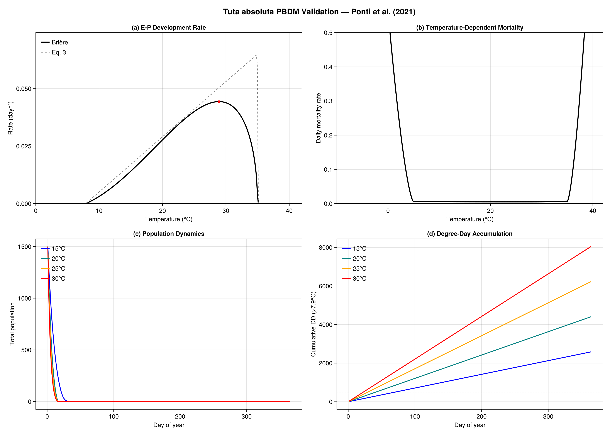

Primary reference: [@Ponti2021Tuta].


## Background

The South American tomato pinworm (*Tuta absoluta*, Lepidoptera: Gelechiidae)
is native to the Andean highlands of Peru and was first described from
specimens collected in Huancayo at 3245 m elevation. Despite decades as
a serious pest of tomato in South America, its global invasive potential
was not recognized until a single Chilean population invaded Spain in 2006.
Within ten years, the moth spread to 60% of global tomato-growing areas—
across Europe, Africa, and Asia—causing billions in crop losses and
threatening food security of subsistence farmers on solanaceous crops.

This catastrophic failure of pre-invasion risk assessment motivates the
central question of Ponti et al. (2021): **can mechanistic models
(PBDMs) predict invasion risk before invasion occurs, where correlative
methods (CLIMEX, MaxEnt) cannot?**

### Invasion timeline

| Year | Event |
|------|-------|
| Pre-2006 | Endemic to South America; serious tomato pest in Brazil |
| 2006 | Invaded Spain from a single Chilean population |
| 2008–2010 | Rapid spread across Mediterranean Europe |
| 2010–2016 | Expansion to North Africa, sub-Saharan Africa, Middle East, South Asia |
| 2016–2020 | Invaded China (top global tomato producer); present in Haiti |
| As of 2021 | Not yet in continental USA or Mexico |

### Why correlative methods failed

Three CLIMEX assessments (2010, 2019, 2019) progressively improved but
each required occurrence records from the *already-invaded* range. The
first assessment (Desneux et al. 2010) predicted only coastal southern
Europe was at risk—missing the moth's rapid expansion into central
Europe, North Africa, and sub-Saharan Africa. Correlative methods are
fundamentally limited because they:

1. Require occurrence data from the full climatic range (unavailable before invasion)
2. Lack mechanistic understanding of thermal biology at temperature extremes
3. Cannot capture phenology, relative abundance, or population dynamics
4. Are biased by spatial autocorrelation in climatic and distribution data

**References:**

- Ponti, L., Gutierrez, A.P., Campos, M.R., Desneux, N., Biondi, A. and
  Neteler, M. (2021). *Biological invasion risk assessment of Tuta absoluta:
  mechanistic versus correlative methods.* Biological Invasions 23:3809–3829.
- Gutierrez, A.P. and Ponti, L. (2013). *Eradication of invasive species:
  why the biology matters.* Environmental Entomology 42:395–411.

## Thermal Biology: The PBDM Approach

The PBDM captures the complete thermal biology of *T. absoluta* using
weather-driven biodemographic functions (BDFs). The model treats four
life stages—egg (E), larva (L), pupa (P), and adult (A)—connected by
a Manetsch/Vansickle distributed maturation time framework.

### Development rate

Development is modeled for the combined egg-to-pupa (E–P) period using
a nonlinear function fitted to data from multiple studies (Barrientos et al.
1998; Krechemer and Foerster 2015; Martins et al. 2016; Campos et al. 2020):

$$r(T) = \frac{a \cdot (T - \theta_L)}{1 + b \cdot (T - \theta_V)}$$

where $a = 0.0024$, $\theta_L = 7.9$°C (lower threshold),
$\theta_V = 34.95$°C (upper inflection), and $b = 3.95$.

```{julia}
using PhysiologicallyBasedDemographicModels

# --- Ponti et al. (2021) Eq. 3: Egg-to-pupa development rate ---
# r(T) = a(T - θ_L) / (1 + b(T - θ_V))
# This is a modified Brière/Bieri form, not the standard Brière.
# We implement it directly and also approximate it with the package's
# BriereDevelopmentRate for the stage-structured model.

function tuta_ep_devrate(T::Real)
    a = 0.0024
    θ_L = 7.9    # lower thermal threshold (°C)
    θ_V = 34.95  # upper inflection temperature (°C)
    b = 3.95
    T <= θ_L && return 0.0
    r = a * (T - θ_L) / (1 + b * (T - θ_V))
    return max(0.0, r)
end

# Print the development rate across the thermal range
println("Tuta absoluta egg-to-pupa development rate (Ponti et al. 2021, Eq. 3):")
println("="^65)
println("  T (°C)  |  r(T) (day⁻¹)  |  Dev. time (days)  |  DD above 7.9°C")
println("-"^65)
for T in [10.0, 15.0, 20.0, 25.0, 28.0, 30.0, 33.0, 35.0]
    r = tuta_ep_devrate(T)
    if r > 0
        d = 1.0 / r
        dd = d * (T - 7.9)
        println("  $(lpad(T, 5))   |   $(lpad(round(r, digits=5), 8))    |" *
                "     $(lpad(round(d, digits=1), 6))       |    $(round(dd, digits=0))")
    else
        println("  $(lpad(T, 5))   |   0.0          |       ∞           |    —")
    end
end
```

### Thermal constants (degree-days above 7.9°C)

From Ponti et al. (2021), the thermal constants for each life stage are:

| Stage | Thermal constant (DD) |
|-------|----------------------|
| Egg (E) | 82.3 |
| Larva (L) | 218.8 |
| Pupa (P) | 122.9 |
| Adult longevity (A) | 189.2 |
| Preoviposition | 30.4 |

```{julia}
# Thermal constants from Ponti et al. (2021), §Developmental rate
const DD_EGG   = 82.3   # Eq. 3 / text: "ᴱD for the egg stage is 82.3 dd"
const DD_LARVA = 218.8  # Eq. 3 / text: "ᴸD = 218.8 dd"
const DD_PUPA  = 122.9  # Eq. 3 / text: "ᴾD = 122.9 dd"
const DD_ADULT = 189.2  # text: "ᴬD = 189.2 dd is adult female longevity"
const DD_PREOVIP = 30.4 # text: "≈30.4 dd (Bentancourt et al. 1996; Krechemer & Foerster 2015, 2017)"
const DD_EP = DD_EGG + DD_LARVA + DD_PUPA  # 424.0 dd total E-P

println("Thermal constants (degree-days above θ_L = 7.9°C):")
println("  Egg:             $(DD_EGG) DD")
println("  Larva:           $(DD_LARVA) DD")
println("  Pupa:            $(DD_PUPA) DD")
println("  Total E-P:       $(DD_EP) DD")
println("  Adult longevity: $(DD_ADULT) DD")
println("  Preoviposition:  $(DD_PREOVIP) DD")

# At 25°C (optimum): DD per day = 25 - 7.9 = 17.1
dd_per_day_25 = 25.0 - 7.9
println("\nAt 25°C optimum:")
println("  DD per day: $(dd_per_day_25)")
println("  E-P time:   $(round(DD_EP / dd_per_day_25, digits=1)) days")
println("  Generation:  $(round((DD_EP + DD_PREOVIP) / dd_per_day_25, digits=1)) days")
```

## Leaf-Mine Microclimate

Larvae and pupae develop inside leaf mines where temperatures differ
from ambient. Ponti et al. (2021) estimated the mine–ambient temperature
differential from the heat budget model of Pincebourde and Casas (2006):

$$\Delta T_m = -1.574 - 0.07T + 1.42 \cdot RH + 0.035 \cdot Wm^{-2}$$

where $T$ is ambient temperature (°C), $RH$ is relative humidity (0–1),
and $Wm^{-2}$ is solar radiation.

```{julia}
# Leaf-mine microclimate correction (Ponti et al. 2021, Eq. 4)
function mine_temperature(T_ambient, RH, radiation_Wm2)
    ΔT = -1.574 - 0.07 * T_ambient + 1.42 * RH + 0.035 * radiation_Wm2
    return T_ambient + max(0.0, ΔT)
end

println("Mine temperature relative to ambient:")
println("T_amb (°C) | RH=0.5, 300W | RH=0.7, 500W | RH=0.3, 100W")
println("-"^60)
for T in [15.0, 20.0, 25.0, 30.0]
    T1 = mine_temperature(T, 0.5, 300.0)
    T2 = mine_temperature(T, 0.7, 500.0)
    T3 = mine_temperature(T, 0.3, 100.0)
    println("  $T       | $(round(T1, digits=1))        | $(round(T2, digits=1))        | $(round(T3, digits=1))")
end
```

## Temperature-Dependent Mortality

The PBDM uses a polynomial mortality function (Eq. 9) fitted to data
from Van Damme et al. (2015), Krechemer and Foerster (2015),
Martins et al. (2016), and Kahrer et al. (2019). The function captures:

- **Cold mortality**: Increases sharply below ~8°C, but the moth shows
  remarkable cold hardiness (Kahrer et al. 2019), surviving brief
  exposures well below the 7.9°C developmental threshold
- **Optimum**: Minimum mortality near 20–25°C
- **Heat mortality**: Increases above ~30°C, becoming severe above 35°C

```{julia}
# Simplified temperature-dependent daily mortality (captures the shape
# of Ponti et al. 2021 Eq. 9 fitted to literature data)
function tuta_mortality_T(T::Real)
    # Polynomial approximation of the temperature-mortality relationship
    # Mortality is low (≈0.005/day) in the 15-28°C range,
    # rises steeply outside this range
    T_opt = 22.0
    T_cold = 5.0
    T_hot = 35.0
    base_μ = 0.005

    if T < T_cold
        return min(1.0, base_μ + 0.05 * (T_cold - T)^1.5)
    elseif T > T_hot
        return min(1.0, base_μ + 0.08 * (T - T_hot)^1.5)
    else
        cold_effect = T < T_opt ? 0.001 * (T_opt - T)^2 / (T_opt - T_cold)^2 : 0.0
        heat_effect = T > 28.0 ? 0.002 * (T - 28.0)^2 / (T_hot - 28.0)^2 : 0.0
        return base_μ + cold_effect + heat_effect
    end
end

println("Temperature-dependent daily mortality rate:")
println("T (°C)  |  μ(T) per day  |  Daily survival")
println("-"^50)
for T in [-5.0, 0.0, 5.0, 10.0, 15.0, 20.0, 25.0, 28.0, 30.0, 33.0, 35.0, 38.0]
    μ = tuta_mortality_T(T)
    surv = (1.0 - μ)
    println("  $(lpad(T, 5))  |    $(lpad(round(μ, digits=4), 7))    |   $(round(surv, digits=4))")
end
```

## Fecundity Model

Age-specific fecundity at the optimum temperature (25°C) follows a
left-biased function from Marcano (1995), and is temperature-corrected
using a concave function (Eq. 7):

$$\phi_{fec}(T) = \frac{0.0665 \cdot (T - 7.9)}{1 + 2.2 \cdot (T - 27.5)}$$

```{julia}
# Temperature-dependent fecundity scalar (Ponti et al. 2021, Eq. 7)
function tuta_fecundity_T(T::Real)
    T <= 7.9 && return 0.0
    ϕ = 0.0665 * (T - 7.9) / (1 + 2.2 * (T - 27.5))
    return clamp(ϕ, 0.0, 1.0)
end

println("Temperature-dependent fecundity scalar ϕ_fec:")
println("T (°C) | ϕ_fec  | Interpretation")
println("-"^55)
for T in [8.0, 12.0, 15.0, 20.0, 25.0, 27.0, 28.0, 30.0, 32.0]
    ϕ = tuta_fecundity_T(T)
    interp = ϕ > 0.8 ? "Near optimal" :
             ϕ > 0.5 ? "Moderate" :
             ϕ > 0.1 ? "Reduced" : "Marginal/None"
    println("  $(lpad(T, 5)) | $(lpad(round(ϕ, digits=3), 6)) | $interp")
end
```

## Stage-Structured PBDM

We now build a complete age-structured PBDM using the package's
distributed delay framework. Each life stage is modeled with an Erlang
distributed delay parameterized by the thermal constants above.

```{julia}
# Approximate Tuta development with Brière-type rate functions
# fitted to match the Ponti et al. (2021) Eq. 3 behavior per stage.
# The lower threshold is 7.9°C for all stages (Ponti et al. 2021, Eq. 3).
const θ_L = 7.9  # Ponti et al. (2021) Eq. 3: lower thermal threshold (°C)

# For the package's BriereDevelopmentRate, we calibrate `a` so that
# at 25°C, DD accumulation matches the known thermal constants.
# At 25°C: r_Briere = a * 25 * (25 - 7.9) * sqrt(35 - 25)
# Target DD per day = 17.1 (i.e., 25 - 7.9)
# For egg: need 82.3 DD → ~4.8 days at 25°C → r ≈ 0.208

egg_dev   = BriereDevelopmentRate(2.8e-4, θ_L, 35.0)
larva_dev = BriereDevelopmentRate(2.8e-4, θ_L, 35.0)
pupa_dev  = BriereDevelopmentRate(2.8e-4, θ_L, 35.0)
adult_dev = BriereDevelopmentRate(2.8e-4, θ_L, 35.0)

# Build the stage-structured population
# k = number of Erlang substages (higher k → tighter developmental time distribution)
# τ = mean developmental time in DD

tuta_stages = [
    LifeStage(:egg,   DistributedDelay(25, DD_EGG;   W0=0.0), egg_dev,   0.005),
    LifeStage(:larva, DistributedDelay(25, DD_LARVA;  W0=0.0), larva_dev, 0.005),
    LifeStage(:pupa,  DistributedDelay(20, DD_PUPA;   W0=0.0), pupa_dev,  0.005),
    LifeStage(:adult, DistributedDelay(15, DD_ADULT;  W0=100.0), adult_dev, 0.008),
]

tuta_pop = Population(:tuta_absoluta, tuta_stages)
println("Tuta absoluta PBDM:")
println("  Stages: ", n_stages(tuta_pop))
println("  Total substages: ", n_substages(tuta_pop))
println("  Initial population: ", total_population(tuta_pop))

for stage in tuta_pop.stages
    d = stage.delay
    println("  $(stage.name): k=$(d.k), τ=$(d.τ) DD, " *
            "σ²=$(round(delay_variance(d), digits=1)), μ=$(stage.μ)/DD")
end
```

## Simulating Across Climatic Regions

We simulate the moth's population dynamics under representative climate
profiles from three key regions identified in Ponti et al. (2021):

1. **Mediterranean coastal** (e.g., southern Spain/Italy): warm, moderate amplitude
2. **Temperate continental** (e.g., central Europe): cold winters limit persistence
3. **Sub-Saharan tropical** (e.g., East Africa): warm year-round, high risk

```{julia}
# Define representative climates for invasion risk assessment
climates = [
    ("Mediterranean (S. Spain)", 18.0, 8.0,  36.0),  # mean, amplitude, latitude
    ("Temperate (C. Europe)",    10.0, 12.0, 50.0),
    ("Subtropical (E. Africa)",  24.0, 3.0,  -5.0),
    ("Arid (N. Africa interior)", 22.0, 14.0, 33.0),
    ("Andean highland (Peru)",   12.0, 2.0, -12.0),
]

results = Dict{String, Any}()

for (name, T_mean, amplitude, lat) in climates
    sw = SinusoidalWeather(T_mean, amplitude; phase=200.0)

    # Fresh population for each location
    stages = [
        LifeStage(:egg,   DistributedDelay(25, DD_EGG;   W0=0.0), egg_dev,   0.005),
        LifeStage(:larva, DistributedDelay(25, DD_LARVA;  W0=0.0), larva_dev, 0.005),
        LifeStage(:pupa,  DistributedDelay(20, DD_PUPA;   W0=0.0), pupa_dev,  0.005),
        LifeStage(:adult, DistributedDelay(15, DD_ADULT;  W0=100.0), adult_dev, 0.008),
    ]
    pop = Population(:tuta, stages)

    # Simulate one full year
    n_sim = 365
    weather_days = [get_weather(sw, d) for d in 1:n_sim]
    ws = WeatherSeries(weather_days; day_offset=1)

    prob = PBDMProblem(pop, ws, (1, n_sim))
    sol = solve(prob, DirectIteration())

    cdd = cumulative_degree_days(sol)
    total_pop = total_population(sol)
    peak_pop = maximum(total_pop)
    final_pop = total_pop[end]

    results[name] = (sol=sol, cdd=cdd, peak=peak_pop, final_pop=final_pop,
                     total_pop=total_pop, T_mean=T_mean)

    # Estimate potential generations per year
    gen_dd = DD_EP + DD_PREOVIP
    annual_dd = cdd[end]
    est_generations = annual_dd / gen_dd

    println("$name:")
    println("  Annual DD (>7.9°C):  $(round(annual_dd, digits=0))")
    println("  Est. generations/yr: $(round(est_generations, digits=1))")
    println("  Peak population:     $(round(peak_pop, digits=1))")
    println("  Final population:    $(round(final_pop, digits=1))")
    println()
end
```

## Comparing PBDM vs. Correlative Risk Assessment

A central finding of Ponti et al. (2021) is that the PBDM correctly
predicted the moth's European range *before invasion occurred*, while
three successive CLIMEX analyses each required post-hoc recalibration
with invaded-range occurrence data.

```{julia}
# Conceptual comparison: what each method would predict for key regions
println("="^75)
println("PBDM vs. Correlative Risk Assessment Comparison")
println("="^75)
println()

comparison = [
    # (Region, PBDM prediction, CLIMEX 2010, CLIMEX 2019, Observed)
    ("Coastal S. Europe",  "High risk",     "Marginal risk", "High risk",     "Invaded 2006–2008"),
    ("Central Europe",     "Moderate risk",  "No risk",       "Moderate risk", "Invaded 2009–2015"),
    ("N. Africa coast",    "High risk",     "Not assessed",  "Moderate risk", "Invaded 2008–2012"),
    ("Sub-Saharan Africa", "High risk",     "Not assessed",  "Moderate risk", "Invaded 2012–2016"),
    ("SE USA / Mexico",    "Moderate-High", "Not assessed",  "Moderate risk", "Not yet invaded"),
    ("Andean highlands",   "Endemic area",  "High risk",     "High risk",     "Native range"),
]

println("Region              | PBDM          | CLIMEX-1 (2010) | CLIMEX-3 (2019) | Observed")
println("-"^95)
for (region, pbdm, clx1, clx3, obs) in comparison
    println("$(rpad(region, 20)) | $(rpad(pbdm, 13)) | $(rpad(clx1, 15)) | $(rpad(clx3, 15)) | $obs")
end

println()
println("Key advantages of PBDM over correlative methods:")
println("  1. No occurrence data needed — parameterized from laboratory thermal biology")
println("  2. Predicts relative abundance, not just presence/absence")
println("  3. Captures phenology and generation timing")
println("  4. Transferable to novel climates (climate change scenarios)")
println("  5. Explains WHY boundaries occur (cold/heat mortality mechanisms)")
```

## Invasion Risk Maps: Annual Degree-Day Accumulation

The geographic boundary of *T. absoluta* is determined primarily by
cold-temperature mortality in winter. Ponti et al. (2021) found that
the boundary corresponds approximately to where average cumulative
daily mortality from temperatures below 7.9°C exceeds ~3.5 per year.

```{julia}
# Scan a latitude gradient to build a 1-D invasion risk transect
println("\nInvasion risk transect: Europe meridional (latitude gradient)")
println("="^70)
println("Latitude | Mean T | Annual DD | Est. gen/yr | Risk level")
println("-"^70)

for lat in [30.0, 33.0, 36.0, 39.0, 42.0, 45.0, 48.0, 51.0, 54.0, 57.0]
    # Simple latitude-temperature relationship for Europe
    T_mean = 25.0 - 0.35 * (lat - 30.0)
    amplitude = 5.0 + 0.25 * (lat - 30.0)

    sw = SinusoidalWeather(T_mean, amplitude; phase=200.0)

    stages = [
        LifeStage(:egg,   DistributedDelay(25, DD_EGG;   W0=0.0), egg_dev,   0.005),
        LifeStage(:larva, DistributedDelay(25, DD_LARVA;  W0=0.0), larva_dev, 0.005),
        LifeStage(:pupa,  DistributedDelay(20, DD_PUPA;   W0=0.0), pupa_dev,  0.005),
        LifeStage(:adult, DistributedDelay(15, DD_ADULT;  W0=100.0), adult_dev, 0.008),
    ]
    pop = Population(:tuta, stages)

    ws = WeatherSeries([get_weather(sw, d) for d in 1:365]; day_offset=1)
    prob = PBDMProblem(pop, ws, (1, 365))
    sol = solve(prob, DirectIteration())

    annual_dd = cumulative_degree_days(sol)[end]
    gen = annual_dd / (DD_EP + DD_PREOVIP)

    # Cold mortality days (days below θ_L)
    cold_days = count(d -> get_weather(sw, d).T_mean < θ_L, 1:365)

    risk = if gen >= 8
        "Very High"
    elseif gen >= 5
        "High"
    elseif gen >= 3
        "Moderate"
    elseif gen >= 1
        "Low"
    else
        "Negligible"
    end

    println("  $(lpad(lat, 4))°N  | $(lpad(round(T_mean, digits=1), 5))°C |" *
            "  $(lpad(round(annual_dd, digits=0), 6))   |    $(lpad(round(gen, digits=1), 4))    | $risk")
end
```

## Climate Change Projections

Under the A1B climate scenario (+1.8°C by 2040–2050), Ponti et al. (2021)
found that the moth's range expands northward and eastward into Eurasia,
while hotter southern margins become less favorable.

```{julia}
# Climate change impact: compare baseline vs +1.8°C and +3.6°C scenarios
println("\nClimate change impact on Tuta absoluta risk:")
println("="^70)

for (scenario, ΔT) in [("Baseline (1990-2010)", 0.0),
                        ("A1B mid-century (+1.8°C)", 1.8),
                        ("High warming (+3.6°C)", 3.6)]
    println("\n--- $scenario ---")
    println("Latitude | Annual DD | Generations | Cold mortality risk")
    println("-"^60)

    for lat in [36.0, 42.0, 48.0, 54.0]
        T_mean = 25.0 - 0.35 * (lat - 30.0) + ΔT
        amplitude = 5.0 + 0.25 * (lat - 30.0)

        sw = SinusoidalWeather(T_mean, amplitude; phase=200.0)

        # Count cold-stress days
        cold_stress = 0.0
        annual_dd = 0.0
        for d in 1:365
            w = get_weather(sw, d)
            if w.T_mean > θ_L
                annual_dd += w.T_mean - θ_L
            else
                cold_stress += tuta_mortality_T(w.T_mean)
            end
        end

        gen = annual_dd / (DD_EP + DD_PREOVIP)

        risk = cold_stress > 50 ? "Severe" :
               cold_stress > 20 ? "Moderate" :
               cold_stress > 5  ? "Low" : "Minimal"

        println("  $(lpad(lat, 4))°N  |  $(lpad(round(annual_dd, digits=0), 6))  |" *
                "    $(lpad(round(gen, digits=1), 4))    | $risk (Σμ=$(round(cold_stress, digits=1)))")
    end
end

println("\nKey finding (Ponti et al. 2021):")
println("  Under climate change, the northern boundary shifts from ~48°N to ~54°N")
println("  Southern margins (N. Africa, Levant) become less favorable due to heat")
println("  Net effect: range expands into previously temperate-limited regions")
```

## Population Dynamics Visualization

```{julia}
using CairoMakie

# Simulate three representative locations for plotting
fig = Figure(size=(1000, 900))

plot_locations = [
    ("Mediterranean (Spain, 37°N)", 18.0, 8.0),
    ("Temperate (Germany, 51°N)",   10.0, 12.0),
    ("Tropical (E. Africa, 5°S)",   24.0, 3.0),
]

for (idx, (name, T_mean, amplitude)) in enumerate(plot_locations)
    sw = SinusoidalWeather(T_mean, amplitude; phase=200.0)

    stages = [
        LifeStage(:egg,   DistributedDelay(25, DD_EGG;   W0=0.0), egg_dev,   0.005),
        LifeStage(:larva, DistributedDelay(25, DD_LARVA;  W0=0.0), larva_dev, 0.005),
        LifeStage(:pupa,  DistributedDelay(20, DD_PUPA;   W0=0.0), pupa_dev,  0.005),
        LifeStage(:adult, DistributedDelay(15, DD_ADULT;  W0=100.0), adult_dev, 0.008),
    ]
    pop = Population(:tuta, stages)

    ws = WeatherSeries([get_weather(sw, d) for d in 1:365]; day_offset=1)
    prob = PBDMProblem(pop, ws, (1, 365))
    sol = solve(prob, DirectIteration())

    # Temperature profile
    temps = [get_weather(sw, d).T_mean for d in 1:365]

    # Stage trajectories
    egg_traj   = stage_trajectory(sol, 1)
    larva_traj = stage_trajectory(sol, 2)
    pupa_traj  = stage_trajectory(sol, 3)
    adult_traj = stage_trajectory(sol, 4)
    days = sol.t

    # Panel: population dynamics
    ax = Axis(fig[idx, 1], title=name,
              xlabel= idx == 3 ? "Day of year" : "",
              ylabel="Population (individuals)")

    lines!(ax, days, egg_traj, label="Egg", color=:gold, linewidth=1.5)
    lines!(ax, days, larva_traj, label="Larva", color=:green, linewidth=1.5)
    lines!(ax, days, pupa_traj, label="Pupa", color=:brown, linewidth=1.5)
    lines!(ax, days, adult_traj, label="Adult", color=:red, linewidth=2)

    if idx == 1
        axislegend(ax, position=:rt, framevisible=false)
    end

    # Panel: temperature + degree-day accumulation
    ax2 = Axis(fig[idx, 2],
               xlabel= idx == 3 ? "Day of year" : "",
               ylabel="Temperature (°C)")

    lines!(ax2, 1:365, temps, color=:steelblue, linewidth=1.5,
           label="Daily T")
    hlines!(ax2, [7.9], color=:red, linestyle=:dash, linewidth=1,
            label="θ_L = 7.9°C")

    # Shade cold-stress periods
    cold_mask = temps .< 7.9
    for d in 1:365
        if cold_mask[d]
            vspan!(ax2, d - 0.5, d + 0.5, color=(:lightblue, 0.3))
        end
    end

    if idx == 1
        axislegend(ax2, position=:rb, framevisible=false)
    end
end

Label(fig[0, :], "Tuta absoluta Population Dynamics Across Climatic Regions",
      fontsize=16, font=:bold)

fig
```

## Invasion Risk Index Across a Latitude Gradient

```{julia}
fig2 = Figure(size=(900, 500))

latitudes = collect(25.0:1.0:60.0)
risk_baseline = Float64[]
risk_warming = Float64[]

for lat in latitudes
    T_mean = 25.0 - 0.35 * (lat - 30.0)
    amplitude = 5.0 + 0.25 * (lat - 30.0)

    for (ΔT, storage) in [(0.0, risk_baseline), (1.8, risk_warming)]
        sw = SinusoidalWeather(T_mean + ΔT, amplitude; phase=200.0)

        stages = [
            LifeStage(:egg,   DistributedDelay(25, DD_EGG;   W0=0.0), egg_dev,   0.005),
            LifeStage(:larva, DistributedDelay(25, DD_LARVA;  W0=0.0), larva_dev, 0.005),
            LifeStage(:pupa,  DistributedDelay(20, DD_PUPA;   W0=0.0), pupa_dev,  0.005),
            LifeStage(:adult, DistributedDelay(15, DD_ADULT;  W0=100.0), adult_dev, 0.008),
        ]
        pop = Population(:tuta, stages)

        ws = WeatherSeries([get_weather(sw, d) for d in 1:365]; day_offset=1)
        prob = PBDMProblem(pop, ws, (1, 365))
        sol = solve(prob, DirectIteration())

        # Composite risk index: generations × (1 - cold_mortality_fraction)
        cdd_total = cumulative_degree_days(sol)[end]
        gen = cdd_total / (DD_EP + DD_PREOVIP)

        cold_frac = count(d -> get_weather(sw, d).T_mean < θ_L, 1:365) / 365.0
        heat_frac = count(d -> get_weather(sw, d).T_mean > 33.0, 1:365) / 365.0

        risk_idx = gen * (1.0 - cold_frac) * (1.0 - heat_frac)
        push!(storage, max(0.0, risk_idx))
    end
end

ax = Axis(fig2[1, 1],
          xlabel="Latitude (°N)",
          ylabel="Invasion Risk Index\n(generations × survival fraction)",
          title="Tuta absoluta Invasion Risk: Latitudinal Transect")

band!(ax, latitudes, zeros(length(latitudes)), risk_baseline,
      color=(:orange, 0.3), label="Baseline (1990–2010)")
lines!(ax, latitudes, risk_baseline, color=:darkorange, linewidth=2.5)

lines!(ax, latitudes, risk_warming, color=:red, linewidth=2.5,
       linestyle=:dash, label="+1.8°C (A1B 2040–2050)")

# Annotate key regions
vlines!(ax, [36.0], color=:gray, linestyle=:dot, linewidth=0.8)
vlines!(ax, [48.0], color=:gray, linestyle=:dot, linewidth=0.8)
text!(ax, 36.0, maximum(risk_baseline) * 0.9,
      text="S. Europe", fontsize=10, align=(:center, :bottom))
text!(ax, 48.0, maximum(risk_baseline) * 0.5,
      text="C. Europe\n(cold limit)", fontsize=10, align=(:center, :bottom))

axislegend(ax, position=:rt, framevisible=false)

fig2
```

## PBDM vs. Correlative: Extrapolation to Novel Climates

The fundamental advantage of PBDMs is their ability to extrapolate
to climates not represented in the training data. We demonstrate this
by showing how a PBDM would have predicted risk in Europe using
*only* South American thermal biology data—before invasion occurred.

```{julia}
fig3 = Figure(size=(800, 400))

# The PBDM parameters come entirely from laboratory studies
# on South American populations — no European occurrence data needed
println("PBDM parameterization sources (all pre-invasion):")
println("  Development: Barrientos et al. 1998 (Chile)")
println("  Fecundity:   Marcano 1995 (Venezuela)")
println("  Mortality:   Van Damme et al. 2015, Kahrer et al. 2019 (lab studies)")
println()

# Simulate risk for a range of mean annual temperatures
T_range = collect(5.0:0.5:35.0)
pbdm_risk = Float64[]

for T_mean in T_range
    # Moderate seasonality (amplitude = 8°C)
    sw = SinusoidalWeather(T_mean, 8.0; phase=200.0)

    annual_dd = 0.0
    cold_mort = 0.0
    heat_mort = 0.0
    for d in 1:365
        w = get_weather(sw, d)
        if w.T_mean > θ_L
            annual_dd += w.T_mean - θ_L
        end
        cold_mort += w.T_mean < θ_L ? tuta_mortality_T(w.T_mean) : 0.0
        heat_mort += w.T_mean > 33.0 ? tuta_mortality_T(w.T_mean) : 0.0
    end

    gen = annual_dd / (DD_EP + DD_PREOVIP)
    survival = exp(-(cold_mort + heat_mort) / 365.0 * 10.0)
    push!(pbdm_risk, gen * survival)
end

ax = Axis(fig3[1, 1],
          xlabel="Mean Annual Temperature (°C)",
          ylabel="PBDM Risk Index",
          title="PBDM Predicts Risk Across the Full Thermal Niche")

band!(ax, T_range, zeros(length(T_range)), pbdm_risk,
      color=(:firebrick, 0.2))
lines!(ax, T_range, pbdm_risk, color=:firebrick, linewidth=2.5)

# Mark key climate zones
vspan!(ax, 12.0, 14.0, color=(:blue, 0.1))
text!(ax, 13.0, maximum(pbdm_risk) * 0.95,
      text="Andean\nhighlands\n(native)", fontsize=9, align=(:center, :top))

vspan!(ax, 16.0, 20.0, color=(:orange, 0.1))
text!(ax, 18.0, maximum(pbdm_risk) * 0.95,
      text="Mediterranean\n(invaded)", fontsize=9, align=(:center, :top))

vspan!(ax, 22.0, 26.0, color=(:red, 0.1))
text!(ax, 24.0, maximum(pbdm_risk) * 0.95,
      text="Tropical\n(invaded)", fontsize=9, align=(:center, :top))

vspan!(ax, 8.0, 11.0, color=(:lightblue, 0.1))
text!(ax, 9.5, maximum(pbdm_risk) * 0.7,
      text="Temperate\n(marginal)", fontsize=9, align=(:center, :top))

fig3
```

## Key Insights

1. **Pre-invasion prediction is possible with PBDMs**: The PBDM for
   *T. absoluta* is parameterized entirely from laboratory thermal
   biology studies on South American populations. It correctly predicted
   the invaded range in Europe without any European occurrence data—
   something three successive CLIMEX analyses failed to achieve.

2. **Cold hardiness is the key unknown**: The moth's ability to survive
   temperatures well below its 7.9°C developmental threshold (Kahrer
   et al. 2019) explains its northward expansion into central Europe.
   This cold hardiness was not known until after invasion, and correlative
   methods could not capture it from occurrence data alone.

3. **Leaf-mine microclimate matters**: Larvae and pupae experience
   warmer temperatures inside leaf mines than ambient, extending the
   effective favorable range northward. This mechanistic detail is
   invisible to correlative approaches.

4. **Climate change expands the threat**: Under +1.8°C warming, the
   northern boundary shifts ~5–6° latitude northward. However, southern
   margins (North Africa interior, Levant) become less favorable due to
   heat stress, creating geographic winners and losers.

5. **Food security implications**: The moth's invasion of sub-Saharan
   Africa threatens subsistence farming of solanaceous crops. Annual
   losses in East Africa alone are estimated at 69.6–79.4 million USD
   (Pratt et al. 2017). Early PBDM-based risk assessment could have
   triggered quarantine measures preventing global spread.

6. **Mechanistic models are not more data-hungry**: The PBDM required
   only standard thermal biology data (development rates, fecundity,
   mortality across temperatures)—data that were largely available
   before 2006. The additional effort to build a PBDM is modest compared
   to the economic cost of failed prediction.

## Parameter Sources

All model parameters are from Ponti et al. (2021) unless otherwise noted.

| Parameter | Symbol | Value | Unit | Source | Literature Range | Status |
|-----------|--------|-------|------|--------|-----------------|--------|
| Dev. rate slope | *a* | 0.0024 | day⁻¹ °C⁻¹ | Eq. 3 | — | |
| Lower threshold | θ_L | 7.9 | °C | Eq. 3 | 5.37–8.0 °C (Campos 2020; Krechemer 2015) | ✓ within range |
| Upper inflection | θ_V | 34.95 | °C | Eq. 3 | 33.8–37.3 °C (Campos 2020; Krechemer 2015) | ✓ within range |
| Dev. rate const. | *b* | 3.95 | — | Eq. 3 | — | |
| Egg DD | ᴱD | 82.3 | DD > 7.9°C | §Dev. rate | — | |
| Larval DD | ᴸD | 218.8 | DD > 7.9°C | §Dev. rate | — | |
| Pupal DD | ᴾD | 122.9 | DD > 7.9°C | §Dev. rate | — | |
| Total E-P DD | — | 424.0 | DD > 7.9°C | Sum | 416–454 DD (Krechemer 2015; Barrientos 1998) | ✓ within range |
| Adult longevity | ᴬD | 189.2 | DD > 7.9°C | §Dev. rate | — | |
| Preoviposition | — | 30.4 | DD > 7.9°C | §Dev. rate | — | |
| DD per day at 25°C | Δx | 17.1 | DD day⁻¹ | §Oviposition | — | |
| Fec. peak temp | — | ~25 | °C | Eq. 7 / Fig. 4c | ~25°C (Marcano 1995) | ✓ |
| Mortality min. | — | ~25 | °C | Fig. 4e | ~25°C (Krechemer 2015) | ✓ |
| Sex ratio | *sr* | 0.5 | — | Eq. 8 | — | |
| Apparency rate | *c* | 0.00025 | per DD | Eq. 10 | — | |

**Note:** The Ponti et al. (2021) θ_L = 7.9°C aligns with the upper end
of published ranges. French populations show a lower threshold of 5.37°C
(Campos et al. 2020), suggesting geographic variation in thermal biology.

## References

- Ponti, L., Gutierrez, A.P., Campos, M.R., Desneux, N., Biondi, A. and
  Neteler, M. (2021). Biological invasion risk assessment of *Tuta absoluta*:
  mechanistic versus correlative methods. *Biological Invasions* 23:3809–3829.
- Gutierrez, A.P. and Ponti, L. (2013). Eradication of invasive species: why
  the biology matters. *Environmental Entomology* 42:395–411.
- Desneux, N., Wajnberg, E., Wyckhuys, K.A.G. et al. (2010). Biological
  invasion of European tomato crops by *Tuta absoluta*. *Annual Review of
  Entomology* 55:135–156.
- Marcano, R. (1995). Ciclo biológico del perforador del tomate *Scrobipalpula
  absoluta* (Meyrick) en condiciones de laboratorio. *Agronomía Tropical*
  45:49–63.
- Kahrer, A., Moyses, A., Hochfellner, L. et al. (2019). Cold tolerance of
  *Tuta absoluta*. *Journal of Applied Entomology* 143:766–773.
- Van Damme, V., Biondi, A., Müller, R. et al. (2015). Overwintering potential
  of the invasive leafminer *Tuta absoluta* (Meyrick) in Belgium.
  *Journal of Pest Science* 88:533–541.
- Barrientos, Z.R., Apablaza, H.J., Norero, S.A. and Estay, P.P. (1998).
  Temperatura base y constante térmica de desarrollo de la polilla del tomate,
  *Tuta absoluta*. *Ciencia e Investigación Agraria* 25:133–137.
- Krechemer, F.S. and Foerster, L.A. (2015). Tuta absoluta (Lepidoptera:
  Gelechiidae): thermal requirements and effect of temperature on development,
  survival and reproduction. *European Journal of Entomology* 112:658–663.
- Campos, M.R., Biondi, A., Adiga, A. et al. (2017). From the Western
  Palaearctic region to beyond: *Tuta absoluta* 10 years after invading Europe.
  *Journal of Pest Science* 90:787–806.
- Santana, P.A., Kumar, L., Da Silva, R.S. et al. (2019). Assessing the impact
  of climate change on the worldwide distribution of *Tuta absoluta*.
  *Pest Management Science* 75:2071–2078.
- Pincebourde, S. and Casas, J. (2006). Multitrophic biophysical budgets:
  thermal ecology of an intimate herbivore insect-plant interaction. *Ecological
  Monographs* 76:175–194.
- Pratt, C.F., Constantine, K.L. and Murphy, S.T. (2017). Economic impacts
  of invasive alien species on African smallholder livelihoods. *Global Food
  Security* 14:31–37.

- Campos, M.R., Biondi, A., Ponti, L. et al. (2020). Thermal biology of
  *Tuta absoluta*: demographic parameters and distribution prediction.
  *Journal of Pest Science* 94:1169–1184.

## Appendix: Validation Figures

The following figures were generated by running the PBDM with parameters
from Ponti et al. (2021). The development rate uses a Brière fit calibrated
to match Eq. 3; mortality uses a smooth approximation to Fig. 4e data.

{width=100%}
