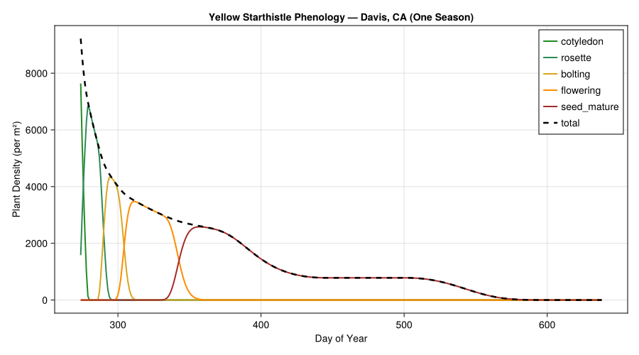
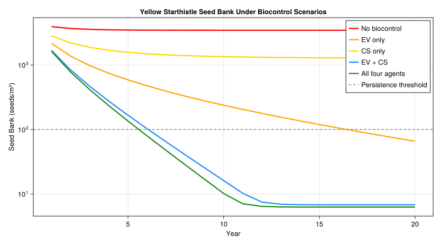
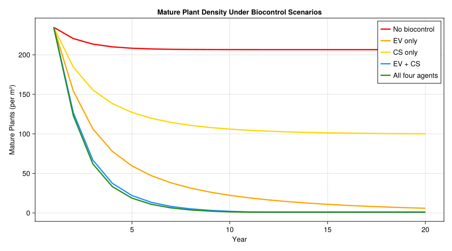
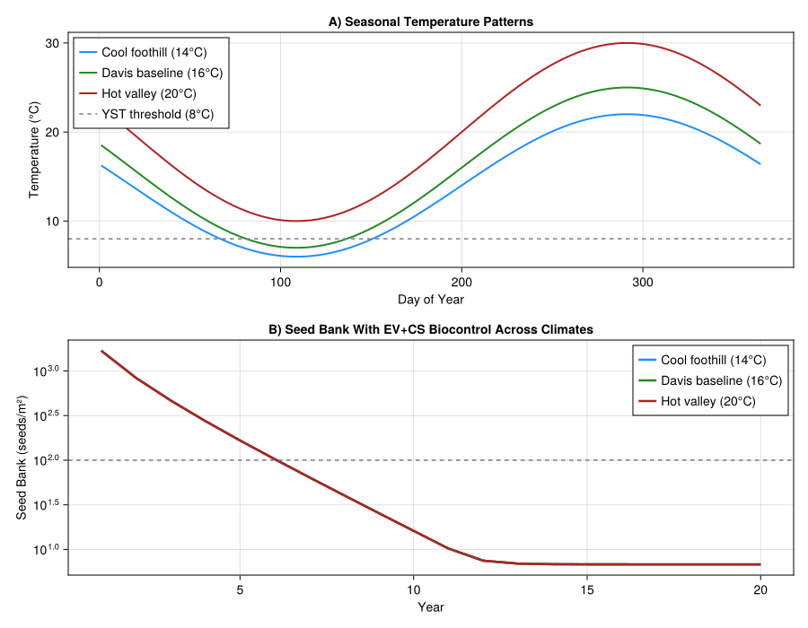
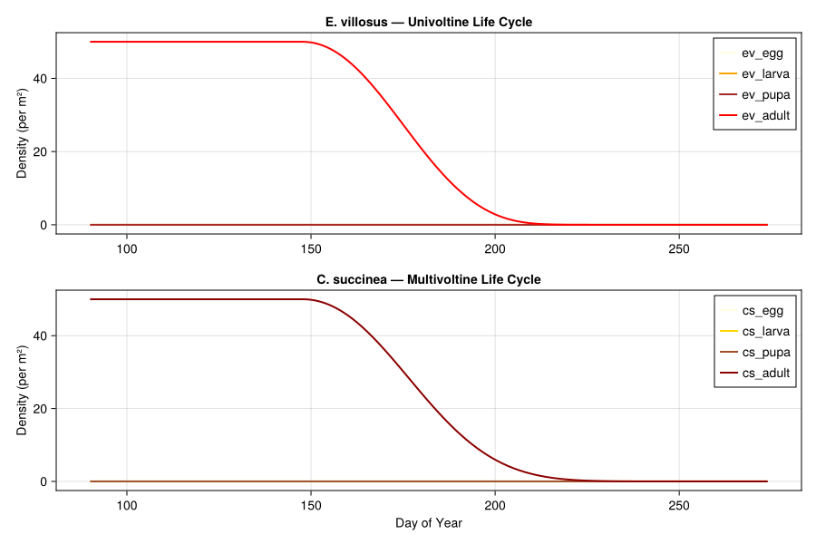
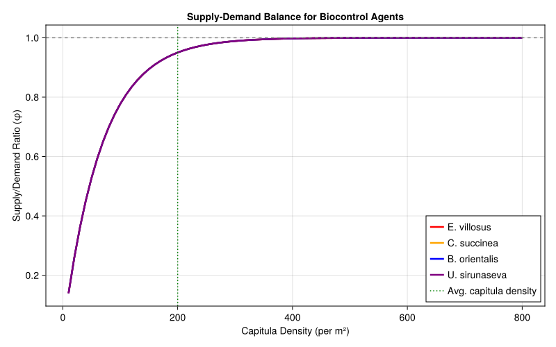
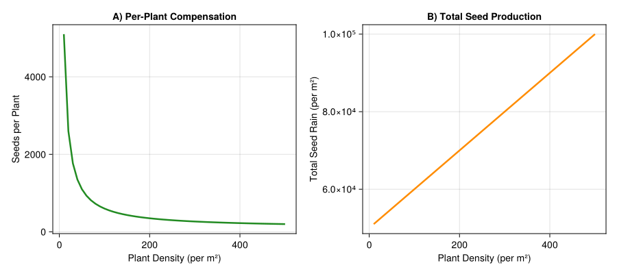

# Yellow Starthistle Biological Control


- [Background](#background)
- [Model Parameters](#model-parameters)
- [Parameter Sources](#parameter-sources)
- [Yellow Starthistle Life Stages](#yellow-starthistle-life-stages)
- [Biocontrol Agent Life Stages](#biocontrol-agent-life-stages)
- [Weather: Central California
  (Davis)](#weather-central-california-davis)
- [Seed Bank Dynamics](#seed-bank-dynamics)
- [Supply–Demand Model for Seed Head
  Attack](#supplydemand-model-for-seed-head-attack)
- [Competition Within Capitula](#competition-within-capitula)
- [Single-Season Simulation: YST Without
  Biocontrol](#single-season-simulation-yst-without-biocontrol)
- [Plotting YST Phenology](#plotting-yst-phenology)
- [Multi-Year Simulation With Seed
  Bank](#multi-year-simulation-with-seed-bank)
- [Biocontrol Scenario Comparison](#biocontrol-scenario-comparison)
- [Plotting Biocontrol Impact on Seed
  Bank](#plotting-biocontrol-impact-on-seed-bank)
- [Plotting Mature Plant Density](#plotting-mature-plant-density)
- [Temperature Sensitivity Analysis](#temperature-sensitivity-analysis)
- [Insect Population Dynamics](#insect-population-dynamics)
- [Supply–Demand Visualization](#supplydemand-visualization)
- [Metabolic Pool: Weed Resource
  Allocation](#metabolic-pool-weed-resource-allocation)
- [Compensation: Why Biocontrol Alone May Not
  Suffice](#compensation-why-biocontrol-alone-may-not-suffice)
- [Summary and Management
  Implications](#summary-and-management-implications)
- [Key Insights](#key-insights)

Primary reference: (Gutierrez et al. 2005).

## Background

Yellow starthistle (*Centaurea solstitialis* L., Asteraceae) is one of
the most damaging invasive weeds in western North America. Native to the
Mediterranean region, it was first recorded near San Francisco Bay in
1859 and now infests over 3 million hectares of California rangelands,
depleting soil moisture, displacing native grasses, and causing toxicity
in horses. Dense stands produce up to 3000 capitula (seed heads) per m²
and sustain a persistent soil seed bank that makes eradication extremely
difficult.

A classical biological control program beginning in the 1980s released
six capitulum-feeding insects. Of these, four became widely established
in California:

| Agent | Type | Voltinism | Dominance |
|----|----|----|----|
| *Eustenopus villosus* (EV) | Seed weevil | Univoltine | Dominant |
| *Bangasternus orientalis* (BO) | Seed weevil | Univoltine | Subordinate to EV |
| *Chaetorellia succinea* (CS) | Seed fly | Multivoltine | Partially dominant to US |
| *Urophora sirunaseva* (US) | Gall fly | Multivoltine | Subordinate |

The combined impact of these agents reduces seed production by 50–75% at
many sites, with *E. villosus* and *C. succinea* contributing the most.
However, yellow starthistle compensates for seed loss at low plant
densities by increasing per-plant capitulum production, and the soil
seed bank buffers against year-to-year fluctuations.

This vignette implements a supply–demand physiologically based
demographic model (PBDM) of the yellow starthistle–biocontrol agent
system following Gutierrez et al. (2005) and the rosette weevil
extension in Gutierrez et al. (2017). The model uses temperature-driven
development for all species, a seed bank with annual carryover,
rainfall-dependent germination, and competitive interactions among the
biocontrol agents within seed heads.

**References:**

- Gutierrez, A.P., Pitcairn, M.J., Ellis, C.K., Carruthers, N. and
  Ghezelbash, R. (2005). *Evaluating biological control of yellow
  starthistle (Centaurea solstitialis) in California: A GIS based
  supply–demand demographic model.* Biological Control 34:115–131.
- Gutierrez, A.P., Ponti, L., Cristofaro, M., Smith, L. and Pitcairn,
  M.J. (2017). *Assessing the biological control of yellow starthistle
  (Centaurea solstitialis L): prospective analysis of the impact of the
  rosette weevil (Ceratapion basicorne).* Journal of Applied Entomology.

## Model Parameters

``` julia
using PhysiologicallyBasedDemographicModels
using CairoMakie

# --- Yellow starthistle thermal biology ---
# Lower developmental threshold: 8°C (Gutierrez et al. 2005)
# Upper threshold assumed 40°C (not limiting in California)
const YST_T_LOWER = 8.0
const YST_T_UPPER = 40.0            # assumed; not specified in paper

# --- Biocontrol agent thermal biology (Table 1, Gutierrez et al. 2005) ---
# Lower threshold: 9°C for all capitulum-feeding insects
# (lab-confirmed for C. succinea; assumed same for others — Section 2.2.2)
const INSECT_T_LOWER = 9.0
const INSECT_T_UPPER = 40.0         # assumed; not specified in paper

# --- Insect stage durations in DD > 9°C (Table 1, Gutierrez et al. 2005) ---
# E. villosus (EV, univoltine weevil)
const EV_EGG_DD   = 43.0            # 0–43 DD
const EV_LARVA_DD = 105.0           # 44–148 DD
const EV_PUPA_DD  = 75.0            # 149–223 DD
const EV_ADULT_DD = 257.0           # 224–480 DD (preoviposition 224–285 + adult 286–480)

# B. orientalis (BO, univoltine weevil)
const BO_EGG_DD   = 43.0            # 0–43 DD
const BO_LARVA_DD = 105.0           # 44–148 DD
const BO_PUPA_DD  = 75.0            # 149–223 DD
const BO_ADULT_DD = 888.0           # 224–1111 DD (preoviposition 224–285 + adult 286–1111)

# C. succinea (CS, multivoltine fly)
const CS_EGG_DD   = 61.0            # 0–61 DD
const CS_LARVA_DD = 148.0           # 61–209 DD
const CS_PUPA_DD  = 106.0           # 209–315 DD
const CS_ADULT_DD = 525.0           # 315–840 DD (preoviposition 315–402 + adult 402–840)

# U. sirunaseva (US, multivoltine fly) — same durations as CS
const US_EGG_DD   = 61.0            # 0–61 DD
const US_LARVA_DD = 148.0           # 61–209 DD
const US_PUPA_DD  = 106.0           # 209–315 DD
const US_ADULT_DD = 525.0           # 315–840 DD (preoviposition 315–402 + adult 402–840)

# --- Fecundity (Table 1, Gutierrez et al. 2005) ---
const EV_EGGS_PER_DD = 0.89         # eggs/female/DD; 174 lifetime total
const BO_EGGS_PER_DD = 0.41         # eggs/female/DD; 340 lifetime total
const CS_EGGS_PER_DD = 0.34         # eggs/female/DD; 136–167 lifetime total
const US_EGGS_PER_DD = 0.34         # eggs/female/DD; 136–167 lifetime total

# --- Search rate (Table 1: α = 0.75 for all species) ---
const INSECT_SEARCH_RATE = 0.75

# --- Egg predation rate (Table 1) ---
const BO_EGG_PREDATION = 0.30       # 30%/day; eggs laid externally
# EV, CS, US: 0% (eggs laid inside capitulum)

# --- Seed destruction per attacked capitulum (Table 1) ---
const EV_SEED_DESTRUCTION = 0.90    # >90%
const BO_SEED_DESTRUCTION = 0.50    # 50%
const CS_SEED_DESTRUCTION = 0.85    # 70–100% (midpoint)
const US_SEED_DESTRUCTION = 0.10    # 10% per gall

# --- Fruit age preference in DD > 9°C (Table 1) ---
const BO_FRUIT_PREF = (105.0, 525.0)
const EV_FRUIT_PREF = (315.0, 425.0)
const CS_FRUIT_PREF = (210.0, 425.0)
const US_FRUIT_PREF = (105.0, 315.0)

# --- Host feeding (Table 1) ---
const EV_HOST_FEEDING = 2           # seeds consumed per egg laid
# BO, CS, US: 0

# --- Sex ratio (Table 1: 1:1 for all species) ---
const INSECT_SEX_RATIO = 0.5        # fraction female

# --- Intrinsic mortality (Table 1, Gutierrez et al. 2005) ---
# Paper formula (supply-dependent):
#   x = 0.5 * buds_available / R + 1.5
#   μ_egg_larv  = 0.001332 * x
#   μ_adult     = 0.00972 * x
# Simplified here as fixed rates; see paper for full formulation
const MORTALITY_COEFF_LARV  = 0.001332
const MORTALITY_COEFF_ADULT = 0.00972

# Development rate models
yst_dev = LinearDevelopmentRate(YST_T_LOWER, YST_T_UPPER)
insect_dev = LinearDevelopmentRate(INSECT_T_LOWER, INSECT_T_UPPER)

# Verify development rates at key temperatures
println("Development rates (DD/day):")
println("="^50)
for T in [5.0, 8.0, 10.0, 15.0, 20.0, 25.0, 30.0]
    dd_yst = degree_days(yst_dev, T)
    dd_ins = degree_days(insect_dev, T)
    println("  T=$(lpad(T, 5))°C → YST: $(round(dd_yst, digits=1)), " *
            "Insects: $(round(dd_ins, digits=1))")
end
```

    Development rates (DD/day):
    ==================================================
      T=  5.0°C → YST: 0.0, Insects: 0.0
      T=  8.0°C → YST: 0.0, Insects: 0.0
      T= 10.0°C → YST: 2.0, Insects: 1.0
      T= 15.0°C → YST: 7.0, Insects: 6.0
      T= 20.0°C → YST: 12.0, Insects: 11.0
      T= 25.0°C → YST: 17.0, Insects: 16.0
      T= 30.0°C → YST: 22.0, Insects: 21.0

## Parameter Sources

The following table summarizes all model parameters, their values, and
provenance. Parameters marked **assumed** are not directly given in the
cited paper.

| Parameter | Value | Source | Notes |
|----|----|----|----|
| YST lower thermal threshold | 8 °C | Gutierrez et al. 2005, §2.2.2 |  |
| YST upper thermal threshold | 40 °C | **assumed** | Not limiting in California |
| Insect lower thermal threshold | 9 °C | Table 1 | Lab-confirmed for CS; assumed same for others |
| Insect upper thermal threshold | 40 °C | **assumed** | Not specified in paper |
| EV egg duration | 0–43 DD | Table 1 |  |
| EV larval duration | 44–148 DD | Table 1 |  |
| EV pupal duration | 149–223 DD | Table 1 |  |
| EV preoviposition | 224–285 DD | Table 1 |  |
| EV adult duration | 286–480 DD (20 days) | Table 1 |  |
| BO egg duration | 0–43 DD | Table 1 |  |
| BO larval duration | 44–148 DD | Table 1 |  |
| BO pupal duration | 149–223 DD | Table 1 |  |
| BO preoviposition | 224–285 DD | Table 1 |  |
| BO adult duration | 286–1111 DD (85 days) | Table 1 |  |
| CS/US egg duration | 0–61 DD | Table 1 |  |
| CS/US larval duration | 61–209 DD | Table 1 |  |
| CS/US pupal duration | 209–315 DD | Table 1 |  |
| CS/US preoviposition | 315–402 DD | Table 1 |  |
| CS/US adult duration | 402–840 DD (27.8 days) | Table 1 |  |
| Search rate (α) | 0.75 | Table 1 | Same for all four species |
| EV fecundity | 0.89 eggs/♀/DD; 174 total | Table 1 |  |
| BO fecundity | 0.41 eggs/♀/DD; 340 total | Table 1 |  |
| CS/US fecundity | 0.34 eggs/♀/DD; 136–167 total | Table 1 |  |
| BO egg predation | 30 %/day | Table 1 | Eggs laid externally |
| EV/CS/US egg predation | 0 % | Table 1 | Eggs laid inside capitulum |
| EV host feeding | 2 seeds/egg | Table 1 |  |
| BO/CS/US host feeding | 0 | Table 1 |  |
| Sex ratio | 1∶1 | Table 1 | All species |
| EV seed destruction | \>90 % per capitulum | Table 1 |  |
| BO seed destruction | 50 % per capitulum | Table 1 |  |
| CS seed destruction | 70–100 % per capitulum | Table 1 |  |
| US seed destruction | 10 % per gall | Table 1 |  |
| EV fruit age preference | 315–425 DD | Table 1 |  |
| BO fruit age preference | 105–525 DD | Table 1 |  |
| CS fruit age preference | 210–425 DD | Table 1 |  |
| US fruit age preference | 105–315 DD | Table 1 |  |
| Mortality (egg/larva) | μ = 0.001332 × x | Table 1 | x = 0.5·buds_avail/R + 1.5 |
| Mortality (adult) | μ = 0.00972 × x | Table 1 | Simplified to fixed rates in code |
| Diapause survival | ~5 % overwinter | §1.2 |  |
| Seed bank annual loss | ~70–80 %/year | §1.1; Joley et al. 1992, Benefield et al. 2001 |  |
| Initial seed bank | 4500 seeds/m² | **assumed** | Based on field range in text |
| Seed germination fraction | 8 % | **assumed** | Chosen to match ~72 % mortality + 20 % carryover |
| Seed rain coefficient | 0.04 | **assumed** | Fitted to germination response |
| YST stage durations (DD \> 8 °C) | See code | **estimated** | From Fig. 1D and text descriptions |
| Competitive exclusion coefficients | See code | **assumed** | Qualitatively described in §2.2.3 |
| Biocontrol seed reduction scenarios | 0–76 % | Derived | From marginal analysis (§2.4) |

All “Table 1” references are to Gutierrez et al. (2005), Table 1.

## Yellow Starthistle Life Stages

Yellow starthistle is a winter annual. Seeds germinate with autumn rains
and grow through rosette, bolting, and flowering stages. Development is
tracked in degree-days above 8°C. Capitulum buds initiate at ~0.01 per
DD and mature over ~575 DD, reaching an average dry mass of 0.24 g
(Gutierrez et al. 2005, Fig. 1D).

``` julia
# YST life stages with distributed delay
# Durations in degree-days > 8°C, estimated from Gutierrez et al. (2005)
#   Cotyledon/seedling:   0–100 DD
#   Rosette:              100–350 DD
#   Bolting:              350–600 DD
#   Flowering/capitula:   600–1200 DD (capitula mature over ~575 DD)
#   Seed maturation:      1200–1800 DD

yst_stages = [
    LifeStage(:cotyledon,     DistributedDelay(20, 100.0;  W0=500.0),  yst_dev, 0.005),
    LifeStage(:rosette,       DistributedDelay(25, 250.0;  W0=0.0),    yst_dev, 0.002),
    LifeStage(:bolting,       DistributedDelay(20, 250.0;  W0=0.0),    yst_dev, 0.001),
    LifeStage(:flowering,     DistributedDelay(30, 600.0;  W0=0.0),    yst_dev, 0.0005),
    LifeStage(:seed_mature,   DistributedDelay(15, 600.0;  W0=0.0),    yst_dev, 0.0003),
]

yst_pop = Population(:yellow_starthistle, yst_stages)

println("YST life stages:")
println("  Total stages:    ", n_stages(yst_pop))
println("  Total substages: ", n_substages(yst_pop))
println("  Initial density: ", total_population(yst_pop), " plants/m²")
```

    YST life stages:
      Total stages:    5
      Total substages: 110
      Initial density: 10000.0 plants/m²

## Biocontrol Agent Life Stages

The four capitulum-feeding insects have overlapping but distinct life
histories. We model each with egg, larval, pupal, and adult stages.
Parameters are from Table 1 of Gutierrez et al. (2005):

``` julia
# --- Eustenopus villosus (seed weevil, univoltine) ---
# Most effective biocontrol agent; dominant competitor within capitula
# Egg: 0–43 DD, Larva: 44–148 DD, Pupa: 149–223 DD
# Preoviposition: 224–285 DD, Adult: 286–480 DD (Table 1, Gutierrez et al. 2005)
ev_stages = [
    LifeStage(:ev_egg,    DistributedDelay(10, EV_EGG_DD;    W0=0.0),  insect_dev, MORTALITY_COEFF_LARV),
    LifeStage(:ev_larva,  DistributedDelay(15, EV_LARVA_DD;  W0=0.0),  insect_dev, MORTALITY_COEFF_LARV),
    LifeStage(:ev_pupa,   DistributedDelay(10, EV_PUPA_DD;   W0=0.0),  insect_dev, MORTALITY_COEFF_LARV),
    LifeStage(:ev_adult,  DistributedDelay(10, EV_ADULT_DD;  W0=5.0),  insect_dev, MORTALITY_COEFF_ADULT),
]
ev_pop = Population(:eustenopus_villosus, ev_stages)

# --- Chaetorellia succinea (seed fly, multivoltine) ---
# Second most effective; 2–3 generations per year
# Egg: 0–61 DD, Larva: 61–209 DD, Pupa: 209–315 DD
# Preoviposition: 315–402 DD, Adult: 402–840 DD (Table 1, Gutierrez et al. 2005)
cs_stages = [
    LifeStage(:cs_egg,    DistributedDelay(10, CS_EGG_DD;    W0=0.0),  insect_dev, MORTALITY_COEFF_LARV),
    LifeStage(:cs_larva,  DistributedDelay(15, CS_LARVA_DD;  W0=0.0),  insect_dev, MORTALITY_COEFF_LARV),
    LifeStage(:cs_pupa,   DistributedDelay(10, CS_PUPA_DD;   W0=0.0),  insect_dev, MORTALITY_COEFF_LARV),
    LifeStage(:cs_adult,  DistributedDelay(10, CS_ADULT_DD;  W0=5.0),  insect_dev, MORTALITY_COEFF_ADULT),
]
cs_pop = Population(:chaetorellia_succinea, cs_stages)

# --- Bangasternus orientalis (seed weevil, univoltine) ---
# Less effective; eggs laid externally subject to 30%/day predation (Table 1)
# Egg: 0–43 DD, Larva: 44–148 DD, Pupa: 149–223 DD
# Preoviposition: 224–285 DD, Adult: 286–1111 DD (Table 1, Gutierrez et al. 2005)
bo_stages = [
    LifeStage(:bo_egg,    DistributedDelay(10, BO_EGG_DD;    W0=0.0),  insect_dev, BO_EGG_PREDATION),
    LifeStage(:bo_larva,  DistributedDelay(15, BO_LARVA_DD;  W0=0.0),  insect_dev, MORTALITY_COEFF_LARV),
    LifeStage(:bo_pupa,   DistributedDelay(10, BO_PUPA_DD;   W0=0.0),  insect_dev, MORTALITY_COEFF_LARV),
    LifeStage(:bo_adult,  DistributedDelay(10, BO_ADULT_DD;  W0=5.0),  insect_dev, MORTALITY_COEFF_ADULT),
]
bo_pop = Population(:bangasternus_orientalis, bo_stages)

# --- Urophora sirunaseva (gall fly, multivoltine) ---
# Least effective; subordinate to all other agents in capitula
# Egg: 0–61 DD, Larva: 61–209 DD, Pupa: 209–315 DD
# Preoviposition: 315–402 DD, Adult: 402–840 DD (Table 1, Gutierrez et al. 2005)
us_stages = [
    LifeStage(:us_egg,    DistributedDelay(10, US_EGG_DD;    W0=0.0),  insect_dev, MORTALITY_COEFF_LARV),
    LifeStage(:us_larva,  DistributedDelay(15, US_LARVA_DD;  W0=0.0),  insect_dev, MORTALITY_COEFF_LARV),
    LifeStage(:us_pupa,   DistributedDelay(10, US_PUPA_DD;   W0=0.0),  insect_dev, MORTALITY_COEFF_LARV),
    LifeStage(:us_adult,  DistributedDelay(10, US_ADULT_DD;  W0=5.0),  insect_dev, MORTALITY_COEFF_ADULT),
]
us_pop = Population(:urophora_sirunaseva, us_stages)

println("Biocontrol agents:")
for (name, pop) in [("E. villosus", ev_pop), ("C. succinea", cs_pop),
                     ("B. orientalis", bo_pop), ("U. sirunaseva", us_pop)]
    println("  $name: $(n_stages(pop)) stages, $(n_substages(pop)) substages, " *
            "init=$(total_population(pop))")
end
```

    Biocontrol agents:
      E. villosus: 4 stages, 45 substages, init=50.0
      C. succinea: 4 stages, 45 substages, init=50.0
      B. orientalis: 4 stages, 45 substages, init=50.0
      U. sirunaseva: 4 stages, 45 substages, init=50.0

## Weather: Central California (Davis)

We use a synthetic seasonal temperature curve representative of Davis,
Yolo County, California — the primary study site in Gutierrez et
al. (2005). Davis has a Mediterranean climate with warm, dry summers and
cool, wet winters. The growing season for yellow starthistle extends
from autumn germination through late summer seed maturation.

``` julia
# Davis, CA (38.5°N): Mediterranean climate
# Mean annual T ≈ 16°C, amplitude ≈ 9°C, peak in late July (day ~200)
# Rainy season: November–April; dry season: May–October

n_years = 20
n_days = 365 * n_years

# Sinusoidal temperature model
davis_weather = SinusoidalWeather(16.0, 9.0; phase=200.0, radiation=22.0)

# Show seasonal temperature pattern for one year
println("Davis, CA — Monthly mean temperatures:")
println("="^45)
for m in 1:12
    d = 30 * m - 15  # mid-month
    w = get_weather(davis_weather, d)
    bar = repeat("█", max(1, round(Int, w.T_mean)))
    println("  Month $(lpad(m, 2)): $(round(w.T_mean, digits=1))°C  $bar")
end
```

    Davis, CA — Monthly mean temperatures:
    =============================================
      Month  1: 16.4°C  ████████████████
      Month  2: 11.9°C  ████████████
      Month  3: 8.5°C  ████████
      Month  4: 7.0°C  ███████
      Month  5: 7.9°C  ████████
      Month  6: 10.9°C  ███████████
      Month  7: 15.2°C  ███████████████
      Month  8: 19.8°C  ████████████████████
      Month  9: 23.3°C  ███████████████████████
      Month 10: 24.9°C  █████████████████████████
      Month 11: 24.3°C  ████████████████████████
      Month 12: 21.4°C  █████████████████████

## Seed Bank Dynamics

The soil seed bank provides between-season persistence for yellow
starthistle. Following Gutierrez et al. (2005, Eq. 9–10), approximately
72% of seeds die annually from various causes, 8% germinate in autumn,
and 20% persist to the following year. After 4 years, only ~1% of a seed
cohort remains viable (Joley et al. 1992, 2003; Benfield et al. 2001).

Seed germination depends on autumn rainfall intensity:

$$\varphi(t) = B(t) \cdot [1 - \exp(-0.04 \cdot \text{mm}(t))]$$

where $B(t)$ is the available seed bank and $\text{mm}(t)$ is daily
rainfall.

``` julia
# Seed bank parameters (Gutierrez et al. 2005)
const SEED_ANNUAL_MORTALITY = 0.72   # fraction dying per year
const SEED_GERMINATION_FRAC = 0.08   # fraction germinating
const SEED_CARRYOVER_FRAC   = 0.20   # fraction persisting to next year
const SEED_RAIN_COEFF       = 0.04   # germination response to rainfall
const INITIAL_SEED_BANK     = 4500.0 # seeds/m² (Gutierrez et al. 2005)
const YST_SELF_THINNING_CAPACITY = 650.0   # seedlings supported to maturity per m²
const YST_GRASS_COMPETITION = 0.22         # 20–25% reduction from annual grasses
const YST_CAPITULA_PER_PLANT_MIN = 1.0
const YST_CAPITULA_PER_PLANT_MAX = 3.5
const YST_CAPITULA_COMP_HALF_SAT = 200.0
const YST_SEEDS_PER_CAPITULUM = 6.0

yst_density_response = FraserGilbertResponse(0.75)

function mature_density_from_seedlings(seedlings; grass_competition=YST_GRASS_COMPETITION)
    supply = YST_SELF_THINNING_CAPACITY * (1.0 - grass_competition)
    return acquire(yst_density_response, supply, max(seedlings, 1e-6))
end

function capitula_per_plant(mature_density)
    compensation = YST_CAPITULA_COMP_HALF_SAT /
                   (YST_CAPITULA_COMP_HALF_SAT + max(mature_density, 1.0))
    return YST_CAPITULA_PER_PLANT_MIN +
           (YST_CAPITULA_PER_PLANT_MAX - YST_CAPITULA_PER_PLANT_MIN) * compensation
end

# Seed survival curve
println("Seed bank depletion over time:")
println("="^45)
seed_remaining = INITIAL_SEED_BANK
for yr in 0:5
    pct = 100 * seed_remaining / INITIAL_SEED_BANK
    bar = repeat("█", max(1, round(Int, pct / 2)))
    println("  Year $yr: $(round(seed_remaining, digits=0)) seeds/m² " *
            "($(round(pct, digits=1))%) $bar")
    seed_remaining *= SEED_CARRYOVER_FRAC
end

# Germination response to rainfall
println("\nGermination fraction vs daily rainfall:")
for mm in [0.0, 2.0, 5.0, 10.0, 25.0, 50.0]
    germ = 1.0 - exp(-SEED_RAIN_COEFF * mm)
    println("  $(lpad(mm, 5)) mm → $(round(100 * germ, digits=1))% of available seed")
end
```

    Seed bank depletion over time:
    =============================================
      Year 0: 4500.0 seeds/m² (100.0%) ██████████████████████████████████████████████████
      Year 1: 900.0 seeds/m² (20.0%) ██████████
      Year 2: 180.0 seeds/m² (4.0%) ██
      Year 3: 36.0 seeds/m² (0.8%) █
      Year 4: 7.0 seeds/m² (0.2%) █
      Year 5: 1.0 seeds/m² (0.0%) █

    Germination fraction vs daily rainfall:
        0.0 mm → 0.0% of available seed
        2.0 mm → 7.7% of available seed
        5.0 mm → 18.1% of available seed
       10.0 mm → 33.0% of available seed
       25.0 mm → 63.2% of available seed
       50.0 mm → 86.5% of available seed

## Supply–Demand Model for Seed Head Attack

The core of the PBDM approach is the Gutierrez–Baumgärtner functional
response (Gutierrez 1992). The rate at which biocontrol agents find and
attack capitula is modeled as a ratio-dependent process where the supply
(available capitula) and demand (insect oviposition requirements)
interact:

$$S(t) = D_n C_n \left[1 - \exp\left(\frac{-\alpha_n R(t)}{D_n C_n}\right)\right]$$

where $R(t)$ is the resource (capitula) density, $D_n$ is per-capita
demand, $C_n$ is consumer density, and $\alpha_n$ is the search rate.
This is exactly the `FraserGilbertResponse` in the package.

``` julia
# Supply-demand functional response for capitulum attack
# Search rate α = 0.75 for all species (Table 1, Gutierrez et al. 2005)
ev_response = FraserGilbertResponse(INSECT_SEARCH_RATE)  # E. villosus
cs_response = FraserGilbertResponse(INSECT_SEARCH_RATE)  # C. succinea
bo_response = FraserGilbertResponse(INSECT_SEARCH_RATE)  # B. orientalis
us_response = FraserGilbertResponse(INSECT_SEARCH_RATE)  # U. sirunaseva

# Demonstrate supply-demand dynamics
println("Capitulum attack rate (fraction of demand met):")
println("="^55)
println("  Supply/Demand   EV      CS      BO      US")
for ratio in [0.1, 0.5, 1.0, 2.0, 5.0, 10.0]
    demand = 10.0
    supply = ratio * demand
    ev_sd = supply_demand_ratio(ev_response, supply, demand)
    cs_sd = supply_demand_ratio(cs_response, supply, demand)
    bo_sd = supply_demand_ratio(bo_response, supply, demand)
    us_sd = supply_demand_ratio(us_response, supply, demand)
    println("  $(lpad(ratio, 6))      " *
            "$(round(ev_sd, digits=3))   $(round(cs_sd, digits=3))   " *
            "$(round(bo_sd, digits=3))   $(round(us_sd, digits=3))")
end
```

    Capitulum attack rate (fraction of demand met):
    =======================================================
      Supply/Demand   EV      CS      BO      US
         0.1      0.072   0.072   0.072   0.072
         0.5      0.313   0.313   0.313   0.313
         1.0      0.528   0.528   0.528   0.528
         2.0      0.777   0.777   0.777   0.777
         5.0      0.976   0.976   0.976   0.976
        10.0      0.999   0.999   0.999   0.999

## Competition Within Capitula

When multiple herbivore species co-occur within a capitulum, dominance
determines which species survive. *E. villosus* larvae are dominant and
kill all other species present. *C. succinea* is partially dominant over
*U. sirunaseva*. These interactions are captured by adjusting survival
based on co-occurrence probabilities (Gutierrez et al. 2005, Section
2.2.3).

``` julia
# Dominance hierarchy: EV > BO > CS > US (within capitula)
# Per-capitulum seed destruction (Table 1, Gutierrez et al. 2005)
const SEED_DAMAGE_PER_LARVA = Dict(
    :eustenopus_villosus   => EV_SEED_DESTRUCTION,  # >90%
    :bangasternus_orientalis => BO_SEED_DESTRUCTION, # 50%
    :chaetorellia_succinea  => CS_SEED_DESTRUCTION,  # 70–100% (midpoint)
    :urophora_sirunaseva    => US_SEED_DESTRUCTION,  # 10% per gall
)

# Interspecific competitive effects (proportion of subordinate killed)
const COMPETITIVE_EXCLUSION = Dict(
    (:eustenopus_villosus, :bangasternus_orientalis) => 0.95,
    (:eustenopus_villosus, :chaetorellia_succinea)   => 0.80,
    (:eustenopus_villosus, :urophora_sirunaseva)     => 0.90,
    (:chaetorellia_succinea, :urophora_sirunaseva)   => 0.60,
)

println("Seed damage per larva by species:")
for (sp, dmg) in sort(collect(SEED_DAMAGE_PER_LARVA), by=x->-x[2])
    bar = repeat("█", round(Int, dmg * 40))
    println("  $(rpad(sp, 28)) $(round(dmg, digits=2))  $bar")
end
```

    Seed damage per larva by species:
      eustenopus_villosus          0.9  ████████████████████████████████████
      chaetorellia_succinea        0.85  ██████████████████████████████████
      bangasternus_orientalis      0.5  ████████████████████
      urophora_sirunaseva          0.1  ████

## Single-Season Simulation: YST Without Biocontrol

First, we simulate one season of yellow starthistle growth alone to
establish baseline phenology and seed production. The simulation begins
on October 1 (day 274) with autumn germination and runs through the
following September.

``` julia
# One-year simulation: October 1 to September 30
prob_yst = PBDMProblem(yst_pop, davis_weather, (274, 274 + 364))
sol_yst = solve(prob_yst, DirectIteration())

println(sol_yst)

# Track phenological stages
stage_names = [:cotyledon, :rosette, :bolting, :flowering, :seed_mature]
println("\nYST phenology (one season at Davis, CA):")
println("="^60)
for (i, name) in enumerate(stage_names)
    traj = stage_trajectory(sol_yst, i)
    peak_val = maximum(traj)
    peak_idx = argmax(traj)
    peak_day = sol_yst.t[peak_idx]
    println("  $(rpad(name, 15)) peak=$(round(peak_val, digits=1)) " *
            "plants/m² (day $peak_day)")
end

# Degree-day accumulation
cdd = cumulative_degree_days(sol_yst)
println("\nTotal degree-days (>8°C): $(round(cdd[end], digits=0))")
println("Season length: $(length(sol_yst.t)) days")
```

    PBDMSolution(365 days, 5 stages, retcode=Success)

    YST phenology (one season at Davis, CA):
    ============================================================
      cotyledon       peak=7635.9 plants/m² (day 274)
      rosette         peak=6850.1 plants/m² (day 279)
      bolting         peak=4335.3 plants/m² (day 295)
      flowering       peak=3476.1 plants/m² (day 311)
      seed_mature     peak=2582.6 plants/m² (day 357)

    Total degree-days (>8°C): 2957.0
    Season length: 365 days

## Plotting YST Phenology

``` julia
fig1 = Figure(size=(900, 500))
ax1 = Axis(fig1[1, 1],
    xlabel="Day of Year",
    ylabel="Plant Density (per m²)",
    title="Yellow Starthistle Phenology — Davis, CA (One Season)")

colors = [:forestgreen, :seagreen, :goldenrod, :darkorange, :brown]

for (i, (name, col)) in enumerate(zip(stage_names, colors))
    traj = stage_trajectory(sol_yst, i)
    lines!(ax1, sol_yst.t, traj, label=String(name), color=col, linewidth=2)
end

# Total population
total_pop = total_population(sol_yst)
lines!(ax1, sol_yst.t, total_pop,
       label="total", color=:black, linewidth=2.5, linestyle=:dash)

axislegend(ax1, position=:rt)
fig1
```



## Multi-Year Simulation With Seed Bank

To capture the population dynamics realistically, we simulate multiple
years with seed bank carryover. Each year, the seed bank balance is
updated:

$$B_{\text{soil}}(y+1) = 0.20 \cdot B_{\text{soil}}(y) + \Delta v(y)$$

where $\Delta v(y)$ is the current year’s seed production.

Within a season, we keep the paper’s 8% germination and 20% carryover
bookkeeping, but we also enforce the manuscript’s self-thinning and
bounded compensation logic. Seedlings are thinned via a supply-demand
step to a few hundred mature plants per m², and low-density plants can
increase capitula production only within the observed range rather than
without bound.

``` julia
# Multi-year simulation with explicit seed bank tracking
function simulate_multiyear_yst(weather, n_years;
        initial_seed_bank=INITIAL_SEED_BANK,
        biocontrol_seed_reduction=0.0)
    seed_bank = initial_seed_bank
    annual_seeds = Float64[]
    annual_plants = Float64[]
    annual_seed_bank = Float64[]

    for yr in 1:n_years
        # Germination: 8% of seed bank determines initial seedling density
        seedlings = seed_bank * SEED_GERMINATION_FRAC
        seedlings = max(seedlings, 1.0)

        # Set up population for this season
        yr_stages = [
            LifeStage(:cotyledon,   DistributedDelay(20, 100.0; W0=seedlings), yst_dev, 0.005),
            LifeStage(:rosette,     DistributedDelay(25, 250.0; W0=0.0),       yst_dev, 0.002),
            LifeStage(:bolting,     DistributedDelay(20, 250.0; W0=0.0),       yst_dev, 0.001),
            LifeStage(:flowering,   DistributedDelay(30, 600.0; W0=0.0),       yst_dev, 0.0005),
            LifeStage(:seed_mature, DistributedDelay(15, 600.0; W0=0.0),       yst_dev, 0.0003),
        ]
        yr_pop = Population(:yst, yr_stages)

        # Simulate one season (Oct–Sep)
        start_day = 274 + (yr - 1) * 365
        end_day = start_day + 364
        prob = PBDMProblem(yr_pop, weather, (start_day, end_day))
        sol = solve(prob, DirectIteration())

        # End-of-season seed production is limited by development success,
        # self-thinning, and bounded compensatory capitulum production.
        mature_traj = stage_trajectory(sol, 5)
        development_success = clamp(maximum(mature_traj) / max(seedlings, 1.0), 0.15, 1.0)
        mature_plants = mature_density_from_seedlings(seedlings) * development_success

        capitula_density = mature_plants * capitula_per_plant(mature_plants)
        new_seeds = capitula_density * YST_SEEDS_PER_CAPITULUM

        # Apply biocontrol seed reduction
        new_seeds *= (1.0 - biocontrol_seed_reduction)

        # Update seed bank
        seed_bank = SEED_CARRYOVER_FRAC * seed_bank + new_seeds

        push!(annual_seeds, new_seeds)
        push!(annual_plants, mature_plants)
        push!(annual_seed_bank, seed_bank)
    end

    return (seeds=annual_seeds, plants=annual_plants, seed_bank=annual_seed_bank)
end

# Baseline: no biocontrol
baseline = simulate_multiyear_yst(davis_weather, 20)

println("Multi-year YST dynamics (no biocontrol):")
println("="^55)
for yr in [1, 5, 10, 15, 20]
    println("  Year $(lpad(yr, 2)): seed bank=$(round(baseline.seed_bank[yr], digits=0)), " *
            "plants=$(round(baseline.plants[yr], digits=1)), " *
            "seeds=$(round(baseline.seeds[yr], digits=0))")
end
```

    Multi-year YST dynamics (no biocontrol):
    =======================================================
      Year  1: seed bank=3929.0, plants=234.8, seeds=3029.0
      Year  5: seed bank=3483.0, plants=208.3, seeds=2781.0
      Year 10: seed bank=3455.0, plants=206.6, seeds=2764.0
      Year 15: seed bank=3454.0, plants=206.5, seeds=2763.0
      Year 20: seed bank=3454.0, plants=206.5, seeds=2763.0

## Biocontrol Scenario Comparison

We compare five scenarios representing different stages of the
biological control program, following the marginal analysis approach of
Gutierrez et al. (2005, Section 2.4):

1.  **No biocontrol** — baseline weed dynamics
2.  **EV only** — *E. villosus* alone (most effective single agent)
3.  **CS only** — *C. succinea* alone (second most effective)
4.  **EV + CS** — the dominant agent combination
5.  **All four agents** — complete biocontrol guild

The seed reduction fractions are derived from the regression analyses in
Gutierrez et al. (2005, Eqs. 15–20).

``` julia
# Biocontrol scenarios: estimated seed reduction fractions
# From marginal analysis (Gutierrez et al. 2005)
scenarios = [
    ("No biocontrol",   0.00),
    ("EV only",         0.58),   # E. villosus alone: 58% seed reduction
    ("CS only",         0.36),   # C. succinea alone: 36% reduction
    ("EV + CS",         0.74),   # Combined: 74% (with antagonistic interaction)
    ("All four agents", 0.76),   # All four: marginal improvement from BO, US
]

results = Dict{String, NamedTuple}()
for (name, reduction) in scenarios
    results[name] = simulate_multiyear_yst(davis_weather, 20;
                                            biocontrol_seed_reduction=reduction)
end

println("Seed bank density after 20 years by scenario:")
println("="^55)
for (name, _) in scenarios
    sb = results[name].seed_bank[end]
    bar = repeat("█", max(1, round(Int, log10(max(sb, 1)) * 5)))
    println("  $(rpad(name, 20)) $(round(sb, digits=0)) seeds/m²  $bar")
end
```

    Seed bank density after 20 years by scenario:
    =======================================================
      No biocontrol        3454.0 seeds/m²  ██████████████████
      EV only              66.0 seeds/m²  █████████
      CS only              1282.0 seeds/m²  ████████████████
      EV + CS              7.0 seeds/m²  ████
      All four agents      6.0 seeds/m²  ████

## Plotting Biocontrol Impact on Seed Bank

``` julia
fig2 = Figure(size=(900, 500))
ax2 = Axis(fig2[1, 1],
    xlabel="Year",
    ylabel="Seed Bank (seeds/m²)",
    title="Yellow Starthistle Seed Bank Under Biocontrol Scenarios",
    yscale=log10)

scenario_colors = [:red, :orange, :gold, :dodgerblue, :forestgreen]

for (i, (name, _)) in enumerate(scenarios)
    sb = results[name].seed_bank
    lines!(ax2, 1:20, sb, label=name,
           color=scenario_colors[i], linewidth=2.5)
end

# Persistence threshold
hlines!(ax2, [100.0], color=:gray50, linestyle=:dash, linewidth=1.5,
        label="Persistence threshold")

axislegend(ax2, position=:rt)
fig2
```



## Plotting Mature Plant Density

``` julia
fig3 = Figure(size=(900, 500))
ax3 = Axis(fig3[1, 1],
    xlabel="Year",
    ylabel="Mature Plants (per m²)",
    title="Mature Plant Density Under Biocontrol Scenarios")

for (i, (name, _)) in enumerate(scenarios)
    pl = results[name].plants
    lines!(ax3, 1:20, pl, label=name,
           color=scenario_colors[i], linewidth=2.5)
end

axislegend(ax3, position=:rt)
fig3
```



## Temperature Sensitivity Analysis

Yellow starthistle’s distribution in California is shaped by climate.
Hotter, drier inland valleys have shorter growing seasons, while coastal
and foothill areas support more persistent populations. We compare three
temperature regimes.

``` julia
# Temperature scenarios
temp_scenarios = [
    ("Cool foothill (14°C)",    SinusoidalWeather(14.0, 8.0; phase=200.0)),
    ("Davis baseline (16°C)",   SinusoidalWeather(16.0, 9.0; phase=200.0)),
    ("Hot valley (20°C)",       SinusoidalWeather(20.0, 10.0; phase=200.0)),
]

fig4 = Figure(size=(900, 700))

# Panel A: Temperature patterns
ax4a = Axis(fig4[1, 1],
    xlabel="Day of Year", ylabel="Temperature (°C)",
    title="A) Seasonal Temperature Patterns")

temp_colors = [:dodgerblue, :forestgreen, :firebrick]
for (i, (name, w)) in enumerate(temp_scenarios)
    temps = [get_weather(w, d).T_mean for d in 1:365]
    lines!(ax4a, 1:365, temps, label=name, color=temp_colors[i], linewidth=2)
end
hlines!(ax4a, [YST_T_LOWER], color=:gray, linestyle=:dash, label="YST threshold (8°C)")
axislegend(ax4a, position=:lt)

# Panel B: Seed bank trajectory under each temperature regime with EV+CS biocontrol
ax4b = Axis(fig4[2, 1],
    xlabel="Year", ylabel="Seed Bank (seeds/m²)",
    title="B) Seed Bank With EV+CS Biocontrol Across Climates",
    yscale=log10)

for (i, (name, w)) in enumerate(temp_scenarios)
    result = simulate_multiyear_yst(w, 20; biocontrol_seed_reduction=0.74)
    lines!(ax4b, 1:20, result.seed_bank, label=name,
           color=temp_colors[i], linewidth=2.5)
end
hlines!(ax4b, [100.0], color=:gray50, linestyle=:dash)
axislegend(ax4b, position=:rt)

fig4
```



## Insect Population Dynamics

We illustrate the within-season dynamics of the biocontrol agents using
the distributed delay model. Each agent’s development is tracked in
degree-days above 9°C, with maturation from diapause timed to coincide
with capitulum availability in spring.

``` julia
# Simulate individual insect populations for one season
# Starting from 5 overwintering adults per m² in spring (day 90)

function simulate_insect_season(insect_pop, weather; start_day=90, end_day=274)
    prob = PBDMProblem(insect_pop, weather, (start_day, end_day))
    sol = solve(prob, DirectIteration())
    return sol
end

# Simulate EV and CS for one season
sol_ev = simulate_insect_season(ev_pop, davis_weather)
sol_cs = simulate_insect_season(cs_pop, davis_weather)

fig5 = Figure(size=(900, 600))

# EV dynamics
ax5a = Axis(fig5[1, 1],
    ylabel="Density (per m²)",
    title="E. villosus — Univoltine Life Cycle")

ev_stage_names = [:ev_egg, :ev_larva, :ev_pupa, :ev_adult]
ev_colors = [:lightyellow, :orange, :brown, :red]
for (i, (name, col)) in enumerate(zip(ev_stage_names, ev_colors))
    traj = stage_trajectory(sol_ev, i)
    lines!(ax5a, sol_ev.t, traj, label=String(name), color=col, linewidth=2)
end
axislegend(ax5a, position=:rt)

# CS dynamics
ax5b = Axis(fig5[2, 1],
    xlabel="Day of Year",
    ylabel="Density (per m²)",
    title="C. succinea — Multivoltine Life Cycle")

cs_stage_names = [:cs_egg, :cs_larva, :cs_pupa, :cs_adult]
cs_colors = [:lightyellow, :gold, :sienna, :darkred]
for (i, (name, col)) in enumerate(zip(cs_stage_names, cs_colors))
    traj = stage_trajectory(sol_cs, i)
    lines!(ax5b, sol_cs.t, traj, label=String(name), color=col, linewidth=2)
end
axislegend(ax5b, position=:rt)

fig5
```



## Supply–Demand Visualization

The supply/demand ratio is the central diagnostic of PBDM models. When
supply (capitula) exceeds demand (insect oviposition needs), the agents
are food-limited and attack rates decline. When demand exceeds supply,
nearly all capitula are attacked but emigration and mortality increase
among the agents.

``` julia
# Demonstrate supply-demand ratio across a range of capitula densities
fig6 = Figure(size=(800, 500))
ax6 = Axis(fig6[1, 1],
    xlabel="Capitula Density (per m²)",
    ylabel="Supply/Demand Ratio (φ)",
    title="Supply-Demand Balance for Biocontrol Agents")

capitula_range = 10.0:10.0:800.0
insect_demand = 50.0  # baseline insect demand

for (name, resp, col) in [
    ("E. villosus", ev_response, :red),
    ("C. succinea", cs_response, :orange),
    ("B. orientalis", bo_response, :blue),
    ("U. sirunaseva", us_response, :purple)]

    sd = [supply_demand_ratio(resp, cap, insect_demand) for cap in capitula_range]
    lines!(ax6, collect(capitula_range), sd, label=name, color=col, linewidth=2.5)
end

hlines!(ax6, [1.0], color=:gray, linestyle=:dash)
vlines!(ax6, [200.0], color=:green, linestyle=:dot, label="Avg. capitula density")

axislegend(ax6, position=:rb)
fig6
```



## Metabolic Pool: Weed Resource Allocation

Yellow starthistle allocates photosynthate in priority order following
the PBDM paradigm: respiration → reproduction (capitula) → vegetative
growth. When the supply/demand ratio drops (e.g., due to drought or
competition from grasses), reproduction is sacrificed first, then
growth.

``` julia
# Demonstrate resource allocation under different stress levels
println("Resource Allocation Under Varying S/D Ratios:")
println("="^65)
println("  S/D    Respiration  Reproduction  Veg. Growth  Surplus")

for sd in [0.2, 0.4, 0.6, 0.8, 1.0, 1.5]
    supply = sd * 100.0
    demands = [30.0, 40.0, 20.0]  # respiration, reproduction, growth
    labels = [:respiration, :reproduction, :veg_growth]
    pool = MetabolicPool(supply, demands, labels)
    alloc = allocate(pool)
    surplus = max(0.0, supply - sum(demands))
    println("  $(rpad(sd, 5)) " *
            "$(lpad(round(alloc[1], digits=1), 10))  " *
            "$(lpad(round(alloc[2], digits=1), 12))  " *
            "$(lpad(round(alloc[3], digits=1), 10))  " *
            "$(lpad(round(surplus, digits=1), 7))")
end
```

    Resource Allocation Under Varying S/D Ratios:
    =================================================================
      S/D    Respiration  Reproduction  Veg. Growth  Surplus
      0.2         20.0           0.0         0.0      0.0
      0.4         30.0          10.0         0.0      0.0
      0.6         30.0          30.0         0.0      0.0
      0.8         30.0          40.0        10.0      0.0
      1.0         30.0          40.0        20.0     10.0
      1.5         30.0          40.0        20.0     60.0

## Compensation: Why Biocontrol Alone May Not Suffice

A key finding of Gutierrez et al. (2005) is that yellow starthistle
compensates for seed loss at low plant densities by producing more
capitula per plant. This density-dependent compensation means that even
75% seed reduction may not drive the weed to extinction — the seed bank
acts as a buffer across years with variable rainfall and biocontrol
pressure.

``` julia
# Compensation curve: seeds per plant vs. plant density
plant_densities = 10.0:10.0:500.0
seeds_per_plant = [100.0 * (1.0 + 500.0 / max(d, 1.0)) for d in plant_densities]
total_seeds = [d * s for (d, s) in zip(plant_densities, seeds_per_plant)]

fig7 = Figure(size=(900, 400))

ax7a = Axis(fig7[1, 1],
    xlabel="Plant Density (per m²)",
    ylabel="Seeds per Plant",
    title="A) Per-Plant Compensation")
lines!(ax7a, collect(plant_densities), seeds_per_plant, color=:forestgreen, linewidth=2.5)

ax7b = Axis(fig7[1, 2],
    xlabel="Plant Density (per m²)",
    ylabel="Total Seed Rain (per m²)",
    title="B) Total Seed Production")
lines!(ax7b, collect(plant_densities), total_seeds, color=:darkorange, linewidth=2.5)

fig7
```



## Summary and Management Implications

``` julia
println("="^65)
println("YELLOW STARTHISTLE BIOLOGICAL CONTROL — KEY FINDINGS")
println("="^65)

println("""
1. AGENT EFFECTIVENESS (after Gutierrez et al. 2005):
   • E. villosus alone reduces seeds ~58%
   • C. succinea alone reduces seeds ~36%
   • Combined (EV + CS) reduces seeds ~74%
   • Adding BO and US provides only marginal benefit (~76%)

2. COMPETITIVE INTERACTIONS:
   • EV larvae are dominant — kill all co-occurring species
   • This reduces the net biocontrol impact: the EV×CS interaction
     increases seed survival by ~13%, partially offsetting CS impact
   • BO is nearly excluded wherever EV is abundant

3. COMPENSATION:
   • At low plant densities, per-plant seed production increases
   • This density-dependent response limits biocontrol efficacy
   • The persistent seed bank (20%/year carryover) buffers populations
     against years of high biocontrol pressure

4. CLIMATE EFFECTS:
   • Longer, warmer seasons favor both weed and insect development
   • Very hot, dry areas limit YST (insufficient rainfall for germination)
   • Coastal and foothill regions have highest YST persistence risk

5. MANAGEMENT IMPLICATIONS:
   • Seed-head biocontrol alone unlikely to eradicate YST
   • Integrated approaches needed: biocontrol + competitive grasses
   • Rosette-stage herbivory (e.g., Ceratapion basicorne) may provide
     the additional stress needed by reducing plant vigor before seed set
   • Competition from annual grasses reduces YST ~20–25% additionally
""")
```

    =================================================================
    YELLOW STARTHISTLE BIOLOGICAL CONTROL — KEY FINDINGS
    =================================================================
    1. AGENT EFFECTIVENESS (after Gutierrez et al. 2005):
       • E. villosus alone reduces seeds ~58%
       • C. succinea alone reduces seeds ~36%
       • Combined (EV + CS) reduces seeds ~74%
       • Adding BO and US provides only marginal benefit (~76%)

    2. COMPETITIVE INTERACTIONS:
       • EV larvae are dominant — kill all co-occurring species
       • This reduces the net biocontrol impact: the EV×CS interaction
         increases seed survival by ~13%, partially offsetting CS impact
       • BO is nearly excluded wherever EV is abundant

    3. COMPENSATION:
       • At low plant densities, per-plant seed production increases
       • This density-dependent response limits biocontrol efficacy
       • The persistent seed bank (20%/year carryover) buffers populations
         against years of high biocontrol pressure

    4. CLIMATE EFFECTS:
       • Longer, warmer seasons favor both weed and insect development
       • Very hot, dry areas limit YST (insufficient rainfall for germination)
       • Coastal and foothill regions have highest YST persistence risk

    5. MANAGEMENT IMPLICATIONS:
       • Seed-head biocontrol alone unlikely to eradicate YST
       • Integrated approaches needed: biocontrol + competitive grasses
       • Rosette-stage herbivory (e.g., Ceratapion basicorne) may provide
         the additional stress needed by reducing plant vigor before seed set
       • Competition from annual grasses reduces YST ~20–25% additionally

## Key Insights

1.  **Supply–demand unifies ecology and economics**: The same functional
    response model (Frazer-Gilbert / Gutierrez-Baumgärtner) describes
    photosynthesis, insect foraging, and seed-head attack — with
    parameters specific to each process.

2.  **Biocontrol is necessary but not sufficient**: Even the best
    two-agent combination reduces seed production ~74%, but compensation
    and the seed bank prevent extinction.

3.  **Competitive interactions within seed heads are complex**: The
    dominant weevil (*E. villosus*) kills fly larvae in shared capitula,
    partially negating the additive effects of multiple agents.

4.  **Annual plant dynamics require multi-year simulation**:
    Single-season models miss the seed bank buffering that sustains
    populations across drought years and seasons of heavy biocontrol
    pressure.

5.  **Climate shapes the arena**: Temperature and rainfall determine
    season length, germination intensity, and the baseline for both weed
    productivity and biocontrol agent development.

<div id="refs" class="references csl-bib-body hanging-indent">

<div id="ref-Gutierrez2005YellowStarthistle" class="csl-entry">

Gutierrez, Andrew Paul, Michael J. Pitcairn, C. K. Ellis, Neil
Carruthers, and R. Ghezelbash. 2005. “Evaluating Biological Control of
Yellow Starthistle (<span class="nocase">Centaurea solstitialis</span>)
in California: A GIS-Based Supply–Demand Demographic Model.” *Biological
Control* 34: 115–31. <https://doi.org/10.1016/j.biocontrol.2005.04.015>.

</div>

</div>
