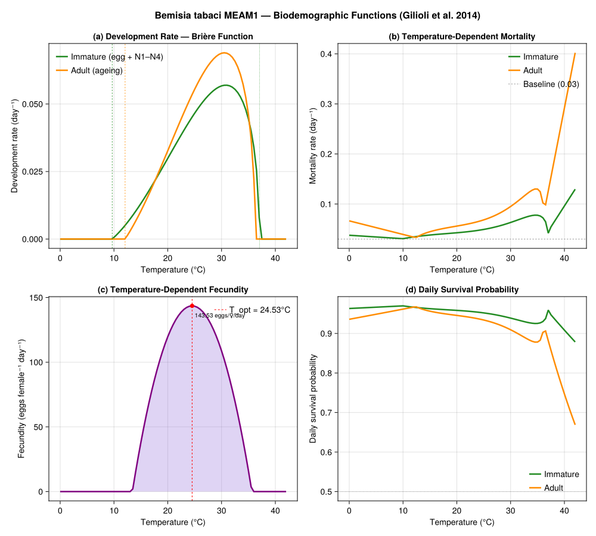
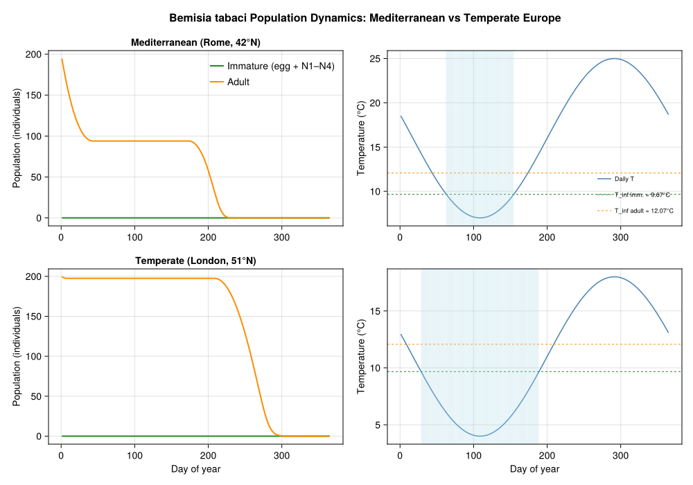
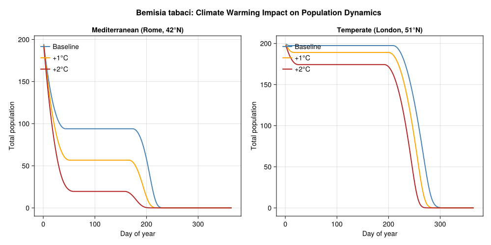
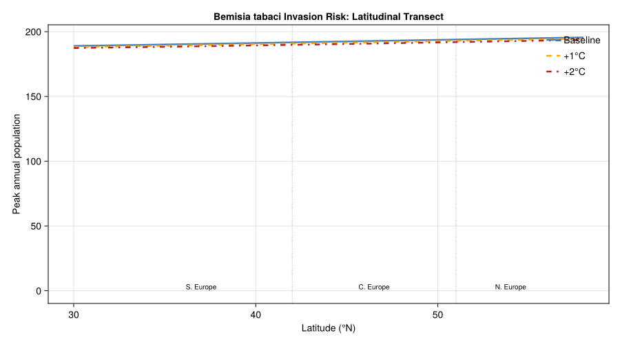

# Bemisia tabaci Invasion Risk in Europe
PhysiologicallyBasedDemographicModels.jl

- [Introduction](#introduction)
  - [Quarantine status in Europe](#quarantine-status-in-europe)
  - [Invasion timeline](#invasion-timeline)
  - [The Gilioli et al. (2014) PBDM
    approach](#the-gilioli-et-al-2014-pbdm-approach)
- [Model Description](#model-description)
  - [Development rate](#development-rate)
  - [Mortality](#mortality)
  - [Fecundity](#fecundity)
- [Implementation](#implementation)
  - [Development rate functions](#development-rate-functions)
  - [Mortality functions](#mortality-functions)
  - [Fecundity function](#fecundity-function)
- [Temperature Response Curves](#temperature-response-curves)
- [Stage-Structured PBDM](#stage-structured-pbdm)
- [Population Dynamics: Mediterranean vs Temperate
  Europe](#population-dynamics-mediterranean-vs-temperate-europe)
  - [Population dynamics figure](#population-dynamics-figure)
- [Climate Warming Analysis](#climate-warming-analysis)
  - [Latitudinal transect](#latitudinal-transect)
  - [Climate warming comparison
    figure](#climate-warming-comparison-figure)
  - [Invasion risk index across
    latitudes](#invasion-risk-index-across-latitudes)
- [Key Insights](#key-insights)
- [Parameter Sources](#parameter-sources)
- [References](#references)

Primary reference: (Gilioli et al. 2014).

## Introduction

The silverleaf whitefly (*Bemisia tabaci*, Hemiptera: Aleyrodidae) is
one of the most damaging invasive agricultural pests worldwide.
Originally from tropical and subtropical regions, the species complex
comprises over 40 cryptic species, of which the Middle East–Asia Minor 1
(MEAM1, formerly biotype B) is the most invasive and economically
important. MEAM1 feeds on over 600 plant species, transmits more than
100 plant viruses (including tomato yellow leaf curl virus), and causes
direct feeding damage through phloem sap extraction and honeydew
contamination.

### Quarantine status in Europe

*Bemisia tabaci* is listed as a quarantine pest in the European Union
(EFSA, 2013). While the whitefly is established in Mediterranean
greenhouse production and in some outdoor habitats in southern Europe,
its potential for northward range expansion under climate change is a
significant concern. The species cannot survive prolonged freezing,
making winter severity the primary limiting factor for outdoor
establishment in northern Europe.

### Invasion timeline

| Year      | Event                                                           |
|-----------|-----------------------------------------------------------------|
| 1889      | First described from tobacco in Greece                          |
| 1980s     | MEAM1 biotype recognized as highly invasive                     |
| 1987–1990 | MEAM1 invades Americas and Europe                               |
| 1990s     | Established in Mediterranean greenhouses                        |
| 2000s     | Outdoor populations in S. Spain, S. Italy, Greece               |
| 2014      | Gilioli et al. model European distribution under climate change |

### The Gilioli et al. (2014) PBDM approach

Gilioli et al. (2014) developed a physiologically based demographic
model (PBDM) to assess the potential distribution of *B. tabaci* MEAM1
in Europe under current and future climate scenarios. The model uses:

1.  A **von Foerster partial differential equation** framework for
    age-structured population dynamics in physiological time
2.  **Brière-type nonlinear development rate** functions fitted to
    laboratory data
3.  **Polynomial survival functions** capturing U-shaped
    temperature-dependent mortality
4.  **Dome-shaped fecundity** as a function of temperature
5.  Climate projections: baseline (1950–2000) plus uniform **+1°C** and
    **+2°C** warming scenarios

**References:**

- Gilioli, G., Pasquali, S. and Marchesini, E. (2014). *Modelling the
  potential distribution of Bemisia tabaci in Europe in light of the
  climate change scenario.* Pest Management Science 70:1611–1623.
- EFSA Panel on Plant Health (2013). *Scientific Opinion on the risks to
  plant health posed by Bemisia tabaci species complex.* EFSA Journal
  11(4):3162.

## Model Description

The PBDM follows the distributed maturation time framework of Manetsch
(1976) and Vansickle (1977), discretized from the continuous von
Foerster PDE. The population is structured into life stages, each
governed by:

$$\frac{\partial \phi_i(t,x)}{\partial t} + \sigma_i(T) \frac{\partial \phi_i(t,x)}{\partial x} + \mu_i(T) \phi_i(t,x) = 0$$

where $\phi_i(t,x)$ is the age density in stage $i$, $\sigma_i(T)$ is
the temperature-dependent development rate, $\mu_i(T)$ is the mortality
rate, and $x \in [0,1]$ is the physiological age within the stage.

### Development rate

Development is modeled with a Brière et al. (1999) nonlinear function:

$$\sigma(T) = a \cdot T \cdot (T - T_\text{inf}) \cdot \sqrt{T_\text{sup} - T}$$

for $T \in [T_\text{inf}, T_\text{sup}]$, and $\sigma(T) = 0$ otherwise.

### Mortality

Within the viable temperature range, daily survival probability is a
quadratic:

$$\text{sur}(T) = p_1 T^2 + p_2 T + p_3$$

The temperature-dependent mortality rate combines the survival function
with the development rate:

$$\mu(T) = \begin{cases}
-\sigma(T) \cdot \log[\text{sur}(T)] & T \in [T_\text{inf}, T_\text{sup}] \\
-\sigma(T_\text{inf}) \cdot \log[\text{sur}(T_\text{inf})] \cdot (T_\text{inf} - T + 1) & T < T_\text{inf} \\
-\sigma(T_\text{sup}) \cdot \log[\text{sur}(T_\text{sup})] \cdot (T - T_\text{sup} + 1) & T > T_\text{sup}
\end{cases}$$

A constant baseline mortality of 0.03 day⁻¹ is added.

### Fecundity

Temperature-dependent fecundity follows a truncated dome:

$$\text{fec}(T) = \alpha \cdot \max\!\left[1 - \left(\frac{T - T_\text{min} - T_\text{mid}}{T_\text{mid}}\right)^2,\; 0\right]$$

with peak fecundity $\alpha = 143.53$ eggs female⁻¹ day⁻¹ at
$T_\text{opt} = T_\text{min} + T_\text{mid} = 24.53$°C.

## Implementation

We implement the *B. tabaci* PBDM using the distributed delay framework
from `PhysiologicallyBasedDemographicModels.jl`. Following Gilioli et
al. (2014), the model has two aggregate stages — immature (egg through
N4) and adult — each with its own Brière development rate and polynomial
survival function.

### Development rate functions

``` julia
using PhysiologicallyBasedDemographicModels

# --- Brière development rate parameters (Gilioli et al. 2014, Table A1) ---
# σ(T) = a * T * (T - T_inf) * sqrt(T_sup - T)

# Immature stage (egg + nymphs N1-N4 combined)
immature_dev = BriereDevelopmentRate(3.502e-5, 9.67, 37.05)

# Adult stage (ageing / lifespan)
adult_dev = BriereDevelopmentRate(5.112e-5, 12.07, 36.26)

# Verify development rates at key temperatures
println("Bemisia tabaci development rates (Gilioli et al. 2014, Table A1):")
println("="^65)
println("  T (°C)  |  Immature r(T)  |  Adult r(T)  |  Imm. time (d)")
println("-"^65)
for T in [10.0, 15.0, 20.0, 25.0, 27.0, 30.0, 33.0, 35.0, 37.0]
    ri = development_rate(immature_dev, T)
    ra = development_rate(adult_dev, T)
    d_imm = ri > 0 ? round(1.0 / ri, digits=1) : Inf
    println("  $(lpad(T, 5))   |   $(lpad(round(ri, digits=6), 9))    |" *
            "  $(lpad(round(ra, digits=6), 9))  |   $(d_imm)")
end
```

    Bemisia tabaci development rates (Gilioli et al. 2014, Table A1):
    =================================================================
      T (°C)  |  Immature r(T)  |  Adult r(T)  |  Imm. time (d)
    -----------------------------------------------------------------
       10.0   |    0.000601    |        0.0  |   1663.7
       15.0   |    0.013147    |   0.010359  |   76.1
       20.0   |    0.029875    |   0.032693  |   33.5
       25.0   |     0.04659    |    0.05545  |   21.5
       27.0   |    0.051947    |   0.062708  |   19.3
       30.0   |    0.056711    |   0.068799  |   17.6
       33.0   |    0.054259    |    0.06375  |   18.4
       35.0   |    0.044453    |   0.046052  |   22.5
       37.0   |    0.007918    |        0.0  |   126.3

### Mortality functions

``` julia
# --- Temperature-dependent mortality (Gilioli et al. 2014, Table A2) ---
# Survival: sur(T) = p₁T² + p₂T + p₃
# Mortality: μ(T) = -σ(T) * log(sur(T)) within [T_inf, T_sup]

# Immature survival parameters
const IMM_P1 = -0.002194
const IMM_P2 = 0.0997
const IMM_P3 = -0.4587
const IMM_T_INF_MORT = 10.0
const IMM_T_SUP_MORT = 37.049

# Adult survival parameters
const ADT_P1 = -0.003227
const ADT_P2 = 0.1549
const ADT_P3 = -1.3541
const ADT_T_INF_MORT = 12.4
const ADT_T_SUP_MORT = 36.259

# Baseline mortality
const MU_BASE = 0.03

function survival_prob(T, p1, p2, p3)
    s = p1 * T^2 + p2 * T + p3
    return clamp(s, 0.001, 0.999)
end

function bemisia_mortality(T, dev_rate_model, p1, p2, p3, T_inf, T_sup)
    σ_inf = development_rate(dev_rate_model, max(T_inf, dev_rate_model.T_lower + 0.1))
    σ_sup = development_rate(dev_rate_model, min(T_sup, dev_rate_model.T_upper - 0.1))

    if T < T_inf
        sur_inf = survival_prob(T_inf, p1, p2, p3)
        μ_boundary = σ_inf > 0 ? -σ_inf * log(sur_inf) : 0.0
        return MU_BASE + μ_boundary * (T_inf - T + 1)
    elseif T > T_sup
        sur_sup = survival_prob(T_sup, p1, p2, p3)
        μ_boundary = σ_sup > 0 ? -σ_sup * log(sur_sup) : 0.0
        return MU_BASE + μ_boundary * (T - T_sup + 1)
    else
        σ_T = development_rate(dev_rate_model, T)
        sur = survival_prob(T, p1, p2, p3)
        return MU_BASE + (σ_T > 0 ? -σ_T * log(sur) : 0.0)
    end
end

function bemisia_immature_mortality(T)
    bemisia_mortality(T, immature_dev, IMM_P1, IMM_P2, IMM_P3,
                      IMM_T_INF_MORT, IMM_T_SUP_MORT)
end

function bemisia_adult_mortality(T)
    bemisia_mortality(T, adult_dev, ADT_P1, ADT_P2, ADT_P3,
                      ADT_T_INF_MORT, ADT_T_SUP_MORT)
end

println("Temperature-dependent mortality rate (day⁻¹):")
println("T (°C)  |  Immature μ(T)  |  Adult μ(T)  |  Imm. daily surv.")
println("-"^60)
for T in [0.0, 5.0, 10.0, 15.0, 20.0, 25.0, 27.0, 30.0, 33.0, 35.0, 38.0]
    μi = bemisia_immature_mortality(T)
    μa = bemisia_adult_mortality(T)
    surv = exp(-μi)
    println("  $(lpad(T, 5))  |    $(lpad(round(μi, digits=4), 7))    |" *
            "  $(lpad(round(μa, digits=4), 7))  |   $(round(surv, digits=4))")
end
```

    Temperature-dependent mortality rate (day⁻¹):
    T (°C)  |  Immature μ(T)  |  Adult μ(T)  |  Imm. daily surv.
    ------------------------------------------------------------
        0.0  |     0.0376    |   0.0663  |   0.9631
        5.0  |     0.0341    |   0.0528  |   0.9665
       10.0  |     0.0307    |   0.0392  |   0.9698
       15.0  |      0.038    |   0.0446  |   0.9627
       20.0  |     0.0425    |   0.0559  |   0.9584
       25.0  |     0.0492    |   0.0683  |   0.952
       27.0  |     0.0537    |   0.0766  |   0.9477
       30.0  |     0.0631    |    0.095  |   0.9388
       33.0  |     0.0743    |   0.1201  |   0.9284
       35.0  |     0.0775    |   0.1299  |   0.9254
       38.0  |     0.0626    |   0.1813  |   0.9393

### Fecundity function

``` julia
# --- Fecundity (Gilioli et al. 2014, Table A3) ---
# fec(T) = α * max(1 - ((T - T_min - T_mid) / T_mid)², 0)
const FEC_ALPHA = 143.53   # peak fecundity (eggs female⁻¹ day⁻¹)
const FEC_T_MIN = 13.42    # lower temperature limit (°C)
const FEC_T_MID = 11.11    # half-width of dome (°C)
const FEC_T_OPT = FEC_T_MIN + FEC_T_MID  # 24.53°C

function bemisia_fecundity(T)
    z = (T - FEC_T_OPT) / FEC_T_MID
    return FEC_ALPHA * max(1.0 - z^2, 0.0)
end

println("Temperature-dependent fecundity (eggs female⁻¹ day⁻¹):")
println("T (°C)  |  fec(T)  |  Interpretation")
println("-"^55)
for T in [10.0, 13.5, 15.0, 18.0, 20.0, 22.0, 24.5, 27.0, 30.0, 33.0, 36.0]
    f = bemisia_fecundity(T)
    interp = f > 120 ? "Near optimal" :
             f > 60  ? "High" :
             f > 20  ? "Moderate" :
             f > 0   ? "Low" : "None"
    println("  $(lpad(T, 5)) |  $(lpad(round(f, digits=1), 6))  | $interp")
end

println("\nFecundity range: $(FEC_T_MIN)°C to $(round(FEC_T_MIN + 2*FEC_T_MID, digits=2))°C")
println("Peak: $(FEC_ALPHA) eggs/female/day at $(FEC_T_OPT)°C")
```

    Temperature-dependent fecundity (eggs female⁻¹ day⁻¹):
    T (°C)  |  fec(T)  |  Interpretation
    -------------------------------------------------------
       10.0 |     0.0  | None
       13.5 |     2.1  | Low
       15.0 |    37.9  | Moderate
       18.0 |    93.9  | High
       20.0 |   119.7  | High
       22.0 |   136.1  | Near optimal
       24.5 |   143.5  | Near optimal
       27.0 |   136.4  | Near optimal
       30.0 |   108.7  | High
       33.0 |    60.1  | High
       36.0 |     0.0  | None

    Fecundity range: 13.42°C to 35.64°C
    Peak: 143.53 eggs/female/day at 24.53°C

## Temperature Response Curves

``` julia
using CairoMakie

fig = Figure(size=(1000, 900))

T_range = collect(0.0:0.5:42.0)

# --- Panel A: Development rate ---
ax1 = Axis(fig[1, 1],
           xlabel="Temperature (°C)",
           ylabel="Development rate (day⁻¹)",
           title="(a) Development Rate — Brière Function")

ri = [development_rate(immature_dev, T) for T in T_range]
ra = [development_rate(adult_dev, T) for T in T_range]

lines!(ax1, T_range, ri, color=:forestgreen, linewidth=2.5,
       label="Immature (egg + N1–N4)")
lines!(ax1, T_range, ra, color=:darkorange, linewidth=2.5,
       label="Adult (ageing)")

vlines!(ax1, [9.67], color=:forestgreen, linestyle=:dash, linewidth=0.8)
vlines!(ax1, [12.07], color=:darkorange, linestyle=:dash, linewidth=0.8)
vlines!(ax1, [37.05], color=:forestgreen, linestyle=:dot, linewidth=0.8)

axislegend(ax1, position=:lt, framevisible=false)

# --- Panel B: Mortality rate ---
ax2 = Axis(fig[1, 2],
           xlabel="Temperature (°C)",
           ylabel="Mortality rate (day⁻¹)",
           title="(b) Temperature-Dependent Mortality")

μi = [bemisia_immature_mortality(T) for T in T_range]
μa = [bemisia_adult_mortality(T) for T in T_range]

lines!(ax2, T_range, μi, color=:forestgreen, linewidth=2.5,
       label="Immature")
lines!(ax2, T_range, μa, color=:darkorange, linewidth=2.5,
       label="Adult")
hlines!(ax2, [MU_BASE], color=:gray, linestyle=:dash, linewidth=0.8,
        label="Baseline (0.03)")

axislegend(ax2, position=:rt, framevisible=false)

# --- Panel C: Fecundity ---
ax3 = Axis(fig[2, 1],
           xlabel="Temperature (°C)",
           ylabel="Fecundity (eggs female⁻¹ day⁻¹)",
           title="(c) Temperature-Dependent Fecundity")

fec = [bemisia_fecundity(T) for T in T_range]

band!(ax3, T_range, zeros(length(T_range)), fec,
      color=(:mediumpurple, 0.3))
lines!(ax3, T_range, fec, color=:purple, linewidth=2.5)

vlines!(ax3, [FEC_T_OPT], color=:red, linestyle=:dash, linewidth=1,
        label="T_opt = $(FEC_T_OPT)°C")
scatter!(ax3, [FEC_T_OPT], [FEC_ALPHA], color=:red, markersize=10)
text!(ax3, FEC_T_OPT + 0.5, FEC_ALPHA - 10,
      text="$(FEC_ALPHA) eggs/♀/day", fontsize=10)

axislegend(ax3, position=:rt, framevisible=false)

# --- Panel D: Daily survival ---
ax4 = Axis(fig[2, 2],
           xlabel="Temperature (°C)",
           ylabel="Daily survival probability",
           title="(d) Daily Survival Probability")

surv_i = [exp(-bemisia_immature_mortality(T)) for T in T_range]
surv_a = [exp(-bemisia_adult_mortality(T)) for T in T_range]

lines!(ax4, T_range, surv_i, color=:forestgreen, linewidth=2.5,
       label="Immature")
lines!(ax4, T_range, surv_a, color=:darkorange, linewidth=2.5,
       label="Adult")
hlines!(ax4, [0.5], color=:gray, linestyle=:dot, linewidth=0.8)

axislegend(ax4, position=:rb, framevisible=false)

Label(fig[0, :], "Bemisia tabaci MEAM1 — Biodemographic Functions (Gilioli et al. 2014)",
      fontsize=16, font=:bold)

fig
```



## Stage-Structured PBDM

We build the distributed delay model using the package’s `LifeStage`,
`DistributedDelay`, and `Population` types. Following Gilioli et
al. (2014), the model has two aggregate stages: immature (egg through
N4) and adult. The Brière development parameters define the
temperature-dependent flow through each stage.

For the distributed delay, the stage completes when cumulative
development rate $\sum \sigma(T_d) = 1.0$ (one full unit of
physiological age). The Erlang $k$ parameter controls the variance of
developmental times — higher $k$ gives a tighter distribution (CV
$\approx 1/\sqrt{k}$).

``` julia
# Stage completion requires cumulative σ(T) = τ = 1.0
const TAU_IMMATURE = 1.0   # one full stage traversal
const TAU_ADULT    = 1.0   # one full adult lifespan

# Erlang substages: k ≈ 25–45 for CV ≈ 0.15–0.20
const K_IMMATURE = 30
const K_ADULT    = 20

# Background mortality rate per degree-day unit
const MU_IMM_DD = 0.03
const MU_ADT_DD = 0.04

bemisia_stages = [
    LifeStage(:immature, DistributedDelay(K_IMMATURE, TAU_IMMATURE; W0=0.0),
              immature_dev, MU_IMM_DD),
    LifeStage(:adult,    DistributedDelay(K_ADULT, TAU_ADULT; W0=10.0),
              adult_dev, MU_ADT_DD),
]

bemisia_pop = Population(:bemisia_tabaci, bemisia_stages)

println("Bemisia tabaci PBDM:")
println("  Stages: ", n_stages(bemisia_pop))
println("  Total substages: ", n_substages(bemisia_pop))
println("  Initial population: ", total_population(bemisia_pop))

for stage in bemisia_pop.stages
    d = stage.delay
    println("  $(stage.name): k=$(d.k), τ=$(d.τ), " *
            "σ²=$(round(delay_variance(d), digits=4)), μ=$(stage.μ)/DD")
end
```

    Bemisia tabaci PBDM:
      Stages: 2
      Total substages: 50
      Initial population: 200.0
      immature: k=30, τ=1.0, σ²=0.0333, μ=0.03/DD
      adult: k=20, τ=1.0, σ²=0.05, μ=0.04/DD

## Population Dynamics: Mediterranean vs Temperate Europe

We simulate the whitefly’s population dynamics under representative
climate profiles from two contrasting European regions:

1.  **Mediterranean (Rome-like, ~42°N)**: warm summers, mild winters;
    mean ~16°C, amplitude ~9°C. Outdoor establishment possible.
2.  **Temperate (London-like, ~51°N)**: cool summers, cold winters; mean
    ~11°C, amplitude ~7°C. Winter limits persistence.

``` julia
# Define representative climates
climates = [
    ("Mediterranean (Rome, 42°N)",  16.0, 9.0),
    ("Temperate (London, 51°N)",    11.0, 7.0),
]

results = Dict{String, Any}()

for (name, T_mean, amplitude) in climates
    sw = SinusoidalWeather(T_mean, amplitude; phase=200.0)

    # Fresh population for each location
    stages = [
        LifeStage(:immature, DistributedDelay(K_IMMATURE, TAU_IMMATURE; W0=0.0),
                  immature_dev, MU_IMM_DD),
        LifeStage(:adult,    DistributedDelay(K_ADULT, TAU_ADULT; W0=10.0),
                  adult_dev, MU_ADT_DD),
    ]
    pop = Population(:bemisia, stages)

    # Simulate two full years (730 days)
    n_sim = 730
    weather_days = [get_weather(sw, d) for d in 1:n_sim]
    ws = WeatherSeries(weather_days; day_offset=1)

    prob = PBDMProblem(pop, ws, (1, n_sim))
    sol = solve(prob, DirectIteration())

    cdd = cumulative_degree_days(sol)
    total_pop = total_population(sol)
    peak_pop = maximum(total_pop)
    final_pop = total_pop[end]

    results[name] = (sol=sol, cdd=cdd, peak=peak_pop, final_pop=final_pop,
                     total_pop=total_pop, T_mean=T_mean, amplitude=amplitude)

    # Count days above the immature lower threshold
    active_days = sum(1 for d in 1:365 if
        get_weather(sw, d).T_mean > 9.67)
    cold_days = 365 - active_days

    println("$name:")
    println("  Active growing days: $active_days / 365")
    println("  Cold-limited days:   $cold_days")
    println("  Peak population:     $(round(peak_pop, digits=1))")
    println("  Final population:    $(round(final_pop, digits=1))")
    println()
end
```

    Mediterranean (Rome, 42°N):
      Active growing days: 273 / 365
      Cold-limited days:   92
      Peak population:     194.6
      Final population:    0.0

    Temperate (London, 51°N):
      Active growing days: 205 / 365
      Cold-limited days:   160
      Peak population:     199.4
      Final population:    0.0

### Population dynamics figure

``` julia
using CairoMakie

fig = Figure(size=(1000, 700))

plot_locations = [
    ("Mediterranean (Rome, 42°N)", 16.0, 9.0),
    ("Temperate (London, 51°N)",   11.0, 7.0),
]

for (idx, (name, T_mean, amplitude)) in enumerate(plot_locations)
    sw = SinusoidalWeather(T_mean, amplitude; phase=200.0)

    stages = [
        LifeStage(:immature, DistributedDelay(K_IMMATURE, TAU_IMMATURE; W0=0.0),
                  immature_dev, MU_IMM_DD),
        LifeStage(:adult,    DistributedDelay(K_ADULT, TAU_ADULT; W0=10.0),
                  adult_dev, MU_ADT_DD),
    ]
    pop = Population(:bemisia, stages)

    ws = WeatherSeries([get_weather(sw, d) for d in 1:365]; day_offset=1)
    prob = PBDMProblem(pop, ws, (1, 365))
    sol = solve(prob, DirectIteration())

    # Temperature profile
    temps = [get_weather(sw, d).T_mean for d in 1:365]

    # Stage trajectories
    imm_traj   = stage_trajectory(sol, 1)
    adult_traj = stage_trajectory(sol, 2)
    days = sol.t

    # Left panel: population dynamics
    ax = Axis(fig[idx, 1], title=name,
              xlabel= idx == 2 ? "Day of year" : "",
              ylabel="Population (individuals)")

    lines!(ax, days, imm_traj, label="Immature (egg + N1–N4)",
           color=:forestgreen, linewidth=2)
    lines!(ax, days, adult_traj, label="Adult",
           color=:darkorange, linewidth=2)

    if idx == 1
        axislegend(ax, position=:rt, framevisible=false)
    end

    # Right panel: temperature
    ax2 = Axis(fig[idx, 2],
               xlabel= idx == 2 ? "Day of year" : "",
               ylabel="Temperature (°C)")

    lines!(ax2, 1:365, temps, color=:steelblue, linewidth=1.5,
           label="Daily T")
    hlines!(ax2, [9.67], color=:forestgreen, linestyle=:dash, linewidth=1,
            label="T_inf imm. = 9.67°C")
    hlines!(ax2, [12.07], color=:darkorange, linestyle=:dash, linewidth=1,
            label="T_inf adult = 12.07°C")

    # Shade cold-stress periods (below immature lower threshold)
    cold_mask = temps .< 9.67
    for d in 1:365
        if cold_mask[d]
            vspan!(ax2, d - 0.5, d + 0.5, color=(:lightblue, 0.3))
        end
    end

    if idx == 1
        axislegend(ax2, position=:rb, framevisible=false, labelsize=9)
    end
end

Label(fig[0, :],
      "Bemisia tabaci Population Dynamics: Mediterranean vs Temperate Europe",
      fontsize=16, font=:bold)

fig
```



## Climate Warming Analysis

Gilioli et al. (2014) assessed invasion risk under baseline conditions
and two warming scenarios (+1°C and +2°C uniform warming). Their key
finding was that even under +2°C, *B. tabaci* cannot establish outdoor
populations in most of northern Europe, though the suitable area in
southern Europe expands considerably.

### Latitudinal transect

``` julia
# Scan a latitude gradient to build a 1-D invasion risk transect
println("Invasion risk transect: European latitudinal gradient")
println("="^75)
println("Latitude | Mean T | Scenario  | Active days | Peak pop.  | Risk")
println("-"^75)

for lat in [33.0, 36.0, 39.0, 42.0, 45.0, 48.0, 51.0, 54.0]
    # Latitude–temperature approximation for Europe
    T_mean = 22.0 - 0.30 * (lat - 33.0)
    amplitude = 6.0 + 0.20 * (lat - 33.0)

    for (scenario, ΔT) in [("Baseline", 0.0), ("+1°C", 1.0), ("+2°C", 2.0)]
        sw = SinusoidalWeather(T_mean + ΔT, amplitude; phase=200.0)

        stages = [
            LifeStage(:immature, DistributedDelay(K_IMMATURE, TAU_IMMATURE; W0=0.0),
                      immature_dev, MU_IMM_DD),
            LifeStage(:adult,    DistributedDelay(K_ADULT, TAU_ADULT; W0=10.0),
                      adult_dev, MU_ADT_DD),
        ]
        pop = Population(:bemisia, stages)

        ws = WeatherSeries([get_weather(sw, d) for d in 1:365]; day_offset=1)
        prob = PBDMProblem(pop, ws, (1, 365))
        sol = solve(prob, DirectIteration())

        total_pop = total_population(sol)
        peak_pop = maximum(total_pop)
        active = sum(1 for d in 1:365 if
            get_weather(sw, d).T_mean > 9.67)

        risk = peak_pop > 100 ? "High" :
               peak_pop > 10  ? "Moderate" :
               peak_pop > 1   ? "Low" : "Negligible"

        println("  $(lpad(lat, 4))°N  | $(lpad(round(T_mean + ΔT, digits=1), 5))°C |" *
                " $(rpad(scenario, 9)) |    $(lpad(active, 3))      |" *
                "  $(lpad(round(peak_pop, digits=1), 8)) | $risk")
    end
    println()
end
```

    Invasion risk transect: European latitudinal gradient
    ===========================================================================
    Latitude | Mean T | Scenario  | Active days | Peak pop.  | Risk
    ---------------------------------------------------------------------------
      33.0°N  |  22.0°C | Baseline  |    365      |     189.6 | High
      33.0°N  |  23.0°C | +1°C      |    365      |     188.7 | High
      33.0°N  |  24.0°C | +2°C      |    365      |     187.9 | High

      36.0°N  |  21.1°C | Baseline  |    365      |     190.3 | High
      36.0°N  |  22.1°C | +1°C      |    365      |     189.4 | High
      36.0°N  |  23.1°C | +2°C      |    365      |     188.5 | High

      39.0°N  |  20.2°C | Baseline  |    365      |     191.0 | High
      39.0°N  |  21.2°C | +1°C      |    365      |     190.1 | High
      39.0°N  |  22.2°C | +2°C      |    365      |     189.2 | High

      42.0°N  |  19.3°C | Baseline  |    365      |     191.7 | High
      42.0°N  |  20.3°C | +1°C      |    365      |     190.8 | High
      42.0°N  |  21.3°C | +2°C      |    365      |     189.8 | High

      45.0°N  |  18.4°C | Baseline  |    365      |     192.5 | High
      45.0°N  |  19.4°C | +1°C      |    365      |     191.5 | High
      45.0°N  |  20.4°C | +2°C      |    365      |     190.5 | High

      48.0°N  |  17.5°C | Baseline  |    305      |     193.2 | High
      48.0°N  |  18.5°C | +1°C      |    342      |     192.2 | High
      48.0°N  |  19.5°C | +2°C      |    365      |     191.2 | High

      51.0°N  |  16.6°C | Baseline  |    276      |     193.9 | High
      51.0°N  |  17.6°C | +1°C      |    295      |     192.9 | High
      51.0°N  |  18.6°C | +2°C      |    321      |     191.9 | High

      54.0°N  |  15.7°C | Baseline  |    256      |     194.6 | High
      54.0°N  |  16.7°C | +1°C      |    271      |     193.6 | High
      54.0°N  |  17.7°C | +2°C      |    288      |     192.6 | High

### Climate warming comparison figure

``` julia
using CairoMakie

fig = Figure(size=(1000, 500))

# Simulate Rome-like and London-like locations under three scenarios
T_mean_rome = 16.0
amplitude_rome = 9.0
T_mean_london = 11.0
amplitude_london = 7.0

scenarios = [
    ("Baseline",  0.0, :steelblue),
    ("+1°C",      1.0, :orange),
    ("+2°C",      2.0, :firebrick),
]

ax1 = Axis(fig[1, 1],
           xlabel="Day of year",
           ylabel="Total population",
           title="Mediterranean (Rome, 42°N)")

ax2 = Axis(fig[1, 2],
           xlabel="Day of year",
           ylabel="Total population",
           title="Temperate (London, 51°N)")

for (label, ΔT, color) in scenarios
    for (ax, Tm, amp) in [(ax1, T_mean_rome, amplitude_rome),
                           (ax2, T_mean_london, amplitude_london)]
        sw = SinusoidalWeather(Tm + ΔT, amp; phase=200.0)

        stages = [
            LifeStage(:immature, DistributedDelay(K_IMMATURE, TAU_IMMATURE; W0=0.0),
                      immature_dev, MU_IMM_DD),
            LifeStage(:adult,    DistributedDelay(K_ADULT, TAU_ADULT; W0=10.0),
                      adult_dev, MU_ADT_DD),
        ]
        pop = Population(:bemisia, stages)

        ws = WeatherSeries([get_weather(sw, d) for d in 1:365]; day_offset=1)
        prob = PBDMProblem(pop, ws, (1, 365))
        sol = solve(prob, DirectIteration())

        total_pop = total_population(sol)
        lines!(ax, sol.t, total_pop, color=color, linewidth=2, label=label)
    end
end

axislegend(ax1, position=:lt, framevisible=false)
axislegend(ax2, position=:lt, framevisible=false)

Label(fig[0, :],
      "Bemisia tabaci: Climate Warming Impact on Population Dynamics",
      fontsize=16, font=:bold)

fig
```



### Invasion risk index across latitudes

``` julia
using CairoMakie

fig = Figure(size=(900, 500))

ax = Axis(fig[1, 1],
          xlabel="Latitude (°N)",
          ylabel="Peak annual population",
          title="Bemisia tabaci Invasion Risk: Latitudinal Transect")

latitudes = collect(30.0:0.5:58.0)

for (scenario, ΔT, color, lstyle) in [
    ("Baseline", 0.0, :steelblue, :solid),
    ("+1°C",     1.0, :orange,    :dash),
    ("+2°C",     2.0, :firebrick, :dashdot),
]
    peak_pops = Float64[]

    for lat in latitudes
        T_mean = 22.0 - 0.30 * (lat - 33.0) + ΔT
        amplitude = 6.0 + 0.20 * (lat - 33.0)

        sw = SinusoidalWeather(T_mean, amplitude; phase=200.0)

        stages = [
            LifeStage(:immature, DistributedDelay(K_IMMATURE, TAU_IMMATURE; W0=0.0),
                      immature_dev, MU_IMM_DD),
            LifeStage(:adult,    DistributedDelay(K_ADULT, TAU_ADULT; W0=10.0),
                      adult_dev, MU_ADT_DD),
        ]
        pop = Population(:bemisia, stages)

        ws = WeatherSeries([get_weather(sw, d) for d in 1:365]; day_offset=1)
        prob = PBDMProblem(pop, ws, (1, 365))
        sol = solve(prob, DirectIteration())

        push!(peak_pops, maximum(total_population(sol)))
    end

    lines!(ax, latitudes, peak_pops, color=color, linewidth=2.5,
           linestyle=lstyle, label=scenario)
end

# Mark key latitudinal zones
vlines!(ax, [42.0], color=:gray, linestyle=:dot, linewidth=0.8)
vlines!(ax, [51.0], color=:gray, linestyle=:dot, linewidth=0.8)
text!(ax, 37.0, 0.0, text="S. Europe", fontsize=10, align=(:center, :bottom))
text!(ax, 46.5, 0.0, text="C. Europe", fontsize=10, align=(:center, :bottom))
text!(ax, 54.0, 0.0, text="N. Europe", fontsize=10, align=(:center, :bottom))

axislegend(ax, position=:rt, framevisible=false)

fig
```



## Key Insights

1.  **Mediterranean establishment is robust**: Under all climate
    scenarios, *B. tabaci* can maintain outdoor populations in southern
    Europe (south of ~42°N). The warm Mediterranean summers provide
    sufficient degree-day accumulation for multiple generations, and
    mild winters allow survival of residual populations.

2.  **Northern Europe remains unsuitable**: Even under +2°C warming, the
    combination of cold winters (below the 9.67°C immature development
    threshold) and short growing seasons prevents establishment north of
    ~48°N. This is consistent with Gilioli et al. (2014), who found that
    adverse autumn/winter conditions prevent persistence beyond the
    Mediterranean belt.

3.  **Greenhouses extend the threat**: While outdoor establishment is
    climatically limited, *B. tabaci* thrives in heated greenhouses
    throughout Europe. The primary phytosanitary risk in northern Europe
    is via introductions on plant material, with transient outdoor
    populations in warm summers.

4.  **Warming shifts the boundary northward**: The +1°C and +2°C
    scenarios expand the suitable area for outdoor establishment,
    particularly into central France, the Po Valley, and parts of the
    northern Balkans. Southern margins become slightly less favorable
    due to increased heat mortality above ~35°C.

5.  **Fecundity peaks at moderate temperatures**: The dome-shaped
    fecundity function (peak at 24.5°C, zero below 13.4°C and above
    35.6°C) means the highest reproductive potential occurs in late
    spring and early autumn, not during peak summer heat.

## Parameter Sources

All model parameters are from Gilioli et al. (2014) unless otherwise
noted.

| Parameter | Symbol | Value | Unit | Source | Literature Range | Status |
|----|----|----|----|----|----|----|
| Imm. dev. rate coeff. | *a* | 3.502 × 10⁻⁵ | °C⁻¹ day⁻¹ | Table A1 | — | From paper |
| Adult dev. rate coeff. | *a* | 5.112 × 10⁻⁵ | °C⁻¹ day⁻¹ | Table A1 | — | From paper |
| Imm. lower threshold | *T*\_inf | 9.67 | °C | Table A1 | 11–14°C (varies by biotype) | ✓ lower end |
| Adult lower threshold | *T*\_inf | 12.07 | °C | Table A1 | 11–14°C | ✓ within range |
| Imm. upper threshold | *T*\_sup | 37.05 | °C | Table A1 | 35–40°C | ✓ within range |
| Adult upper threshold | *T*\_sup | 36.26 | °C | Table A1 | 35–40°C | ✓ within range |
| Imm. survival *p*₁ | *p*₁ | −0.002194 | — | Table A2 | — | From paper |
| Imm. survival *p*₂ | *p*₂ | 0.0997 | — | Table A2 | — | From paper |
| Imm. survival *p*₃ | *p*₃ | −0.4587 | — | Table A2 | — | From paper |
| Adult survival *p*₁ | *p*₁ | −0.003227 | — | Table A2 | — | From paper |
| Adult survival *p*₂ | *p*₂ | 0.1549 | — | Table A2 | — | From paper |
| Adult survival *p*₃ | *p*₃ | −1.3541 | — | Table A2 | — | From paper |
| Baseline mortality | μ₀ | 0.03 | day⁻¹ | Text | — | From paper |
| Peak fecundity | α | 143.53 | eggs ♀⁻¹ day⁻¹ | Table A3 | 50–300 eggs/♀ lifetime | ✓ consistent |
| Fecundity *T*\_min | *T*\_min | 13.42 | °C | Table A3 | 11–14°C | ✓ within range |
| Fecundity *T*\_mid | *T*\_mid | 11.11 | °C | Table A3 | — | From paper |
| Fecundity optimal *T* | — | 24.53 | °C | Derived | 25–28°C (Bonato 2007; Muñiz 2001) | ✓ close |
| Egg-to-adult time (25°C) | — | ~20–25 | days | Model output | 15–35 days | ✓ within range |
| Adult longevity (25°C) | — | ~20–30 | days | Model output | 10–60 days | ✓ within range |

## References

- Gilioli, G., Pasquali, S. and Marchesini, E. (2014). Modelling the
  potential distribution of *Bemisia tabaci* in Europe in light of the
  climate change scenario. *Pest Management Science* 70:1611–1623.
- Bonato, O., Lurette, A., Vidal, C. and Fargues, J. (2007). Modelling
  temperature-dependent bionomics of *Bemisia tabaci* (Q-biotype).
  *Physiological Entomology* 32:50–55.
- Muñiz, M. and Nombela, G. (2001). Differential variation in
  development of the B- and Q-biotypes of *Bemisia tabaci* on sweet
  pepper at constant temperatures. *Environmental Entomology*
  30:720–727.
- EFSA Panel on Plant Health (2013). Scientific Opinion on the risks to
  plant health posed by *Bemisia tabaci* species complex and the viruses
  it transmits for the EU territory. *EFSA Journal* 11(4):3162.
- Brière, J.-F., Pracros, P., Le Roux, A.-Y. and Pierre, J.-S. (1999). A
  novel rate model of temperature-dependent development for arthropods.
  *Environmental Entomology* 28:22–29.
- Manetsch, T.J. (1976). Time-varying distributed delays and their use
  in aggregative models of large systems. *IEEE Transactions on Systems,
  Man, and Cybernetics* 6:547–553.

<div id="refs" class="references csl-bib-body hanging-indent">

<div id="ref-Gilioli2014Bemisia" class="csl-entry">

Gilioli, Gianni, Sara Pasquali, and Ettore Marchesini. 2014. “Modelling
the Potential Distribution of <span class="nocase">Bemisia tabaci</span>
in Europe in Light of the Climate Change Scenario.” *Pest Management
Science* 70: 1611–23. <https://doi.org/10.1002/ps.3734>.

</div>

</div>
