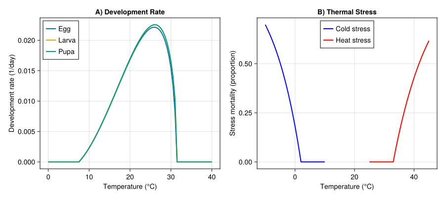
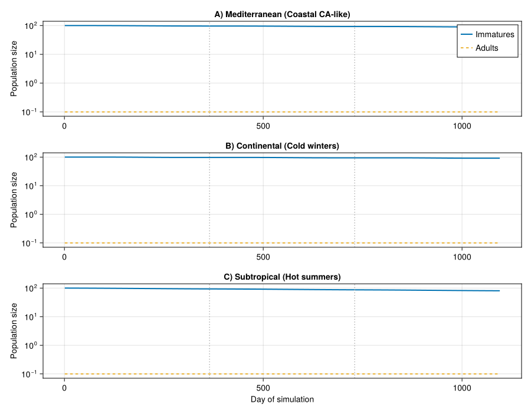
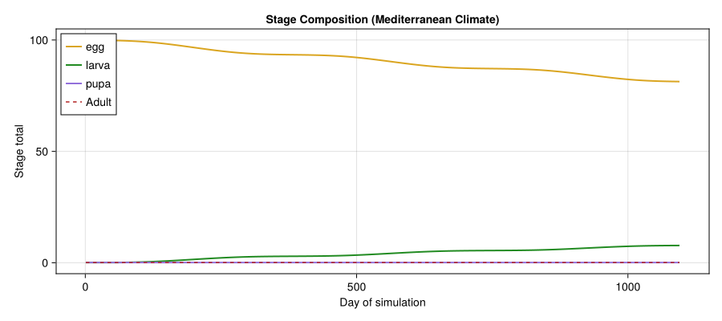
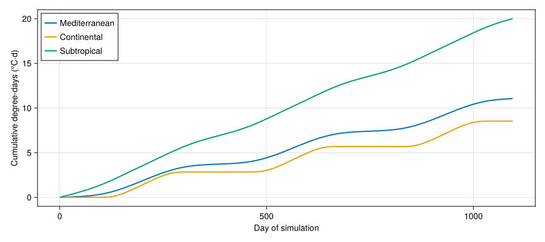
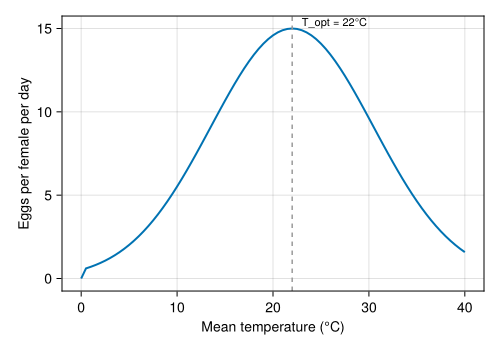

# Light Brown Apple Moth Invasion Potential
PhysiologicallyBasedDemographicModels.jl

- [Introduction](#introduction)
- [Biology and Life History](#biology-and-life-history)
- [Model Description](#model-description)
- [Implementation](#implementation)
  - [Setup](#setup)
  - [Development Rate Parameters](#development-rate-parameters)
  - [Degree-Day Requirements and Distributed
    Delays](#degree-day-requirements-and-distributed-delays)
  - [Life Stage Assembly](#life-stage-assembly)
  - [Temperature-Dependent Mortality](#temperature-dependent-mortality)
  - [Fecundity Model](#fecundity-model)
  - [Synthetic Weather Generator](#synthetic-weather-generator)
  - [Simulation Driver](#simulation-driver)
  - [Running the Simulations](#running-the-simulations)
- [Temperature Response Curves](#temperature-response-curves)
- [Population Dynamics Across
  Climates](#population-dynamics-across-climates)
- [Stage Structure Over Time](#stage-structure-over-time)
- [Degree-Day Accumulation and Generation
  Time](#degree-day-accumulation-and-generation-time)
- [Temperature–Fecundity
  Relationship](#temperaturefecundity-relationship)
- [Parameter Summary](#parameter-summary)
- [Summary and Interpretation](#summary-and-interpretation)
  - [Potential Extensions](#potential-extensions)
- [References](#references)

## Introduction

The light brown apple moth (*Epiphyas postvittana*, LBAM) is an
extremely polyphagous tortricid leafroller native to southeastern
Australia. With a documented host range exceeding 500 plant species
across 121 families, it is one of the most generalist herbivorous
insects known. LBAM was detected in California in 2007, triggering
extensive eradication efforts and a contentious debate about its
potential to establish across North America.

Gutierrez et al. (2010) developed a physiologically based demographic
model (PBDM) to assess the invasive potential of LBAM under varying
climatic conditions. Their analysis showed that while LBAM can persist
in mild, Mediterranean-type climates, it is strongly limited by both
cold winters and hot, dry summers. This vignette reimplements their core
population dynamics using `PhysiologicallyBasedDemographicModels.jl`.

## Biology and Life History

LBAM develops through four life stages: egg, larva (5–6 instars), pupa,
and adult. Key biological features relevant to modeling include:

- **No diapause**: unlike many temperate Lepidoptera, LBAM develops
  continuously whenever temperatures permit, leading to overlapping
  generations year-round in mild climates.
- **Thermal biology**: development occurs between approximately 7°C and
  31°C, with optimum rates near 22–25°C. The nonlinear relationship
  between temperature and development rate is well described by a
  Brière-type function.
- **Polyphagy**: larvae feed on foliage and fruit of an enormous range
  of hosts, including grapevines, citrus, pome fruit, ornamentals, and
  native vegetation. In Mediterranean climates, weed hosts that dry out
  in summer can limit population persistence.
- **Fecundity**: females lay 150–700 eggs depending on host quality and
  temperature.

## Model Description

The PBDM follows the Manetsch/Vansickle distributed-delay framework,
where each life stage is represented as a distributed-delay process with
*k* substages. The delay parameter $\tau$ (in degree-days, DD) controls
the mean development time, while *k* controls the shape of the
stage-duration distribution (higher *k* gives a tighter, more peaked
distribution).

Development rate at temperature $T$ is computed using a Brière-type
function:

$$r(T) = \begin{cases}
a \, T \, (T - T_L) \, \sqrt{T_U - T} & \text{if } T_L < T < T_U \\
0 & \text{otherwise}
\end{cases}$$

where $T_L$ is the lower developmental threshold, $T_U$ is the upper
threshold, and $a$ is a scaling constant. Daily degree-day accumulation
is the integral of this rate over the daily temperature cycle.

Stage-specific mortality is temperature-dependent, with elevated
mortality at thermal extremes. Fecundity is a function of adult age (in
physiological time) and temperature-dependent performance.

## Implementation

### Setup

``` julia
using PhysiologicallyBasedDemographicModels
using CairoMakie
using Statistics
```

### Development Rate Parameters

We parameterize Brière-type development rate functions for each immature
stage. Parameters are based on the reanalysis by Gutierrez et al. (2010)
of laboratory data from Danthanarayana (1975).

``` julia
# Lower developmental thresholds (°C)
T_L_egg   = 7.5
T_L_larva = 7.5
T_L_pupa  = 7.5

# Upper developmental thresholds (°C)
T_U_egg   = 31.3
T_U_larva = 31.5
T_U_pupa  = 31.5

# Brière scaling constants (fitted to match observed degree-day requirements)
a_egg   = 2.0e-5
a_larva = 2.0e-5
a_pupa  = 2.0e-5

# Development rate models
dev_egg   = BriereDevelopmentRate(a_egg,   T_L_egg,   T_U_egg)
dev_larva = BriereDevelopmentRate(a_larva, T_L_larva, T_U_larva)
dev_pupa  = BriereDevelopmentRate(a_pupa,  T_L_pupa,  T_U_pupa)
```

    BriereDevelopmentRate{Float64}(2.0e-5, 7.5, 31.5)

### Degree-Day Requirements and Distributed Delays

Each stage is modeled as a distributed delay with mean duration $\tau$
(in DD) and *k* substages controlling the variance of the stage-duration
distribution.

``` julia
# Degree-day requirements (above T_L) from Gutierrez et al. (2010)
tau_egg   = 120.8  # DD for egg stage
tau_larva = 335.0  # DD for larval stage
tau_pupa  = 142.0  # DD for pupal stage

# Number of substages (controls variance; k ~ 20-40 typical for insects)
k_egg   = 25
k_larva = 30
k_pupa  = 25

# Distributed delays
delay_egg   = DistributedDelay(k_egg,   tau_egg)
delay_larva = DistributedDelay(k_larva, tau_larva)
delay_pupa  = DistributedDelay(k_pupa,  tau_pupa)
```

    DistributedDelay{Float64}(25, 142.0, [0.0, 0.0, 0.0, 0.0, 0.0, 0.0, 0.0, 0.0, 0.0, 0.0  …  0.0, 0.0, 0.0, 0.0, 0.0, 0.0, 0.0, 0.0, 0.0, 0.0])

### Life Stage Assembly

We assemble `LifeStage` objects that combine the distributed delay,
development rate function, and a baseline daily mortality rate for each
stage.

``` julia
# Baseline daily mortality rates
mu_egg   = 0.01
mu_larva = 0.02
mu_pupa  = 0.01

# Life stages
egg   = LifeStage(:egg,   delay_egg,   dev_egg,   mu_egg)
larva = LifeStage(:larva, delay_larva, dev_larva, mu_larva)
pupa  = LifeStage(:pupa,  delay_pupa,  dev_pupa,  mu_pupa)

# Population (immature stages only for basic dynamics)
lbam = Population(:LBAM, [egg, larva, pupa])
```

    Population{Float64}(:LBAM, LifeStage{Float64, BriereDevelopmentRate{Float64}}[LifeStage{Float64, BriereDevelopmentRate{Float64}}(:egg, DistributedDelay{Float64}(25, 120.8, [0.0, 0.0, 0.0, 0.0, 0.0, 0.0, 0.0, 0.0, 0.0, 0.0  …  0.0, 0.0, 0.0, 0.0, 0.0, 0.0, 0.0, 0.0, 0.0, 0.0]), BriereDevelopmentRate{Float64}(2.0e-5, 7.5, 31.3), 0.01), LifeStage{Float64, BriereDevelopmentRate{Float64}}(:larva, DistributedDelay{Float64}(30, 335.0, [0.0, 0.0, 0.0, 0.0, 0.0, 0.0, 0.0, 0.0, 0.0, 0.0  …  0.0, 0.0, 0.0, 0.0, 0.0, 0.0, 0.0, 0.0, 0.0, 0.0]), BriereDevelopmentRate{Float64}(2.0e-5, 7.5, 31.5), 0.02), LifeStage{Float64, BriereDevelopmentRate{Float64}}(:pupa, DistributedDelay{Float64}(25, 142.0, [0.0, 0.0, 0.0, 0.0, 0.0, 0.0, 0.0, 0.0, 0.0, 0.0  …  0.0, 0.0, 0.0, 0.0, 0.0, 0.0, 0.0, 0.0, 0.0, 0.0]), BriereDevelopmentRate{Float64}(2.0e-5, 7.5, 31.5), 0.01)])

### Temperature-Dependent Mortality

LBAM experiences elevated mortality at temperature extremes. Cold stress
increases below approximately 5°C, and heat stress increases above
approximately 30°C. Following the PBDM approach, we define stress
functions that return a daily mortality multiplier.

``` julia
"""
    cold_stress(T_min; T_crit=2.0, k_cold=0.1)

Daily cold-stress mortality multiplier. Increases exponentially as
minimum temperature falls below `T_crit`.
"""
function cold_stress(T_min; T_crit=2.0, k_cold=0.1)
    T_min >= T_crit && return 0.0
    return 1.0 - exp(-k_cold * (T_crit - T_min))
end

"""
    heat_stress(T_max; T_crit=33.0, k_heat=0.08)

Daily heat-stress mortality multiplier. Increases exponentially as
maximum temperature exceeds `T_crit`.
"""
function heat_stress(T_max; T_crit=33.0, k_heat=0.08)
    T_max <= T_crit && return 0.0
    return 1.0 - exp(-k_heat * (T_max - T_crit))
end
```

    Main.Notebook.heat_stress

### Fecundity Model

Fecundity in LBAM is temperature-dependent, with maximum oviposition
occurring at intermediate temperatures (~20–25°C). We model per-capita
daily egg production as a function of mean daily temperature, scaled to
produce a lifetime fecundity of approximately 300 eggs at optimal
temperature.

``` julia
"""
    fecundity(T_mean; F_max=15.0, T_opt=22.0, T_range=12.0)

Daily per-capita fecundity (eggs per adult female) as a Gaussian
function of mean temperature, peaking at `T_opt`.
"""
function fecundity(T_mean; F_max=15.0, T_opt=22.0, T_range=12.0)
    T_mean <= 0.0 && return 0.0
    return F_max * exp(-((T_mean - T_opt) / T_range)^2)
end
```

    Main.Notebook.fecundity

### Synthetic Weather Generator

To demonstrate the model across contrasting climates, we generate
synthetic daily weather representing three scenarios relevant to the
LBAM invasion risk assessment: a mild Mediterranean climate (similar to
coastal California), a continental climate with cold winters, and a
subtropical climate with hot summers.

``` julia
"""
    generate_weather(; T_mean_annual, T_amplitude, T_diurnal, n_years)

Generate a synthetic daily weather series using sinusoidal annual and
diurnal temperature cycles.
"""
function generate_weather(;
    T_mean_annual::Float64 = 15.0,
    T_amplitude::Float64  = 8.0,
    T_diurnal::Float64    = 10.0,
    n_years::Int          = 3
)
    n_days = 365 * n_years
    days = DailyWeather[]
    for d in 1:n_days
        doy = mod(d - 1, 365) + 1
        # Sinusoidal annual cycle (peak at day 200 ~ mid-July NH)
        T_base = T_mean_annual + T_amplitude * sin(2π * (doy - 110) / 365)
        T_mean = T_base
        T_min  = T_base - T_diurnal / 2
        T_max  = T_base + T_diurnal / 2
        push!(days, DailyWeather(T_mean, T_min, T_max))
    end
    return WeatherSeries(days)
end

# Three contrasting climates
weather_mediterranean = generate_weather(
    T_mean_annual = 15.5, T_amplitude = 6.0, T_diurnal = 10.0, n_years = 3
)
weather_continental = generate_weather(
    T_mean_annual = 10.0, T_amplitude = 15.0, T_diurnal = 12.0, n_years = 3
)
weather_subtropical = generate_weather(
    T_mean_annual = 22.0, T_amplitude = 5.0, T_diurnal = 8.0, n_years = 3
)
```

    WeatherSeries{Float64}(DailyWeather{Float64}[DailyWeather{Float64}(17.23159501684777, 13.23159501684777, 21.23159501684777, 0.0, 12.0, 0.0, 0.5), DailyWeather{Float64}(17.20641091506352, 13.206410915063518, 21.20641091506352, 0.0, 12.0, 0.0, 0.5), DailyWeather{Float64}(17.182647257179255, 13.182647257179255, 21.182647257179255, 0.0, 12.0, 0.0, 0.5), DailyWeather{Float64}(17.16031108487968, 13.16031108487968, 21.16031108487968, 0.0, 12.0, 0.0, 0.5), DailyWeather{Float64}(17.139409016854692, 13.139409016854692, 21.139409016854692, 0.0, 12.0, 0.0, 0.5), DailyWeather{Float64}(17.11994724683816, 13.119947246838159, 21.11994724683816, 0.0, 12.0, 0.0, 0.5), DailyWeather{Float64}(17.10193154177255, 13.10193154177255, 21.10193154177255, 0.0, 12.0, 0.0, 0.5), DailyWeather{Float64}(17.08536724010009, 13.08536724010009, 21.08536724010009, 0.0, 12.0, 0.0, 0.5), DailyWeather{Float64}(17.070259250180847, 13.070259250180847, 21.070259250180847, 0.0, 12.0, 0.0, 0.5), DailyWeather{Float64}(17.056612048838296, 13.056612048838296, 21.056612048838296, 0.0, 12.0, 0.0, 0.5)  …  DailyWeather{Float64}(17.559713386852536, 13.559713386852536, 21.559713386852536, 0.0, 12.0, 0.0, 0.5), DailyWeather{Float64}(17.520803546325457, 13.520803546325457, 21.520803546325457, 0.0, 12.0, 0.0, 0.5), DailyWeather{Float64}(17.48322098837658, 13.48322098837658, 21.48322098837658, 0.0, 12.0, 0.0, 0.5), DailyWeather{Float64}(17.44697684952892, 13.44697684952892, 21.44697684952892, 0.0, 12.0, 0.0, 0.5), DailyWeather{Float64}(17.412081869703034, 13.412081869703034, 21.412081869703034, 0.0, 12.0, 0.0, 0.5), DailyWeather{Float64}(17.378546389034533, 13.378546389034533, 21.378546389034533, 0.0, 12.0, 0.0, 0.5), DailyWeather{Float64}(17.346380344810104, 13.346380344810104, 21.346380344810104, 0.0, 12.0, 0.0, 0.5), DailyWeather{Float64}(17.315593268522843, 13.315593268522843, 21.315593268522843, 0.0, 12.0, 0.0, 0.5), DailyWeather{Float64}(17.286194283047898, 13.286194283047898, 21.286194283047898, 0.0, 12.0, 0.0, 0.5), DailyWeather{Float64}(17.25819209993914, 13.25819209993914, 21.25819209993914, 0.0, 12.0, 0.0, 0.5)], 1)

### Simulation Driver

We use the coupled population API to integrate distributed-delay
population dynamics with temperature-dependent mortality and fecundity.
Adults emerging from the pupal stage produce eggs that enter the egg
delay. Three `BulkPopulation` components track the stage totals (synced
from their underlying `DistributedDelay` objects), while a fourth tracks
the free-living adult pool:

``` julia
"""
    simulate_lbam(pop, weather; n0=100.0)

Run a forward simulation of LBAM population dynamics using the coupled
population API with distributed-delay stages.
"""
function simulate_lbam(pop::Population, weather::WeatherSeries; n0::Float64=100.0)
    n_days = length(weather.days)
    stage_names_vec = [s.name for s in pop.stages]
    ns = length(stage_names_vec)

    # Initialize egg stage
    egg_stage = pop.stages[1]
    init_per_substage = n0 / egg_stage.delay.k
    for i in 1:egg_stage.delay.k
        egg_stage.delay.W[i] = init_per_substage
    end

    # BulkPopulations mirror delay totals; adult pool is separate
    bp_stages = [BulkPopulation(s.name, delay_total(s.delay)) for s in pop.stages]
    bp_adult  = BulkPopulation(:adult, 0.0)

    # Phenology: LBAM generational phase driven by the egg-stage Brière
    # development rate. Each "generation" is ~597.8 DD = τ_egg + τ_larva + τ_pupa.
    gen_dd = tau_egg + tau_larva + tau_pupa
    phen = PhenologyState(:phen,
        [(:gen1, gen_dd), (:gen2, 2*gen_dd), (:gen3, 3*gen_dd),
         (:gen4, 4*gen_dd), (:gen5, 5*gen_dd)];
        base_temp=T_L_egg,
        dd_fn=(w, day, p) -> degree_days(p.pop.stages[1].dev_rate, w.T_mean))

    # Single rule: step delays manually, update adult pool
    dynamics = CustomRule(:dynamics, (sys, w, day, p) -> begin
        adult_pool = total_population(sys[:adult].population)
        matured = zeros(ns)

        for (i, stage) in enumerate(p.pop.stages)
            dd = degree_days(stage.dev_rate, w.T_mean)
            mu_base = stage.μ
            mu_cold = cold_stress(w.T_min)
            mu_heat = heat_stress(w.T_max)
            mu_total = min(1.0, mu_base + mu_cold + mu_heat)

            inflow = 0.0
            if i == 1
                daily_fec = fecundity(w.T_mean)
                inflow = adult_pool * daily_fec * 0.5
            elseif i > 1
                inflow = matured[i - 1]
            end

            matured[i] = step_delay!(stage.delay, dd, inflow; μ=mu_total).outflow
            set_value!(sys[stage.name].population, delay_total(stage.delay))
        end

        new_adult = adult_pool * 0.92 + matured[ns]
        set_value!(sys[:adult].population, new_adult)

        (matured_last=matured[ns],)
    end)

    sys = PopulationSystem(
        [s.name => bp for (s, bp) in zip(pop.stages, bp_stages)]...,
        :adult => bp_adult;
        state=[phen])

    prob = PBDMProblem(sys, weather, (1, n_days);
        rules=[dynamics], p=(pop=pop,))

    sol = solve(prob, DirectIteration())

    # Reconstruct original interface — pull DD from the PhenologyState snapshot
    totals = zeros(n_days, ns)
    for (i, sn) in enumerate(stage_names_vec)
        totals[:, i] = sol[sn]
    end
    dd_accum = [snap.cum_dd for snap in sol.state_history[:phen]]
    final_phase = sol.state_history[:phen][end].phase

    return (; t=1:n_days, totals, stage_names=stage_names_vec,
              dd_accum=dd_accum,
              fec_out=zeros(n_days),  # fecundity tracked in rule_log
              adults=sol[:adult],
              final_phase=final_phase)
end
```

    Main.Notebook.simulate_lbam

### Running the Simulations

``` julia
# Run across the three climate scenarios
sim_med  = simulate_lbam(
    Population(:LBAM_med,  [
        LifeStage(:egg,   DistributedDelay(k_egg,   tau_egg),   dev_egg,   mu_egg),
        LifeStage(:larva, DistributedDelay(k_larva, tau_larva), dev_larva, mu_larva),
        LifeStage(:pupa,  DistributedDelay(k_pupa,  tau_pupa),  dev_pupa,  mu_pupa)
    ]),
    weather_mediterranean
)

sim_cont = simulate_lbam(
    Population(:LBAM_cont, [
        LifeStage(:egg,   DistributedDelay(k_egg,   tau_egg),   dev_egg,   mu_egg),
        LifeStage(:larva, DistributedDelay(k_larva, tau_larva), dev_larva, mu_larva),
        LifeStage(:pupa,  DistributedDelay(k_pupa,  tau_pupa),  dev_pupa,  mu_pupa)
    ]),
    weather_continental
)

sim_sub  = simulate_lbam(
    Population(:LBAM_sub,  [
        LifeStage(:egg,   DistributedDelay(k_egg,   tau_egg),   dev_egg,   mu_egg),
        LifeStage(:larva, DistributedDelay(k_larva, tau_larva), dev_larva, mu_larva),
        LifeStage(:pupa,  DistributedDelay(k_pupa,  tau_pupa),  dev_pupa,  mu_pupa)
    ]),
    weather_subtropical
)
```

    (t = 1:1095, totals = [99.9770070832025 0.010413458694509877 0.0; 99.95409088792732 0.02079013161455699 0.0; … ; 68.315028187016 12.25567144559103 9.970240448624199e-27; 68.29785178382303 12.261109943935043 1.0156283230217006e-26], stage_names = [:egg, :larva, :pupa], dd_accum = [0.012579458102967931, 0.02511923360409734, 0.03762155945980894, 0.050088680946880924, 0.06252285483411003, 0.07492634856657693, 0.08730143946193576, 0.09965041391809903, 0.11197556663164292, 0.12427919982621571  …  19.896540317049872, 19.90957494110679, 19.922550483867845, 19.93546902783502, 19.948332675921023, 19.96114355049076, 19.973903792418017, 19.986615560157315, 19.999281028830826, 20.011902389330224], fec_out = [0.0, 0.0, 0.0, 0.0, 0.0, 0.0, 0.0, 0.0, 0.0, 0.0  …  0.0, 0.0, 0.0, 0.0, 0.0, 0.0, 0.0, 0.0, 0.0, 0.0], adults = [0.0, 0.0, 0.0, 0.0, 0.0, 0.0, 0.0, 0.0, 0.0, 0.0  …  3.412341466486372e-55, 3.52238720468044e-55, 3.6355351527038926e-55, 3.751890396796919e-55, 3.8715635112163874e-55, 3.994670848472418e-55, 4.121334842573275e-55, 4.251684326013106e-55, 4.385854861290502e-55, 4.523989087802103e-55], final_phase = :pre)

## Temperature Response Curves

The Brière function captures the asymmetric thermal performance curve
characteristic of ectotherms: a gradual rise from the lower threshold, a
broad optimum, and a sharp decline near the upper lethal temperature.

``` julia
fig = Figure(size = (900, 400))

# Panel A: Development rates
ax1 = Axis(fig[1, 1],
    xlabel = "Temperature (°C)",
    ylabel = "Development rate (1/day)",
    title  = "A) Development Rate"
)

temps = 0.0:0.5:40.0
lines!(ax1, collect(temps), [development_rate(dev_egg, T) for T in temps],
    label = "Egg", linewidth = 2)
lines!(ax1, collect(temps), [development_rate(dev_larva, T) for T in temps],
    label = "Larva", linewidth = 2)
lines!(ax1, collect(temps), [development_rate(dev_pupa, T) for T in temps],
    label = "Pupa", linewidth = 2)
axislegend(ax1, position = :lt)

# Panel B: Stress mortality
ax2 = Axis(fig[1, 2],
    xlabel = "Temperature (°C)",
    ylabel = "Stress mortality (proportion)",
    title  = "B) Thermal Stress"
)

temps_cold = -10.0:0.5:10.0
temps_heat = 25.0:0.5:45.0
lines!(ax2, collect(temps_cold), [cold_stress(T) for T in temps_cold],
    label = "Cold stress", linewidth = 2, color = :blue)
lines!(ax2, collect(temps_heat), [heat_stress(T) for T in temps_heat],
    label = "Heat stress", linewidth = 2, color = :red)
axislegend(ax2, position = :ct)

fig
```

<div id="fig-temp-response">



Figure 1: Temperature-dependent development rates and mortality stress
functions for LBAM.

</div>

## Population Dynamics Across Climates

The three climate scenarios illustrate how thermal regime controls LBAM
population persistence and growth. In the Mediterranean climate,
populations build through multiple overlapping generations; in the
continental climate, cold winters cause periodic crashes; in the
subtropical climate, heat stress limits summer population growth.

``` julia
fig2 = Figure(size = (900, 700))

scenarios = [
    (sim_med,  "A) Mediterranean (Coastal CA-like)"),
    (sim_cont, "B) Continental (Cold winters)"),
    (sim_sub,  "C) Subtropical (Hot summers)")
]

for (idx, (sim, title_str)) in enumerate(scenarios)
    ax = Axis(fig2[idx, 1],
        xlabel = idx == 3 ? "Day of simulation" : "",
        ylabel = "Population size",
        title  = title_str,
        yscale = log10
    )

    total_immatures = vec(sum(sim.totals, dims=2))
    # Replace zeros for log scale
    total_immatures = max.(total_immatures, 1e-1)
    adult_pop = max.(sim.adults, 1e-1)

    lines!(ax, collect(sim.t), total_immatures, label = "Immatures", linewidth = 2)
    lines!(ax, collect(sim.t), adult_pop, label = "Adults", linewidth = 1.5, linestyle = :dash)

    # Mark year boundaries
    for yr in 1:2
        vlines!(ax, [365.0 * yr], color = :gray70, linestyle = :dot)
    end

    if idx == 1
        axislegend(ax, position = :rt)
    end
end

fig2
```

<div id="fig-population-dynamics">



Figure 2: Simulated LBAM population dynamics under three climate
scenarios over three years.

</div>

## Stage Structure Over Time

The distributed-delay framework naturally produces realistic
stage-duration distributions. In mild climates, overlapping generations
lead to a continuous presence of all stages. The following plot shows
the stage composition for the Mediterranean climate scenario.

``` julia
fig3 = Figure(size = (900, 400))
ax3 = Axis(fig3[1, 1],
    xlabel = "Day of simulation",
    ylabel = "Stage total",
    title  = "Stage Composition (Mediterranean Climate)"
)

colors = [:goldenrod, :forestgreen, :mediumpurple]
for (i, sname) in enumerate(sim_med.stage_names)
    stage_data = max.(sim_med.totals[:, i], 1e-1)
    lines!(ax3, collect(sim_med.t), stage_data,
        label = string(sname), linewidth = 2, color = colors[i])
end

adult_data = max.(sim_med.adults, 1e-1)
lines!(ax3, collect(sim_med.t), adult_data, label = "Adult",
    linewidth = 1.5, linestyle = :dash, color = :firebrick)

axislegend(ax3, position = :lt)
fig3
```

<div id="fig-stage-structure">



Figure 3: Stage structure of simulated LBAM population in the
Mediterranean climate, showing continuous overlapping generations.

</div>

## Degree-Day Accumulation and Generation Time

The cumulative degree-day trajectory reveals how quickly generations
turn over in different climates. A full LBAM generation requires
approximately 594 DD. In the Mediterranean scenario, this is achieved
3–4 times per year; in the continental scenario, DD accumulation
effectively ceases during winter.

``` julia
fig4 = Figure(size = (900, 400))
ax4 = Axis(fig4[1, 1],
    xlabel = "Day of simulation",
    ylabel = "Cumulative degree-days (°C·d)"
)

lines!(ax4, collect(sim_med.t),  sim_med.dd_accum,
    label = "Mediterranean", linewidth = 2)
lines!(ax4, collect(sim_cont.t), sim_cont.dd_accum,
    label = "Continental", linewidth = 2)
lines!(ax4, collect(sim_sub.t),  sim_sub.dd_accum,
    label = "Subtropical", linewidth = 2)

# Mark generation boundaries (594 DD per generation)
max_dd = maximum(sim_sub.dd_accum)
gen_dd = 594.0
n_gens = floor(Int, max_dd / gen_dd)
for g in 1:n_gens
    hlines!(ax4, [gen_dd * g], color = :gray70, linestyle = :dot)
end

axislegend(ax4, position = :lt)
fig4
```

<div id="fig-degree-days">



Figure 4: Cumulative degree-day accumulation across climate scenarios,
with horizontal lines marking generation boundaries at 594 DD intervals.

</div>

## Temperature–Fecundity Relationship

``` julia
fig5 = Figure(size = (500, 350))
ax5 = Axis(fig5[1, 1],
    xlabel = "Mean temperature (°C)",
    ylabel = "Eggs per female per day"
)

T_range = 0.0:0.5:40.0
lines!(ax5, collect(T_range), [fecundity(T) for T in T_range], linewidth = 2)
vlines!(ax5, [22.0], color = :gray60, linestyle = :dash)
text!(ax5, 23.0, fecundity(22.0), text = "T_opt = 22°C", fontsize = 11)

fig5
```

<div id="fig-fecundity">



Figure 5: Daily per-capita fecundity as a function of mean daily
temperature, showing the Gaussian thermal optimum.

</div>

## Parameter Summary

| Parameter | Symbol | Value | Unit | Source |
|----|----|----|----|----|
| Egg lower threshold | $T_L$ | 7.5 | °C | Danthanarayana (1975) |
| Egg upper threshold | $T_U$ | 31.3 | °C | Gutierrez et al. (2010) |
| Larva lower threshold | $T_L$ | 7.5 | °C | Danthanarayana (1975) |
| Larva upper threshold | $T_U$ | 31.5 | °C | Gutierrez et al. (2010) |
| Pupa lower threshold | $T_L$ | 7.5 | °C | Danthanarayana (1975) |
| Pupa upper threshold | $T_U$ | 31.5 | °C | Gutierrez et al. (2010) |
| Egg degree-days | $\tau$ | 120.8 | DD | Gutierrez et al. (2010) |
| Larva degree-days | $\tau$ | 335.0 | DD | Gutierrez et al. (2010) |
| Pupa degree-days | $\tau$ | 142.0 | DD | Gutierrez et al. (2010) |
| Generation time | — | 594 | DD | Gutierrez et al. (2010) |
| Brière scaling | $a$ | 2.0×10⁻⁵ | — | Fitted |
| Substages (egg) | $k$ | 25 | — | Assumed |
| Substages (larva) | $k$ | 30 | — | Assumed |
| Substages (pupa) | $k$ | 25 | — | Assumed |
| Egg mortality | $\mu$ | 0.01 | day$^{-1}$ | Assumed |
| Larva mortality | $\mu$ | 0.02 | day$^{-1}$ | Assumed |
| Pupa mortality | $\mu$ | 0.01 | day$^{-1}$ | Assumed |
| Adult mortality | — | 0.08 | day$^{-1}$ | Assumed |
| Max fecundity | $F_{max}$ | 15.0 | eggs·female$^{-1}$·day$^{-1}$ | Danthanarayana (1975) |
| Optimal temperature | $T_{opt}$ | 22.0 | °C | Danthanarayana (1975) |
| Cold stress threshold | $T_{crit}$ | 2.0 | °C | Gutierrez et al. (2010) |
| Heat stress threshold | $T_{crit}$ | 33.0 | °C | Gutierrez et al. (2010) |

## Summary and Interpretation

This vignette demonstrates the application of
`PhysiologicallyBasedDemographicModels.jl` to model the climate-driven
invasion potential of the light brown apple moth. Key findings from the
simulation, consistent with Gutierrez et al. (2010), include:

1.  **Mediterranean climates are most favorable**: mild winters allow
    continuous development, and moderate summers maintain high
    fecundity, leading to 3–4 overlapping generations per year.
2.  **Cold limitation is strong**: in continental climates, winter
    temperatures below the lower developmental threshold halt DD
    accumulation, and cold stress causes substantial mortality,
    preventing persistent population buildup.
3.  **Heat limitation is moderate**: in subtropical climates, high
    summer temperatures reduce development rates (via the Brière
    function decline above the optimum) and increase heat-stress
    mortality, dampening population growth despite rapid DD
    accumulation.
4.  **No diapause amplifies climate sensitivity**: because LBAM cannot
    arrest development during unfavorable seasons, its year-round
    dynamics are directly coupled to the thermal regime. This makes
    geographic range prediction particularly amenable to
    temperature-driven PBDM analysis.

The distributed-delay framework naturally captures the overlapping
generation structure and continuous reproduction that characterize LBAM
biology, making it well suited for climate-matching and invasion risk
assessment.

### Potential Extensions

- **Rainfall-driven host availability**: in Mediterranean climates,
  summer drought desiccates weed hosts, reducing larval food
  availability and acting as an additional population bottleneck
  (Gutierrez et al. (2010)).
- **Photoperiod effects**: although LBAM lacks true diapause, winter
  short days may slow reproductive maturation.
- **Spatial dynamics**: coupling this model with gridded weather data
  (as in the original study) enables mapping of geographic invasion risk
  at high resolution.
- **Tritrophic interactions**: parasitoid dynamics could be incorporated
  as an additional population layer using the same distributed-delay
  framework.

## References

<div id="refs" class="references csl-bib-body hanging-indent">

<div id="ref-danthanarayana1975bionomics" class="csl-entry">

Danthanarayana, W. 1975. “The Bionomics, Distribution and Host Range of
the Light Brown Apple Moth, <span class="nocase">Epiphyas
postvittana</span> (Walk.) (Tortricidae).” *Australian Journal of
Zoology*, ahead of print. <https://doi.org/10.1071/ZO9750419>.

</div>

<div id="ref-gutierrez2010prospective" class="csl-entry">

Gutierrez, Andrew Paul, Nicholas J. Mills, and Luigi Ponti. 2010.
“Limits to the Potential Distribution of Light Brown Apple Moth in
Arizona–California Based on Climate Suitability and Host Plant
Availability.” *Biological Invasions*, ahead of print.
<https://doi.org/10.1007/s10530-010-9725-8>.

</div>

</div>
