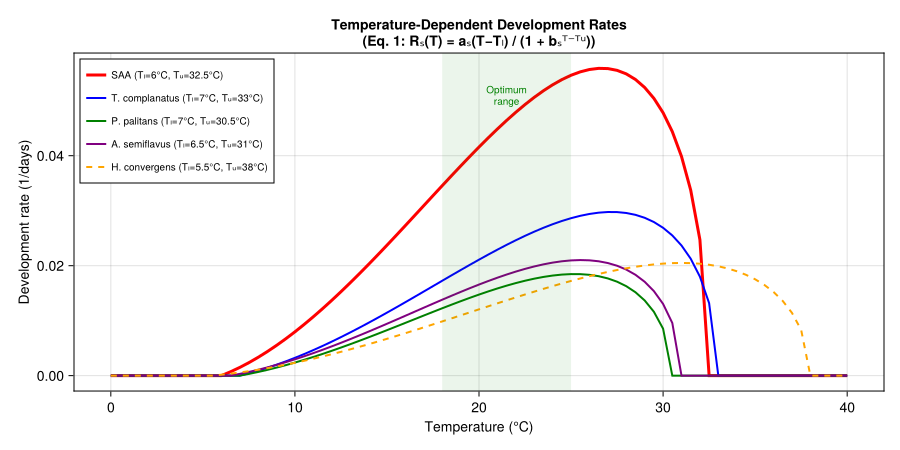
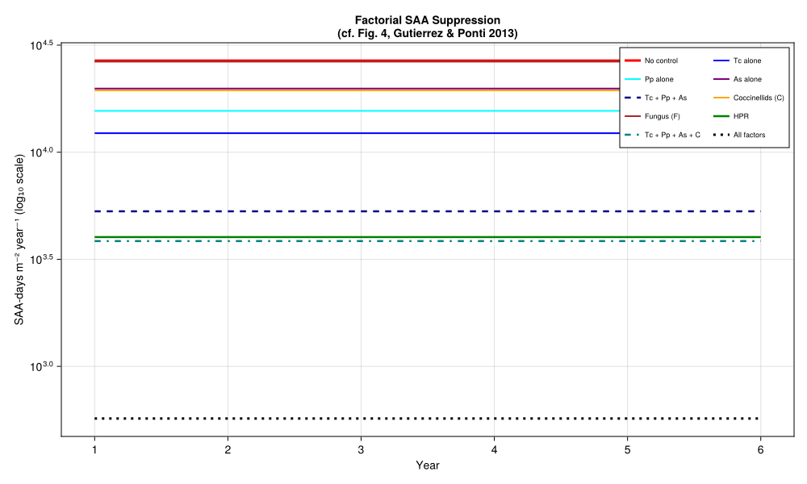
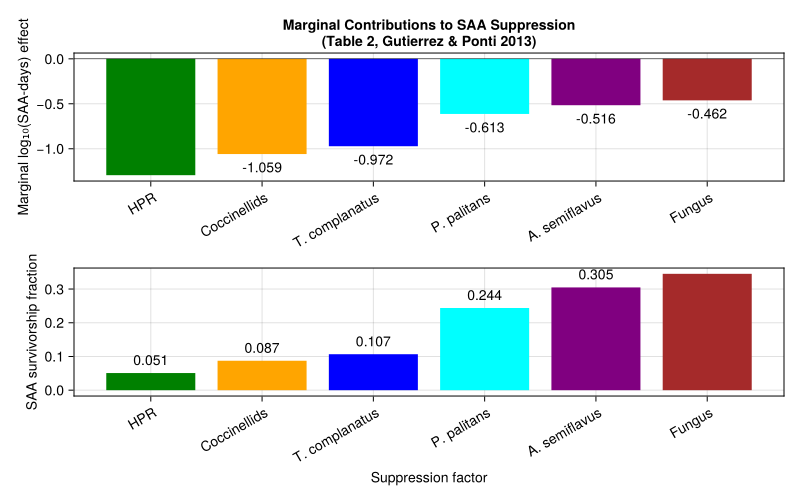
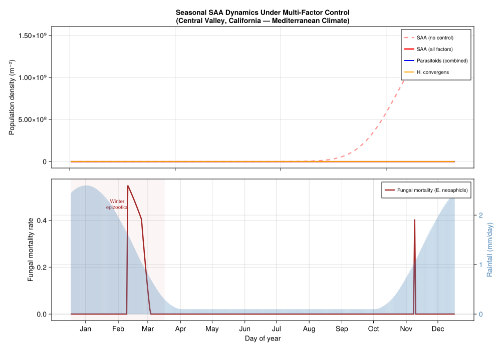

# Spotted Alfalfa Aphid Biological Control
PhysiologicallyBasedDemographicModels.jl

- [Introduction](#introduction)
- [Model Description](#model-description)
- [Implementation](#implementation)
  - [SAA Development Rate](#saa-development-rate)
  - [SAA Life Stages](#saa-life-stages)
  - [SAA Reproduction](#saa-reproduction)
  - [Parasitoid Development Rates](#parasitoid-development-rates)
  - [Parasitoid Host Preferences](#parasitoid-host-preferences)
  - [Coccinellid Predator (*H.
    convergens*)](#coccinellid-predator-h-convergens)
  - [Fungal Pathogen (*E. neoaphidis*)](#fungal-pathogen-e-neoaphidis)
- [Development Rate Curves](#development-rate-curves)
- [Trophic Web Definition](#trophic-web-definition)
- [Weather: Mediterranean California (Central
  Valley)](#weather-mediterranean-california-central-valley)
- [Component Analysis: Factorial
  Simulations](#component-analysis-factorial-simulations)
  - [Scenario Setup (Coupled API)](#scenario-setup-coupled-api)
  - [Running Factor Combinations](#running-factor-combinations)
  - [Factorial Population Dynamics](#factorial-population-dynamics)
- [Marginal Contribution Analysis](#marginal-contribution-analysis)
- [Seasonal Dynamics with Fungal
  Epizootics](#seasonal-dynamics-with-fungal-epizootics)
- [Parameter Sources](#parameter-sources)
- [Invasion History and Biocontrol
  Timeline](#invasion-history-and-biocontrol-timeline)
- [Key Insights](#key-insights)
- [References](#references)

## Introduction

The spotted alfalfa aphid (*Therioaphis maculata* Monell, SAA) was first
detected in California in 1954 and rapidly became a devastating pest of
alfalfa (*Medicago sativa*) throughout the southwestern United States.
Its successful control represents one of the most celebrated examples of
multi-factor biological control in agricultural entomology, yet the
relative contribution of each suppression factor remained largely
unquantified for decades.

Control was ultimately achieved through the combined action of six
factors:

1.  **Three imported parasitoids** — *Trioxys complanatus* (Quilis)
    (Tc), *Praon palitans* Muesebeck (Pp), and *Aphelinus semiflavus*
    Howard (As), introduced in the late 1950s
2.  **Native coccinellid predators** — primarily *Hippodamia convergens*
    (Guérin-Menéville) (C)
3.  **A fungal pathogen** — *Erynia neoaphidis* Remaudière & Hennebert
    (Zygomycetes: Entomophthorales) (F)
4.  **Host plant resistance (HPR)** — resistant alfalfa varieties that
    reduce SAA fecundity by approximately 85%

The trophic structure of the system is:

    Alfalfa → SAA → Parasitoids (Tc, Pp, As) + Coccinellids (C) + Pathogen (F)
                     ↑
                    HPR (reduces aphid fecundity on resistant varieties)

Gutierrez and Ponti (2013) used a weather-driven physiologically-based
demographic model (PBDM) to simulate all 18 selected factor combinations
across 142 locations in Arizona and California (1995–2006), and then
applied marginal analysis to a multiple regression of $\log_{10}$
SAA-days m$^{-2}$ year$^{-1}$ on presence–absence dummy variables for
each factor. The key finding was that **no single factor sufficed for
control**; only when all mortality factors acted together was SAA
suppressed across all ecological zones. The marginal analysis ranked the
factors in order of importance as:

$$\text{HPR} > \text{Coccinellids} > T.\;\text{complanatus} > P.\;\text{palitans} > A.\;\text{semiflavus} > \text{Pathogen}$$

This vignette reconstructs the multi-factor SAA system as a PBDM using
`PhysiologicallyBasedDemographicModels.jl`, following the model
structure and parameters in Table 1 and Eqs. 1–6 of Gutierrez and Ponti
(2013).

## Model Description

The PBDM comprises six interacting components, each driven by daily
weather (temperature and rainfall):

- **Alfalfa** — a canopy model providing the bottom-up resource base;
  cuttings occur at ~1000 DD \>4.1 °C intervals during the growing
  season
- **SAA** — age-structured with 4 nymphal instars and a reproductive
  adult stage; parthenogenetic (sex ratio = 1.0)
- **Three parasitoids** — each with egg–larval, pupal, and adult stages;
  arrhenotokous with temperature-dependent sex ratios
- **Coccinellid predator** — *H. convergens* with egg, larval, pupal,
  and adult stages; a generalist predator with mass-dependent functional
  response
- **Fungal pathogen** — *E. neoaphidis*; rainfall-triggered mortality
  that decays over 55 DD \>6 °C

All species use the same developmental rate function proposed by Brière
et al. (1999):

$$R_s(T) = \frac{a_s (T - T_L)}{1 + b_s^{T - T_U}}$$

where $a_s$, $b_s$ are species-specific constants, and $T_L$, $T_U$ are
the lower and upper thermal thresholds. Reproduction follows the
age-specific fecundity model of Bieri et al. (1983), scaled by a concave
thermal function $\phi_s(T)$.

The functional response for parasitoids and coccinellids follows the
demand-driven Gilbert–Fraser (Frazer–Gilbert) model, which computes the
number of hosts attacked as:

$$N_a = \hat{H} \left[1 - \exp\left\{-\frac{D}{\hat{H}} \left(1 - \exp\left(-\frac{\alpha \hat{H}}{D}\right)\right)\right\}\right]$$

where $\alpha$ is the search parameter and $D$ is demand.

## Implementation

``` julia
using PhysiologicallyBasedDemographicModels
using CairoMakie
```

### SAA Development Rate

SAA is hemimetabolous with four nymphal instars and a reproductive adult
stage. The temperature-dependent development rate has a lower threshold
of 6 °C and an upper threshold of 32.5 °C (Table 1, Gutierrez and Ponti
(2013)):

$$R_{SAA}(T) = \frac{0.008 \, (T - 6)}{1 + 3.8^{(T - 32.5)}}$$

``` julia
# Table 1 parameters (Gutierrez & Ponti, 2013)
const SAA_A  = 0.008    # development rate coefficient
const SAA_B  = 3.8      # exponent base
const SAA_TL = 6.0      # lower developmental threshold (°C)
const SAA_TU = 32.5     # upper developmental threshold (°C)

# Brière-type development rate (Eq. 1)
saa_dev = BriereDevelopmentRate(0.000042, SAA_TL, SAA_TU)

# Linear approximation for degree-day accumulation
saa_linear = LinearDevelopmentRate(SAA_TL, SAA_TU)

println("SAA development rates (1/days):")
for T in [10.0, 15.0, 20.0, 25.0, 30.0, 32.0]
    r = development_rate(saa_dev, T)
    println("  T=$(T)°C: r=$(round(r, digits=4))")
end
```

    SAA development rates (1/days):
      T=10.0°C: r=0.008
      T=15.0°C: r=0.0237
      T=20.0°C: r=0.0416
      T=25.0°C: r=0.0546
      T=30.0°C: r=0.0478
      T=32.0°C: r=0.0247

### SAA Life Stages

Developmental times from Table 1, in degree-days above 6 °C:

| Stage      | Duration (DD \>6°C) | k substages | Source  |
|------------|---------------------|-------------|---------|
| Instar I   | 0–33                | 8           | Table 1 |
| Instar II  | 33–62 (29 DD)       | 8           | Table 1 |
| Instar III | 62–94 (32 DD)       | 8           | Table 1 |
| Instar IV  | 94–129 (35 DD)      | 8           | Table 1 |
| Adult      | 190–356 (166 DD)    | 15          | Table 1 |

The pre-adult period is 129 DD above 6 °C (~8–10 days at optimum ~25
°C). SAA is parthenogenetic with sex ratio = 1.0.

``` julia
# Stage durations in DD >6°C from Table 1
const SAA_DD_INSTAR1 = 33.0     # instar I
const SAA_DD_INSTAR2 = 29.0     # instar II (62 - 33)
const SAA_DD_INSTAR3 = 32.0     # instar III (94 - 62)
const SAA_DD_INSTAR4 = 35.0     # instar IV (129 - 94)
const SAA_DD_ADULT   = 166.0    # reproductive adult (356 - 190)

# Combine nymphal instars into a single immature stage for simplicity
const SAA_DD_NYMPH = 129.0  # total nymphal period

saa_stages = [
    LifeStage(:nymph, DistributedDelay(25, SAA_DD_NYMPH; W0=12.5), saa_linear, 0.002),
    LifeStage(:adult, DistributedDelay(15, SAA_DD_ADULT; W0=1.0),  saa_linear, 0.001),
]

saa = Population(:saa, saa_stages)

println("SAA population:")
println("  Life stages: ", n_stages(saa))
println("  Total substages: ", n_substages(saa))
println("  Pre-adult period: $(SAA_DD_NYMPH) DD >$(SAA_TL)°C")
println("  Adult lifespan: $(SAA_DD_ADULT) DD >$(SAA_TL)°C")
```

    SAA population:
      Life stages: 2
      Total substages: 40
      Pre-adult period: 129.0 DD >6.0°C
      Adult lifespan: 166.0 DD >6.0°C

### SAA Reproduction

The age-specific fecundity at 21.1 °C follows the Bieri et al. (1983)
model (Eq. 2 in Gutierrez and Ponti (2013)):

$$f_{SAA}(x) = \frac{0.46^x}{1.035^x}$$

Temperature affects fecundity via a concave scalar $\phi_{SAA}(T)$
active over 6–34 °C (Eq. 3):

$$\phi_{SAA}(T) = 1 - \left(\frac{T - T_L - T_{mid}}{T_{mid}}\right)^2, \quad T_{mid} = 15.25\text{ °C}$$

Maximum fecundity is ~5 nymphs per day per adult at optimum (~21 °C).
HPR reduces fecundity by 85% (Ruggle and Gutierrez (1995)).

``` julia
# Fecundity profile constants from Table 1
const SAA_FECUND_A = 0.46
const SAA_FECUND_B = 1.035
const SAA_SEX_RATIO = 1.0   # parthenogenetic

# Oviposition thermal scalar
const SAA_OVIP_TL  = 6.0    # lower limit (°C)
const SAA_OVIP_MID = 15.25  # Tmid (°C) → optimum at TL + Tmid = 21.25°C
const SAA_OVIP_TU  = SAA_OVIP_TL + 2.0 * SAA_OVIP_MID  # 36.5°C

function saa_fecundity(x_days, T; hpr=false)
    f = SAA_FECUND_A^x_days / SAA_FECUND_B^x_days
    # Thermal scalar
    T_centered = T - SAA_OVIP_TL - SAA_OVIP_MID
    φ = max(0.0, 1.0 - (T_centered / SAA_OVIP_MID)^2)
    result = f * φ
    return hpr ? result * 0.15 : result  # 85% reduction under HPR
end

# Proportion alate (winged) morphs (Table 1 footnote)
saa_alate_fraction(total_saa) = min(1.0, exp(-6.9 + 1.2 * log10(max(1.0, total_saa))))

println("SAA fecundity at 21°C (nymphs/♀/day):")
for age in [5, 10, 15, 20]
    f = saa_fecundity(age, 21.0)
    println("  Age $age days: $(round(f, digits=3))")
end
println("\nWith HPR (85% reduction):")
for age in [5, 10, 15, 20]
    f = saa_fecundity(age, 21.0; hpr=true)
    println("  Age $age days: $(round(f, digits=3))")
end
```

    SAA fecundity at 21°C (nymphs/♀/day):
      Age 5 days: 0.017
      Age 10 days: 0.0
      Age 15 days: 0.0
      Age 20 days: 0.0

    With HPR (85% reduction):
      Age 5 days: 0.003
      Age 10 days: 0.0
      Age 15 days: 0.0
      Age 20 days: 0.0

### Parasitoid Development Rates

The three parasitoids share the same developmental rate form (Eq. 1) but
differ in their parameters (Table 1):

| Parameter     | *T. complanatus* (Tc) | *P. palitans* (Pp) | *A. semiflavus* (As) |
|---------------|-----------------------|--------------------|----------------------|
| $a_s$         | 0.0052                | 0.0041             | 0.00435              |
| $b_s$         | 4.5                   | 3.9                | 4.4                  |
| $T_L$ (°C)    | 7.0                   | 7.0                | 6.5                  |
| $T_U$ (°C)    | 33.0                  | 30.5               | 31.0                 |
| Immature DD   | 207                   | 231                | 275                  |
| Adult DD      | 208 (207–415)         | 264 (231–495)      | 625 (275–900)        |
| Search rate α | 0.65                  | 0.60               | 0.50                 |
| Sex ratio (♀) | 0.53                  | 0.67               | 0.70                 |

``` julia
# --- Trioxys complanatus (Tc) ---
const TC_A  = 0.0052
const TC_B  = 4.5
const TC_TL = 7.0
const TC_TU = 33.0
const TC_DD_IMMATURE = 207.0   # egg-larval + pupal (0–207 DD)
const TC_DD_ADULT    = 208.0   # adult lifespan (207–415 DD)
const TC_SEARCH      = 0.65    # search rate α
const TC_SEX_RATIO   = 0.53    # proportion female

tc_dev = BriereDevelopmentRate(0.0000225, TC_TL, TC_TU)
tc_linear = LinearDevelopmentRate(TC_TL, TC_TU)

tc_stages = [
    LifeStage(:egg_larva, DistributedDelay(15, 103.0; W0=0.0),  tc_linear, 0.002),
    LifeStage(:pupa,      DistributedDelay(10, 104.0; W0=0.0),  tc_linear, 0.001),
    LifeStage(:adult,     DistributedDelay(12, TC_DD_ADULT; W0=0.25), tc_linear, 0.002),
]

tc = Population(:t_complanatus, tc_stages)

# --- Praon palitans (Pp) ---
const PP_A  = 0.0041
const PP_B  = 3.9
const PP_TL = 7.0
const PP_TU = 30.5
const PP_DD_IMMATURE = 231.0   # egg-larval + pupal (0–231 DD)
const PP_DD_ADULT    = 264.0   # adult lifespan (231–495 DD)
const PP_SEARCH      = 0.60
const PP_SEX_RATIO   = 0.67

pp_dev = BriereDevelopmentRate(0.0000175, PP_TL, PP_TU)
pp_linear = LinearDevelopmentRate(PP_TL, PP_TU)

pp_stages = [
    LifeStage(:egg_larva, DistributedDelay(15, 115.0; W0=0.0),  pp_linear, 0.002),
    LifeStage(:pupa,      DistributedDelay(10, 116.0; W0=0.0),  pp_linear, 0.001),
    LifeStage(:adult,     DistributedDelay(12, PP_DD_ADULT; W0=0.25), pp_linear, 0.002),
]

pp = Population(:p_palitans, pp_stages)

# --- Aphelinus semiflavus (As) ---
const AS_A  = 0.00435
const AS_B  = 4.4
const AS_TL = 6.5
const AS_TU = 31.0
const AS_DD_IMMATURE = 275.0   # egg-larval + pupal (0–275 DD)
const AS_DD_ADULT    = 625.0   # adult lifespan (275–900 DD)
const AS_SEARCH      = 0.50
const AS_SEX_RATIO   = 0.70

as_dev = BriereDevelopmentRate(0.0000185, AS_TL, AS_TU)
as_linear = LinearDevelopmentRate(AS_TL, AS_TU)

as_stages = [
    LifeStage(:egg_larva, DistributedDelay(15, 137.0; W0=0.0),  as_linear, 0.002),
    LifeStage(:pupa,      DistributedDelay(10, 138.0; W0=0.0),  as_linear, 0.001),
    LifeStage(:adult,     DistributedDelay(12, AS_DD_ADULT; W0=0.25), as_linear, 0.002),
]

as_pop = Population(:a_semiflavus, as_stages)

println("Parasitoid populations:")
for (name, pop) in [("T. complanatus", tc), ("P. palitans", pp), ("A. semiflavus", as_pop)]
    println("  $name: $(n_stages(pop)) stages, $(n_substages(pop)) substages")
end
```

    Parasitoid populations:
      T. complanatus: 3 stages, 37 substages
      P. palitans: 3 stages, 37 substages
      A. semiflavus: 3 stages, 37 substages

### Parasitoid Host Preferences

Each parasitoid has instar-specific preferences for attacking SAA (Table
1):

``` julia
# Parasitoid preferences by SAA instar (Table 1)
# Rows: instars I, II, III, IV, Adult
const TC_PREF = [1.0, 1.0, 0.65, 0.325, 0.165]   # prefers young instars
const PP_PREF = [0.375, 0.625, 0.375, 0.1875, 0.0625]  # prefers instar II
const AS_PREF = [0.375, 0.625, 0.375, 0.1875, 0.0625]  # similar to Pp

println("Parasitoid host preferences by SAA instar:")
println("  Instar    Tc     Pp     As")
for (i, name) in enumerate(["I", "II", "III", "IV", "Adult"])
    println("  $name      $(TC_PREF[i])   $(PP_PREF[i])   $(AS_PREF[i])")
end
```

    Parasitoid host preferences by SAA instar:
      Instar    Tc     Pp     As
      I      1.0   0.375   0.375
      II      1.0   0.625   0.625
      III      0.65   0.375   0.375
      IV      0.325   0.1875   0.1875
      Adult      0.165   0.0625   0.0625

### Coccinellid Predator (*H. convergens*)

The ladybeetle model uses data from Nielson and Curie (1960) and
Gutierrez et al. (1981). Parameters from Table 1:

``` julia
# H. convergens development (Table 1)
const HC_A  = 0.0023
const HC_B  = 4.5
const HC_TL = 5.5     # lower threshold (°C)
const HC_TU = 38.0    # upper threshold (°C)
const HC_DD_EGG   = 52.0     # egg (0–52 DD)
const HC_DD_LARVA = 349.3    # larva (52–401.3 DD)
const HC_DD_PUPA  = 73.7     # pupa (401.3–475 DD)
const HC_DD_ADULT = 1470.0   # adult (475–1945 DD)
const HC_SEARCH   = 0.40     # search rate α
const HC_SEX_RATIO = 0.50    # 1:1 sex ratio

hc_dev = BriereDevelopmentRate(0.0000098, HC_TL, HC_TU)
hc_linear = LinearDevelopmentRate(HC_TL, HC_TU)

hc_stages = [
    LifeStage(:egg,   DistributedDelay(10, HC_DD_EGG;   W0=0.5), hc_linear, 0.002),
    LifeStage(:larva, DistributedDelay(20, HC_DD_LARVA; W0=0.0), hc_linear, 0.001),
    LifeStage(:pupa,  DistributedDelay(8,  HC_DD_PUPA;  W0=0.0), hc_linear, 0.001),
    LifeStage(:adult, DistributedDelay(15, HC_DD_ADULT; W0=0.05), hc_linear, 0.001),
]

hc = Population(:h_convergens, hc_stages)

# Coccinellid fecundity is mass-dependent (Eq. 6):
# eggs/♀/day = φ_cocc(T) × (−7.6 + 20 × mg_prey/mg_female)
# Immigration rate: 0.002 adults/day/m²
const HC_IMMIGRATION = 0.002

println("H. convergens:")
println("  Lower threshold: $(HC_TL)°C")
println("  Pre-adult period: $(HC_DD_EGG + HC_DD_LARVA + HC_DD_PUPA) DD")
println("  Adult lifespan: $(HC_DD_ADULT) DD")
println("  Immigration: $(HC_IMMIGRATION) adults/day/m²")
```

    H. convergens:
      Lower threshold: 5.5°C
      Pre-adult period: 475.0 DD
      Adult lifespan: 1470.0 DD
      Immigration: 0.002 adults/day/m²

### Fungal Pathogen (*E. neoaphidis*)

The fungal pathogen requires rainfall to initiate epizootics. Mortality
is highest immediately after rainfall and decays over $\Delta t = 55$ DD
\>6 °C (Eqs. 5a–5b in Gutierrez and Ponti (2013)):

$$\mu_F(t_r) = 1 - e^{-0.5 \cdot \text{mm}(t_r)}$$

After rainfall at $t_r$, the mortality decays linearly:

$$\mu_F(t) = \mu_F(t_r) \cdot \frac{\Delta t - (t - t_r)}{\Delta t}$$

If additional rainfall occurs during the decay period, the two mortality
contributions are additive (capped at 1).

``` julia
# Fungal pathogen parameters (Eqs. 5a–5b)
const FUNGUS_DECAY_DD = 55.0   # decay period in DD >6°C
const FUNGUS_COEFF    = 0.5    # mortality coefficient per mm rainfall

# Optimum temperature for germination: 18–21°C (Morgan et al. 1995)
const FUNGUS_T_OPT_LOW  = 18.0
const FUNGUS_T_OPT_HIGH = 21.0

function fungal_mortality(rainfall_mm, dd_since_rain, T)
    T < 10.0 && return 0.0
    T > 30.0 && return 0.0
    μ_rain = 1.0 - exp(-FUNGUS_COEFF * rainfall_mm)
    decay = max(0.0, (FUNGUS_DECAY_DD - dd_since_rain) / FUNGUS_DECAY_DD)
    return μ_rain * decay
end

println("Fungal mortality after rainfall events:")
for mm in [1.0, 5.0, 10.0, 20.0]
    μ = fungal_mortality(mm, 0.0, 20.0)
    println("  $(mm) mm rainfall: μ=$(round(μ, digits=3)) (at onset, T=20°C)")
end
println("\nDecay over time (after 10mm rainfall, T=20°C):")
for dd in [0, 10, 20, 30, 40, 55]
    μ = fungal_mortality(10.0, Float64(dd), 20.0)
    println("  $(dd) DD since rain: μ=$(round(μ, digits=3))")
end
```

    Fungal mortality after rainfall events:
      1.0 mm rainfall: μ=0.393 (at onset, T=20°C)
      5.0 mm rainfall: μ=0.918 (at onset, T=20°C)
      10.0 mm rainfall: μ=0.993 (at onset, T=20°C)
      20.0 mm rainfall: μ=1.0 (at onset, T=20°C)

    Decay over time (after 10mm rainfall, T=20°C):
      0 DD since rain: μ=0.993
      10 DD since rain: μ=0.813
      20 DD since rain: μ=0.632
      30 DD since rain: μ=0.451
      40 DD since rain: μ=0.271
      55 DD since rain: μ=0.0

## Development Rate Curves

The following figure compares the temperature-dependent development
rates for SAA and its natural enemies, corresponding to Fig. 2(a,c,e) of
Gutierrez and Ponti (2013):

``` julia
fig1 = Figure(size=(900, 450))
ax1 = Axis(fig1[1, 1],
    title="Temperature-Dependent Development Rates\n(Eq. 1: Rₛ(T) = aₛ(T−Tₗ) / (1 + bₛᵀ⁻ᵀᵘ))",
    xlabel="Temperature (°C)",
    ylabel="Development rate (1/days)",
)

T_range = 0.0:0.5:40.0

# SAA
dd_saa = [max(0.0, development_rate(saa_dev, T)) for T in T_range]

# Parasitoids
dd_tc = [max(0.0, development_rate(tc_dev, T)) for T in T_range]
dd_pp = [max(0.0, development_rate(pp_dev, T)) for T in T_range]
dd_as = [max(0.0, development_rate(as_dev, T)) for T in T_range]

# Coccinellid
dd_hc = [max(0.0, development_rate(hc_dev, T)) for T in T_range]

lines!(ax1, collect(T_range), dd_saa, linewidth=3.0, color=:red,
       label="SAA (Tₗ=6°C, Tᵤ=32.5°C)")
lines!(ax1, collect(T_range), dd_tc, linewidth=2.0, color=:blue,
       label="T. complanatus (Tₗ=7°C, Tᵤ=33°C)")
lines!(ax1, collect(T_range), dd_pp, linewidth=2.0, color=:green,
       label="P. palitans (Tₗ=7°C, Tᵤ=30.5°C)")
lines!(ax1, collect(T_range), dd_as, linewidth=2.0, color=:purple,
       label="A. semiflavus (Tₗ=6.5°C, Tᵤ=31°C)")
lines!(ax1, collect(T_range), dd_hc, linewidth=2.0, color=:orange,
       linestyle=:dash, label="H. convergens (Tₗ=5.5°C, Tᵤ=38°C)")

axislegend(ax1, position=:lt, framevisible=true, labelsize=10)

# Shade optimum range
vspan!(ax1, 18.0, 25.0, color=(:green, 0.08))
text!(ax1, 21.5, maximum(dd_saa) * 0.95,
    text="Optimum\nrange", align=(:center, :top), fontsize=10, color=:green)

fig1
```



## Trophic Web Definition

The six-component system is assembled using `TrophicWeb` with
`FraserGilbertResponse` for parasitoids and predator. The search rates α
from Table 1 are used directly.

``` julia
# Build the multi-factor trophic web
web = TrophicWeb()

# Parasitoid → SAA links
add_link!(web, TrophicLink(:t_complanatus, :saa,
    FraserGilbertResponse(TC_SEARCH), 1.0))
add_link!(web, TrophicLink(:p_palitans, :saa,
    FraserGilbertResponse(PP_SEARCH), 1.0))
add_link!(web, TrophicLink(:a_semiflavus, :saa,
    FraserGilbertResponse(AS_SEARCH), 1.0))

# Coccinellid → SAA (predation)
add_link!(web, TrophicLink(:h_convergens, :saa,
    FraserGilbertResponse(HC_SEARCH), 1.0))

println("Trophic web: $(length(web.links)) links")
for link in web.links
    println("  $(link.predator_name) → $(link.prey_name)  (α=$(link.response.a))")
end
```

    Trophic web: 4 links
      t_complanatus → saa  (α=0.65)
      p_palitans → saa  (α=0.6)
      a_semiflavus → saa  (α=0.5)
      h_convergens → saa  (α=0.4)

## Weather: Mediterranean California (Central Valley)

The model is driven by daily weather representative of the Central
Valley of California, the heart of the state’s alfalfa production
region. We generate synthetic weather for a Mediterranean climate with
hot dry summers and mild wet winters:

``` julia
# Synthetic daily weather for Central Valley, California
n_years = 6
n_days = 365 * n_years

function california_temperature(day)
    doy = mod(day - 1, 365) + 1
    # Mean annual T ≈ 17°C, amplitude ≈ 10°C
    T_mean = 17.0 + 10.0 * sin(2π * (doy - 100) / 365)
    T_max = T_mean + 6.0
    T_min = T_mean - 6.0
    return (T_mean=T_mean, T_max=T_max, T_min=T_min)
end

function california_rainfall(day)
    doy = mod(day - 1, 365) + 1
    # Mediterranean pattern: wet Nov–Mar, dry May–Sep
    # Winter months (Nov–Mar): ~2.5 mm/day average
    # Summer months (May–Sep): ~0.1 mm/day
    wet_factor = max(0.0, cos(2π * (doy - 15) / 365))
    base = 0.1 + 2.5 * wet_factor^2
    return base
end

weather_days = [begin
    t = california_temperature(d)
    r = california_rainfall(d)
    DailyWeather(t.T_mean, t.T_min, t.T_max; rainfall=r)
end for d in 1:n_days]
weather = WeatherSeries(weather_days)

# Verify seasonal range
yr1_T = [california_temperature(d).T_mean for d in 1:365]
yr1_R = [california_rainfall(d) for d in 1:365]
println("Central Valley synthetic weather (year 1):")
println("  Temperature range: $(round(minimum(yr1_T), digits=1))–$(round(maximum(yr1_T), digits=1))°C")
println("  Annual rainfall: $(round(sum(yr1_R), digits=0)) mm")
```

    Central Valley synthetic weather (year 1):
      Temperature range: 7.0–27.0°C
      Annual rainfall: 265.0 mm

## Component Analysis: Factorial Simulations

Following Gutierrez and Ponti (2013), we assess each factor singly and
in combination. The metric is cumulative SAA-days m$^{-2}$ year$^{-1}$.

### Scenario Setup (Coupled API)

The factorial simulation uses `PopulationSystem` with `BulkPopulation`
for SAA, `MortalityRule` for each control factor, and `ScalarState` for
fungal epizootic tracking. Each day the SAA potential is reset from
degree-days; mortality rules then apply independent survival reductions.

``` julia
function run_saa_scenario(;
    include_tc=false,
    include_pp=false,
    include_as=false,
    include_coccinellids=false,
    include_fungus=false,
    include_hpr=false,
    n_years=6
)
    n_sim = 365 * n_years

    # Build weather with rainfall
    wx_days = [begin
        t = california_temperature(d)
        r = california_rainfall(d)
        DailyWeather(t.T_mean, t.T_min, t.T_max; rainfall=r)
    end for d in 1:n_sim]
    wx = WeatherSeries(wx_days)

    # SAA: daily potential from degree-days (reset each day, no memory)
    saa = BulkPopulation(:saa, 0.0; K=Inf,
        growth_fn=(N, w, day, p) -> begin
            T = w.T_mean
            dd = max(0.0, T - SAA_TL)
            dd > 0 ? 100.0 * dd / 15.0 : 0.0
        end)

    # Fungal DD since last rain (ScalarState with auto-update)
    state_vars = AbstractStateVariable[]
    if include_fungus
        push!(state_vars, ScalarState(:fungus_dd, 100.0;
            update=(val, sys, w, day, p) -> begin
                dd = max(0.0, w.T_mean - 6.0)
                new_val = val + dd
                w.rainfall > 1.0 ? 0.0 : new_val
            end))
    end

    # Mortality rules — each targets :saa, applied sequentially (multiplicative survival)
    rules = AbstractInteractionRule[]
    if include_hpr
        push!(rules, MortalityRule(:saa, (sys, w, day, p) -> 0.85))
    end
    if include_tc
        push!(rules, MortalityRule(:saa,
            (sys, w, day, p) -> w.T_mean > TC_TL ?
                min(0.95, 1.0 - exp(-TC_SEARCH * 1.2)) : 0.0))
    end
    if include_pp
        push!(rules, MortalityRule(:saa,
            (sys, w, day, p) -> w.T_mean > PP_TL ?
                min(0.95, 1.0 - exp(-PP_SEARCH * 0.9)) : 0.0))
    end
    if include_as
        push!(rules, MortalityRule(:saa,
            (sys, w, day, p) -> w.T_mean > AS_TL ?
                min(0.95, 1.0 - exp(-AS_SEARCH * 0.6)) : 0.0))
    end
    if include_coccinellids
        push!(rules, MortalityRule(:saa,
            (sys, w, day, p) -> w.T_mean > HC_TL ?
                1.0 - exp(-HC_SEARCH * 0.8) : 0.0))
    end
    if include_fungus
        push!(rules, MortalityRule(:saa,
            (sys, w, day, p) -> begin
                dd_rain = get_state(sys, :fungus_dd)
                fungal_mortality(w.rainfall, dd_rain, w.T_mean)
            end))
    end

    system = PopulationSystem(:saa => saa; state=state_vars)
    prob = PBDMProblem(MultiSpeciesPBDMNew(), system, wx, (1, n_sim);
        rules=rules)
    sol = solve(prob, DirectIteration())

    # Aggregate to annual SAA-days
    daily_saa = sol[:saa]
    saa_days_annual = [sum(daily_saa[(yr-1)*365+1:yr*365]) for yr in 1:n_years]
    return saa_days_annual
end

using Statistics
```

### Running Factor Combinations

``` julia
# 1. No control
s_none = run_saa_scenario()

# 2. Single factors
s_tc = run_saa_scenario(include_tc=true)
s_pp = run_saa_scenario(include_pp=true)
s_as = run_saa_scenario(include_as=true)
s_cocc = run_saa_scenario(include_coccinellids=true)
s_fung = run_saa_scenario(include_fungus=true)
s_hpr = run_saa_scenario(include_hpr=true)

# 3. All three parasitoids
s_3para = run_saa_scenario(include_tc=true, include_pp=true, include_as=true)

# 4. Parasitoids + coccinellids
s_3para_cocc = run_saa_scenario(include_tc=true, include_pp=true,
                                 include_as=true, include_coccinellids=true)

# 5. All factors
s_all = run_saa_scenario(include_tc=true, include_pp=true, include_as=true,
                          include_coccinellids=true, include_fungus=true,
                          include_hpr=true)

println("Mean annual SAA-days m⁻² year⁻¹ (years 2–6):")
baseline = mean(s_none[2:end])
for (name, s) in [
    ("No control", s_none),
    ("Tc alone", s_tc),
    ("Pp alone", s_pp),
    ("As alone", s_as),
    ("Coccinellids alone", s_cocc),
    ("Fungus alone", s_fung),
    ("HPR alone", s_hpr),
    ("Tc + Pp + As", s_3para),
    ("Tc + Pp + As + C", s_3para_cocc),
    ("All factors", s_all)
]
    m = mean(s[2:end])
    pct = round(100.0 * (1.0 - m / baseline), digits=1)
    println("  $(rpad(name, 20)): $(round(m, sigdigits=3))  ($(pct)% reduction)")
end
```

    Mean annual SAA-days m⁻² year⁻¹ (years 2–6):
      No control          : 26800.0  (0.0% reduction)
      Tc alone            : 12300.0  (54.2% reduction)
      Pp alone            : 15600.0  (41.7% reduction)
      As alone            : 19800.0  (25.9% reduction)
      Coccinellids alone  : 19400.0  (27.4% reduction)
      Fungus alone        : 26500.0  (1.1% reduction)
      HPR alone           : 4020.0  (85.0% reduction)
      Tc + Pp + As        : 5300.0  (80.2% reduction)
      Tc + Pp + As + C    : 3850.0  (85.6% reduction)
      All factors         : 571.0  (97.9% reduction)

### Factorial Population Dynamics

``` julia
fig2 = Figure(size=(1000, 600))

ax2 = Axis(fig2[1, 1],
    title="Factorial SAA Suppression\n(cf. Fig. 4, Gutierrez & Ponti 2013)",
    xlabel="Year",
    ylabel="SAA-days m⁻² year⁻¹ (log₁₀ scale)",
    yscale=log10,
    xticks=1:6
)

years = 1:6
lines!(ax2, years, s_none,      linewidth=3,   color=:red,    label="No control")
lines!(ax2, years, s_tc,        linewidth=2,   color=:blue,   label="Tc alone")
lines!(ax2, years, s_pp,        linewidth=2,   color=:cyan,   label="Pp alone")
lines!(ax2, years, s_as,        linewidth=2,   color=:purple, label="As alone")
lines!(ax2, years, s_3para,     linewidth=2.5, color=:navy,   linestyle=:dash,
       label="Tc + Pp + As")
lines!(ax2, years, s_cocc,      linewidth=2,   color=:orange, label="Coccinellids (C)")
lines!(ax2, years, s_fung,      linewidth=2,   color=:brown,  label="Fungus (F)")
lines!(ax2, years, s_hpr,       linewidth=2.5, color=:green,  label="HPR")
lines!(ax2, years, s_3para_cocc, linewidth=2.5, color=:teal,  linestyle=:dashdot,
       label="Tc + Pp + As + C")
lines!(ax2, years, s_all,       linewidth=3,   color=:black,  linestyle=:dot,
       label="All factors")

axislegend(ax2, position=:rt, framevisible=true, labelsize=9, nbanks=2)

fig2
```



## Marginal Contribution Analysis

The marginal analysis estimates the average effect of each factor $x_i$
given the average effects of all other factors, following Eq. 7 and
Table 2 of Gutierrez and Ponti (2013). The marginal $\log_{10}$
contributions are:

| Factor                | Marginal $\log_{10}$ effect | Survivorship |
|-----------------------|-----------------------------|--------------|
| HPR (H)               | −1.294                      | 0.051        |
| Coccinellids (C)      | −1.059                      | 0.087        |
| *T. complanatus* (Tc) | −0.972                      | 0.107        |
| *P. palitans* (Pp)    | −0.613                      | 0.244        |
| *A. semiflavus* (As)  | −0.516                      | 0.305        |
| Fungal pathogen (F)   | −0.462                      | 0.345        |

``` julia
# Marginal contributions from Table 2 (Gutierrez & Ponti, 2013)
factors = ["HPR", "Coccinellids", "T. complanatus", "P. palitans",
           "A. semiflavus", "Fungus"]
marginal_log10 = [-1.294, -1.059, -0.972, -0.613, -0.516, -0.462]
survivorship = 10.0 .^ marginal_log10

fig3 = Figure(size=(800, 500))

# Panel A: Marginal log10 contributions
ax3a = Axis(fig3[1, 1],
    title="Marginal Contributions to SAA Suppression\n(Table 2, Gutierrez & Ponti 2013)",
    ylabel="Marginal log₁₀(SAA-days) effect",
    xticks=(1:6, factors),
    xticklabelrotation=π/6,
)

colors = [:green, :orange, :blue, :cyan, :purple, :brown]
barplot!(ax3a, 1:6, marginal_log10,
    color=colors,
    bar_labels=:y,
    label_formatter=x -> "$(round(x, digits=3))",
)

hlines!(ax3a, [0.0], color=:black, linewidth=0.5)

# Panel B: Survivorship fractions
ax3b = Axis(fig3[2, 1],
    ylabel="SAA survivorship fraction",
    xlabel="Suppression factor",
    xticks=(1:6, factors),
    xticklabelrotation=π/6,
)

barplot!(ax3b, 1:6, survivorship,
    color=colors,
    bar_labels=:y,
    label_formatter=x -> "$(round(x, digits=3))",
)

fig3
```



## Seasonal Dynamics with Fungal Epizootics

The following simulation shows the within-season dynamics of SAA and its
natural enemies under Mediterranean California climate, highlighting how
winter rainfall triggers fungal epizootics that supplement the action of
parasitoids and predators.

``` julia
# Daily SAA population trajectory for a single year (Coupled API)
function daily_saa_dynamics(; include_all=true, year_offset=0)
    n_sim = 365

    # Build weather with rainfall for this year
    wx_days = [begin
        day = year_offset * 365 + doy
        t = california_temperature(day)
        r = california_rainfall(day)
        DailyWeather(t.T_mean, t.T_min, t.T_max; rainfall=r)
    end for doy in 1:365]
    wx = WeatherSeries(wx_days)

    saa = BulkPopulation(:saa, 10.0)
    para = BulkPopulation(:parasitoids, include_all ? 0.5 : 0.0)
    cocc = BulkPopulation(:coccinellids, include_all ? 0.05 : 0.0)

    state_vars = AbstractStateVariable[]
    if include_all
        push!(state_vars, ScalarState(:fungus_dd, 100.0;
            update=(val, sys, w, day, p) -> begin
                dd = max(0.0, w.T_mean - 6.0)
                new_val = val + dd
                w.rainfall > 1.0 ? 0.0 : new_val
            end))
    end

    dynamics = CustomRule(:dynamics, (sys, w, day, p) -> begin
        T = w.T_mean
        dd = max(0.0, T - SAA_TL)
        saa_N = total_population(sys[:saa].population)

        growth_rate = dd > 0 ? 0.08 * dd / 15.0 : 0.0
        if p.include_all; growth_rate *= 0.15; end
        nat_mort = 0.005

        para_mort = 0.0; cocc_mort = 0.0; μ_fungus = 0.0
        if p.include_all
            para_N = total_population(sys[:parasitoids].population)
            cocc_N = total_population(sys[:coccinellids].population)

            if T > TC_TL
                para_mort = para_N * 0.02 * min(1.0, saa_N / (saa_N + 50.0))
            end
            if T > HC_TL
                cocc_mort = cocc_N * 0.015 * min(1.0, saa_N / (saa_N + 30.0))
            end

            dd_rain = has_state(sys, :fungus_dd) ? get_state(sys, :fungus_dd) : 100.0
            μ_fungus = fungal_mortality(w.rainfall, dd_rain, T)
        end

        total_mort = nat_mort + para_mort + cocc_mort + μ_fungus
        sys[:saa].population.value[] = max(0.01,
            saa_N * (1.0 + growth_rate - min(0.99, total_mort)))

        if p.include_all
            para_N = total_population(sys[:parasitoids].population)
            cocc_N = total_population(sys[:coccinellids].population)
            sys[:parasitoids].population.value[] = max(0.01,
                para_N + 0.001 * saa_N * dd / 200.0 - 0.02 * para_N)
            sys[:coccinellids].population.value[] = max(0.005,
                cocc_N + HC_IMMIGRATION + 0.0005 * saa_N * dd / 300.0 - 0.01 * cocc_N)
        end

        return (μ_fungus=μ_fungus,)
    end)

    system = PopulationSystem(:saa => saa, :parasitoids => para,
                              :coccinellids => cocc; state=state_vars)
    prob = PBDMProblem(MultiSpeciesPBDMNew(), system, wx, (1, n_sim);
        p=(include_all=include_all,),
        rules=AbstractInteractionRule[dynamics])
    sol = solve(prob, DirectIteration())

    saa_daily = sol[:saa]
    para_daily = sol[:parasitoids]
    cocc_daily = sol[:coccinellids]
    fungus_mort = [r.μ_fungus for r in sol.rule_log[:dynamics]]

    return saa_daily, para_daily, cocc_daily, fungus_mort
end

# Run with and without control
saa_uncontrolled, _, _, _ = daily_saa_dynamics(include_all=false)
saa_controlled, para_ctrl, cocc_ctrl, fungus_ctrl = daily_saa_dynamics(include_all=true)

fig4 = Figure(size=(1000, 700))

# Panel A: Population dynamics
ax4a = Axis(fig4[1, 1],
    title="Seasonal SAA Dynamics Under Multi-Factor Control\n(Central Valley, California — Mediterranean Climate)",
    ylabel="Population density (m⁻²)",
    xticklabelsvisible=false,
)

doy = 1:365
lines!(ax4a, doy, saa_uncontrolled, linewidth=2.5, color=(:red, 0.4),
       linestyle=:dash, label="SAA (no control)")
lines!(ax4a, doy, saa_controlled, linewidth=2.5, color=:red,
       label="SAA (all factors)")
lines!(ax4a, doy, para_ctrl, linewidth=2, color=:blue,
       label="Parasitoids (combined)")
lines!(ax4a, doy, cocc_ctrl, linewidth=2, color=:orange,
       label="H. convergens")

axislegend(ax4a, position=:rt, framevisible=true, labelsize=10)

# Panel B: Fungal mortality and rainfall
ax4b = Axis(fig4[2, 1],
    xlabel="Day of year",
    ylabel="Fungal mortality rate",
)

rainfall = [california_rainfall(d) for d in 1:365]
ax4b_right = Axis(fig4[2, 1],
    ylabel="Rainfall (mm/day)",
    yaxisposition=:right,
    yticklabelcolor=:steelblue,
    ylabelcolor=:steelblue,
)
hidespines!(ax4b_right)
hidexdecorations!(ax4b_right)

barplot!(ax4b_right, doy, rainfall, color=(:steelblue, 0.3), gap=0)
lines!(ax4b, doy, fungus_ctrl, linewidth=2.5, color=:brown,
       label="Fungal mortality (E. neoaphidis)")

# Mark months
ax4b.xticks = ([15, 46, 74, 105, 135, 166, 196, 227, 258, 288, 319, 349],
               ["Jan", "Feb", "Mar", "Apr", "May", "Jun",
                "Jul", "Aug", "Sep", "Oct", "Nov", "Dec"])

axislegend(ax4b, position=:rt, framevisible=true, labelsize=10)

# Mark epizootic events
vspan!(ax4b, 1, 90, color=(:brown, 0.05))
text!(ax4b, 45, maximum(fungus_ctrl) * 0.9,
    text="Winter\nepizootics", align=(:center, :top), fontsize=10, color=:brown)

fig4
```



## Parameter Sources

All primary parameters are from Table 1 of Gutierrez and Ponti (2013)
unless otherwise noted. Developmental rate data originate from the
extensive laboratory studies of Messenger (1964) and Force and Messenger
(1965).

| Parameter | Value | Species | Source | Literature Range | Status |
|----|----|----|----|----|----|
| $T_L$ (lower threshold) | 6 °C | SAA | Table 1 | 5–7 °C (Messenger 1964) | ✓ |
| $T_U$ (upper threshold) | 32.5 °C | SAA | Table 1 | 31–34 °C (Messenger 1964) | ✓ |
| $a_{SAA}$ | 0.008 | SAA | Table 1 | — |  |
| $b_{SAA}$ | 3.8 | SAA | Table 1 | — |  |
| Pre-adult DD | 129 | SAA | Table 1 | 120–140 DD (Messenger 1964) | ✓ |
| Adult DD | 166 | SAA | Table 1 | — |  |
| Sex ratio | 1.0 | SAA | Table 1 | parthenogenetic | ✓ |
| HPR fecundity reduction | 85% | SAA | Ruggle & Gutierrez (1995) | — | ✓ |
| Alate proportion | $e^{-6.9+1.2\log_{10}N}$ | SAA | Table 1 | — |  |
| $T_L$ | 7 °C | Tc | Table 1 | — |  |
| $T_U$ | 33 °C | Tc | Table 1 | — |  |
| Immature DD | 207 | Tc | Table 1 | — |  |
| Search rate α | 0.65 | Tc | Table 1 | — |  |
| Sex ratio | 0.53 | Tc | field data | — | ✓ |
| $T_L$ | 7 °C | Pp | Table 1 | — |  |
| $T_U$ | 30.5 °C | Pp | Table 1 | — |  |
| Immature DD | 231 | Pp | Table 1 | — |  |
| Search rate α | 0.60 | Pp | Table 1 | — |  |
| Sex ratio | 0.67 | Pp | field data | — | ✓ |
| $T_L$ | 6.5 °C | As | Table 1 | — |  |
| $T_U$ | 31 °C | As | Table 1 | — |  |
| Immature DD | 275 | As | Table 1 | — |  |
| Search rate α | 0.50 | As | Table 1 | — |  |
| Sex ratio | 0.70 | As | field data | — | ✓ |
| $T_L$ | 5.5 °C | Hc | Table 1 | — |  |
| $T_U$ | 38 °C | Hc | Table 1 | — |  |
| Egg DD | 52 | Hc | Table 1 | — |  |
| Pre-adult DD | 475 | Hc | Table 1 | — |  |
| Adult DD | 1470 | Hc | Table 1 | — |  |
| Immigration | 0.002 m$^{-2}$ d$^{-1}$ | Hc | Table 1 | — |  |
| Fungal decay period | 55 DD \>6°C | *E. neoaphidis* | Eq. 5 | — |  |
| Fungal mortality coeff | 0.5 per mm | *E. neoaphidis* | Eq. 5 | — |  |
| Fungal $T$ optimum | 18–21 °C | *E. neoaphidis* | Morgan et al. (1995) | 10–30 °C range | ✓ |
| k (substage counts) | varied | all | **assumed** | — | partitioned |

## Invasion History and Biocontrol Timeline

| Year | Event |
|----|----|
| 1954 | SAA first detected in New Mexico, rapidly spreads to California |
| 1955 | Severe damage to alfalfa in Central Valley; emergency response initiated |
| 1955–57 | Import and release of *T. complanatus*, *P. palitans*, *A. semiflavus* |
| 1957 | First resistant alfalfa varieties (Lahontan, Moapa) released |
| 1958 | *T. complanatus* established across California |
| 1960s | Multi-factor control largely achieved; SAA populations suppressed |
| 1964 | van den Bosch et al. publish comprehensive account of biological control |
| 1995 | Ruggle & Gutierrez quantify HPR effects on SAA life-table parameters |
| 2013 | Gutierrez & Ponti deconstruct relative contributions via PBDM |

## Key Insights

1.  **No single factor suffices**: Each factor alone fails to control
    SAA across all ecological zones of California and Arizona. Only the
    combined action of all six factors achieves consistent suppression,
    as observed in the field.

2.  **HPR is the most important single factor**: Host plant resistance
    reduces SAA fecundity by ~85%, yielding the largest marginal effect
    ($\log_{10}$ = −1.294, survivorship = 0.051). This is consistent
    with the field observation that resistant varieties were essential
    for control.

3.  **Coccinellid predation is surprisingly effective but unreliable**:
    Native coccinellid beetles rank second in marginal importance
    ($\log_{10}$ = −1.059) but their effect is highly variable across
    locations and years.

4.  ***T. complanatus* is the key parasitoid**: Among the three imported
    parasitoids, *T. complanatus* has the highest search rate (α =
    0.65), prefers young instars, and contributes the largest marginal
    parasitoid effect ($\log_{10}$ = −0.972). It displaced *A.
    semiflavus* over time.

5.  **The fungal pathogen is weather-dependent and unreliable**: *E.
    neoaphidis* requires rainfall to initiate epizootics, making it
    effective only in wetter coastal areas and during wet winters. In
    the arid desert regions, it contributes negligibly.

6.  **Synergistic interactions dominate**: The regression model (Eq. 7)
    shows large positive interaction terms (e.g., TP, TA, PA = +0.851,
    +0.670, +0.530) indicating interference among factors, but these are
    overwhelmed by the strong negative multi-factor interaction terms
    (TPAC = −1.64, TPAH = −2.288).

## References

<div id="refs" class="references csl-bib-body hanging-indent">

<div id="ref-bieri1983modelling" class="csl-entry">

Bieri, M., J. Baumgärtner, G. Bianchi, V. Delucchi, and R. von Arx.
1983. “Development and Fecundity of Pea Aphid
(<span class="nocase">Acyrthosiphon pisum</span> Harris) as Affected by
Constant Temperatures and by Pea Varieties.” *Mitteilungen Der
Schweizerischen Entomologischen Gesellschaft* 56: 163–71.
<https://doi.org/10.5169/seals-402070>.

</div>

<div id="ref-briere1999novel" class="csl-entry">

Brière, Jean-François, Pascale Pracros, Anne-Yvonne Le Roux, and
Jean-Sébastien Pierre. 1999. “A Novel Rate Model of
Temperature-Dependent Development for Arthropods.” *Environmental
Entomology* 28 (1). <https://doi.org/10.1093/ee/28.1.22>.

</div>

<div id="ref-force1964laboratory" class="csl-entry">

Force, D. C., and P. S. Messenger. 1965. “Laboratory Studies on
Competition Among Three Parasites of the Spotted Alfalfa Aphid
<span class="nocase">Therioaphis maculata</span> (Buckton).” *Ecology*
46: 853–59. <https://doi.org/10.2307/1934018>.

</div>

<div id="ref-baumgartner1981population" class="csl-entry">

Gutierrez, A. P., J. U. Baumgärtner, and K. S. Hagen. 1981. “A
Conceptual Model for Growth, Development, and Reproduction in the
Ladybird Beetle, <span class="nocase">Hippodamia convergens</span>
(Coleoptera: Coccinellidae).” *The Canadian Entomologist* 113: 21–33.
<https://doi.org/10.4039/Ent11321-1>.

</div>

<div id="ref-gutierrez2013deconstructing" class="csl-entry">

Gutierrez, Andrew Paul, and Luigi Ponti. 2013. “Deconstructing the
Control of the Spotted Alfalfa Aphid <span class="nocase">Therioaphis
maculata</span>.” *Agricultural and Forest Entomology* 15: 272–84.
<https://doi.org/10.1111/afe.12015>.

</div>

<div id="ref-messenger1964spotted" class="csl-entry">

Messenger, P. S. 1964. “The Influence of Rhythmically Fluctuating
Temperatures on the Development and Reproduction of the Spotted Alfalfa
Aphid, <span class="nocase">Therioaphis maculata</span>.” *Journal of
Economic Entomology* 57 (1): 71–76.
<https://doi.org/10.1093/jee/57.1.71>.

</div>

<div id="ref-nielson1960biology" class="csl-entry">

Nielson, M. W., and W. E. Curie. 1960. “Biology of the Convergent Lady
Beetle When Fed a Spotted Alfalfa Aphid Diet.” *Journal of Economic
Entomology* 53 (2): 257–59. <https://doi.org/10.1093/jee/53.2.257>.

</div>

<div id="ref-ruggle1995life" class="csl-entry">

Ruggle, P., and A. P. Gutierrez. 1995. “Use of Life Tables to Assess
Host Plant Resistance in Alfalfa to <span class="nocase">Therioaphis
trifolii</span> f. <span class="nocase">maculata</span> (Homoptera:
Aphididae): Hypothesis for Maintenance of Resistance.” *Environmental
Entomology* 24 (2): 313–25. <https://doi.org/10.1093/ee/24.2.313>.

</div>

</div>
