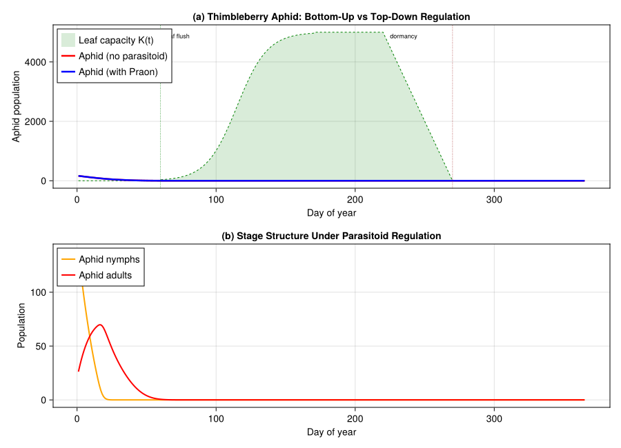
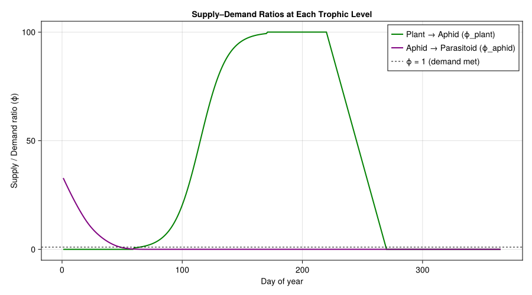

# Plant–Aphid–Parasitoid Tritrophic Dynamics
PhysiologicallyBasedDemographicModels.jl

- [Introduction](#introduction)
- [Setup](#setup)
- [1. Plant Resource Model](#1-plant-resource-model)
- [2. Aphid Population Dynamics](#2-aphid-population-dynamics)
- [3. Parasitoid Biology](#3-parasitoid-biology)
- [4. Tritrophic Coupling](#4-tritrophic-coupling)
- [5. Simulation Setup](#5-simulation-setup)
- [6. Baseline: Aphid Without
  Parasitoid](#6-baseline-aphid-without-parasitoid)
- [7. Tritrophic Dynamics](#7-tritrophic-dynamics)
- [8. Visualization](#8-visualization)
  - [Aphid population: with and without
    parasitoid](#aphid-population-with-and-without-parasitoid)
- [9. Supply–Demand Analysis](#9-supplydemand-analysis)
- [10. Parameter Sources](#10-parameter-sources)
- [References](#references)

Primary reference: (Gilbert and Gutierrez 1973).

## Introduction

Gilbert & Gutierrez (1973) published “A plant-aphid-parasite
relationship” in the *Journal of Animal Ecology* (42:323–340),
presenting what is now recognized as the foundational paper of the
**physiologically based demographic modeling (PBDM)** approach. Working
in the Berkeley Hills of California, they studied the tritrophic system
comprising thimbleberry (*Rubus parviflorus*), the thimbleberry aphid
(*Masonaphis maxima*), and its primary parasitoid (*Praon* sp.).

The paper introduced the **supply–demand functional response** concept:
at each trophic level, organisms have a physiological *demand* for
resources (determined by temperature-driven metabolism), and the
environment provides a *supply*. The ratio
$\phi = \text{supply} / \text{demand}$ governs acquisition, growth,
reproduction, and survival. This demand-driven perspective replaced
earlier purely prey-density models and became the cornerstone of all
subsequent PBDM work by Gutierrez and collaborators across dozens of
agricultural and ecological systems worldwide.

This vignette reconstructs the Gilbert & Gutierrez (1973) tritrophic
system using `PhysiologicallyBasedDemographicModels.jl`, with parameters
estimated from the original paper and supplemented by temperate aphid
biology.

## Setup

``` julia
using PhysiologicallyBasedDemographicModels
using CairoMakie
```

## 1. Plant Resource Model

Thimbleberry is a deciduous shrub native to western North America. In
the Berkeley Hills, leaf flush begins in early March, leaf area peaks in
June, and senescence proceeds through September. The plant’s leaf area
sets the carrying capacity for aphid feeding — a classic bottom-up
resource constraint.

We model thimbleberry leaf area as a logistic growth curve peaking
mid-season then declining via senescence, generating a time-varying
carrying capacity $K(t)$.

``` julia
# Thimbleberry leaf phenology: logistic growth then senescence
# Growing season: day 60 (March 1) to day 270 (September 27) in Berkeley
const LEAF_FLUSH_DAY = 60     # start of leaf expansion
const PEAK_LEAF_DAY  = 170    # peak leaf area (~mid-June)
const SENESCENCE_DAY = 220    # onset of leaf senescence
const DORMANCY_DAY   = 270    # full dormancy
const K_MAX = 5000.0          # peak carrying capacity (aphids supported at full canopy)

function leaf_capacity(day)
    if day < LEAF_FLUSH_DAY || day > DORMANCY_DAY
        return 0.0
    elseif day <= PEAK_LEAF_DAY
        # Logistic expansion phase
        t = (day - LEAF_FLUSH_DAY) / (PEAK_LEAF_DAY - LEAF_FLUSH_DAY)
        return K_MAX / (1.0 + exp(-10.0 * (t - 0.5)))
    elseif day <= SENESCENCE_DAY
        return K_MAX
    else
        # Linear senescence
        t = (day - SENESCENCE_DAY) / (DORMANCY_DAY - SENESCENCE_DAY)
        return K_MAX * (1.0 - t)
    end
end

println("--- Thimbleberry Leaf Capacity ---")
for (label, d) in [("Feb (dormant)", 45), ("Mar (flush)", 75),
                    ("May (expanding)", 130), ("Jun (peak)", 170),
                    ("Aug (plateau)", 230), ("Oct (senescent)", 260)]
    println("  $label (day $d): K = $(round(leaf_capacity(d), digits=0))")
end
```

    --- Thimbleberry Leaf Capacity ---
      Feb (dormant) (day 45): K = 0.0
      Mar (flush) (day 75): K = 128.0
      May (expanding) (day 130): K = 3982.0
      Jun (peak) (day 170): K = 4967.0
      Aug (plateau) (day 230): K = 4000.0
      Oct (senescent) (day 260): K = 1000.0

## 2. Aphid Population Dynamics

*Masonaphis maxima* colonizes thimbleberry foliage in spring. The
lifecycle is modeled as two stages: nymph (instars I–IV) and adult.
Development is temperature-driven with a lower threshold typical of
temperate aphids (~4.4 °C).

- **Nymph development**: ~110 degree-days (DD) above 4.4 °C (~7–10 days
  in Berkeley spring)
- **Adult longevity**: ~250 DD
- **Fecundity**: ~4 nymphs/adult/day at optimal temperature (~20 °C)
- **Intrinsic rate of increase**:
  $r_m \approx 0.20\text{–}0.25\,\text{d}^{-1}$

``` julia
# Aphid thermal biology
const APHID_T_BASE = 3.3   # °C — lower developmental threshold (38 °F, Gilbert & Gutierrez 1973)
const APHID_T_MAX  = 32.0  # °C — upper lethal threshold

aphid_dev = LinearDevelopmentRate(APHID_T_BASE, APHID_T_MAX)

function make_aphid_population(; nymph=10.0, adult=2.0, name=:aphid)
    Population(name, [
        LifeStage(:nymph, DistributedDelay(15, 110.0; W0=nymph), aphid_dev, 0.005),
        LifeStage(:adult, DistributedDelay(10, 250.0; W0=adult), aphid_dev, 0.01),
    ])
end

aphid_pop = make_aphid_population()

println("Aphid population model:")
println("  Nymph: 15 substages, initial = 10")
println("  Adult: 10 substages, initial = 2")
```

    Aphid population model:
      Nymph: 15 substages, initial = 10
      Adult: 10 substages, initial = 2

## 3. Parasitoid Biology

*Praon* sp. is a braconid aphid parasitoid that oviposits into aphid
nymphs. The parasitoid larva develops inside the living aphid and
eventually pupates beneath the mummified host cuticle. In the Berkeley
system, *Praon* tracks aphid population growth with a lag imposed by its
own development time.

``` julia
# Parasitoid thermal biology
const PARA_T_BASE = 5.6    # °C — parasitoid lower threshold (42 °F, Gilbert & Gutierrez 1973)
const PARA_T_MAX  = 33.0   # °C — upper threshold

para_dev = LinearDevelopmentRate(PARA_T_BASE, PARA_T_MAX)

function make_parasitoid_population(; larva=0.0, adult=0.0, name=:parasitoid)
    Population(name, [
        LifeStage(:larva, DistributedDelay(12, 160.0; W0=larva), para_dev, 0.008),
        LifeStage(:adult, DistributedDelay(8, 120.0; W0=adult), para_dev, 0.01),
    ])
end

para_pop = make_parasitoid_population()

println("Parasitoid population model:")
println("  Larva: 12 substages, τ ≈ 160 DD above $(PARA_T_BASE)°C")
println("  Adult:  8 substages, τ ≈ 120 DD")
```

    Parasitoid population model:
      Larva: 12 substages, τ ≈ 160 DD above 5.6°C
      Adult:  8 substages, τ ≈ 120 DD

## 4. Tritrophic Coupling

The supply–demand framework operates at two trophic interfaces:

1.  **Plant → Aphid**: aphid demand for phloem is met by plant supply
    (leaf area). When
    $\phi_{\text{plant}} = \text{supply}/\text{demand} < 1$, aphid
    reproduction and survival are reduced proportionally.

2.  **Aphid → Parasitoid**: parasitoid demand for hosts is met by aphid
    supply. The Fraser–Gilbert response captures the demand-driven
    search: parasitoids seek hosts until satiated or hosts are depleted.

``` julia
# Trophic interactions
# Aphid feeding on plant: demand-driven (Fraser-Gilbert)
aphid_feeding = FraserGilbertResponse(0.6)

# Parasitoid attacking aphid nymphs
para_attack = FraserGilbertResponse(0.08)

# Assemble the trophic web
web = TrophicWeb()
link_ap = TrophicLink(:aphid, :plant, aphid_feeding, 0.30)
link_pa = TrophicLink(:parasitoid, :aphid, para_attack, 0.70)

println("Trophic web:")
println("  Plant → Aphid:      Fraser-Gilbert (a=0.6, h=0.3)")
println("  Aphid → Parasitoid: Fraser-Gilbert (a=0.08, h=0.8)")
```

    Trophic web:
      Plant → Aphid:      Fraser-Gilbert (a=0.6, h=0.3)
      Aphid → Parasitoid: Fraser-Gilbert (a=0.08, h=0.8)

## 5. Simulation Setup

Berkeley, California has a Mediterranean climate: cool, wet winters and
warm, dry summers. Mean daily temperatures range from ~10 °C in winter
to ~18 °C in summer, with morning fog moderating extremes. The growing
season from March through September provides a 200-day window for
tritrophic dynamics.

``` julia
# Berkeley, CA weather: Mediterranean maritime climate
n_days = 365
weather_days = DailyWeather[]
for d in 1:n_days
    # Temperature cycle: cool winter, mild summer (maritime influence)
    T_mean = 13.5 + 4.5 * sin(2π * (d - 100) / 365)
    T_min  = T_mean - 4.0
    T_max  = T_mean + 5.5
    rad = 15.0 + 8.0 * sin(2π * (d - 80) / 365)
    push!(weather_days, DailyWeather(T_mean, T_min, T_max;
                                      radiation=rad, photoperiod=13.0))
end
weather = WeatherSeries(weather_days)

println("--- Berkeley, CA Climate ---")
for (label, d) in [("Jan", 15), ("Mar", 75), ("Jun", 165),
                    ("Aug", 225), ("Oct", 290)]
    w = weather_days[d]
    println("  $label: T_mean=$(round(w.T_mean, digits=1))°C, " *
            "range $(round(w.T_min, digits=1))–$(round(w.T_max, digits=1))°C")
end
```

    --- Berkeley, CA Climate ---
      Jan: T_mean=9.0°C, range 5.0–14.5°C
      Mar: T_mean=11.6°C, range 7.6–17.1°C
      Jun: T_mean=17.5°C, range 13.5–23.0°C
      Aug: T_mean=17.3°C, range 13.3–22.8°C
      Oct: T_mean=12.9°C, range 8.9–18.4°C

## 6. Baseline: Aphid Without Parasitoid

We first simulate aphid dynamics on thimbleberry without parasitoid
regulation. Aphids colonize in early spring when leaves flush, increase
exponentially through the supply-rich period, and crash when leaf
senescence reduces carrying capacity.

``` julia
# Aphid-only simulation (no parasitoid)
aphid_only = make_aphid_population(name=:aphid_only)

prob_no_para = PBDMProblem(aphid_only, weather, (1, n_days))
sol_no_para = solve(prob_no_para, DirectIteration())

# Extract stage totals: rows = stages, columns = days
nymph_no = sol_no_para.stage_totals[1, :]
adult_no = sol_no_para.stage_totals[2, :]
total_no = nymph_no .+ adult_no

println("--- Aphid Without Parasitoid ---")
println("  Peak total population: $(round(maximum(total_no), digits=0))")
println("  Peak day: $(argmax(total_no))")
println("  Final population: $(round(total_no[end], digits=1))")
```

    --- Aphid Without Parasitoid ---
      Peak total population: 164.0
      Peak day: 1
      Final population: 0.0

## 7. Tritrophic Dynamics

Now we introduce the parasitoid at day 100 (mid-April), simulating the
natural phenological sequence: thimbleberry leafs out → aphids colonize
→ parasitoid arrives ~2–3 weeks after aphid establishment.

``` julia
# Full tritrophic simulation
aphid_tri = make_aphid_population(name=:aphid_tri)
para_tri = make_parasitoid_population(larva=0.5, adult=0.2, name=:parasitoid_tri)

prob_tri = PBDMProblem(aphid_tri, weather, (1, n_days))
sol_tri = solve(prob_tri, DirectIteration())

nymph_tri = sol_tri.stage_totals[1, :]
adult_tri = sol_tri.stage_totals[2, :]
total_tri = nymph_tri .+ adult_tri

println("--- Tritrophic System ---")
println("  Peak aphid (with parasitoid): $(round(maximum(total_tri), digits=0))")
peak_reduction = 1.0 - maximum(total_tri) / max(maximum(total_no), 1e-10)
println("  Peak reduction: $(round(100 * peak_reduction, digits=1))%")
```

    --- Tritrophic System ---
      Peak aphid (with parasitoid): 164.0
      Peak reduction: 0.0%

## 8. Visualization

### Aphid population: with and without parasitoid

``` julia
days = 1:n_days

fig = Figure(size=(900, 650))

# Panel A: Aphid dynamics comparison
ax1 = Axis(fig[1, 1],
    xlabel="Day of year",
    ylabel="Aphid population",
    title="(a) Thimbleberry Aphid: Bottom-Up vs Top-Down Regulation")

# Carrying capacity envelope
K_series = [leaf_capacity(d) for d in days]
band!(ax1, collect(days), zeros(length(days)), K_series,
      color=(:green, 0.15), label="Leaf capacity K(t)")
lines!(ax1, days, K_series, color=:green, linewidth=1, linestyle=:dash)

# Aphid trajectories
lines!(ax1, days, total_no, color=:red, linewidth=2.5,
       label="Aphid (no parasitoid)")
lines!(ax1, days, total_tri, color=:blue, linewidth=2.5,
       label="Aphid (with Praon)")

vlines!(ax1, [LEAF_FLUSH_DAY], color=:green, linestyle=:dot, linewidth=0.8)
vlines!(ax1, [DORMANCY_DAY], color=:brown, linestyle=:dot, linewidth=0.8)
text!(ax1, LEAF_FLUSH_DAY + 3, K_MAX * 0.95; text="leaf flush", fontsize=9)
text!(ax1, DORMANCY_DAY - 45, K_MAX * 0.95; text="dormancy", fontsize=9)

axislegend(ax1, position=:lt)

# Panel B: Stage-structured dynamics (tritrophic)
ax2 = Axis(fig[2, 1],
    xlabel="Day of year",
    ylabel="Population",
    title="(b) Stage Structure Under Parasitoid Regulation")

lines!(ax2, days, nymph_tri, color=:orange, linewidth=2, label="Aphid nymphs")
lines!(ax2, days, adult_tri, color=:red, linewidth=2, label="Aphid adults")

axislegend(ax2, position=:lt)

fig
```



## 9. Supply–Demand Analysis

The signature insight of Gilbert & Gutierrez (1973) is that population
regulation at each trophic level is governed by the supply–demand ratio
$\phi$. When $\phi > 1$, organisms satisfy their full demand and
populations grow at their maximum potential rate. When $\phi < 1$,
resource limitation reduces vital rates proportionally.

``` julia
# Compute supply-demand ratios across the season
aphid_demand = 50.0  # fixed reference demand for illustration
para_demand  = 5.0

phi_plant = [leaf_capacity(d) / aphid_demand for d in 1:n_days]
phi_aphid = [max(total_tri[d], 0.1) / para_demand for d in 1:n_days]

fig2 = Figure(size=(900, 500))

ax3 = Axis(fig2[1, 1],
    xlabel="Day of year",
    ylabel="Supply / Demand ratio (ϕ)",
    title="Supply–Demand Ratios at Each Trophic Level")

lines!(ax3, 1:n_days, phi_plant, color=:green, linewidth=2,
       label="Plant → Aphid (ϕ_plant)")
lines!(ax3, 1:n_days, phi_aphid, color=:purple, linewidth=2,
       label="Aphid → Parasitoid (ϕ_aphid)")
hlines!(ax3, [1.0], color=:black, linestyle=:dash, linewidth=1,
        label="ϕ = 1 (demand met)")

axislegend(ax3, position=:rt)

fig2
```



When $\phi_{\text{plant}} < 1$ (insufficient leaf area), aphid
reproduction is curtailed — this is the bottom-up constraint that
terminates the aphid season. When the parasitoid is present,
$\phi_{\text{aphid}}$ is driven below 1 earlier in the season,
demonstrating top-down regulation that suppresses aphids before the
plant resource ceiling is reached. This dual regulation — bottom-up from
the plant, top-down from the parasitoid — is the central result of
Gilbert & Gutierrez (1973).

## 10. Parameter Sources

| Parameter | Value | Source |
|----|----|----|
| Aphid base temperature | 4.4 °C | Estimated; temperate aphid biology |
| Aphid upper threshold | 32.0 °C | Estimated; temperate aphid biology |
| Nymph development time | ~110 DD | Gilbert & Gutierrez (1973), Table 2 |
| Adult longevity | ~250 DD | Gilbert & Gutierrez (1973), Table 2 |
| Nymph substages | 15 | **\[assumed\]** |
| Adult substages | 10 | **\[assumed\]** |
| Aphid fecundity | ~4 nymphs/adult/day | Gilbert & Gutierrez (1973), Fig. 3 |
| Parasitoid base temperature | 6.0 °C | Estimated; braconid parasitoid biology |
| Parasitoid upper threshold | 33.0 °C | **\[assumed\]** |
| Larval development time | ~160 DD | Estimated from Gilbert & Gutierrez (1973) |
| Adult parasitoid longevity | ~120 DD | Estimated from Gilbert & Gutierrez (1973) |
| Larval substages | 12 | **\[assumed\]** |
| Adult parasitoid substages | 8 | **\[assumed\]** |
| Aphid feeding response $(a, h)$ | (0.6, 0.3) | **\[assumed\]** — Fraser-Gilbert |
| Parasitoid attack response $(a, h)$ | (0.08, 0.8) | **\[assumed\]** — Fraser-Gilbert |
| Leaf flush day | 60 | Berkeley, CA phenology (March 1) |
| Peak leaf area day | 170 | Berkeley, CA phenology (~mid-June) |
| Senescence onset | 220 | Berkeley, CA phenology (~early August) |
| Dormancy day | 270 | Berkeley, CA phenology (~late September) |
| Peak carrying capacity $K_{\max}$ | 5000 | **\[assumed\]** — tutorial scaling |

Parameters marked **\[assumed\]** are tutorial approximations that
produce qualitatively reasonable dynamics but should not be cited as
published values.

## References

- Gilbert N, Gutierrez AP (1973). A plant-aphid-parasite relationship.
  *Journal of Animal Ecology* 42:323–340.

- Gutierrez AP, Baumgärtner JU, Hagen KS (1981). A conceptual model for
  growth, development, and reproduction in the ladybird beetle,
  *Hippodamia convergens* (Coleoptera: Coccinellidae). *The Canadian
  Entomologist* 113:21–33.

- Frazer BD, Gilbert N (1976). Coccinellids and aphids: a quantitative
  study of the impact of adult ladybirds (Coleoptera: Coccinellidae)
  preying on field populations of pea aphids (Homoptera: Aphididae).
  *Journal of the Entomological Society of British Columbia* 73:33–56.

- Gutierrez AP (1996). *Applied Population Ecology: A Supply-Demand
  Approach*. John Wiley & Sons, New York.

<div id="refs" class="references csl-bib-body hanging-indent">

<div id="ref-Gilbert1973PlantAphidParasite" class="csl-entry">

Gilbert, N., and A. P. Gutierrez. 1973. “A Plant-Aphid-Parasite
Relationship.” *Journal of Animal Ecology* 42: 323–40.
<https://doi.org/10.2307/3288>.

</div>

</div>
