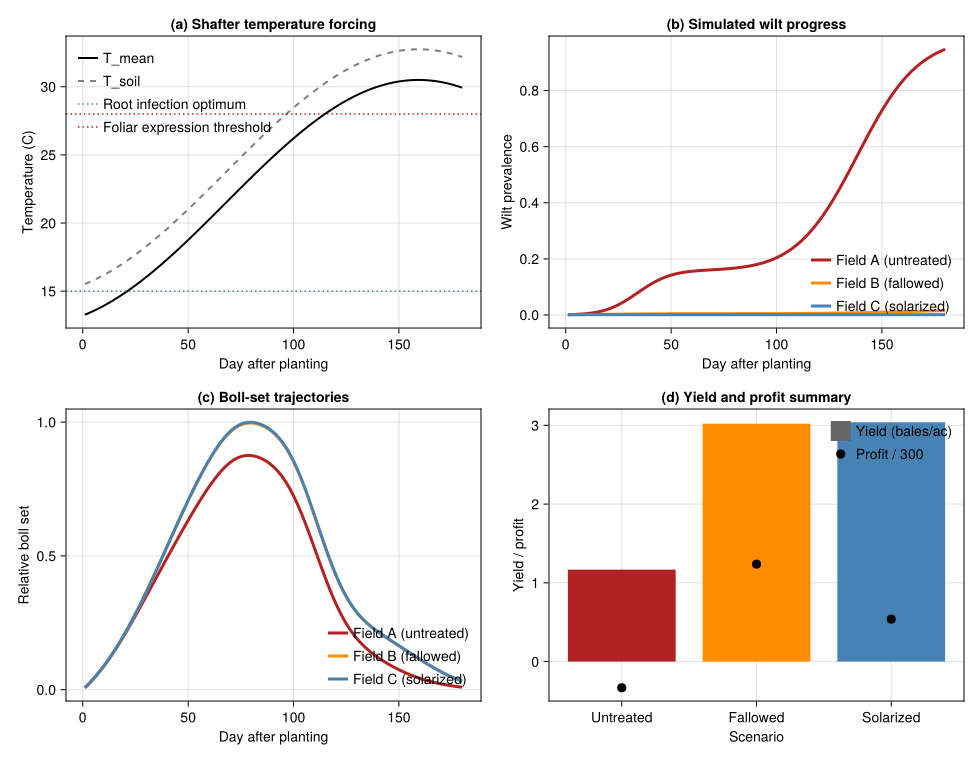
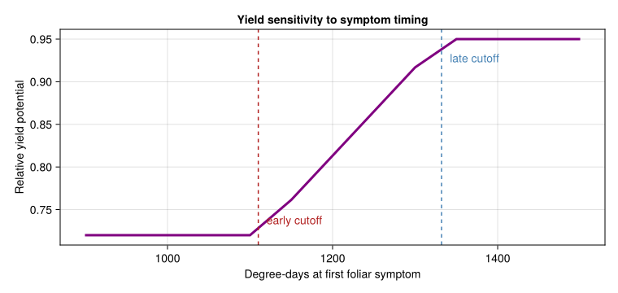

# Fusarium Wilt and Root-Knot Nematode in Cotton
PhysiologicallyBasedDemographicModels.jl

- [Introduction](#introduction)
- [Field Scenarios and Inoculum
  Gradients](#field-scenarios-and-inoculum-gradients)
- [Physiological Time and Symptom
  Timing](#physiological-time-and-symptom-timing)
- [Weather Data: Shafter, California](#weather-data-shafter-california)
- [Temperature-Gated Infection
  Pressure](#temperature-gated-infection-pressure)
- [Disease-State Approximation](#disease-state-approximation)
- [Cotton Growth Skeleton](#cotton-growth-skeleton)
- [Coupling Disease to Height, Boll Set, and
  Yield](#coupling-disease-to-height-boll-set-and-yield)
- [Comparing the Three Management
  Histories](#comparing-the-three-management-histories)
- [Management Interpretation](#management-interpretation)
- [Sensitivity to Symptom Timing](#sensitivity-to-symptom-timing)
- [Discussion](#discussion)

## Introduction

Fusarium wilt of upland cotton (*Gossypium hirsutum*) in California is a
classic **soil-borne disease complex**: severe disease usually requires
both the pathogen *Fusarium oxysporum* f. sp. *vasinfectum* (FOV) and
the root-knot nematode *Meloidogyne incognita* (MI). DeVay et al. (1997)
measured FOV and MI inoculum densities at three fields near Shafter,
California (1982-1984), then related those densities to wilt incidence,
cotton phenology, plant height, boll set, and seed cotton yield.

The paper highlights three interacting processes:

1.  **Low soil temperatures** near 15 C favour early root infection by
    FOV.
2.  **Nematode injury** increases cotton susceptibility to vascular
    invasion.
3.  **High air temperatures** later in the season accelerate foliar wilt
    expression, stunting plants and reducing boll set.

This vignette implements a compact PBDM-style reconstruction of that
system using the `PhysiologicallyBasedDemographicModels.jl` API. The
goal is not to reproduce every regression in the paper, but to encode
the main causal chain:

soil inoculum -\> temperature-gated infection pressure -\> foliar wilt
progress -\> reduced cotton growth and yield.

``` julia
using PhysiologicallyBasedDemographicModels
using CairoMakie
using Statistics
```

## Field Scenarios and Inoculum Gradients

The paper reports three contrasting field histories:

- **Field A:** untreated, naturally infested, high disease pressure.
- **Field B:** fallowed, intermediate inoculum and intermediate disease.
- **Field C:** solarized, near-zero FOV and MI after summer heating.

The reported 1982 FOV densities were 2608, 1122, and 0.2 CFU/g soil for
Fields A, B, and C, respectively (1997, Table 2). The text also notes
that MI reached an explicitly reported high of 163 J2 per 250 cm^3 soil
in one 1984 field-year, and that MI and FOV were strongly correlated on
a log scale. The paper does not give a full MI table in the text
version, so the MI values below are **representative scenario values**
chosen to preserve the paper’s ranking (A \> B \> C) and the observed
disease ordering.

``` julia
const FIELD_DATA = (
    A = (label = "Field A (untreated)",
         FOV = 2608.0,      # CFU / g soil, reported
         MI = 80.0,         # representative J2 / 250 cm^3, assumed
         target_incidence = 0.90,
         extra_cost = 0.0),
    B = (label = "Field B (fallowed)",
         FOV = 1122.0,      # CFU / g soil, reported
         MI = 25.0,         # representative J2 / 250 cm^3, assumed
         target_incidence = 0.35,
         extra_cost = 85.0),
    C = (label = "Field C (solarized)",
         FOV = 0.2,         # CFU / g soil, reported
         MI = 1.0,          # near-zero nematode pressure, assumed
         target_incidence = 0.03,
         extra_cost = 300.0)
)

for (k, field) in pairs(FIELD_DATA)
    println(rpad(field.label, 22),
            "  FOV = ", round(field.FOV, digits = 1),
            " CFU/g, MI = ", round(field.MI, digits = 1),
            ", target incidence = ", round(100 * field.target_incidence, digits = 0), "%")
end
```

    Field A (untreated)     FOV = 2608.0 CFU/g, MI = 80.0, target incidence = 90.0%
    Field B (fallowed)      FOV = 1122.0 CFU/g, MI = 25.0, target incidence = 35.0%
    Field C (solarized)     FOV = 0.2 CFU/g, MI = 1.0, target incidence = 3.0%

For reference, the interaction term reported by DeVay et al. was:

$$\mathrm{Wilt\ incidence} = 12.12 + 0.00052(\mathrm{FOV} \times \mathrm{MI}),$$

with the caveat that the fit was sensitive to one large MI observation
and that FOV and MI were themselves strongly correlated.

``` julia
paper_interaction_percent(FOV, MI) = clamp(12.12 + 0.00052 * FOV * MI, 0.0, 100.0)

for field in values(FIELD_DATA)
    pred = paper_interaction_percent(field.FOV, field.MI)
    println(rpad(field.label, 22), "  interaction regression = ", round(pred, digits = 1), "%")
end
```

    Field A (untreated)     interaction regression = 100.0%
    Field B (fallowed)      interaction regression = 26.7%
    Field C (solarized)     interaction regression = 12.1%

## Physiological Time and Symptom Timing

Disease progress in Field A was plotted against physiological time above
a threshold of **53.5 F = 11.9 C** (1997). The paper also reports:

- Root infection is favoured at about **15 C** soil temperature.
- Foliar wilt expression becomes strongest when air temperatures exceed
  about **28 C**.
- Vascular browning can precede foliar symptoms by about **300 F
  degree-days** (**167 C degree-days**).
- Early foliar symptoms before **1110 C degree-days** are associated
  with stronger stunting and lower boll set than symptoms after **1332 C
  degree-days**.

``` julia
const T_BASE = 11.9
const T_UPPER = 38.0
const T_ROOT_OPT = 15.0
const T_FOLIAR = 28.0

const DD_VASCULAR_LEAD = 167.0
const DD_EARLY = 1110.0
const DD_LATE = 1332.0

cotton_dev = LinearDevelopmentRate(T_BASE, T_UPPER)

println("Base threshold for physiological time: ", T_BASE, " C")
println("Vascular browning lead time: ", DD_VASCULAR_LEAD, " C degree-days")
println("Early / late symptom cutoffs: ", DD_EARLY, " and ", DD_LATE, " C degree-days")
```

    Base threshold for physiological time: 11.9 C
    Vascular browning lead time: 167.0 C degree-days
    Early / late symptom cutoffs: 1110.0 and 1332.0 C degree-days

## Weather Data: Shafter, California

We approximate the Shafter growing season with a warm San Joaquin Valley
temperature trajectory: cool spring conditions that favour root
infection, then hot summer conditions that accelerate foliar wilt
expression. Cotton is planted in mid-April and followed for 180 days.

``` julia
n_days = 180
start_doy = 105

temps_mean = Float64[]
temps_min = Float64[]
temps_max = Float64[]
rads = Float64[]

for d in 1:n_days
    doy = start_doy + d - 1
    T_mean = 21.5 + 9.0 * sin(2π * (doy - 172) / 365)
    T_min = T_mean - 8.0
    T_max = T_mean + 9.0
    rad = 19.0 + 5.0 * sin(2π * (doy - 160) / 365)

    push!(temps_mean, T_mean)
    push!(temps_min, T_min)
    push!(temps_max, T_max)
    push!(rads, rad)
end

weather_days = [DailyWeather(temps_mean[d], temps_min[d], temps_max[d];
                             radiation = rads[d], photoperiod = 12.0 + 1.8 * sin(2π * (start_doy + d - 80) / 365))
                for d in 1:n_days]
weather = WeatherSeries(weather_days; day_offset = 1)

cdd = cumsum([degree_days(cotton_dev, w.T_mean) for w in weather_days])
println("End-of-season cumulative degree-days: ", round(cdd[end], digits = 0))
```

    End-of-season cumulative degree-days: 2123.0

## Temperature-Gated Infection Pressure

The paper suggests a two-stage environmental filter:

1.  A **root infection gate** peaked near 15 C when the pathogen first
    invades roots.
2.  A **foliar expression gate** that strengthens under hot summer
    conditions.

We represent those gates with a Gaussian soil-temperature response and a
sigmoidal air-temperature response. Infection pressure is then scaled by
FOV and MI densities.

``` julia
root_gate(T_soil) = exp(-((T_soil - T_ROOT_OPT) / 4.0)^2)
foliar_gate(T_air) = inv(1 + exp(-(T_air - T_FOLIAR) / 1.8))

function infection_pressure(FOV, MI, T_soil, T_air)
    inoculum = log1p(FOV / 50.0) * (1.0 + 0.30 * log1p(MI))
    return inoculum * (0.70 * root_gate(T_soil) + 0.30 * foliar_gate(T_air))
end

soil_temps = [0.75 * w.T_mean + 0.25 * w.T_max for w in weather_days]
press_A = [infection_pressure(FIELD_DATA.A.FOV, FIELD_DATA.A.MI, soil_temps[d], temps_mean[d]) for d in 1:n_days]
press_B = [infection_pressure(FIELD_DATA.B.FOV, FIELD_DATA.B.MI, soil_temps[d], temps_mean[d]) for d in 1:n_days]
press_C = [infection_pressure(FIELD_DATA.C.FOV, FIELD_DATA.C.MI, soil_temps[d], temps_mean[d]) for d in 1:n_days]
```

    180-element Vector{Float64}:
     0.003318719042083686
     0.003304030360333792
     0.00328707486042804
     0.0032676971639015308
     0.0032457468981593436
     0.0032210804439483836
     0.003193562764392829
     0.0031630692979574817
     0.0031294878940998404
     0.003092720766793642
     ⋮
     0.0011291928032703673
     0.0011243440825731358
     0.0011190779442415758
     0.001113383550462671
     0.0011072494792253521
     0.0011006637786679485
     0.0010936140311453022
     0.001086087428172505
     0.001078070857433576

## Disease-State Approximation

To connect soil infection pressure to field-level symptom prevalence we
use the package epidemiology types as a convenient bookkeeping layer.
Here, `DiseaseState(S, I, R, D)` is interpreted as:

- `S`: asymptomatic plants
- `I`: plants with visible foliar symptoms
- `R`: symptomatically damaged but still alive
- `D`: plants effectively lost from production

Recovery is set to zero, and disease mortality is low; the main effect
is yield reduction rather than outright plant death.

``` julia
function simulate_wilt(field, weather_days)
    beta = 0.0015 + 0.030 * field.target_incidence
    wilt = SIRDisease(beta, 0.0, 0.00025)
    state = DiseaseState(999.0, 1.0)

    # Track field inoculum + virulence via a SoilState. Virulence here
    # encodes the field's target incidence (used by β), and inoculum carries
    # FOV×MI so the CustomRule can read it from the coupled system. This
    # exercises the coupled SoilState API end-to-end.
    soil = SoilState(:soil_inoc;
        inoculum = log1p(field.FOV / 50.0) * (1.0 + 0.30 * log1p(field.MI)),
        virulence = field.target_incidence)

    bp = BulkPopulation(:crop, state.S + state.I)

    disease_rule = CustomRule(:wilt, (sys, w, day, p) -> begin
        T_soil = 0.75 * w.T_mean + 0.25 * w.T_max
        soil = sys.state[:soil_inoc]
        inoc = get_inoculum(soil)
        contact = inoc *
                  (0.70 * root_gate(T_soil) + 0.30 * foliar_gate(w.T_mean))
        step_disease!(p.disease_state, p.model, contact)
        (S = p.disease_state.S, I = p.disease_state.I, D = p.disease_state.D,
         prevalence = prevalence(p.disease_state))
    end)

    sys = PopulationSystem(:crop => bp; state = [soil])
    prob = PBDMProblem(sys, WeatherSeries(weather_days), (1, length(weather_days));
        rules = [disease_rule], p = (disease_state = state, model = wilt))
    sol = solve(prob, DirectIteration())

    prev   = [r.prevalence for r in sol.rule_log[:wilt]]
    S_hist = [r.S for r in sol.rule_log[:wilt]]
    I_hist = [r.I for r in sol.rule_log[:wilt]]
    D_hist = [r.D for r in sol.rule_log[:wilt]]

    return (; prevalence = prev, S = S_hist, I = I_hist, D = D_hist)
end

field_disease = Dict(name => simulate_wilt(field, weather_days) for (name, field) in pairs(FIELD_DATA))

for (name, field) in pairs(FIELD_DATA)
    final_prev = 100 * field_disease[name].prevalence[end]
    println(rpad(field.label, 22),
            "  simulated end-season incidence = ", round(final_prev, digits = 1), "%")
end
```

    Field A (untreated)     simulated end-season incidence = 94.7%
    Field B (fallowed)      simulated end-season incidence = 1.6%
    Field C (solarized)     simulated end-season incidence = 0.1%

## Cotton Growth Skeleton

The crop side of the system is simplified from the dedicated cotton
vignette. We track four organ pools with distributed delays:

- leaves and stems for canopy growth,
- roots as the infection interface,
- bolls as the reproductive sink most visibly damaged by wilt.

``` julia
const K = 20

leaf_stage = LifeStage(:leaf,
    DistributedDelay(K, 520.0; W0 = 0.35),
    cotton_dev,
    0.003)

stem_stage = LifeStage(:stem,
    DistributedDelay(K, 760.0; W0 = 0.20),
    cotton_dev,
    0.002)

root_stage = LifeStage(:root,
    DistributedDelay(K, 420.0; W0 = 0.18),
    cotton_dev,
    0.003)

boll_stage = LifeStage(:boll,
    DistributedDelay(K, 800.0; W0 = 0.0),
    cotton_dev,
    0.001)

cotton = Population(:acala_sj2, [leaf_stage, stem_stage, root_stage, boll_stage])
prob = PBDMProblem(cotton, weather, (1, n_days))
sol = solve(prob, DirectIteration())

leaf_base = stage_trajectory(sol, 1)
stem_base = stage_trajectory(sol, 2)
root_base = stage_trajectory(sol, 3)
boll_base = stage_trajectory(sol, 4)
```

    180-element Vector{Float64}:
     0.011767269482845686
     0.024015714367343618
     0.036756843315542416
     0.050001166274495676
     0.06375815452670004
     0.07803620161014056
     0.0928425853283573
     0.10818343107316634
     0.12406367668388892
     0.14048703906710333
     ⋮
     0.09383702395102532
     0.08774792267654882
     0.08187232358284549
     0.07621720724911735
     0.07078861300427054
     0.06559155921907803
     0.060629977816057265
     0.05590666476506011
     0.051423247513069134

## Coupling Disease to Height, Boll Set, and Yield

DeVay et al. showed that once foliar symptoms appear, plant height slows
rapidly and boll set is reduced most strongly when symptoms appear
early. We represent this by scaling organ trajectories with the
simulated symptom prevalence and by assigning an additional timing
penalty based on the first day that prevalence exceeds 5%.

``` julia
function first_symptom_metrics(prev, cdd; threshold = 0.05)
    idx = findfirst(>=(threshold), prev)
    if isnothing(idx)
        return (day = length(prev), dd = cdd[end], vascular_dd = cdd[end] - DD_VASCULAR_LEAD)
    end
    return (day = idx, dd = cdd[idx], vascular_dd = cdd[idx] - DD_VASCULAR_LEAD)
end

function timing_factor(dd_symptom)
    dd_symptom <= DD_EARLY && return 0.72
    dd_symptom >= DD_LATE && return 0.95
    frac = (dd_symptom - DD_EARLY) / (DD_LATE - DD_EARLY)
    return 0.72 + 0.23 * frac
end

function diseased_growth(sol, prev)
    leaf = stage_trajectory(sol, 1)
    stem = stage_trajectory(sol, 2)
    root = stage_trajectory(sol, 3)
    boll = stage_trajectory(sol, 4)

    height = (leaf .+ stem) .* (1 .- 0.45 .* prev)
    roots = root .* (1 .- 0.35 .* prev)
    bolls = boll .* (1 .- 0.75 .* prev)

    return (; height = height, roots = roots, bolls = bolls)
end

const POTENTIAL_YIELD = 3.2  # bales / acre
wilt_damage = LinearDamageFunction(0.012)
cotton_revenue = CropRevenue(300.0, :bale)

function scenario_metrics(field, prev, cdd)
    sym = first_symptom_metrics(prev, cdd)
    pot = POTENTIAL_YIELD * timing_factor(sym.dd)
    act = actual_yield(wilt_damage, 100 * prev[end], pot)
    costs = InputCostBundle(production = 450.0, treatment = field.extra_cost)
    profit = net_profit(cotton_revenue, act, costs)
    return (; symptom = sym, potential_yield = pot, actual_yield = act, profit = profit)
end

growth_results = Dict(name => diseased_growth(sol, field_disease[name].prevalence) for name in keys(FIELD_DATA))
metric_results = Dict(name => scenario_metrics(field, field_disease[name].prevalence, cdd)
                      for (name, field) in pairs(FIELD_DATA))

for (name, field) in pairs(FIELD_DATA)
    metrics = metric_results[name]
    println(rpad(field.label, 22),
            "  symptom day = ", metrics.symptom.day,
            ", symptom DD = ", round(metrics.symptom.dd, digits = 0),
            ", yield = ", round(metrics.actual_yield, digits = 2),
            " bales/ac, profit = \$", round(metrics.profit, digits = 0), "/ac")
end
```

    Field A (untreated)     symptom day = 29, symptom DD = 74.0, yield = 1.17 bales/ac, profit = $-100.0/ac
    Field B (fallowed)      symptom day = 180, symptom DD = 2123.0, yield = 3.02 bales/ac, profit = $371.0/ac
    Field C (solarized)     symptom day = 180, symptom DD = 2123.0, yield = 3.04 bales/ac, profit = $162.0/ac

## Comparing the Three Management Histories

Field C was solarized before planting; the paper reports mean maximum
soil temperatures of **47-48 C at 15 cm depth** during solarization,
versus about **36 C** in the fallowed field (1997). In the model that
large thermal contrast is represented indirectly through the near-zero
inoculum densities assigned to the solarized field.

``` julia
scenario_order = [:A, :B, :C]
scenario_colors = Dict(:A => :firebrick, :B => :darkorange, :C => :steelblue)

fig = Figure(size = (980, 760))

ax1 = Axis(fig[1, 1],
    xlabel = "Day after planting",
    ylabel = "Temperature (C)",
    title = "(a) Shafter temperature forcing")
lines!(ax1, 1:n_days, temps_mean, color = :black, linewidth = 2, label = "T_mean")
lines!(ax1, 1:n_days, soil_temps, color = :gray50, linewidth = 2, linestyle = :dash, label = "T_soil")
hlines!(ax1, [T_ROOT_OPT], color = :steelblue, linestyle = :dot,
        label = "Root infection optimum")
hlines!(ax1, [T_FOLIAR], color = :firebrick, linestyle = :dot,
        label = "Foliar expression threshold")
axislegend(ax1, position = :lt, framevisible = false)

ax2 = Axis(fig[1, 2],
    xlabel = "Day after planting",
    ylabel = "Wilt prevalence",
    title = "(b) Simulated wilt progress")
for key in scenario_order
    prev = field_disease[key].prevalence
    lines!(ax2, 1:n_days, prev, color = scenario_colors[key], linewidth = 3,
           label = FIELD_DATA[key].label)
end
axislegend(ax2, position = :rb, framevisible = false)

ax3 = Axis(fig[2, 1],
    xlabel = "Day after planting",
    ylabel = "Relative boll set",
    title = "(c) Boll-set trajectories")
for key in scenario_order
    rel_bolls = growth_results[key].bolls ./ maximum(boll_base)
    lines!(ax3, 1:n_days, rel_bolls, color = scenario_colors[key], linewidth = 3,
           label = FIELD_DATA[key].label)
end
axislegend(ax3, position = :rb, framevisible = false)

ax4 = Axis(fig[2, 2],
    xlabel = "Scenario",
    ylabel = "Yield / profit",
    title = "(d) Yield and profit summary",
    xticks = (1:3, ["Untreated", "Fallowed", "Solarized"]))
barplot!(ax4, 1:3, [metric_results[k].actual_yield for k in scenario_order],
         color = [:firebrick, :darkorange, :steelblue], label = "Yield (bales/ac)")
scatter!(ax4, 1:3, [metric_results[k].profit / 300 for k in scenario_order],
         color = :black, markersize = 13, label = "Profit / 300")
axislegend(ax4, position = :rt, framevisible = false)

fig
```



## Management Interpretation

The three scenarios summarize the paper’s main agronomic message:

``` julia
println("Scenario comparison:")
println("  Scenario            Incidence  Symptom DD  Yield  Profit")
for key in scenario_order
    field = FIELD_DATA[key]
    prev = field_disease[key].prevalence[end]
    met = metric_results[key]
    println(rpad(field.label, 22), "  ",
            lpad(round(100 * prev, digits = 0), 3), "%      ",
            lpad(round(met.symptom.dd, digits = 0), 4), "     ",
            lpad(round(met.actual_yield, digits = 2), 4), "   ",
            lpad(round(met.profit, digits = 0), 4))
end
```

    Scenario comparison:
      Scenario            Incidence  Symptom DD  Yield  Profit
    Field A (untreated)     95.0%      74.0     1.17   -100.0
    Field B (fallowed)      2.0%      2123.0     3.02   371.0
    Field C (solarized)     0.0%      2123.0     3.04   162.0

1.  **Untreated field:** high FOV and MI produce early symptoms, strong
    boll-set reduction, and the lowest yield.
2.  **Fallowed field:** inoculum is lower, symptoms are delayed, and
    both height and boll trajectories improve.
3.  **Solarized field:** near-zero inoculum and delayed symptom
    expression keep yield near the healthy baseline despite higher
    treatment costs.

## Sensitivity to Symptom Timing

The paper emphasizes that **when** foliar symptoms appear matters as
much as the final end-of-season incidence. The snippet below shifts the
first symptom date and computes the corresponding yield factor used
above.

``` julia
symptom_dds = 900.0:50.0:1500.0
y_factors = [timing_factor(dd) for dd in symptom_dds]

fig_timing = Figure(size = (760, 360))
ax = Axis(fig_timing[1, 1],
    xlabel = "Degree-days at first foliar symptom",
    ylabel = "Relative yield potential",
    title = "Yield sensitivity to symptom timing")
lines!(ax, symptom_dds, y_factors, color = :purple, linewidth = 3)
vlines!(ax, [DD_EARLY, DD_LATE], color = [:firebrick, :steelblue], linestyle = :dash)
text!(ax, DD_EARLY + 10, 0.73, text = "early cutoff", color = :firebrick)
text!(ax, DD_LATE + 10, 0.92, text = "late cutoff", color = :steelblue)
fig_timing
```



## Discussion

This simplified vignette preserves the qualitative structure of the
DeVay et al. study:

- Wilt pressure is highest when **high inoculum** meets **cool
  early-season root temperatures**.
- Foliar symptoms expressed early in physiological time strongly reduce
  height and boll set.
- Solarization works because it lowers both FOV and MI so strongly that
  the hot-summer symptom phase never gains momentum.

The main assumptions made here are explicit:

1.  MI scenario values for the three fields are reconstructed from the
    paper’s relative rankings rather than copied from a full table.
2.  The disease-state approximation uses `SIRDisease` as a bookkeeping
    device for plant cohorts, not as a mechanistic within-plant
    pathology model.
3.  Yield penalties are tied to both final incidence and **timing of
    first symptoms**, reflecting Figures 2-4 rather than a single
    published equation.

Even with those simplifications, the vignette captures the core PBDM
insight of the paper: disease severity emerges from the interaction
between **soil ecology**, **host phenology**, and **weather-driven
physiological time**, not from inoculum density alone.

<div id="refs" class="references csl-bib-body hanging-indent">

<div id="ref-DeVay1997Fusarium" class="csl-entry">

DeVay, J. E., A. P. Gutierrez, G. S. Pullman, et al. 1997. “Inoculum
Densities of <span class="nocase">Fusarium oxysporum</span> f. Sp.
<span class="nocase">vasinfectum</span> and
<span class="nocase">Meloidogyne incognita</span> in Relation to the
Development of Fusarium Wilt and the Phenology of Cotton Plants
(<span class="nocase">Gossypium hirsutum</span>).” *Phytopathology* 87
(3): 341–46. <https://doi.org/10.1094/PHYTO.1997.87.3.341>.

</div>

</div>
