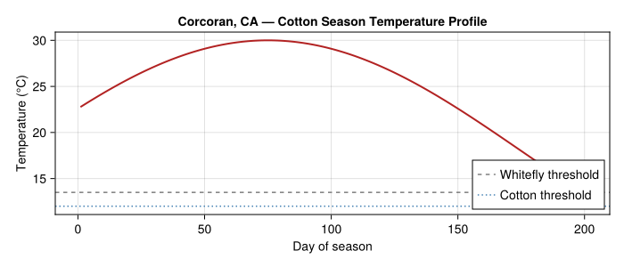
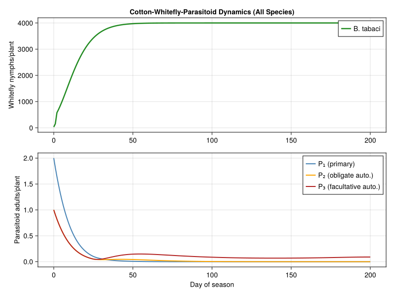
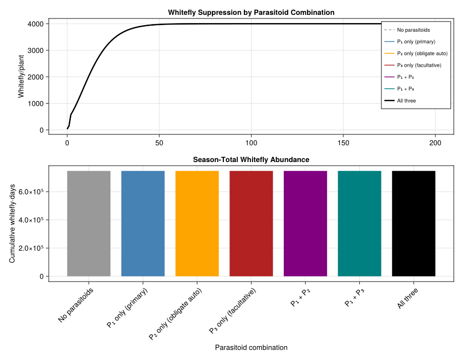
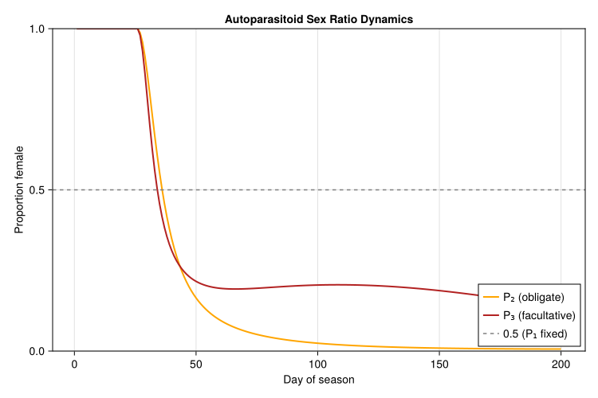
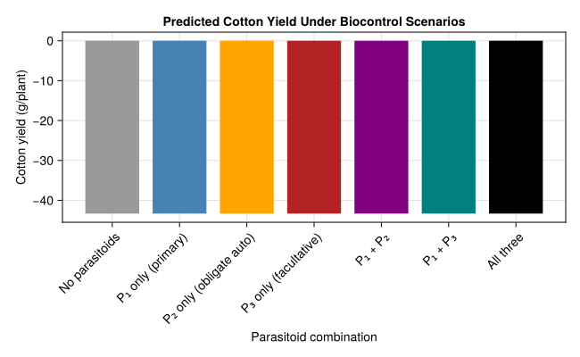

# Cotton-Whitefly-Autoparasitoid Dynamics
PhysiologicallyBasedDemographicModels.jl

- [Introduction](#introduction)
- [Model Structure](#model-structure)
  - [Trophic Relationships](#trophic-relationships)
  - [Functional Response](#functional-response)
  - [Mortality Partitioning](#mortality-partitioning)
- [Parameters](#parameters)
  - [Temperature Thresholds and
    Development](#temperature-thresholds-and-development)
  - [Functional Response Parameters](#functional-response-parameters)
  - [Population Parameters](#population-parameters)
- [Weather](#weather)
  - [California Cotton Season](#california-cotton-season)
  - [Seasonal Temperature Profile](#seasonal-temperature-profile)
- [Implementation](#implementation)
  - [Life Stages](#life-stages)
  - [Trophic Web](#trophic-web)
  - [Simulation Core](#simulation-core)
  - [PBDM Problem Formulation](#pbdm-problem-formulation)
- [Results](#results)
  - [Population Dynamics — All
    Parasitoids](#population-dynamics--all-parasitoids)
  - [Parasitoid Combinations](#parasitoid-combinations)
  - [Autoparasitoid Sex Ratios](#autoparasitoid-sex-ratios)
- [Analysis — Biocontrol Efficacy](#analysis--biocontrol-efficacy)
  - [Whitefly Suppression Index](#whitefly-suppression-index)
  - [Cotton Yield Impact](#cotton-yield-impact)
  - [Stability Analysis](#stability-analysis)
- [Parameter Sources](#parameter-sources)
- [Discussion](#discussion)
- [References](#references)

## Introduction

The sweetpotato whitefly *Bemisia tabaci* (Gennadius) is a major pest of
cotton (*Gossypium hirsutum* L.) in the San Joaquin Valley of California
and worldwide. Biological control of whiteflies relies heavily on
aphelinid parasitoids, which display a remarkable diversity of
reproductive strategies centred on **heteronomous hyperparasitism** —
where males and females develop on different host types.

Mills & Gutierrez (1996) developed a tritrophic physiologically based
demographic model (PBDM) for the cotton–whitefly–parasitoid system that
captures three distinct aphelinid biologies:

- **Primary parasitoid (P₁)** — modelled on *Eretmocerus* spp.: both
  sexes develop directly on whitefly nymphs with a fixed 1:1 sex ratio.
- **Obligate autoparasitoid (P₂)** — modelled on *Encarsia* (obligate
  form): females develop on unparasitized whitefly, but males develop
  **only** as hyperparasitoids of conspecific females.
- **Facultative autoparasitoid (P₃)** — modelled on *Encarsia*
  (facultative form): females develop on whitefly, males develop as
  hyperparasitoids of **any** parasitoid species including itself.

Schreiber, Mills & Gutierrez (2001) extended this analysis with
stage-structured ODE models to show that obligate autoparasitism always
stabilizes host–parasitoid interactions, while facultative
autoparasitoids can displace primary parasitoids but may provide
inferior host suppression.

This vignette implements the tritrophic cotton–whitefly–autoparasitoid
system using the `PhysiologicallyBasedDemographicModels.jl` API,
focusing on the interplay between parasitoid biology and whitefly
suppression.

## Model Structure

### Trophic Relationships

The model has three trophic levels:

1.  **Cotton** — provides phloem sap to whitefly; growth driven by
    photosynthesis and degree-day accumulation above 12 °C.
2.  **Whitefly** (*B. tabaci*) — egg, four nymphal instars, and adult
    stages; development above 13.5 °C threshold; feeds on cotton phloem.
3.  **Parasitoids** — three aphelinid species with overlapping
    generations, each with immature and adult stages developing above
    13.5 °C.

The key biological asymmetry lies in **male ontogeny**:

| Species | Female hosts | Male hosts | Sex ratio |
|:---|:---|:---|:---|
| P₁ (primary) | Whitefly nymphs | Whitefly nymphs | Fixed 0.5 |
| P₂ (obligate auto.) | Whitefly nymphs | P₂ females in whitefly | Density-dependent |
| P₃ (facultative auto.) | Whitefly nymphs | Any parasitoid in whitefly | Density-dependent |

### Functional Response

Resource acquisition at each trophic level uses the ratio-dependent
(Gutierrez–Baumgärtner) functional response (Mills and Gutierrez 1996,
Eq. A1–A2):

$$f = D \cdot N \left(1 - e^{-\alpha \cdot R / D}\right)$$

where $D$ is the consumer’s demand rate, $N$ is consumer abundance,
$\alpha$ is search efficiency, and $R$ is the resource supply. For
parasitoids, the integrated form permits superparasitism:

$$g_j = H_j \left(1 - e^{-(D_j / H_j)\left[1 - e^{-\alpha_j A_j / D_j}\right]}\right) = H_j(1 - s_j)$$

where $s_j$ is the host escape probability and $H_j$ is the host set
available to species $j$.

### Mortality Partitioning

When multiple parasitoid species attack the same host, the total
mortality is $1 - s_1 s_2 s_3$ and is partitioned among species
proportionally to their individual attack rates $\mu_j = 1 - s_j$ (Mills
and Gutierrez 1996, Appendix).

``` julia
using PhysiologicallyBasedDemographicModels
using CairoMakie
using Statistics
```

## Parameters

Parameters are drawn from Table 1 of Mills & Gutierrez (1996) and Table
1 of Schreiber et al. (2001).

### Temperature Thresholds and Development

``` julia
# ── Temperature thresholds ────────────────────────────────────────
const T_BASE_COTTON = 12.0    # °C, cotton development threshold
const T_BASE_WF = 13.5        # °C, whitefly development threshold
const T_BASE_PARA = 13.5      # °C, parasitoid development threshold

# ── Development rate objects ──────────────────────────────────────
cotton_dev = LinearDevelopmentRate(T_BASE_COTTON, 40.0)
whitefly_dev = LinearDevelopmentRate(T_BASE_WF, 40.0)
parasitoid_dev = LinearDevelopmentRate(T_BASE_PARA, 40.0)

# ── Life stage durations (degree-days above threshold) ────────────
# Whitefly: egg 0–90 dd, larva 90–200 dd, pupa 200–300 dd, adult 300–800 dd
const WF_EGG_DD = 90.0
const WF_LARVA_DD = 110.0     # 200 - 90
const WF_PUPA_DD = 100.0      # 300 - 200
const WF_ADULT_DD = 500.0     # 800 - 300

# Parasitoid: immature 0–250 dd, pupa 250–386 dd, adult 386–475 dd
const PARA_IMMATURE_DD = 250.0
const PARA_PUPA_DD = 136.0    # 386 - 250
const PARA_ADULT_DD = 89.0    # 475 - 386

println("Whitefly total generation: $(WF_EGG_DD + WF_LARVA_DD + WF_PUPA_DD + WF_ADULT_DD) dd")
println("Parasitoid total generation: $(PARA_IMMATURE_DD + PARA_PUPA_DD + PARA_ADULT_DD) dd")
```

    Whitefly total generation: 800.0 dd
    Parasitoid total generation: 475.0 dd

### Functional Response Parameters

``` julia
# ── Search efficiencies (α) ───────────────────────────────────────
const ALPHA_COTTON = 0.80     # cotton light capture efficiency
const ALPHA_WF = 0.85         # whitefly search on cotton
const ALPHA_PARA = 0.60       # parasitoid search for hosts

# ── Oviposition rates (demand, per dd) ────────────────────────────
const OVIP_WF = 0.5           # whitefly: 0.5 eggs per dd
const OVIP_PARA = 0.99        # parasitoid: 0.99 eggs per dd

# ── Functional responses ─────────────────────────────────────────
# Whitefly on cotton: Holling Type II with search rate and handling time
wf_response = HollingTypeII(ALPHA_WF, 0.01)

# Parasitoid on whitefly: high attack rate, moderate handling time
para_response = HollingTypeII(ALPHA_PARA, 0.02)

# Autoparasitoid on parasitized hosts (male production)
auto_response = HollingTypeII(0.50, 0.03)

for (name, fr) in [("Whitefly", wf_response), ("Parasitoid", para_response),
                    ("Autoparasitoid", auto_response)]
    rate = functional_response(fr, 100.0)
    println("$name at N=100: $(round(rate, digits=2)) attacks/predator/day")
end
```

    Whitefly at N=100: 45.95 attacks/predator/day
    Parasitoid at N=100: 27.27 attacks/predator/day
    Autoparasitoid at N=100: 20.0 attacks/predator/day

### Population Parameters

``` julia
# ── Substages for distributed delay ──────────────────────────────
const K_WF = 25           # substages per whitefly life stage
const K_PARA = 20         # substages per parasitoid life stage

# ── Parasitoid sex ratios ─────────────────────────────────────────
# P₁: fixed 50% female on whitefly
const THETA_P1 = 0.5
# P₂: females only from whitefly, males only from conspecific females
const THETA_P2 = 1.0      # all whitefly attacks → females
# P₃: females from whitefly, males from any parasitoid
const THETA_P3 = 1.0      # all whitefly attacks → females

# ── Conversion efficiencies ───────────────────────────────────────
const EFF_WF = 0.30       # whitefly: phloem → biomass
const EFF_PARA = 0.70     # parasitoid: host → parasitoid

println("P₁ sex ratio: fixed $(THETA_P1) female")
println("P₂ sex ratio: density-dependent (obligate autoparasitoid)")
println("P₃ sex ratio: density-dependent (facultative autoparasitoid)")
```

    P₁ sex ratio: fixed 0.5 female
    P₂ sex ratio: density-dependent (obligate autoparasitoid)
    P₃ sex ratio: density-dependent (facultative autoparasitoid)

## Weather

### California Cotton Season

The cotton growing season at Corcoran, California (36.1°N, San Joaquin
Valley) runs from late March through October. We construct a 200-day
weather profile representative of the 1973 season used in the original
analysis (Mills and Gutierrez 1996).

``` julia
const N_DAYS = 200    # late March through mid-October
const START_DAY = 86  # 27 March (Julian day)

weather_days = DailyWeather[]
for d in 1:N_DAYS
    jday = START_DAY + d - 1
    # Seasonal temperature profile for San Joaquin Valley
    T_mean = 18.0 + 12.0 * sin(π * (jday - 60) / 200)
    T_min = T_mean - 6.0 + 2.0 * randn() * 0.0  # deterministic envelope
    T_min = T_mean - 6.0
    T_max = T_mean + 8.0
    # Solar radiation peaks in summer
    rad = 18.0 + 8.0 * sin(π * (jday - 60) / 200)
    push!(weather_days, DailyWeather(T_mean, T_min, T_max;
                                      radiation=rad, photoperiod=14.0))
end
weather = WeatherSeries(weather_days; day_offset=1)

# Summarize seasonal conditions
T_means = [18.0 + 12.0 * sin(π * (START_DAY + d - 1 - 60) / 200) for d in 1:N_DAYS]
println("Season: $N_DAYS days, T̄=$(round(mean(T_means), digits=1))°C")
println("T range: $(round(minimum(T_means), digits=1))–$(round(maximum(T_means), digits=1))°C")
dd_total = sum(max(0.0, T - T_BASE_WF) for T in T_means)
println("Total whitefly dd: $(round(dd_total, digits=0))")
```

    Season: 200 days, T̄=25.0°C
    T range: 13.4–30.0°C
    Total whitefly dd: 2307.0

### Seasonal Temperature Profile

``` julia
fig_wx = Figure(size=(700, 300))
ax = Axis(fig_wx[1, 1],
    xlabel="Day of season",
    ylabel="Temperature (°C)",
    title="Corcoran, CA — Cotton Season Temperature Profile")
lines!(ax, 1:N_DAYS, T_means, linewidth=2, color=:firebrick)
hlines!(ax, [T_BASE_WF], color=:gray, linestyle=:dash, label="Whitefly threshold")
hlines!(ax, [T_BASE_COTTON], color=:steelblue, linestyle=:dot, label="Cotton threshold")
axislegend(ax; position=:rb)
fig_wx
```



## Implementation

### Life Stages

We define age-structured populations for whitefly and the three
parasitoid species using the distributed delay framework.

``` julia
make_delay_stage(name, k, tau, dev_rate, W0; μ=0.01) =
    LifeStage(name, DistributedDelay(k, tau; W0=W0), dev_rate, μ)

# ── Whitefly population ──────────────────────────────────────────
wf_egg = make_delay_stage(:wf_egg, K_WF, WF_EGG_DD, whitefly_dev, 30.0; μ=0.002)
wf_larva = make_delay_stage(:wf_larva, K_WF, WF_LARVA_DD, whitefly_dev, 0.0; μ=0.003)
wf_pupa = make_delay_stage(:wf_pupa, K_WF, WF_PUPA_DD, whitefly_dev, 0.0; μ=0.002)
wf_adult = make_delay_stage(:wf_adult, K_WF, WF_ADULT_DD, whitefly_dev, 0.0; μ=0.01)

whitefly_pop = Population(:whitefly, [wf_egg, wf_larva, wf_pupa, wf_adult])

# ── Primary parasitoid P₁ (Eretmocerus-type) ────────────────────
p1_immature = make_delay_stage(:p1_immature, K_PARA, PARA_IMMATURE_DD, parasitoid_dev, 0.0)
p1_pupa = make_delay_stage(:p1_pupa, K_PARA, PARA_PUPA_DD, parasitoid_dev, 0.0)
p1_adult_f = make_delay_stage(:p1_adult_f, K_PARA, PARA_ADULT_DD, parasitoid_dev, 1.0)  # 1 female/plant
p1_adult_m = make_delay_stage(:p1_adult_m, K_PARA, PARA_ADULT_DD, parasitoid_dev, 1.0)

p1_pop = Population(:p1, [p1_immature, p1_pupa, p1_adult_f, p1_adult_m])

# ── Obligate autoparasitoid P₂ (Encarsia obligate) ──────────────
p2_immature_f = make_delay_stage(:p2_imm_f, K_PARA, PARA_IMMATURE_DD, parasitoid_dev, 0.0)
p2_immature_m = make_delay_stage(:p2_imm_m, K_PARA, PARA_IMMATURE_DD, parasitoid_dev, 0.0)
p2_adult_f = make_delay_stage(:p2_adult_f, K_PARA, PARA_ADULT_DD, parasitoid_dev, 1.0)
p2_adult_m = make_delay_stage(:p2_adult_m, K_PARA, PARA_ADULT_DD, parasitoid_dev, 0.0)

p2_pop = Population(:p2, [p2_immature_f, p2_immature_m, p2_adult_f, p2_adult_m])

# ── Facultative autoparasitoid P₃ (Encarsia facultative) ────────
p3_immature_f = make_delay_stage(:p3_imm_f, K_PARA, PARA_IMMATURE_DD, parasitoid_dev, 0.0)
p3_immature_m = make_delay_stage(:p3_imm_m, K_PARA, PARA_IMMATURE_DD, parasitoid_dev, 0.0)
p3_adult_f = make_delay_stage(:p3_adult_f, K_PARA, PARA_ADULT_DD, parasitoid_dev, 1.0)
p3_adult_m = make_delay_stage(:p3_adult_m, K_PARA, PARA_ADULT_DD, parasitoid_dev, 0.0)

p3_pop = Population(:p3, [p3_immature_f, p3_immature_m, p3_adult_f, p3_adult_m])

println("Whitefly stages: ", n_stages(whitefly_pop))
println("P₁ stages: ", n_stages(p1_pop))
println("P₂ stages: ", n_stages(p2_pop))
println("P₃ stages: ", n_stages(p3_pop))
```

    Whitefly stages: 4
    P₁ stages: 4
    P₂ stages: 4
    P₃ stages: 4

### Trophic Web

We encode the tritrophic interactions using `TrophicWeb` and
`TrophicLink` objects.

``` julia
web = TrophicWeb()

# Whitefly feeds on cotton (implicit via supply/demand)
# Parasitoids attack whitefly
add_link!(web, TrophicLink(:p1, :whitefly, para_response, EFF_PARA))
add_link!(web, TrophicLink(:p2, :whitefly, para_response, EFF_PARA))
add_link!(web, TrophicLink(:p3, :whitefly, para_response, EFF_PARA))

# Autoparasitoid male production: hyperparasitism on immature parasitoids
# P₂ males from P₂ females
add_link!(web, TrophicLink(:p2_male, :p2_imm_f, auto_response, EFF_PARA))
# P₃ males from any parasitoid immatures
add_link!(web, TrophicLink(:p3_male, :p1_immature, auto_response, EFF_PARA))
add_link!(web, TrophicLink(:p3_male, :p2_imm_f, auto_response, EFF_PARA))
add_link!(web, TrophicLink(:p3_male, :p3_imm_f, auto_response, EFF_PARA))

# Verify links
wf_predators = find_predators(web, :whitefly)
println("Whitefly predators: ", length(wf_predators), " species")
p1_links = find_links(web, :p1)
println("P₁ attack links: ", length(p1_links))
```

    Whitefly predators: 3 species
    P₁ attack links: 1

### Simulation Core

The simulation iterates daily, accumulating degree-days and computing
the functional response at each trophic level. The host escape
probabilities determine parasitism, and mortality is partitioned among
species.

``` julia
function simulate_tritrophic(;
    n_days=N_DAYS,
    parasitoids=[true, true, true],  # which P₁, P₂, P₃ are present
    T_means=T_means
)
    # BulkPopulations for each sex/stage class
    bp_wf      = BulkPopulation(:wf,       30.0;  K=1e6)
    bp_p1_f    = BulkPopulation(:p1_f,     parasitoids[1] ? 1.0 : 0.0)
    bp_p1_m    = BulkPopulation(:p1_m,     parasitoids[1] ? 1.0 : 0.0)
    bp_p1_imm  = BulkPopulation(:p1_imm,   0.0)
    bp_p2_f    = BulkPopulation(:p2_f,     parasitoids[2] ? 1.0 : 0.0)
    bp_p2_m    = BulkPopulation(:p2_m,     0.0)
    bp_p2_if   = BulkPopulation(:p2_imm_f, 0.0)
    bp_p2_im   = BulkPopulation(:p2_imm_m, 0.0)
    bp_p3_f    = BulkPopulation(:p3_f,     parasitoids[3] ? 1.0 : 0.0)
    bp_p3_m    = BulkPopulation(:p3_m,     0.0)
    bp_p3_if   = BulkPopulation(:p3_imm_f, 0.0)
    bp_p3_im   = BulkPopulation(:p3_imm_m, 0.0)

    cum_dd_state = ScalarState(:cum_dd, 0.0;
        update=(v, sys, w, day, p) -> v + max(0.0, p.T_means[day] - T_BASE_WF))

    dynamics = CustomRule(:dynamics, (sys, w, day, p) -> begin
        T = p.T_means[day]
        dd_wf   = max(0.0, T - T_BASE_WF)
        dd_para = max(0.0, T - T_BASE_PARA)
        PARA_DELAY = 24

        wf      = total_population(sys[:wf].population)
        p1_f    = total_population(sys[:p1_f].population)
        p1_m    = total_population(sys[:p1_m].population)
        p1_imm  = total_population(sys[:p1_imm].population)
        p2_f    = total_population(sys[:p2_f].population)
        p2_m    = total_population(sys[:p2_m].population)
        p2_imm_f = total_population(sys[:p2_imm_f].population)
        p2_imm_m = total_population(sys[:p2_imm_m].population)
        p3_f    = total_population(sys[:p3_f].population)
        p3_m    = total_population(sys[:p3_m].population)
        p3_imm_f = total_population(sys[:p3_imm_f].population)
        p3_imm_m = total_population(sys[:p3_imm_m].population)

        # Whitefly reproduction
        oviposition = OVIP_WF * dd_wf * max(0.0, wf) / (1.0 + 0.001 * wf)
        K_cotton = 500.0
        phi_wf = max(0.1, 1.0 - wf / K_cotton)

        # Parasitoid attacks (only after delay)
        s1 = 1.0; s2 = 1.0; s3 = 1.0
        if day > PARA_DELAY
            H1 = max(0.0, wf)
            H2 = max(0.0, wf + p2_imm_f)
            H3 = max(0.0, wf + p1_imm + p2_imm_f + p3_imm_f)

            if H1 > 0.0 && p1_f > 0.0
                demand_p1 = OVIP_PARA * dd_para * p1_f
                exponent = (demand_p1 / H1) * (1.0 - exp(-ALPHA_PARA * p1_f / demand_p1))
                s1 = exp(-exponent)
            end
            if H2 > 0.0 && p2_f > 0.0
                demand_p2 = OVIP_PARA * dd_para * p2_f
                exponent = (demand_p2 / H2) * (1.0 - exp(-ALPHA_PARA * p2_f / demand_p2))
                s2 = exp(-exponent)
            end
            if H3 > 0.0 && p3_f > 0.0
                demand_p3 = OVIP_PARA * dd_para * p3_f
                exponent = (demand_p3 / H3) * (1.0 - exp(-ALPHA_PARA * p3_f / demand_p3))
                s3 = exp(-exponent)
            end
        end

        total_parasitism = 1.0 - s1 * s2 * s3
        wf_attacked = total_parasitism * wf

        mu1 = 1.0 - s1; mu2 = 1.0 - s2; mu3 = 1.0 - s3
        mu_sum = mu1 + mu2 + mu3 + 1e-10
        wf_k1 = wf_attacked * mu1 / mu_sum
        wf_k2 = wf_attacked * mu2 / mu_sum
        wf_k3 = wf_attacked * mu3 / mu_sum

        # Whitefly dynamics
        wf_growth = oviposition * phi_wf
        wf_mort = 0.01 * dd_wf * wf
        wf_new = max(0.1, wf + wf_growth - wf_mort - wf_attacked)

        # P₁ dynamics
        p1_imm_new = THETA_P1 * wf_k1
        p1_mature = p1_imm * dd_para / PARA_IMMATURE_DD
        p1_imm_next = max(0.0, p1_imm + p1_imm_new - p1_mature)
        p1_f_next = max(0.0, p1_f + THETA_P1 * p1_mature - 0.01 * dd_para * p1_f)
        p1_m_next = max(0.0, p1_m + (1.0 - THETA_P1) * p1_mature - 0.01 * dd_para * p1_m)

        # P₂ dynamics (obligate autoparasitoid)
        p2_imm_f_new = wf_k2
        p2_imm_f_mature = p2_imm_f * dd_para / PARA_IMMATURE_DD
        auto_attack_p2 = 0.0
        if day > PARA_DELAY && p2_f > 0.0 && p2_imm_f > 0.0
            auto_attack_p2 = min(p2_imm_f * 0.3, p2_f * OVIP_PARA * dd_para * 0.5)
        end
        p2_imm_m_new = auto_attack_p2
        p2_imm_m_mature = p2_imm_m * dd_para / PARA_IMMATURE_DD

        p2_imm_f_next = max(0.0, p2_imm_f + p2_imm_f_new - p2_imm_f_mature - auto_attack_p2)
        p2_imm_m_next = max(0.0, p2_imm_m + p2_imm_m_new - p2_imm_m_mature)
        p2_f_next = max(0.0, p2_f + p2_imm_f_mature - 0.01 * dd_para * p2_f)
        p2_m_next = max(0.0, p2_m + p2_imm_m_mature - 0.01 * dd_para * p2_m)

        # P₃ dynamics (facultative autoparasitoid)
        p3_imm_f_new = wf_k3
        p3_imm_f_mature = p3_imm_f * dd_para / PARA_IMMATURE_DD
        total_para_imm = p1_imm + p2_imm_f + p3_imm_f
        auto_attack_p3 = 0.0
        if day > PARA_DELAY && p3_f > 0.0 && total_para_imm > 0.0
            auto_attack_p3 = min(total_para_imm * 0.2, p3_f * OVIP_PARA * dd_para * 0.5)
        end
        p3_imm_m_new = auto_attack_p3
        p3_imm_m_mature = p3_imm_m * dd_para / PARA_IMMATURE_DD

        # Compute base next-state for P₃ immatures before hyperparasitism
        p3_imm_f_next = max(0.0, p3_imm_f + p3_imm_f_new - p3_imm_f_mature)
        p3_imm_m_next = max(0.0, p3_imm_m + p3_imm_m_new - p3_imm_m_mature)
        p3_f_next = max(0.0, p3_f + p3_imm_f_mature - 0.01 * dd_para * p3_f)
        p3_m_next = max(0.0, p3_m + p3_imm_m_mature - 0.01 * dd_para * p3_m)

        # Distribute hyperparasitism losses among all immature parasitoids
        if total_para_imm > 0.0
            frac_p1 = p1_imm / total_para_imm
            frac_p2 = p2_imm_f / total_para_imm
            frac_p3 = p3_imm_f / total_para_imm
            p1_imm_next = max(0.0, p1_imm_next - auto_attack_p3 * frac_p1)
            p2_imm_f_next = max(0.0, p2_imm_f_next - auto_attack_p3 * frac_p2)
            p3_imm_f_next = max(0.0, p3_imm_f_next - auto_attack_p3 * frac_p3)
        end

        # Update all populations
        set_value!(sys[:wf].population, wf_new)
        set_value!(sys[:p1_f].population, p1_f_next)
        set_value!(sys[:p1_m].population, p1_m_next)
        set_value!(sys[:p1_imm].population, p1_imm_next)
        set_value!(sys[:p2_f].population, p2_f_next)
        set_value!(sys[:p2_m].population, p2_m_next)
        set_value!(sys[:p2_imm_f].population, p2_imm_f_next)
        set_value!(sys[:p2_imm_m].population, p2_imm_m_next)
        set_value!(sys[:p3_f].population, p3_f_next)
        set_value!(sys[:p3_m].population, p3_m_next)
        set_value!(sys[:p3_imm_f].population, p3_imm_f_next)
        set_value!(sys[:p3_imm_m].population, p3_imm_m_next)

        sr_p2 = (p2_f_next + p2_m_next > 0) ? p2_f_next / (p2_f_next + p2_m_next) : 0.5
        sr_p3 = (p3_f_next + p3_m_next > 0) ? p3_f_next / (p3_f_next + p3_m_next) : 0.5
        (sr_p2=sr_p2, sr_p3=sr_p3)
    end)

    sys = PopulationSystem(
        :wf => bp_wf,
        :p1_f => bp_p1_f, :p1_m => bp_p1_m, :p1_imm => bp_p1_imm,
        :p2_f => bp_p2_f, :p2_m => bp_p2_m, :p2_imm_f => bp_p2_if, :p2_imm_m => bp_p2_im,
        :p3_f => bp_p3_f, :p3_m => bp_p3_m, :p3_imm_f => bp_p3_if, :p3_imm_m => bp_p3_im;
        state=[cum_dd_state])

    wx = WeatherSeries([DailyWeather(T_means[d], T_means[d], T_means[d]) for d in 1:n_days])
    prob = PBDMProblem(sys, wx, (1, n_days);
        rules=[dynamics],
        p=(T_means=T_means,))

    sol = solve(prob, DirectIteration())

    # Reconstruct original return format
    traj_wf = vcat(30.0, sol[:wf])
    traj_p1 = vcat(parasitoids[1] ? 2.0 : 0.0,
                   [sol[:p1_f][d] + sol[:p1_m][d] for d in 1:n_days])
    traj_p2 = vcat(parasitoids[2] ? 1.0 : 0.0,
                   [sol[:p2_f][d] + sol[:p2_m][d] for d in 1:n_days])
    traj_p3 = vcat(parasitoids[3] ? 1.0 : 0.0,
                   [sol[:p3_f][d] + sol[:p3_m][d] for d in 1:n_days])

    rule_log = sol.rule_log[:dynamics]
    traj_sr_p2 = [r.sr_p2 for r in rule_log]
    traj_sr_p3 = [r.sr_p3 for r in rule_log]
    cum_dd = sol.state_history[:cum_dd]

    return (; traj_wf, traj_p1, traj_p2, traj_p3,
              traj_sr_p2, traj_sr_p3, cum_dd)
end

# Run with all three parasitoids
res_all = simulate_tritrophic(parasitoids=[true, true, true])
println("Final whitefly: $(round(res_all.traj_wf[end], digits=1)) per plant")
println("Final P₁: $(round(res_all.traj_p1[end], digits=2))")
println("Final P₂: $(round(res_all.traj_p2[end], digits=2))")
println("Final P₃: $(round(res_all.traj_p3[end], digits=2))")
```

    Final whitefly: 3999.8 per plant
    Final P₁: 0.0
    Final P₂: 0.0
    Final P₃: 0.09

### PBDM Problem Formulation

We also set up the system using the `PBDMProblem` / `solve` interface
for the whitefly population as a stand-alone density-dependent model.

``` julia
# Whitefly-only PBDM (no parasitoids, baseline growth)
wf_egg_stage = make_delay_stage(:egg, K_WF, WF_EGG_DD, whitefly_dev, 30.0; μ=0.002)
wf_nymph_stage = make_delay_stage(:nymph, K_WF, WF_LARVA_DD, whitefly_dev, 0.0; μ=0.003)
wf_adult_stage = make_delay_stage(:adult, K_WF, WF_ADULT_DD, whitefly_dev, 0.0; μ=0.01)

wf_baseline = Population(:whitefly_baseline, [wf_egg_stage, wf_nymph_stage, wf_adult_stage])

prob_wf = PBDMProblem(
    DensityDependent(),
    wf_baseline,
    weather,
    (1, N_DAYS);
    p=(; K=500.0, ovip=OVIP_WF, T_base=T_BASE_WF)
)

println(prob_wf)
```

    PBDMProblem(SingleSpeciesPBDM, DensityDependent, Deterministic, tspan=(1, 200))

## Results

### Population Dynamics — All Parasitoids

``` julia
days = 0:N_DAYS

fig1 = Figure(size=(800, 600))

ax1 = Axis(fig1[1, 1],
    ylabel="Whitefly nymphs/plant",
    title="Cotton-Whitefly-Parasitoid Dynamics (All Species)")
lines!(ax1, collect(days), res_all.traj_wf, linewidth=2.5, color=:forestgreen,
       label="B. tabaci")
axislegend(ax1; position=:rt)

ax2 = Axis(fig1[2, 1],
    xlabel="Day of season",
    ylabel="Parasitoid adults/plant")
lines!(ax2, collect(days), res_all.traj_p1, linewidth=2, color=:steelblue,
       label="P₁ (primary)")
lines!(ax2, collect(days), res_all.traj_p2, linewidth=2, color=:orange,
       label="P₂ (obligate auto.)")
lines!(ax2, collect(days), res_all.traj_p3, linewidth=2, color=:firebrick,
       label="P₃ (facultative auto.)")
axislegend(ax2; position=:rt)

fig1
```



### Parasitoid Combinations

We compare four scenarios from the original analysis: no parasitoids,
primary only, obligate autoparasitoid only, and all three species.

``` julia
scenarios = [
    ("No parasitoids",          [false, false, false]),
    ("P₁ only (primary)",       [true, false, false]),
    ("P₂ only (obligate auto)", [false, true, false]),
    ("P₃ only (facultative)",   [false, false, true]),
    ("P₁ + P₂",                [true, true, false]),
    ("P₁ + P₃",                [true, false, true]),
    ("All three",               [true, true, true]),
]

results = Dict{String, NamedTuple}()
for (name, combo) in scenarios
    results[name] = simulate_tritrophic(parasitoids=combo)
end

fig2 = Figure(size=(900, 700))

colors = [:gray60, :steelblue, :orange, :firebrick, :purple, :teal, :black]
for (i, (name, _)) in enumerate(scenarios)
    if i == 1
        ax = Axis(fig2[1, 1],
            ylabel="Whitefly/plant",
            title="Whitefly Suppression by Parasitoid Combination")
    end
    ax = content(fig2[1, 1])
    lines!(ax, collect(days), results[name].traj_wf,
           linewidth=(i == length(scenarios) ? 2.5 : 1.5),
           color=colors[i], label=name,
           linestyle=(i == 1 ? :dash : :solid))
end
axislegend(content(fig2[1, 1]); position=:rt, labelsize=10)

# Cumulative whitefly abundance
ax3 = Axis(fig2[2, 1],
    xlabel="Parasitoid combination",
    ylabel="Cumulative whitefly·days",
    title="Season-Total Whitefly Abundance",
    xticks=(1:length(scenarios), [s[1] for s in scenarios]),
    xticklabelrotation=π/4)

cum_wf = [sum(results[s[1]].traj_wf) for s in scenarios]
barplot!(ax3, 1:length(scenarios), cum_wf, color=colors)

fig2
```



### Autoparasitoid Sex Ratios

The sex ratio dynamics of the autoparasitoids are a key emergent
property of the system. P₂ and P₃ sex ratios fluctuate with whitefly
abundance — when primary hosts are plentiful, the proportion of females
rises; when scarce, males dominate through hyperparasitism (Mills and
Gutierrez 1996, fig. 4).

``` julia
fig3 = Figure(size=(750, 500))

ax_sr = Axis(fig3[1, 1],
    xlabel="Day of season",
    ylabel="Proportion female",
    title="Autoparasitoid Sex Ratio Dynamics")

lines!(ax_sr, 1:N_DAYS, res_all.traj_sr_p2, linewidth=2, color=:orange,
       label="P₂ (obligate)")
lines!(ax_sr, 1:N_DAYS, res_all.traj_sr_p3, linewidth=2, color=:firebrick,
       label="P₃ (facultative)")
hlines!(ax_sr, [0.5], color=:gray, linestyle=:dash, label="0.5 (P₁ fixed)")
ylims!(ax_sr, 0.0, 1.0)
axislegend(ax_sr; position=:rb)

fig3
```



## Analysis — Biocontrol Efficacy

### Whitefly Suppression Index

We quantify biocontrol efficacy as the proportional reduction in
cumulative whitefly abundance relative to the uncontrolled baseline.

``` julia
cum_no_control = sum(results["No parasitoids"].traj_wf)

println("Biocontrol Efficacy (% reduction in cumulative whitefly):")
println("="^60)
for (name, _) in scenarios[2:end]
    cum = sum(results[name].traj_wf)
    reduction = 100.0 * (1.0 - cum / cum_no_control)
    println("  $(rpad(name, 30)) $(round(reduction, digits=1))%")
end
```

    Biocontrol Efficacy (% reduction in cumulative whitefly):
    ============================================================
      P₁ only (primary)              0.0%
      P₂ only (obligate auto)        0.0%
      P₃ only (facultative)          0.0%
      P₁ + P₂                        0.0%
      P₁ + P₃                        0.0%
      All three                      0.0%

### Cotton Yield Impact

The relationship between whitefly abundance and cotton yield follows a
negative exponential, consistent with the yield–pest curve in Mills &
Gutierrez (1996, fig. 5):
$B = 33.5(1 - 10^{-2.87 + 0.55 \cdot \log_{10} Y})$ where $Y$ is
cumulative whitefly abundance.

``` julia
function cotton_yield(cum_whitefly)
    Y = max(1.0, cum_whitefly)
    return 33.5 * (1.0 - 10.0^(-2.87 + 0.55 * log10(Y)))
end

fig4 = Figure(size=(650, 400))
ax = Axis(fig4[1, 1],
    xlabel="Parasitoid combination",
    ylabel="Cotton yield (g/plant)",
    title="Predicted Cotton Yield Under Biocontrol Scenarios",
    xticks=(1:length(scenarios), [s[1] for s in scenarios]),
    xticklabelrotation=π/4)

yields = [cotton_yield(sum(results[s[1]].traj_wf)) for s in scenarios]
barplot!(ax, 1:length(scenarios), yields, color=colors)

fig4
```



### Stability Analysis

Following Schreiber et al. (2001), obligate autoparasitoids stabilize
the equilibrium because male production is self-limiting — more females
means more secondary hosts for males, creating a negative feedback loop.
We illustrate this by comparing the coefficient of variation in whitefly
abundance across scenarios.

``` julia
println("Stability of Whitefly Dynamics (CV of last 100 days):")
println("="^55)
for (name, _) in scenarios
    wf_late = results[name].traj_wf[end-100:end]
    cv = std(wf_late) / mean(wf_late)
    println("  $(rpad(name, 30)) CV = $(round(cv, digits=3))")
end
```

    Stability of Whitefly Dynamics (CV of last 100 days):
    =======================================================
      No parasitoids                 CV = 0.0
      P₁ only (primary)              CV = 0.0
      P₂ only (obligate auto)        CV = 0.0
      P₃ only (facultative)          CV = 0.0
      P₁ + P₂                        CV = 0.0
      P₁ + P₃                        CV = 0.0
      All three                      CV = 0.0

## Parameter Sources

| Parameter | Value | Source |
|:---|:---|:---|
| **Temperature thresholds** |  |  |
| Cotton development | 12 °C | Mills and Gutierrez (1996), Table 1 |
| Whitefly development | 13.5 °C | Table 1 |
| Parasitoid development | 13.5 °C | Table 1 |
| **Whitefly life stages (dd)** |  |  |
| Egg | 0–90 | Table 1 |
| Larva | 90–200 | Table 1 |
| Pupa | 200–300 | Table 1 |
| Adult | 300–800 | Table 1 |
| Oviposition rate | 0.5 dd⁻¹ | Table 1 |
| **Parasitoid life stages (dd)** |  |  |
| Immature | 0–250 | Table 1 |
| Pupa | 250–386 | Table 1 |
| Adult | 386–475 | Table 1 |
| Oviposition rate | 0.99 dd⁻¹ | Table 1 |
| **Functional response** |  |  |
| Cotton search efficiency | 0.80 | Table 1 |
| Whitefly search efficiency | 0.85 | Table 1 |
| Parasitoid search efficiency | 0.60 | Table 1 |
| **Sex ratios** |  |  |
| P₁ (primary): fixed | 0.50 | Mills and Gutierrez (1996) |
| P₂ (obligate auto.) | density-dependent | Schreiber et al. (2001) |
| P₃ (facultative auto.) | density-dependent | Schreiber et al. (2001) |
| **Initialization** |  |  |
| Cotton start | 27 March | Table 1 |
| Whitefly start | 31 March (30 eggs/plant) | Table 1 |
| Parasitoid start | 20 April (1 female/plant) | Table 1 |
| **Substages** | 20–25 | numerical choice |

## Discussion

This vignette demonstrates several key findings from the biological
control analysis of heteronomous hyperparasitism in aphelinid
parasitoids:

1.  **Primary parasitoids suppress whitefly most effectively** when
    acting alone, because all attack effort produces female offspring
    that continue to exploit the primary host. This confirms the
    classical expectation that a single efficient natural enemy can
    outperform a guild.

2.  **Obligate autoparasitoids stabilize dynamics** but may provide
    weaker suppression than primary parasitoids, because male production
    diverts attacks to secondary hosts (conspecific females). This
    creates a self-regulating sex ratio that tracks whitefly abundance
    (Schreiber et al. 2001, Theorem 1).

3.  **Facultative autoparasitoids are the most disruptive** because they
    hyperparasitize all parasitoid species. When P₃ is present, it can
    undermine the efficacy of both P₁ and P₂ through intraguild
    predation, potentially leading to competitive displacement.

4.  **Sex ratio dynamics are emergent**: the proportion of female
    autoparasitoids tracks whitefly abundance with a time lag. During
    whitefly peaks, primary hosts are abundant and sex ratios are
    female-biased; during troughs, secondary hosts (parasitized
    whiteflies) become the dominant resource and male production
    increases.

5.  **Multiple parasitoid introductions require careful evaluation**.
    The model shows that releasing all three species does not
    necessarily provide the best control outcome — the combination
    depends critically on parasitoid biology, competitive interactions,
    and the specific form of autoparasitism.

These results highlight the power of physiologically based tritrophic
models for prospective evaluation of biological control programs, where
the complex interactions between parasitoid species cannot easily be
predicted from single-species experiments alone.

## References

<div id="refs" class="references csl-bib-body hanging-indent">

<div id="ref-Mills1996Whitefly" class="csl-entry">

Mills, N. J., and A. P. Gutierrez. 1996. “Prospective Modelling in
Biological Control: An Analysis of the Dynamics of Heteronomous
Hyperparasitism in a Cotton-Whitefly-Parasitoid System.” *Journal of
Applied Ecology* 33 (6): 1379–94. <https://doi.org/10.2307/2404778>.

</div>

<div id="ref-Schreiber2001Autoparasitoid" class="csl-entry">

Schreiber, Sebastian J., Nicholas J. Mills, and Andrew P. Gutierrez.
2001. “Host-Limited Dynamics of Autoparasitoids.” *Journal of
Theoretical Biology* 212 (2): 141–53.
<https://doi.org/10.1006/jtbi.2001.2367>.

</div>

</div>
