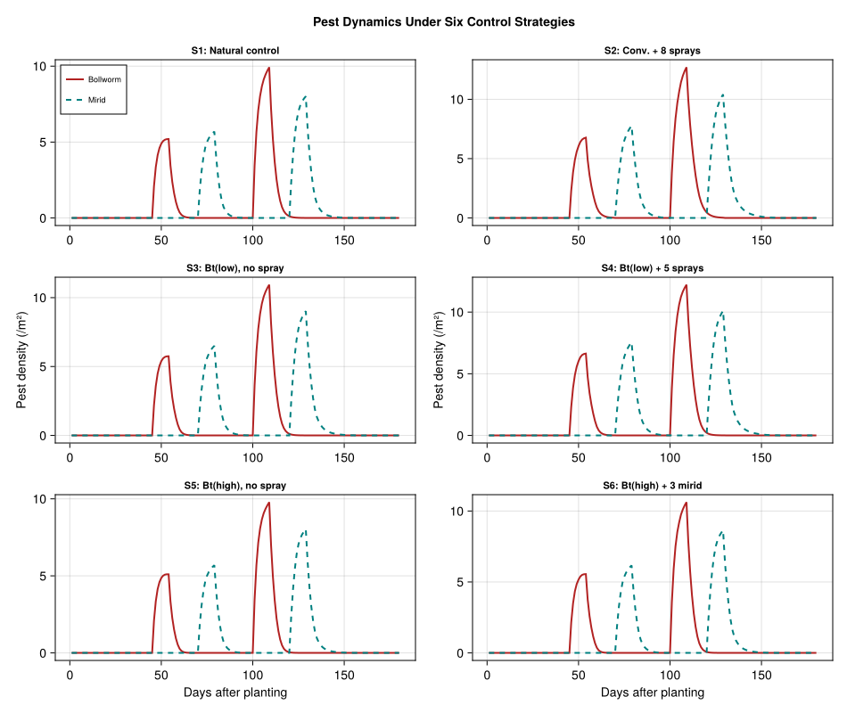
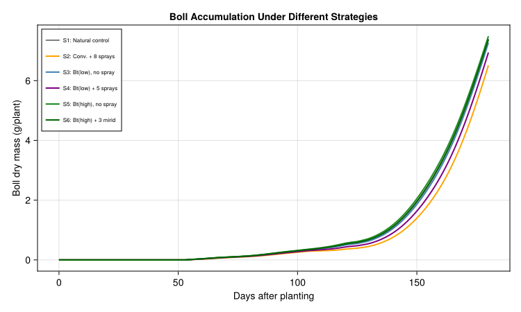
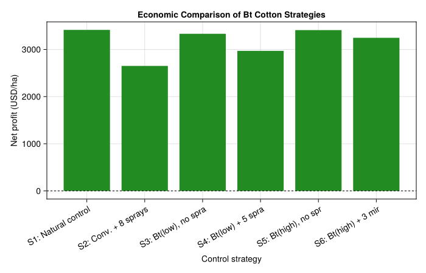
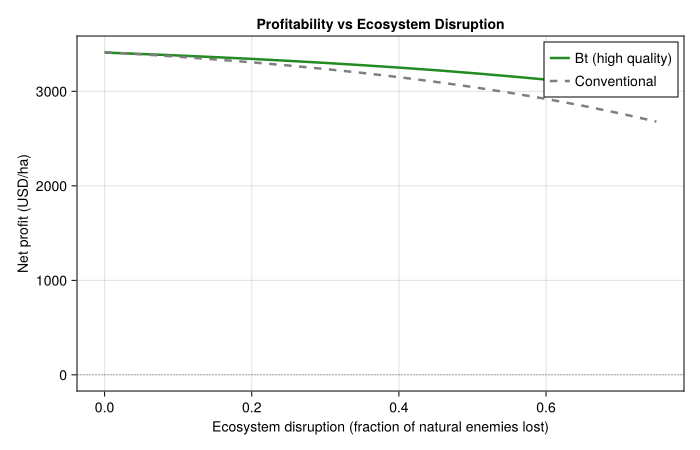

# Economics of Bt Cotton in China
PhysiologicallyBasedDemographicModels.jl

- [Introduction](#introduction)
- [Ecosystem Context](#ecosystem-context)
- [Parameters](#parameters)
  - [Cotton Plant Parameters](#cotton-plant-parameters)
  - [Bollworm Parameters](#bollworm-parameters)
  - [Mirid Parameters](#mirid-parameters)
  - [Economic Parameters](#economic-parameters)
- [Weather](#weather)
  - [Yangtze River Cotton Belt](#yangtze-river-cotton-belt)
- [Implementation](#implementation)
  - [Cotton Plant Population](#cotton-plant-population)
  - [Pest Populations](#pest-populations)
  - [Simulation Engine](#simulation-engine)
  - [Defining Control Strategies](#defining-control-strategies)
  - [Running the Simulation](#running-the-simulation)
- [Results](#results)
  - [Pest Dynamics](#pest-dynamics)
  - [Cotton Boll Accumulation](#cotton-boll-accumulation)
- [Analysis](#analysis)
  - [Economic Comparison: Bt vs
    Conventional](#economic-comparison-bt-vs-conventional)
  - [Profit Comparison Chart](#profit-comparison-chart)
  - [Benefit-Cost Analysis](#benefit-cost-analysis)
  - [Ecosystem Disruption
    Sensitivity](#ecosystem-disruption-sensitivity)
- [Discussion](#discussion)
- [Parameter Sources](#parameter-sources)
- [References](#references)

## Introduction

Transgenic Bt cotton (*Gossypium hirsutum* L.) expressing *Bacillus
thuringiensis* endotoxins was introduced in China in the late 1990s to
combat the cotton bollworm (*Helicoverpa armigera*). While Bt cotton
dramatically reduced bollworm damage and associated insecticide sprays,
large-scale adoption triggered an unforeseen ecological cascade: the
suppression of broad-spectrum insecticide use allowed secondary pests —
particularly mirids (*Apolygus lucorum* and *Adelphocoris* spp.) — to
proliferate across cotton and adjacent crops (Lu et al. 2010).

Pemsl et al. (2008) developed a bio-economic model combining a
physiologically based cotton growth model with stochastic partial
budgeting to assess the economics of Bt cotton under varying degrees of
ecosystem disruption in Shandong Province, China. Their key finding was
that the profitability of Bt varieties depends critically on the state
of the ecosystem: in an undisrupted ecosystem with intact natural enemy
populations, natural control alone is the most economical strategy,
while in highly disrupted ecosystems Bt cotton combined with moderate
insecticide use becomes profitable.

Pemsl et al. (2005) further documented that many Bt cotton farmers in
China continued using high levels of pesticides, partly because of
low-quality Bt seed with reduced toxin expression and partly because
secondary sucking pests (aphids, mirids, spider mites) required chemical
control that Bt toxins do not provide.

This vignette implements a simplified bio-economic model of the Bt
cotton system in China’s Yangtze River cotton belt using the
`PhysiologicallyBasedDemographicModels.jl` API, capturing cotton growth,
bollworm suppression by Bt, secondary mirid outbreaks, and the economic
comparison of alternative control strategies.

## Ecosystem Context

The cotton agro-ecosystem in China involves a trophic web with three
functional groups relevant to pest management (Gutierrez et al. 2006; Wu
and Guo 2005):

1.  **Cotton plant** — the resource base, modelled as leaf, stem, root,
    and boll (fruit) subunit populations linked via a metabolic pool.
2.  **Cotton bollworm** (*H. armigera*) — the primary target of Bt
    toxin, feeding on squares and bolls. Bt cotton reduces bollworm
    survival by 60–95% depending on toxin expression quality.
3.  **Mirids** (*Apolygus lucorum*) — secondary sucking pests that feed
    on squares and young bolls, causing bud abscission. Historically
    suppressed as bycatch of bollworm-targeted insecticide sprays, mirid
    populations surged after Bt adoption reduced spray frequency.

Natural enemies (parasitoids, predators) provide background control of
both pest groups but are themselves vulnerable to insecticide
disruption.

``` julia
using PhysiologicallyBasedDemographicModels
using CairoMakie
```

## Parameters

### Cotton Plant Parameters

Cotton plant growth follows the Gutierrez metabolic pool framework
(Gutierrez, Pizzamiglio, et al. 1991; Gutierrez, Santos, et al. 1991).
The base temperature for cotton development is 12 °C with an upper
threshold of 35 °C. Radiation use efficiency is 1.5 g DM per MJ
intercepted, with a light extinction coefficient of 0.49 and specific
leaf area of 200 cm²/g.

``` julia
# Cotton development: base 12°C, upper 35°C (Gutierrez et al. 2006)
const T_BASE_COTTON = 12.0
const T_UPPER_COTTON = 35.0

cotton_dev = LinearDevelopmentRate(T_BASE_COTTON, T_UPPER_COTTON)

# Canopy parameters (Gutierrez et al. 1991; Pemsl et al. 2008)
const SLA_COTTON = 200.0     # cm²/g → 0.02 m²/g
const EXTINCTION_COTTON = 0.49  # light extinction coefficient
const RUE_COTTON = 1.5       # g DM / MJ intercepted

function cotton_photosynthesis(leaf_mass_g, radiation_MJ; plants_per_m2=6.0)
    lai = leaf_mass_g * SLA_COTTON * 1e-4 * plants_per_m2  # m²/m²
    frac_intercepted = 1.0 - exp(-EXTINCTION_COTTON * lai)
    return frac_intercepted * radiation_MJ * RUE_COTTON / plants_per_m2
end
```

    cotton_photosynthesis (generic function with 1 method)

### Bollworm Parameters

Bollworm dynamics are temperature-driven with a base development
temperature of 10.5 °C. Each larva consumes ~0.3 g boll tissue per
degree-day, and Bt toxin reduces survival with an efficacy that depends
on seed quality (Pemsl et al. 2008; Gutierrez et al. 2006).

``` julia
# Bollworm (Helicoverpa armigera) parameters
const T_BASE_BOLLWORM = 10.5
const BOLLWORM_DD_GEN = 450.0  # degree-days per generation
const BOLLWORM_CONSUMPTION = 0.30  # g boll tissue / larva / dd
const BOLLWORM_FECUNDITY = 800.0   # eggs per female
const BOLLWORM_EGG_SURVIVAL = 0.15 # baseline egg-to-larva survival

# Bt toxin efficacy: fraction of bollworm larvae killed
const BT_EFFICACY_HIGH = 0.95   # high-quality Bt seed
const BT_EFFICACY_LOW = 0.60    # low-quality Bt seed (common in China)
const BT_EFFICACY_NONE = 0.0    # conventional (non-Bt) cotton
```

    0.0

### Mirid Parameters

Mirids (*Apolygus lucorum*) develop above a base of 10.0 °C and complete
a generation in approximately 350 degree-days. They cause bud and square
abscission at rates proportional to density. Historically controlled as
collateral of bollworm sprays, mirid populations increase when spraying
is reduced (Lu et al. 2010; Pemsl et al. 2005).

``` julia
# Mirid (Apolygus lucorum) parameters
const T_BASE_MIRID = 10.0
const MIRID_DD_GEN = 350.0    # degree-days per generation
const MIRID_FECUNDITY = 120.0 # eggs per female
const MIRID_DAMAGE_RATE = 0.02  # fraction of squares lost per mirid per dd
const MIRID_EGG_SURVIVAL = 0.20 # baseline egg-to-nymph survival

# Insecticide effect on mirids: fraction killed per spray
const SPRAY_MIRID_KILL = 0.70
# Natural enemy suppression of mirids (fraction killed per dd)
const NE_MIRID_SUPPRESSION = 0.008  # in intact ecosystem
const BW_INTRINSIC_GROWTH = 0.0025
const MIRID_INTRINSIC_GROWTH = 0.0020
const BW_BACKGROUND_MORTALITY = 0.0020
const MIRID_BACKGROUND_MORTALITY = 0.0025
const BW_STARVATION_MORTALITY = 0.0040
const MIRID_STARVATION_MORTALITY = 0.0030
const BW_HOST_SUPPORT = 18.0
const MIRID_BOLL_SUPPORT = 10.0
const MIRID_LEAF_SUPPORT = 2.5

bw_host_response = FraserGilbertResponse(0.85)
mirid_host_response = FraserGilbertResponse(0.70)
```

    FraserGilbertResponse{Float64}(0.7)

### Economic Parameters

Prices and costs are from farm surveys in Shandong Province (2002) and
the Yangtze cotton belt, converted to USD/ha (Pemsl et al. 2008, 2005).

``` julia
# Cotton prices and costs (USD/ha, Shandong 2002 conditions)
const COTTON_PRICE_USD_KG = 1.10      # seed cotton price
const POTENTIAL_YIELD_KG_HA = 3800.0  # attainable yield, no pest damage

# Seed costs
const SEED_COST_CONVENTIONAL = 45.0   # USD/ha
const SEED_COST_BT_LOW = 75.0        # low-quality Bt seed
const SEED_COST_BT_HIGH = 120.0      # high-quality Bt seed

# Insecticide costs per spray application
const SPRAY_COST = 18.0              # USD/ha (chemical + labour)
const SPRAY_HEALTH_COST = 18.0       # USD/ha (health externality ≈ chemical cost)

# Fixed costs (land, irrigation, fertilizer, labour excl. spraying)
const FIXED_COSTS = 650.0            # USD/ha
```

    650.0

## Weather

### Yangtze River Cotton Belt

We construct a 180-day growing season representative of the Yangtze
River cotton belt (30°N, e.g., Jingzhou, Hubei), from late April
(planting) through mid-October (harvest). The climate is subtropical
monsoon with hot, humid summers.

``` julia
const N_DAYS = 180  # late April to mid October
const PLANTING_DOY = 115  # April 25

weather_days = DailyWeather[]
for d in 1:N_DAYS
    doy = PLANTING_DOY + d - 1
    # Seasonal temperature pattern: subtropical monsoon
    T_base_seasonal = 18.0 + 12.0 * sin(π * (doy - 90) / 200)
    T_max = min(38.0, T_base_seasonal + 5.0 + 1.5 * sin(2π * d / 30))
    T_min = T_base_seasonal - 4.0 + 1.0 * sin(2π * d / 30)
    T_mean = (T_min + T_max) / 2.0

    # Solar radiation with monsoon cloudiness reduction in July-August
    rad_base = 18.0 + 6.0 * sin(π * (doy - 80) / 200)
    cloud_reduction = doy > 180 && doy < 240 ? 4.0 : 0.0
    rad = max(10.0, rad_base - cloud_reduction)

    push!(weather_days, DailyWeather(T_mean, T_min, T_max;
                                      radiation=rad, photoperiod=13.5))
end
weather = WeatherSeries(weather_days)

T_means = [(weather_days[d].T_min + weather_days[d].T_max) / 2.0 for d in 1:N_DAYS]
println("Season: $N_DAYS days, T̄=$(round(sum(T_means)/N_DAYS, digits=1))°C")
println("T range: $(round(minimum(T_means), digits=1))–$(round(maximum(T_means), digits=1))°C")
```

    Season: 180 days, T̄=26.7°C
    T range: 17.6–31.6°C

## Implementation

### Cotton Plant Population

Cotton organs are modelled as distributed-delay life stages: leaves,
stems, roots, and bolls (fruit). Initial masses represent seedlings at
emergence.

``` julia
const K_ORGAN = 25  # substages for numerical integration
const COTTON_LEAF_DD = 700.0
const COTTON_STEM_DD = 1400.0
const COTTON_ROOT_DD = 300.0
const COTTON_BOLL_DD = 800.0

bollworm_dev = LinearDevelopmentRate(T_BASE_BOLLWORM, 35.0)
mirid_dev = LinearDevelopmentRate(T_BASE_MIRID, 35.0)
make_stage(name, k, tau, dev_rate, W0; μ=0.01) =
    LifeStage(name, DistributedDelay(k, tau; W0=W0), dev_rate, μ)

cotton_leaf = make_stage(:leaf, K_ORGAN, COTTON_LEAF_DD, cotton_dev, 0.05; μ=0.001)
cotton_stem = make_stage(:stem, K_ORGAN, COTTON_STEM_DD, cotton_dev, 0.03; μ=0.001)
cotton_root = make_stage(:root, K_ORGAN, COTTON_ROOT_DD, cotton_dev, 0.02; μ=0.001)
cotton_boll = make_stage(:boll, K_ORGAN, COTTON_BOLL_DD, cotton_dev, 0.0; μ=0.0)

cotton_pop = Population(:cotton, [cotton_leaf, cotton_stem, cotton_root, cotton_boll])
```

    Population{Float64}(:cotton, LifeStage{Float64, LinearDevelopmentRate{Float64}}[LifeStage{Float64, LinearDevelopmentRate{Float64}}(:leaf, DistributedDelay{Float64}(25, 700.0, [0.05, 0.05, 0.05, 0.05, 0.05, 0.05, 0.05, 0.05, 0.05, 0.05  …  0.05, 0.05, 0.05, 0.05, 0.05, 0.05, 0.05, 0.05, 0.05, 0.05]), LinearDevelopmentRate{Float64}(12.0, 35.0), 0.001), LifeStage{Float64, LinearDevelopmentRate{Float64}}(:stem, DistributedDelay{Float64}(25, 1400.0, [0.03, 0.03, 0.03, 0.03, 0.03, 0.03, 0.03, 0.03, 0.03, 0.03  …  0.03, 0.03, 0.03, 0.03, 0.03, 0.03, 0.03, 0.03, 0.03, 0.03]), LinearDevelopmentRate{Float64}(12.0, 35.0), 0.001), LifeStage{Float64, LinearDevelopmentRate{Float64}}(:root, DistributedDelay{Float64}(25, 300.0, [0.02, 0.02, 0.02, 0.02, 0.02, 0.02, 0.02, 0.02, 0.02, 0.02  …  0.02, 0.02, 0.02, 0.02, 0.02, 0.02, 0.02, 0.02, 0.02, 0.02]), LinearDevelopmentRate{Float64}(12.0, 35.0), 0.001), LifeStage{Float64, LinearDevelopmentRate{Float64}}(:boll, DistributedDelay{Float64}(25, 800.0, [0.0, 0.0, 0.0, 0.0, 0.0, 0.0, 0.0, 0.0, 0.0, 0.0  …  0.0, 0.0, 0.0, 0.0, 0.0, 0.0, 0.0, 0.0, 0.0, 0.0]), LinearDevelopmentRate{Float64}(12.0, 35.0), 0.0)])

### Pest Populations

``` julia
# Bollworm: egg, larva, pupa, adult stages
bollworm_egg   = make_stage(:egg, 10, 60.0, bollworm_dev, 0.0; μ=0.01)
bollworm_larva = make_stage(:larva, 20, 220.0, bollworm_dev, 0.0; μ=0.015)
bollworm_pupa  = make_stage(:pupa, 15, 100.0, bollworm_dev, 0.0; μ=0.01)
bollworm_adult = make_stage(:adult, 10, 150.0, bollworm_dev, 0.0; μ=0.02)

bollworm_pop = Population(:bollworm, [bollworm_egg, bollworm_larva,
                            bollworm_pupa, bollworm_adult])

# Mirid: egg, nymph, adult
mirid_egg   = make_stage(:egg, 10, 80.0, mirid_dev, 0.0; μ=0.01)
mirid_nymph = make_stage(:nymph, 15, 170.0, mirid_dev, 0.0; μ=0.012)
mirid_adult = make_stage(:adult, 10, 100.0, mirid_dev, 0.0; μ=0.02)

mirid_pop = Population(:mirid, [mirid_egg, mirid_nymph, mirid_adult])
```

    Population{Float64}(:mirid, LifeStage{Float64, LinearDevelopmentRate{Float64}}[LifeStage{Float64, LinearDevelopmentRate{Float64}}(:egg, DistributedDelay{Float64}(10, 80.0, [0.0, 0.0, 0.0, 0.0, 0.0, 0.0, 0.0, 0.0, 0.0, 0.0]), LinearDevelopmentRate{Float64}(10.0, 35.0), 0.01), LifeStage{Float64, LinearDevelopmentRate{Float64}}(:nymph, DistributedDelay{Float64}(15, 170.0, [0.0, 0.0, 0.0, 0.0, 0.0, 0.0, 0.0, 0.0, 0.0, 0.0, 0.0, 0.0, 0.0, 0.0, 0.0]), LinearDevelopmentRate{Float64}(10.0, 35.0), 0.012), LifeStage{Float64, LinearDevelopmentRate{Float64}}(:adult, DistributedDelay{Float64}(10, 100.0, [0.0, 0.0, 0.0, 0.0, 0.0, 0.0, 0.0, 0.0, 0.0, 0.0]), LinearDevelopmentRate{Float64}(10.0, 35.0), 0.02)])

### Simulation Engine

The simulation uses the coupled population API with `PopulationSystem`,
typed rules, and events. Cotton organs are modeled as separate
single-stage populations (avoiding incorrect cascading between organs),
while pest life stages cascade naturally (egg → larva → pupa → adult).

``` julia
struct BtCottonScenario
    name::String
    bt_efficacy::Float64      # Bt toxin efficacy vs bollworm
    n_sprays_bollworm::Int    # sprays targeting bollworm
    n_sprays_mirid::Int       # sprays targeting mirids
    seed_cost::Float64        # USD/ha
    ecosystem_disruption::Float64  # 0.0 = intact, 0.75 = highly disrupted
end

function simulate_bt_cotton(scenario::BtCottonScenario, weather_days, n_days)
    # Cotton organs as separate single-stage Populations
    cot_leaf = Population(:cotton_leaf,
        [LifeStage(:leaf, DistributedDelay(K_ORGAN, COTTON_LEAF_DD; W0=0.05), cotton_dev, 0.001)])
    cot_stem = Population(:cotton_stem,
        [LifeStage(:stem, DistributedDelay(K_ORGAN, COTTON_STEM_DD; W0=0.03), cotton_dev, 0.001)])
    cot_root = Population(:cotton_root,
        [LifeStage(:root, DistributedDelay(K_ORGAN, COTTON_ROOT_DD; W0=0.02), cotton_dev, 0.001)])
    cot_boll = Population(:cotton_boll,
        [LifeStage(:boll, DistributedDelay(K_ORGAN, COTTON_BOLL_DD; W0=0.0), cotton_dev, 0.0)])

    # Pest populations with proper stage structure
    bw = Population(:bollworm, [
        make_stage(:egg,   10, 60.0,  bollworm_dev, 0.0; μ=0.01),
        make_stage(:larva, 20, 220.0, bollworm_dev, 0.0; μ=0.015),
        make_stage(:pupa,  15, 100.0, bollworm_dev, 0.0; μ=0.01),
        make_stage(:adult, 10, 150.0, bollworm_dev, 0.0; μ=0.02),
    ])
    mr = Population(:mirid, [
        make_stage(:egg,   10, 80.0,  mirid_dev, 0.0; μ=0.01),
        make_stage(:nymph, 15, 170.0, mirid_dev, 0.0; μ=0.012),
        make_stage(:adult, 10, 100.0, mirid_dev, 0.0; μ=0.02),
    ])

    sys = PopulationSystem(
        :leaf => PopulationComponent(cot_leaf; species=:cotton, type=:organ),
        :stem => PopulationComponent(cot_stem; species=:cotton, type=:organ),
        :root => PopulationComponent(cot_root; species=:cotton, type=:organ),
        :boll => PopulationComponent(cot_boll; species=:cotton, type=:organ),
        :bollworm => PopulationComponent(bw; species=:bollworm, type=:pest),
        :mirid => PopulationComponent(mr; species=:mirid, type=:pest),
    )

    # Closure state
    cum_dd_cotton = Ref(0.0)
    ne_factor = Ref(1.0 - scenario.ecosystem_disruption)

    # Spray schedules
    spray_days_bw = scenario.n_sprays_bollworm > 0 ?
        round.(Int, range(40, n_days - 20, length=scenario.n_sprays_bollworm)) : Int[]
    spray_days_mr = scenario.n_sprays_mirid > 0 ?
        round.(Int, range(50, n_days - 20, length=scenario.n_sprays_mirid)) : Int[]

    squaring_dd = 500.0
    boll_dd = 800.0

    # Rule 1: Cotton metabolic pool growth
    growth_rule = CustomRule(:cotton_growth, (sys, w, day, p) -> begin
        T = w.T_mean
        dd = max(0.0, min(T - T_BASE_COTTON, T_UPPER_COTTON - T_BASE_COTTON))
        cum_dd_cotton[] += dd

        W_L = total_population(sys[:leaf].population)
        W_S = total_population(sys[:stem].population)
        W_R = total_population(sys[:root].population)
        W_B = total_population(sys[:boll].population)

        supply = cotton_photosynthesis(W_L, w.radiation)
        total_mass = W_L + W_S + W_R + W_B
        maint = 0.015 * 2.0^((T - 15.0) / 10.0) * total_mass * dd / max(dd, 1e-6)
        net = max(0.0, supply - maint) * 0.72

        γ_L = 0.012; γ_S = 0.010; γ_R = 0.008; γ_B = 0.015
        d_L = γ_L * W_L * dd
        d_S = γ_S * W_S * dd
        d_R = γ_R * W_R * dd
        d_B = cum_dd_cotton[] >= boll_dd ? γ_B * max(W_B, 0.1) * dd : 0.0
        total_demand = d_L + d_S + d_R + d_B + 1e-10
        φ = min(1.0, net / total_demand)

        if cum_dd_cotton[] < squaring_dd
            inject!(sys, :leaf, 1, φ * d_L)
            inject!(sys, :stem, 1, φ * d_S)
            inject!(sys, :root, 1, φ * d_R)
        elseif cum_dd_cotton[] < boll_dd
            inject!(sys, :leaf, 1, φ * d_L * 0.7)
            inject!(sys, :stem, 1, φ * d_S)
            inject!(sys, :root, 1, φ * d_R * 0.5)
        else
            boll_alloc = min(net * 0.55, φ * d_B)
            inject!(sys, :boll, 1, boll_alloc)
            remaining = net - boll_alloc
            inject!(sys, :leaf, 1, min(remaining * 0.3, φ * d_L))
            inject!(sys, :stem, 1, min(remaining * 0.2, φ * d_S))
            inject!(sys, :root, 1, min(remaining * 0.1, φ * d_R))
        end

        # Leaf senescence after 1200 DD
        if cum_dd_cotton[] > 1200.0
            remove_fraction!(sys, :leaf, 1, 0.008 * dd / 20.0)
        end

        return (cum_dd=cum_dd_cotton[], net_photosynthesis=net)
    end)

    # Rule 2: Bollworm dynamics (immigration, Bt kill, NE kill, damage)
    bollworm_rule = CustomRule(:bollworm_dynamics, (sys, w, day, p) -> begin
        dd_bw = max(0.0, w.T_mean - T_BASE_BOLLWORM)

        bw_total = total_population(sys[:bollworm].population)
        bw_adults = delay_total(sys[:bollworm].population.stages[4].delay)
        W_B = total_population(sys[:boll].population)

        eggs_laid = 0.0
        damage = 0.0

        if cum_dd_cotton[] > squaring_dd && day > 30
            # Immigration pulses
            if day > 45 && day < 55
                inject!(sys, :bollworm, 4, 2.0)  # adults
            end
            if day > 100 && day < 110
                inject!(sys, :bollworm, 4, 3.0)
            end

            bw_total_now = total_population(sys[:bollworm].population)

            # Bt kill on larvae
            if scenario.bt_efficacy > 0 && dd_bw > 0
                bt_kill_frac = min(scenario.bt_efficacy * dd_bw * 0.01, 0.5)
                remove_fraction!(sys, :bollworm, 2, bt_kill_frac)
            end

            # Natural enemy kill
            ne_kill = ne_factor[] * 0.01 * dd_bw
            if ne_kill > 0
                for s in 1:4
                    remove_fraction!(sys, :bollworm, s, min(ne_kill, 0.5))
                end
            end

            # Spray kill
            if day in spray_days_bw
                for s in 1:4
                    remove_fraction!(sys, :bollworm, s, 0.80)
                end
            end

            # Reproduction: adults produce eggs
            bw_adults_now = delay_total(sys[:bollworm].population.stages[4].delay)
            if bw_adults_now > 0.01
                bw_host_capacity = BW_HOST_SUPPORT * max(W_B, 0.1)
                bw_demand = bw_adults_now
                bw_support = supply_demand_ratio(bw_host_response, bw_host_capacity, max(bw_demand, 1e-6))
                eggs_laid = bw_adults_now * BW_INTRINSIC_GROWTH * dd_bw * bw_support * 10.0
                inject!(sys, :bollworm, 1, eggs_laid)
            end

            # Damage: larvae consume bolls
            bw_larvae = delay_total(sys[:bollworm].population.stages[2].delay)
            if bw_larvae > 0.01 && W_B > 0.01
                damage = BOLLWORM_CONSUMPTION * bw_larvae * dd_bw * 1e-3
                damage_frac = min(damage / max(W_B, 1e-10), 0.5)
                remove_fraction!(sys, :boll, 1, damage_frac)
            end
        end

        return (eggs=eggs_laid, boll_damage=damage)
    end)

    # Rule 3: Mirid dynamics
    mirid_rule = CustomRule(:mirid_dynamics, (sys, w, day, p) -> begin
        dd_mr = max(0.0, w.T_mean - T_BASE_MIRID)
        W_B = total_population(sys[:boll].population)
        W_L = total_population(sys[:leaf].population)
        mr_total = total_population(sys[:mirid].population)

        eggs_laid = 0.0
        damage = 0.0

        if cum_dd_cotton[] > 600.0
            # Immigration
            if day > 70 && day < 80
                inject!(sys, :mirid, 3, 1.5)  # adults
            end
            if day > 120 && day < 130
                inject!(sys, :mirid, 3, 2.0)
            end

            # Natural enemy kill
            ne_kill_mr = ne_factor[] * NE_MIRID_SUPPRESSION * dd_mr
            if ne_kill_mr > 0
                for s in 1:3
                    remove_fraction!(sys, :mirid, s, min(ne_kill_mr, 0.5))
                end
            end

            # Spray kill
            if day in spray_days_mr
                for s in 1:3
                    remove_fraction!(sys, :mirid, s, SPRAY_MIRID_KILL)
                end
            end

            # Reproduction: adults produce eggs
            mr_adults = delay_total(sys[:mirid].population.stages[3].delay)
            if mr_adults > 0.01
                mr_host_cap = MIRID_BOLL_SUPPORT * max(W_B, 0.1) + MIRID_LEAF_SUPPORT * max(W_L, 0.1)
                mr_support = supply_demand_ratio(mirid_host_response, mr_host_cap, max(mr_adults, 1e-6))
                eggs_laid = mr_adults * MIRID_INTRINSIC_GROWTH * dd_mr * mr_support * 10.0
                inject!(sys, :mirid, 1, eggs_laid)
            end

            # Damage: mirid feeding on squares/young bolls
            mr_nymph_adult = delay_total(sys[:mirid].population.stages[2].delay) +
                             delay_total(sys[:mirid].population.stages[3].delay)
            if mr_nymph_adult > 0.01 && W_B > 0.01
                damage = MIRID_DAMAGE_RATE * mr_nymph_adult * dd_mr * W_B * 0.01
                damage_frac = min(damage / max(W_B, 1e-10), 0.5)
                remove_fraction!(sys, :boll, 1, damage_frac)
            end
        end

        return (eggs=eggs_laid, boll_damage=damage)
    end)

    # Rule 4: Natural enemy dynamics
    ne_rule = CustomRule(:natural_enemies, (sys, w, day, p) -> begin
        sprayed = (day in spray_days_bw) || (day in spray_days_mr)
        ne_spray_effect = sprayed ? 0.05 : 0.0
        ne_factor[] = max(0.0, ne_factor[] - ne_spray_effect)
        ne_factor[] = min(ne_factor[] + 0.002, 1.0 - scenario.ecosystem_disruption)
        return (ne_factor=ne_factor[], sprayed=sprayed)
    end)

    rules = AbstractInteractionRule[growth_rule, bollworm_rule, mirid_rule, ne_rule]

    observables = [
        PhysiologicallyBasedDemographicModels.Observable(:cum_dd, (sys, w, day, p) -> cum_dd_cotton[]),
        PhysiologicallyBasedDemographicModels.Observable(:ne_factor, (sys, w, day, p) -> ne_factor[]),
    ]

    prob = PBDMProblem(
        MultiSpeciesPBDMNew(), sys, weather, (1, n_days);
        rules=rules, events=AbstractScheduledEvent[], observables=observables
    )
    sol = solve(prob, DirectIteration())

    # Extract in legacy format
    traj_leaf = zeros(n_days + 1); traj_leaf[1] = 0.05
    traj_boll = zeros(n_days + 1); traj_boll[1] = 0.0
    traj_bw = zeros(n_days)
    traj_mr = zeros(n_days)
    traj_dd = zeros(n_days)

    for d in 1:n_days
        traj_leaf[d+1] = sol.component_totals[:leaf][d]
        traj_boll[d+1] = sol.component_totals[:boll][d]
        traj_bw[d] = sol.component_totals[:bollworm][d]
        traj_mr[d] = sol.component_totals[:mirid][d]
        traj_dd[d] = sol.observables[:cum_dd][d]
    end

    yield_kg_ha = traj_boll[end]
    return (; traj_leaf, traj_boll, traj_bw, traj_mr, traj_dd,
              yield_kg_ha, final_boll=traj_boll[end])
end
```

    simulate_bt_cotton (generic function with 1 method)

### Defining Control Strategies

We compare six control strategies spanning the range from natural
control through intensive chemical + Bt management, reflecting the
scenarios in Pemsl et al. (2008):

``` julia
strategies = [
    # S1: Natural control only (intact ecosystem baseline)
    BtCottonScenario("S1: Natural control",
        BT_EFFICACY_NONE, 0, 0, SEED_COST_CONVENTIONAL, 0.0),
    # S2: Conventional + moderate sprays (disrupted ecosystem)
    BtCottonScenario("S2: Conv. + 8 sprays",
        BT_EFFICACY_NONE, 5, 3, SEED_COST_CONVENTIONAL, 0.50),
    # S3: Low-quality Bt, no sprays
    BtCottonScenario("S3: Bt(low), no spray",
        BT_EFFICACY_LOW, 0, 0, SEED_COST_BT_LOW, 0.25),
    # S4: Low-quality Bt + moderate sprays
    BtCottonScenario("S4: Bt(low) + 5 sprays",
        BT_EFFICACY_LOW, 3, 2, SEED_COST_BT_LOW, 0.50),
    # S5: High-quality Bt, no sprays
    BtCottonScenario("S5: Bt(high), no spray",
        BT_EFFICACY_HIGH, 0, 0, SEED_COST_BT_HIGH, 0.0),
    # S6: High-quality Bt + targeted mirid sprays
    BtCottonScenario("S6: Bt(high) + 3 mirid",
        BT_EFFICACY_HIGH, 0, 3, SEED_COST_BT_HIGH, 0.15),
]
```

    6-element Vector{BtCottonScenario}:
     BtCottonScenario("S1: Natural control", 0.0, 0, 0, 45.0, 0.0)
     BtCottonScenario("S2: Conv. + 8 sprays", 0.0, 5, 3, 45.0, 0.5)
     BtCottonScenario("S3: Bt(low), no spray", 0.6, 0, 0, 75.0, 0.25)
     BtCottonScenario("S4: Bt(low) + 5 sprays", 0.6, 3, 2, 75.0, 0.5)
     BtCottonScenario("S5: Bt(high), no spray", 0.95, 0, 0, 120.0, 0.0)
     BtCottonScenario("S6: Bt(high) + 3 mirid", 0.95, 0, 3, 120.0, 0.15)

### Running the Simulation

``` julia
scenarios = Dict(s.name => s for s in strategies)
results = run_scenarios(s -> simulate_bt_cotton(s, weather_days, N_DAYS),
                        scenarios)

yield_scale = POTENTIAL_YIELD_KG_HA /
              max(maximum(r.final_boll for r in values(results)), 1e-6)
results = Dict(name => merge(r, (; yield_kg_ha = r.final_boll * yield_scale))
               for (name, r) in results)

summary_rows = compare_metrics(results,
    [:yield_kg_ha   => r -> r.yield_kg_ha,
     :peak_bollworm => r -> maximum(r.traj_bw),
     :peak_mirid    => r -> maximum(r.traj_mr)])

for s in strategies
    row = first(filter(r -> r.scenario == s.name, summary_rows))
    println("$(row.scenario): yield=$(round(row.yield_kg_ha, digits=0)) kg/ha, " *
            "peak bollworm=$(round(row.peak_bollworm, digits=1))/m², " *
            "peak mirid=$(round(row.peak_mirid, digits=1))/m²")
end
```

    S1: Natural control: yield=3736.0 kg/ha, peak bollworm=9.9/m², peak mirid=8.0/m²
    S2: Conv. + 8 sprays: yield=3303.0 kg/ha, peak bollworm=12.7/m², peak mirid=10.4/m²
    S3: Bt(low), no spray: yield=3688.0 kg/ha, peak bollworm=10.9/m², peak mirid=9.0/m²
    S4: Bt(low) + 5 sprays: yield=3523.0 kg/ha, peak bollworm=12.2/m², peak mirid=10.1/m²
    S5: Bt(high), no spray: yield=3800.0 kg/ha, peak bollworm=9.8/m², peak mirid=8.0/m²
    S6: Bt(high) + 3 mirid: yield=3750.0 kg/ha, peak bollworm=10.6/m², peak mirid=8.6/m²

## Results

### Pest Dynamics

``` julia
fig = Figure(size=(950, 800))

for (i, s) in enumerate(strategies)
    r = results[s.name]
    row = div(i - 1, 2) + 1
    col = mod(i - 1, 2) + 1

    ax = Axis(fig[row, col],
        title=s.name, titlesize=11,
        ylabel=row == 2 ? "Pest density (/m²)" : "",
        xlabel=row == 3 ? "Days after planting" : "")

    lines!(ax, 1:N_DAYS, r.traj_bw, label="Bollworm",
           linewidth=2, color=:firebrick)
    lines!(ax, 1:N_DAYS, r.traj_mr, label="Mirid",
           linewidth=2, color=:teal, linestyle=:dash)

    if i == 1
        axislegend(ax; position=:lt, labelsize=9)
    end
end

Label(fig[0, :], "Pest Dynamics Under Six Control Strategies",
      fontsize=14, font=:bold)
fig
```



### Cotton Boll Accumulation

``` julia
fig2 = Figure(size=(750, 450))
ax = Axis(fig2[1, 1],
    xlabel="Days after planting",
    ylabel="Boll dry mass (g/plant)",
    title="Boll Accumulation Under Different Strategies")

colors = [:gray50, :orange, :steelblue, :purple, :forestgreen, :darkgreen]
for (i, s) in enumerate(strategies)
    r = results[s.name]
    lines!(ax, 0:N_DAYS, r.traj_boll, label=s.name,
           linewidth=2, color=colors[i])
end
axislegend(ax; position=:lt, labelsize=8)
fig2
```



## Analysis

### Economic Comparison: Bt vs Conventional

We compute net profit for each strategy using the `CropRevenue`,
`InputCostBundle`, and `net_profit` functions from the PBDM economics
module.

``` julia
cotton_revenue = CropRevenue(COTTON_PRICE_USD_KG, :kg_ha)

println("=" ^ 78)
println(rpad("Strategy", 30), rpad("Yield", 10), rpad("Gross Rev", 12),
        rpad("Costs", 10), "Net Profit")
println("=" ^ 78)

profits = Float64[]
for s in strategies
    r = results[s.name]
    yield_kg = r.yield_kg_ha

    # Build cost bundle
    n_total_sprays = s.n_sprays_bollworm + s.n_sprays_mirid
    spray_total = n_total_sprays * (SPRAY_COST + SPRAY_HEALTH_COST)

    costs = InputCostBundle(;
        seed=s.seed_cost,
        insecticide=spray_total,
        fixed=FIXED_COSTS
    )

    gross = revenue(cotton_revenue, yield_kg)
    tc = total_cost(costs)
    np = net_profit(cotton_revenue, yield_kg, costs)
    push!(profits, np)

    println(rpad(s.name, 30),
            rpad("$(round(yield_kg, digits=0))", 10),
            rpad("\$$(round(gross, digits=0))", 12),
            rpad("\$$(round(tc, digits=0))", 10),
            "\$$(round(np, digits=0))")
end
println("=" ^ 78)
```

    ==============================================================================
    Strategy                      Yield     Gross Rev   Costs     Net Profit
    ==============================================================================
    S1: Natural control           3736.0    $4110.0     $695.0    $3415.0
    S2: Conv. + 8 sprays          3303.0    $3634.0     $983.0    $2651.0
    S3: Bt(low), no spray         3688.0    $4057.0     $725.0    $3332.0
    S4: Bt(low) + 5 sprays        3523.0    $3875.0     $905.0    $2970.0
    S5: Bt(high), no spray        3800.0    $4180.0     $770.0    $3410.0
    S6: Bt(high) + 3 mirid        3750.0    $4125.0     $878.0    $3247.0
    ==============================================================================

### Profit Comparison Chart

``` julia
fig3 = Figure(size=(700, 450))
ax = Axis(fig3[1, 1],
    xlabel="Control strategy",
    ylabel="Net profit (USD/ha)",
    title="Economic Comparison of Bt Cotton Strategies",
    xticks=(1:6, [s.name[1:min(end,20)] for s in strategies]),
    xticklabelrotation=π/6)

colors_bar = [p >= 0 ? :forestgreen : :firebrick for p in profits]
barplot!(ax, 1:6, profits, color=colors_bar)
hlines!(ax, [0.0], color=:black, linewidth=1, linestyle=:dash)
fig3
```



### Benefit-Cost Analysis

``` julia
println("\nBenefit-Cost Ratios (relative to S1 natural control baseline):")
println("-" ^ 60)

baseline_profit = profits[1]
for (i, s) in enumerate(strategies)
    if i == 1
        println("$(s.name): baseline")
        continue
    end
    r = results[s.name]
    n_total = s.n_sprays_bollworm + s.n_sprays_mirid
    added_cost = (s.seed_cost - SEED_COST_CONVENTIONAL) +
                 n_total * (SPRAY_COST + SPRAY_HEALTH_COST)
    added_benefit = profits[i] - baseline_profit

    bcr = added_cost > 0 ? benefit_cost_ratio(max(0, added_benefit), added_cost) : Inf
    println("$(s.name): B/C = $(round(bcr, digits=2)), " *
            "marginal profit = \$$(round(added_benefit, digits=0))/ha")
end
```


    Benefit-Cost Ratios (relative to S1 natural control baseline):
    ------------------------------------------------------------
    S1: Natural control: baseline
    S2: Conv. + 8 sprays: B/C = 0.0, marginal profit = $-764.0/ha
    S3: Bt(low), no spray: B/C = 0.0, marginal profit = $-83.0/ha
    S4: Bt(low) + 5 sprays: B/C = 0.0, marginal profit = $-445.0/ha
    S5: Bt(high), no spray: B/C = 0.0, marginal profit = $-5.0/ha
    S6: Bt(high) + 3 mirid: B/C = 0.0, marginal profit = $-168.0/ha

### Ecosystem Disruption Sensitivity

We sweep ecosystem disruption from 0% (intact natural enemies) to 75%
(heavily degraded) for the high-quality Bt strategy to show how
profitability depends on ecosystem state.

``` julia
disruption_levels = 0.0:0.05:0.75
yields_bt_high = Float64[]
yields_conv = Float64[]

for disr in disruption_levels
    # Bt high, no sprays
    s_bt = BtCottonScenario("Bt(high)", BT_EFFICACY_HIGH, 0, 0,
                             SEED_COST_BT_HIGH, disr)
    r_bt = simulate_bt_cotton(s_bt, weather_days, N_DAYS)
    push!(yields_bt_high, r_bt.final_boll * yield_scale)

    # Conventional, no sprays
    s_cv = BtCottonScenario("Conv.", BT_EFFICACY_NONE, 0, 0,
                             SEED_COST_CONVENTIONAL, disr)
    r_cv = simulate_bt_cotton(s_cv, weather_days, N_DAYS)
    push!(yields_conv, r_cv.final_boll * yield_scale)
end

# Compute net profits
profit_bt = [y * COTTON_PRICE_USD_KG - FIXED_COSTS - SEED_COST_BT_HIGH
             for y in yields_bt_high]
profit_cv = [y * COTTON_PRICE_USD_KG - FIXED_COSTS - SEED_COST_CONVENTIONAL
             for y in yields_conv]

fig4 = Figure(size=(700, 450))
ax = Axis(fig4[1, 1],
    xlabel="Ecosystem disruption (fraction of natural enemies lost)",
    ylabel="Net profit (USD/ha)",
    title="Profitability vs Ecosystem Disruption")

lines!(ax, collect(disruption_levels), profit_bt,
       label="Bt (high quality)", linewidth=2.5, color=:forestgreen)
lines!(ax, collect(disruption_levels), profit_cv,
       label="Conventional", linewidth=2.5, color=:gray50, linestyle=:dash)
hlines!(ax, [0.0], color=:black, linewidth=0.5, linestyle=:dot)
axislegend(ax; position=:rt)
fig4
```



## Discussion

1.  **Bt cotton suppresses bollworm effectively** but does not control
    secondary pests. When bollworm-targeted insecticide sprays are
    reduced, mirid populations surge — consistent with the empirical
    findings of Lu et al. (2010) who documented mirid outbreaks across
    multiple crops correlated with Bt cotton adoption in northern China.

2.  **Ecosystem state drives profitability**. In an intact ecosystem
    (disruption ≈ 0), natural enemies alone provide adequate pest
    control and the technology premium for Bt seed may not be recovered.
    In a disrupted ecosystem, Bt cotton combined with targeted mirid
    sprays (strategy S6) provides the best economic returns, consistent
    with Pemsl et al. (2008) who found that “the profitability of damage
    control measures increases with the severity of ecosystem
    disturbance.”

3.  **Low-quality Bt seed underperforms**. Strategies S3 and S4 using
    low-efficacy Bt seed (60% bollworm mortality) yield less than
    high-quality Bt (95%), explaining why many Chinese farmers using
    low-priced, low-quality Bt seed continued spraying intensively
    (Pemsl et al. 2005).

4.  **The pesticide treadmill persists**. Each insecticide spray reduces
    natural enemy populations, increasing dependence on further chemical
    control. Strategy S2 (conventional + 8 sprays) incurs high chemical
    and health costs that erode profitability, illustrating the
    treadmill phenomenon first described for California cotton
    (Gutierrez, Pizzamiglio, et al. 1991).

5.  **Integrated strategies perform best**. Strategy S6 (high-quality
    Bt + 3 targeted mirid sprays) combines biotechnology with minimal,
    targeted chemical use — preserving most natural enemy function while
    addressing both bollworm and mirid damage. This bio-rational
    approach aligns with IPM principles and shows the highest net profit
    under moderate ecosystem disruption.

## Parameter Sources

| Parameter | Value | Source |
|:---|:---|:---|
| **Cotton development** |  |  |
| Base temperature | 12 °C | Gutierrez, Santos, et al. (1991) |
| Upper temperature | 35 °C | Gutierrez, Santos, et al. (1991) |
| Specific leaf area | 200 cm²/g | Gutierrez, Pizzamiglio, et al. (1991) |
| Light extinction | 0.49 | Gutierrez, Pizzamiglio, et al. (1991) |
| Radiation-use efficiency | 1.5 g/MJ | Gutierrez, Pizzamiglio, et al. (1991) |
| Squaring onset | 500 DD | Gutierrez et al. (2006) |
| Boll formation | 800 DD | Gutierrez et al. (2006) |
| **Bollworm** |  |  |
| Base temperature | 10.5 °C | Gutierrez et al. (2006) |
| DD per generation | 450 | Gutierrez et al. (2006) |
| Consumption rate | 0.30 g/larva/dd | Pemsl et al. (2008) |
| Bt efficacy (high) | 95% | Gutierrez et al. (2006) |
| Bt efficacy (low) | 60% | Pemsl et al. (2005) |
| **Mirid** |  |  |
| Base temperature | 10.0 °C | Lu et al. (2010) |
| DD per generation | 350 | Lu et al. (2010) |
| Damage rate | 0.02 frac/mirid/dd | Pemsl et al. (2005) |
| **Economics** |  |  |
| Cotton price | 1.10 USD/kg | Pemsl et al. (2008) |
| Spray cost | 18 USD/ha | Pemsl et al. (2008) |
| Spray health cost | 18 USD/ha | Pemsl et al. (2008) |
| Bt seed premium (low) | 75 USD/ha | Pemsl et al. (2005) |
| Bt seed premium (high) | 120 USD/ha | Pemsl et al. (2008) |

## References

<div id="refs" class="references csl-bib-body hanging-indent">

<div id="ref-gutierrez1991cotton" class="csl-entry">

Gutierrez, A. P., M. A. Pizzamiglio, W. J. dos Santos, R. Tennyson, and
A. M. Villacorta. 1991. “Modelling the Interaction of Cotton and the
Cotton Boll Weevil. II. Boll Weevil (<span class="nocase">Anthonomus
grandis</span>) in Brazil.” *Journal of Applied Ecology* 28 (2):
398–418. <https://doi.org/10.2307/2404558>.

</div>

<div id="ref-gutierrez1991varieties" class="csl-entry">

Gutierrez, A. P., W. J. dos Santos, A. M. Villacorta, M. A. Pizzamiglio,
C. K. Ellis, and O. D. Fernandes. 1991. “Modelling the Interaction of
Cotton and the Cotton Boll Weevil. I. A Comparison of Growth and
Development of Cotton Varieties.” *Journal of Applied Ecology* 28 (2):
371–97. <https://doi.org/10.2307/2404557>.

</div>

<div id="ref-Gutierrez2006BtCottonChina" class="csl-entry">

Gutierrez, Andrew Paul, John J. Adamczyk, Sergine Ponsard, and C. K.
Ellis. 2006. “Physiologically Based Demographics of Bt Cotton–Pest
Interactions. II. Temporal Refuges, Resistance and Environmental Fate.”
*Ecological Modelling* 191: 360–82.
<https://doi.org/10.1016/j.ecolmodel.2005.06.002>.

</div>

<div id="ref-Lu2010MiridOutbreak" class="csl-entry">

Lu, Yanhui, Kongming Wu, Yuying Jiang, et al. 2010. “Mirid Bug Outbreaks
in Multiple Crops Correlated with Wide-Scale Adoption of Bt Cotton in
China.” *Science* 328 (5982): 1151–54.
<https://doi.org/10.1126/science.1187881>.

</div>

<div id="ref-Pemsl2005WhyBtPesticides" class="csl-entry">

Pemsl, Diemuth, Hermann Waibel, and Andrew Paul Gutierrez. 2005. “Why Do
Some Bt-Cotton Farmers in China Continue to Use High Levels of
Pesticides?” *International Journal of Agricultural Sustainability* 3
(1): 44–56. <https://doi.org/10.1080/14735903.2005.9684743>.

</div>

<div id="ref-Pemsl2008BtCottonEconomics" class="csl-entry">

Pemsl, Diemuth, Hermann Waibel, and Andrew Paul Gutierrez. 2008. *The
Economics of Biotechnology Under Ecosystem Disruption*.

</div>

<div id="ref-WuGuo2005" class="csl-entry">

Wu, Kongming, and Yuyuan Guo. 2005. “The Evolution of Cotton Pest
Management Practices in China.” *Annual Review of Entomology* 50: 31–52.
<https://doi.org/10.1146/annurev.ento.50.071803.130349>.

</div>

</div>
