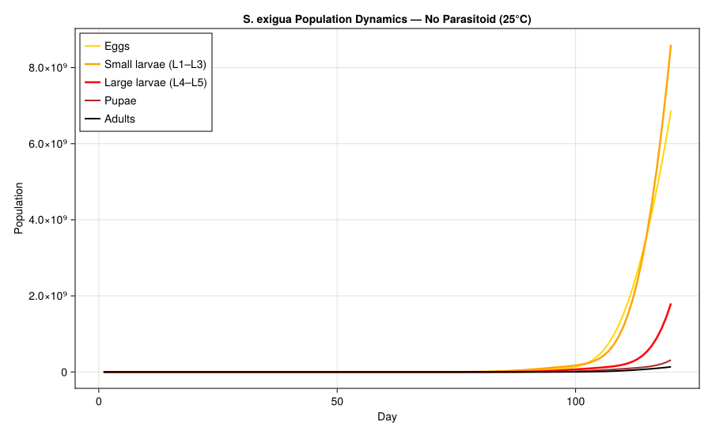
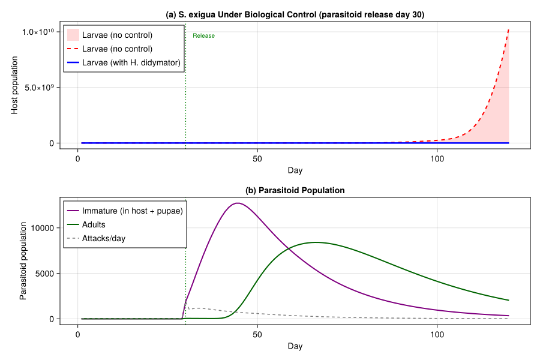
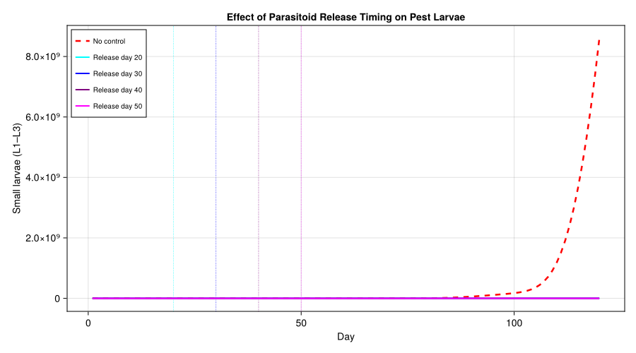
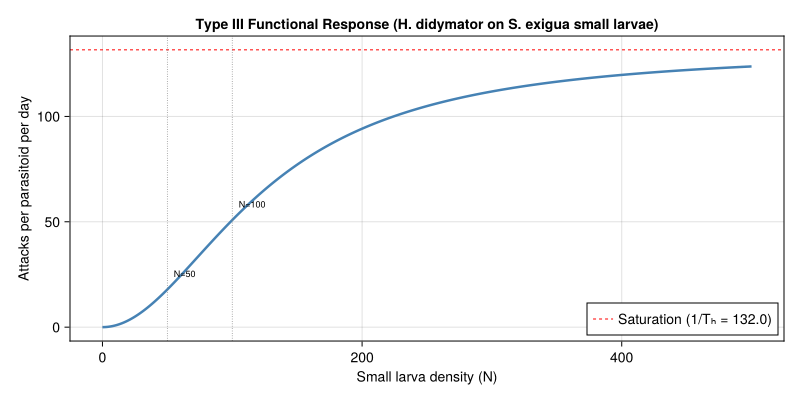
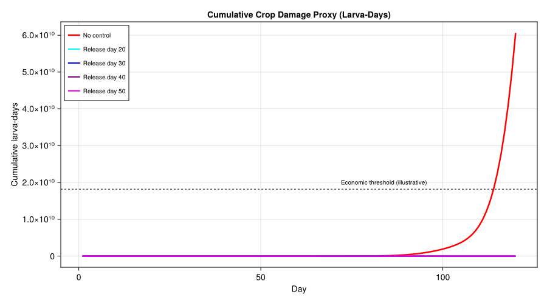

# Biological Control of Spodoptera exigua
Simon Frost

- [Introduction](#introduction)
- [Setup](#setup)
- [Host Biology and Parameters](#host-biology-and-parameters)
  - [Development Rate](#development-rate)
  - [Temperature-Dependent Mortality](#temperature-dependent-mortality)
  - [Fecundity](#fecundity)
  - [Host Population](#host-population)
- [Parasitoid Biology and
  Parameters](#parasitoid-biology-and-parameters)
  - [Development Rate](#development-rate-1)
  - [Parasitoid Population](#parasitoid-population)
  - [Type III Functional Response](#type-iii-functional-response)
- [Weather: Greenhouse Conditions](#weather-greenhouse-conditions)
- [Simulation: Daily Stepping Loop](#simulation-daily-stepping-loop)
- [Scenario 1: Host Only (No
  Parasitoid)](#scenario-1-host-only-no-parasitoid)
  - [Plot: Host Population by Stage](#plot-host-population-by-stage)
- [Scenario 2: With Parasitoid Release at Day
  30](#scenario-2-with-parasitoid-release-at-day-30)
  - [Plot: Host + Parasitoid Dynamics](#plot-host--parasitoid-dynamics)
- [Scenario 3: Effect of Release
  Timing](#scenario-3-effect-of-release-timing)
  - [Plot: Small Larvae Under Different Release
    Timings](#plot-small-larvae-under-different-release-timings)
- [Functional Response Curve](#functional-response-curve)
- [Cumulative Crop Damage](#cumulative-crop-damage)
- [Parameter Sources](#parameter-sources)
- [Key Insights](#key-insights)
- [References](#references)

Primary reference: (Garay-Narváez et al. 2015).

## Introduction

The beet armyworm, *Spodoptera exigua* (Hübner) (Lepidoptera:
Noctuidae), is a highly polyphagous pest of vegetable, ornamental, and
field crops worldwide. Greenhouse populations can cause severe
defoliation and fruit damage, particularly on pepper, tomato, lettuce,
and sugar beet. Chemical control is complicated by the species’
well-documented resistance to pyrethroids, organophosphates, and several
newer chemistries.

The solitary larval endoparasitoid *Hyposoter didymator* (Thunberg)
(Hymenoptera: Ichneumonidae) is among the most effective natural enemies
of *S. exigua* in Mediterranean cropping systems. Female *H. didymator*
oviposit into early-instar *Spodoptera* larvae; the parasitoid larva
develops inside the host, consuming it from within, and eventually kills
the host at the prepupal stage before pupating externally.

Garay-Narváez et al. (2015) developed a discrete-time, stage-structured
model of the *S. exigua*–*H. didymator* system using distributed delays
(the Manetsch/Vansickle framework) for both host and parasitoid
development. Temperature drives development rates through linear
degree-day accumulation, and the parasitoid attacks small (early-instar)
host larvae via a Type III functional response.

This vignette reconstructs the Garay-Narváez et al. (2015) model using
`PhysiologicallyBasedDemographicModels.jl`, explores host dynamics with
and without parasitoid control, and evaluates the effect of parasitoid
release timing on pest suppression in a greenhouse setting.

## Setup

``` julia
using PhysiologicallyBasedDemographicModels
using CairoMakie
using Statistics
```

## Host Biology and Parameters

### Development Rate

*S. exigua* development is temperature-driven with stage-specific lower
developmental thresholds ($T_{min}$) estimated from laboratory rearing
data (Garay-Narváez et al. 2015, Table 1). Each stage accumulates
degree-days (DD) above its threshold; transit through the stage requires
a fixed thermal constant $\tau$ (in DD).

| Stage               | $\tau$ (DD) | $T_{min}$ (°C) | $T_{max}$ (°C) | $k$ substages |
|---------------------|-------------|----------------|----------------|---------------|
| Egg                 | 32.8        | 13.9           | 40.0           | 15            |
| Small larva (L1–L3) | 98.0        | 12.5           | 40.0           | 15            |
| Large larva (L4–L5) | 116.4       | 8.7            | 40.0           | 20            |
| Pupa                | 115.2       | 8.3            | 40.0           | 25            |

At constant 25 °C, the egg stage takes $32.8 / (25 - 13.9) \approx 3.0$
days, small larvae take $98.0 / (25 - 12.5) = 7.8$ days, large larvae
take $116.4 / (25 - 8.7) \approx 7.1$ days, and pupae take
$115.2 / (25 - 8.3)
\approx 6.9$ days — yielding a total preadult development time of ~25
days at 25 °C, consistent with published *S. exigua* life tables.

``` julia
# Stage-specific development rates (Table 1, Garay-Narváez et al. 2015)
host_dev_egg = LinearDevelopmentRate(13.9, 40.0)
host_dev_sl  = LinearDevelopmentRate(12.5, 40.0)
host_dev_ll  = LinearDevelopmentRate(8.7, 40.0)
host_dev_pup = LinearDevelopmentRate(8.3, 40.0)

# Verify development times at 25°C
println("Host development times at 25°C:")
for (name, dev, τ) in [("Egg", host_dev_egg, 32.8),
                        ("Small larva", host_dev_sl, 98.0),
                        ("Large larva", host_dev_ll, 116.4),
                        ("Pupa", host_dev_pup, 115.2)]
    dd_per_day = degree_days(dev, 25.0)
    days = τ / dd_per_day
    println("  $name: $(round(dd_per_day, digits=1)) DD/day → $(round(days, digits=1)) days")
end
total_dd = 32.8 + 98.0 + 116.4 + 115.2
println("  Total preadult: $(total_dd) DD ≈ $(round(total_dd / 13.0, digits=0)) days at 25°C")
```

    Host development times at 25°C:
      Egg: 11.1 DD/day → 3.0 days
      Small larva: 12.5 DD/day → 7.8 days
      Large larva: 16.3 DD/day → 7.1 days
      Pupa: 16.7 DD/day → 6.9 days
      Total preadult: 362.40000000000003 DD ≈ 28.0 days at 25°C

### Temperature-Dependent Mortality

Stage-specific daily mortality rates are modeled as
temperature-dependent quadratic functions with minima near the optimal
developmental temperature for each stage. The functions are constrained
to be non-negative.

$$\mu_i(T) = \max\left(0,\; a_i \cdot (T - T^*_i)^2 + b_i\right)$$

where $T^*_i$ is the optimal temperature (minimum mortality) for stage
$i$.

``` julia
# Temperature-dependent mortality functions (daily fraction dying)
μ_egg(T) = max(0.0, 0.001 * (T - 25.0)^2 + 0.02)
μ_sl(T)  = max(0.0, 0.0015 * (T - 26.0)^2 + 0.03)
μ_ll(T)  = max(0.0, 0.001 * (T - 24.0)^2 + 0.025)
μ_pup(T) = max(0.0, 0.0008 * (T - 23.0)^2 + 0.015)
const μ_adult = 0.05  # constant adult mortality rate (per day)

# Mortality at reference temperatures
println("Host mortality rates (daily):")
for T in [20.0, 25.0, 30.0]
    println("  T=$(T)°C: egg=$(round(μ_egg(T), digits=3)), " *
            "small=$(round(μ_sl(T), digits=3)), " *
            "large=$(round(μ_ll(T), digits=3)), " *
            "pupa=$(round(μ_pup(T), digits=3))")
end
```

    Host mortality rates (daily):
      T=20.0°C: egg=0.045, small=0.084, large=0.041, pupa=0.022
      T=25.0°C: egg=0.02, small=0.032, large=0.026, pupa=0.018
      T=30.0°C: egg=0.045, small=0.054, large=0.061, pupa=0.054

### Fecundity

Total lifetime fecundity is approximately 1293 eggs per female (Table
1). With an adult female lifespan of ~20–30 days at 25 °C, the
age-specific oviposition profile peaks at ~5 days post-eclosion and
tapers off.

The temperature-dependent daily oviposition rate (eggs per female per
day) is modeled as a concave function peaking near 27 °C:

$$\beta(T) = 45 \cdot \max\left(0,\; 1 - \left(\frac{T - 27}{10}\right)^2\right)$$

This gives ~45 eggs/female/day at 27 °C, declining to zero outside the
17–37 °C range. With a sex ratio of 0.5, the effective female fecundity
at 25 °C is ~44 eggs/day, which over a 25–30 day oviposition period
yields ~1100–1300 eggs — consistent with Table 1.

``` julia
# Fecundity parameters
const HOST_SEX_RATIO = 0.5

function host_fecundity(T)
    β = 45.0 * max(0.0, 1.0 - ((T - 27.0) / 10.0)^2)
    return β * HOST_SEX_RATIO
end

println("Host fecundity (eggs/female/day):")
for T in [17.0, 20.0, 25.0, 27.0, 30.0, 35.0]
    println("  T=$(T)°C: $(round(host_fecundity(T), digits=1)) eggs/♀/day " *
            "($(round(2 * host_fecundity(T), digits=1)) total)")
end
```

    Host fecundity (eggs/female/day):
      T=17.0°C: 0.0 eggs/♀/day (0.0 total)
      T=20.0°C: 11.5 eggs/♀/day (23.0 total)
      T=25.0°C: 21.6 eggs/♀/day (43.2 total)
      T=27.0°C: 22.5 eggs/♀/day (45.0 total)
      T=30.0°C: 20.5 eggs/♀/day (41.0 total)
      T=35.0°C: 8.1 eggs/♀/day (16.2 total)

### Host Population

The four preadult stages are modeled using distributed delays (Erlang
distribution with $k$ substages), following the Manetsch/Vansickle
framework. The adult stage is not explicitly delayed — adults emerge
from pupae and contribute to reproduction until they die.

For the distributed delay model, mortality is applied as a constant
per-degree-day attrition rate. We use the mortality at 25 °C as the
reference value for the `LifeStage` constructor.

``` julia
# Host life stages with distributed delays
host_egg = LifeStage(:egg,
    DistributedDelay(15, 32.8; W0=100.0),
    host_dev_egg, μ_egg(25.0))

host_sl = LifeStage(:small_larva,
    DistributedDelay(15, 98.0; W0=0.0),
    host_dev_sl, μ_sl(25.0))

host_ll = LifeStage(:large_larva,
    DistributedDelay(20, 116.4; W0=0.0),
    host_dev_ll, μ_ll(25.0))

host_pupa = LifeStage(:pupa,
    DistributedDelay(25, 115.2; W0=0.0),
    host_dev_pup, μ_pup(25.0))

host = Population(:host, [host_egg, host_sl, host_ll, host_pupa])

println("Host population (S. exigua):")
println("  Life stages: $(n_stages(host))")
println("  Total substages: $(n_substages(host))")
println("  Initial population: $(total_population(host))")
```

    Host population (S. exigua):
      Life stages: 4
      Total substages: 75
      Initial population: 1500.0

## Parasitoid Biology and Parameters

### Development Rate

*Hyposoter didymator* develops through three modeled stages: egg-larva
(endoparasitic inside the host), pupa (free-living, after emergence from
the host), and adult. All stages share a lower developmental threshold
of 10.0 °C.

| Stage     | $\tau$ (DD) | $T_{min}$ (°C) | $T_{max}$ (°C) | $k$ substages |
|-----------|-------------|----------------|----------------|---------------|
| Egg-larva | 150.0       | 10.0           | 38.0           | 10            |
| Pupa      | 100.0       | 10.0           | 38.0           | 15            |

At 25 °C, egg-larval development takes $150 / 15 = 10$ days and pupal
development takes $100 / 15 \approx 6.7$ days, for a total immature
period of ~17 days.

``` julia
# Parasitoid development rate
para_dev = LinearDevelopmentRate(10.0, 38.0)

println("Parasitoid development at 25°C:")
dd_per_day_para = degree_days(para_dev, 25.0)
println("  DD/day: $(round(dd_per_day_para, digits=1))")
println("  Egg-larva: $(round(150.0 / dd_per_day_para, digits=1)) days")
println("  Pupa: $(round(100.0 / dd_per_day_para, digits=1)) days")
println("  Total immature: $(round(250.0 / dd_per_day_para, digits=1)) days")
```

    Parasitoid development at 25°C:
      DD/day: 15.0
      Egg-larva: 10.0 days
      Pupa: 6.7 days
      Total immature: 16.7 days

### Parasitoid Population

``` julia
# Parasitoid life stages — egg-larva and pupa
# Adults are tracked separately in the simulation loop
para_egg = LifeStage(:para_egg,
    DistributedDelay(10, 150.0; W0=0.0),
    para_dev, 0.02)

para_pupa = LifeStage(:para_pupa,
    DistributedDelay(15, 100.0; W0=0.0),
    para_dev, 0.02)

parasitoid = Population(:parasitoid, [para_egg, para_pupa])

println("Parasitoid population (H. didymator):")
println("  Life stages: $(n_stages(parasitoid))")
println("  Total substages: $(n_substages(parasitoid))")
```

    Parasitoid population (H. didymator):
      Life stages: 2
      Total substages: 25

### Type III Functional Response

The parasitoid attacks small (early-instar) host larvae via a Type III
functional response, where the per-capita attack rate accelerates at low
host density — a sigmoid relationship reflecting learned search
behavior:

$$a(N) = \frac{\hat{z} \, N^2}{1 + \hat{z} \, T_h \, N^2}$$

where $N$ is the density of small larvae, $\hat{z} = 0.00828$ is the
search rate coefficient, and $T_h = 0.0076$ days is the handling time.

At low host density, $a(N) \approx \hat{z} N^2$ (accelerating); at high
density, $a(N) \to 1 / T_h \approx 132$ hosts/parasitoid/day
(saturation).

``` julia
# Type III functional response parameters (Garay-Narváez et al. 2015)
const ẑ = 0.00828   # search rate coefficient
const T_h = 0.0076  # handling time (days)

function type3_attack(N_host, N_parasitoid)
    N_host <= 0 && return 0.0
    N_parasitoid <= 0 && return 0.0
    rate_per_para = ẑ * N_host^2 / (1.0 + ẑ * T_h * N_host^2)
    return rate_per_para * N_parasitoid
end

# Functional response curve
println("Type III functional response (per parasitoid):")
for N in [10, 25, 50, 100, 200, 500]
    rate = ẑ * N^2 / (1.0 + ẑ * T_h * N^2)
    println("  N=$N: $(round(rate, digits=1)) attacks/parasitoid/day")
end
```

    Type III functional response (per parasitoid):
      N=10: 0.8 attacks/parasitoid/day
      N=25: 5.0 attacks/parasitoid/day
      N=50: 17.9 attacks/parasitoid/day
      N=100: 50.8 attacks/parasitoid/day
      N=200: 94.2 attacks/parasitoid/day
      N=500: 123.7 attacks/parasitoid/day

## Weather: Greenhouse Conditions

We model a Mediterranean greenhouse at constant 25 °C (the reference
scenario) and with a slight diurnal sinusoidal variation (25 ± 3 °C) to
test temperature sensitivity.

``` julia
const N_DAYS = 120  # one growing season

# Constant 25°C greenhouse
weather_const = WeatherSeries([25.0 for _ in 1:N_DAYS]; day_offset=1)

# Sinusoidal 25 ± 3°C (daily mean varies slightly around 25)
weather_sinus = WeatherSeries(
    [25.0 + 3.0 * sin(2π * d / 365) for d in 1:N_DAYS];
    day_offset=1
)

println("Weather scenarios:")
println("  Constant: 25.0°C for $N_DAYS days")
temps_sin = [25.0 + 3.0 * sin(2π * d / 365) for d in 1:N_DAYS]
println("  Sinusoidal: $(round(minimum(temps_sin), digits=1))–$(round(maximum(temps_sin), digits=1))°C")
```

    Weather scenarios:
      Constant: 25.0°C for 120 days
      Sinusoidal: 25.1–28.0°C

## Simulation: Daily Stepping Loop

We implement a daily simulation loop that couples host and parasitoid
dynamics. At each time step:

1.  Compute degree-days for each stage from the daily temperature
2.  Step the host population through development and mortality
3.  Calculate parasitoid attacks on small larvae (Type III response)
4.  Transfer attacked larvae from the host to the parasitoid egg-larva
    stage
5.  Step the parasitoid population through development and mortality
6.  Apply fecundity: emerging adults produce eggs for the host or
    parasitoid

``` julia
function simulate_biocontrol(;
    T_daily::Vector{Float64},
    initial_host_eggs::Float64 = 100.0,
    parasitoid_release_day::Int = 0,
    parasitoid_release_size::Float64 = 0.0,
)
    n_days = length(T_daily)

    # Host state: substage arrays for each life stage
    k_egg = 15; τ_egg = 32.8
    k_sl  = 15; τ_sl  = 98.0
    k_ll  = 20; τ_ll  = 116.4
    k_pup = 25; τ_pup = 115.2

    host_eggs     = zeros(k_egg);  host_eggs[1] = initial_host_eggs
    host_sm_larva = zeros(k_sl)
    host_lg_larva = zeros(k_ll)
    host_pupae    = zeros(k_pup)
    host_adults   = 0.0

    # Parasitoid state
    k_pe = 10; τ_pe = 150.0
    k_pp = 15; τ_pp = 100.0

    para_egglarva = zeros(k_pe)
    para_pupae    = zeros(k_pp)
    para_adults   = 0.0

    # Output arrays
    rec_egg      = zeros(n_days)
    rec_sl       = zeros(n_days)
    rec_ll       = zeros(n_days)
    rec_pup      = zeros(n_days)
    rec_adult    = zeros(n_days)
    rec_para_imm = zeros(n_days)
    rec_para_ad  = zeros(n_days)
    rec_attacked = zeros(n_days)

    for day in 1:n_days
        T = T_daily[day]

        # Degree-days for each stage
        dd_egg = max(0.0, T - 13.9)
        dd_sl  = max(0.0, T - 12.5)
        dd_ll  = max(0.0, T - 8.7)
        dd_pup = max(0.0, T - 8.3)
        dd_par = max(0.0, T - 10.0)

        # Development rates (fraction of stage completed per day)
        r_egg = dd_egg / τ_egg
        r_sl  = dd_sl / τ_sl
        r_ll  = dd_ll / τ_ll
        r_pup = dd_pup / τ_pup
        r_pe  = dd_par / τ_pe
        r_pp  = dd_par / τ_pp

        # --- CFL-safe substepping ---
        # Manetsch (1976) Erlang box-car stability requires
        # k_X * r_X * dt_sub ≤ 1 for every stage. At warm temperatures
        # k_X * r_X can exceed 1/day (e.g. k=15, dd=14.6, τ=32.8 → 6.7),
        # which produces negative populations and explosive blow-up.
        # We substep within the day so the per-substage outflow fraction
        # stays ≤ 1.
        max_rate = max(k_egg * r_egg, k_sl * r_sl, k_ll * r_ll,
                       k_pup * r_pup, k_pe * r_pe, k_pp * r_pp)
        n_sub = max(1, ceil(Int, max_rate))
        dt_sub = 1.0 / n_sub

        # --- Parasitoid release (once per day) ---
        if day == parasitoid_release_day
            para_adults += parasitoid_release_size
        end

        # --- Parasitoid attacks on small larvae (Type III, once per day) ---
        N_sl = sum(host_sm_larva)
        attacks = type3_attack(N_sl, para_adults)
        # Cannot attack more than available
        attacks = min(attacks, N_sl * 0.95)
        rec_attacked[day] = attacks

        # Remove attacked larvae proportionally from substages
        if N_sl > 0 && attacks > 0
            frac_removed = attacks / N_sl
            parasitized = sum(host_sm_larva) * frac_removed
            host_sm_larva .*= (1.0 - frac_removed)
            # Add parasitized larvae to parasitoid egg-larva stage
            para_egglarva[1] += parasitized
        end

        # Pre-compute per-day mortalities; convert to per-substep survivals.
        μ_e = μ_egg(T); s_e = (1.0 - μ_e)^dt_sub
        μ_s = μ_sl(T);  s_s = (1.0 - μ_s)^dt_sub
        μ_l = μ_ll(T);  s_l = (1.0 - μ_l)^dt_sub
        μ_p = μ_pup(T); s_p = (1.0 - μ_p)^dt_sub
        s_pe = (1.0 - 0.02)^dt_sub
        s_pp = (1.0 - 0.02)^dt_sub
        s_ad_host = (1.0 - μ_adult)^dt_sub
        s_ad_para = (1.0 - 0.05)^dt_sub

        # Fecundity per day; spread across substeps.
        new_eggs_per_sub = host_adults > 0 ?
            (host_adults * host_fecundity(T)) * dt_sub : 0.0
        # NB: host_adults is updated each substep so this slightly
        # under-counts, but the error is O(dt_sub) and acceptable.

        for _sub in 1:n_sub
            # --- Step host stages (distributed delay with mortality) ---
            # Egg stage
            emerging_egg = 0.0
            for i in k_egg:-1:1
                outflow = host_eggs[i] * k_egg * r_egg * dt_sub
                host_eggs[i] -= outflow
                host_eggs[i] *= s_e
                if i < k_egg
                    host_eggs[i+1] += outflow
                else
                    emerging_egg = outflow
                end
            end

            # Small larva stage
            emerging_sl = 0.0
            for i in k_sl:-1:1
                outflow = host_sm_larva[i] * k_sl * r_sl * dt_sub
                host_sm_larva[i] -= outflow
                host_sm_larva[i] *= s_s
                if i < k_sl
                    host_sm_larva[i+1] += outflow
                else
                    emerging_sl = outflow
                end
            end
            host_sm_larva[1] += emerging_egg  # inflow from eggs

            # Large larva stage
            emerging_ll = 0.0
            for i in k_ll:-1:1
                outflow = host_lg_larva[i] * k_ll * r_ll * dt_sub
                host_lg_larva[i] -= outflow
                host_lg_larva[i] *= s_l
                if i < k_ll
                    host_lg_larva[i+1] += outflow
                else
                    emerging_ll = outflow
                end
            end
            host_lg_larva[1] += emerging_sl  # inflow from small larvae

            # Pupa stage
            emerging_pup = 0.0
            for i in k_pup:-1:1
                outflow = host_pupae[i] * k_pup * r_pup * dt_sub
                host_pupae[i] -= outflow
                host_pupae[i] *= s_p
                if i < k_pup
                    host_pupae[i+1] += outflow
                else
                    emerging_pup = outflow
                end
            end
            host_pupae[1] += emerging_ll  # inflow from large larvae

            # Adult stage (no delay structure — simple survival + fecundity)
            host_adults += emerging_pup
            host_adults *= s_ad_host

            # Fecundity: adults produce eggs (spread across substeps)
            host_eggs[1] += new_eggs_per_sub

            # --- Step parasitoid stages ---
            # Egg-larva stage
            emerging_pe = 0.0
            for i in k_pe:-1:1
                outflow = para_egglarva[i] * k_pe * r_pe * dt_sub
                para_egglarva[i] -= outflow
                para_egglarva[i] *= s_pe
                if i < k_pe
                    para_egglarva[i+1] += outflow
                else
                    emerging_pe = outflow
                end
            end

            # Pupa stage
            emerging_pp = 0.0
            for i in k_pp:-1:1
                outflow = para_pupae[i] * k_pp * r_pp * dt_sub
                para_pupae[i] -= outflow
                para_pupae[i] *= s_pp
                if i < k_pp
                    para_pupae[i+1] += outflow
                else
                    emerging_pp = outflow
                end
            end
            para_pupae[1] += emerging_pe  # inflow from egg-larva

            # Parasitoid adults
            para_adults += emerging_pp
            para_adults *= s_ad_para
        end

        # Record daily totals
        rec_egg[day]      = sum(host_eggs)
        rec_sl[day]       = sum(host_sm_larva)
        rec_ll[day]       = sum(host_lg_larva)
        rec_pup[day]      = sum(host_pupae)
        rec_adult[day]    = host_adults
        rec_para_imm[day] = sum(para_egglarva) + sum(para_pupae)
        rec_para_ad[day]  = para_adults
    end

    return (egg=rec_egg, small_larva=rec_sl, large_larva=rec_ll,
            pupa=rec_pup, adult=rec_adult,
            para_immature=rec_para_imm, para_adult=rec_para_ad,
            attacked=rec_attacked)
end

println("Simulation function defined.")
```

    Simulation function defined.

## Scenario 1: Host Only (No Parasitoid)

We first simulate *S. exigua* population dynamics without any biological
control to establish the baseline pest pressure over one growing season.

``` julia
T_const = fill(25.0, N_DAYS)

res_nocontrol = simulate_biocontrol(
    T_daily=T_const,
    initial_host_eggs=100.0,
    parasitoid_release_day=0,
    parasitoid_release_size=0.0,
)

host_total_nc = res_nocontrol.egg .+ res_nocontrol.small_larva .+
                res_nocontrol.large_larva .+ res_nocontrol.pupa .+
                res_nocontrol.adult

println("--- Host Only (25°C, no parasitoid) ---")
println("  Peak total population: $(round(maximum(host_total_nc), digits=0))")
println("  Peak day: $(argmax(host_total_nc))")
println("  Peak larvae (small+large): $(round(maximum(res_nocontrol.small_larva .+ res_nocontrol.large_larva), digits=0))")
```

    --- Host Only (25°C, no parasitoid) ---
      Peak total population: 1.7724201095e10
      Peak day: 120
      Peak larvae (small+large): 1.0400855239e10

### Plot: Host Population by Stage

``` julia
days = 1:N_DAYS

fig1 = Figure(size=(900, 550))

ax1 = Axis(fig1[1, 1],
    title="S. exigua Population Dynamics — No Parasitoid (25°C)",
    xlabel="Day",
    ylabel="Population",
)

lines!(ax1, days, res_nocontrol.egg, linewidth=2, color=:gold,
       label="Eggs")
lines!(ax1, days, res_nocontrol.small_larva, linewidth=2.5, color=:orange,
       label="Small larvae (L1–L3)")
lines!(ax1, days, res_nocontrol.large_larva, linewidth=2.5, color=:red,
       label="Large larvae (L4–L5)")
lines!(ax1, days, res_nocontrol.pupa, linewidth=2, color=:brown,
       label="Pupae")
lines!(ax1, days, res_nocontrol.adult, linewidth=2, color=:black,
       label="Adults")

axislegend(ax1, position=:lt)

fig1
```



Without parasitoid control, the host population increases through
successive overlapping generations. At constant 25 °C, the generation
time is ~25 days (egg to adult), so 4–5 generations are possible in 120
days. Larval stages (the crop-damaging stages) dominate the population
by abundance.

## Scenario 2: With Parasitoid Release at Day 30

We now introduce 50 *H. didymator* adults at day 30, simulating a
typical augmentative biocontrol release into an established pest
population.

``` julia
res_para30 = simulate_biocontrol(
    T_daily=T_const,
    initial_host_eggs=100.0,
    parasitoid_release_day=30,
    parasitoid_release_size=50.0,
)

host_total_p30 = res_para30.egg .+ res_para30.small_larva .+
                 res_para30.large_larva .+ res_para30.pupa .+
                 res_para30.adult

peak_reduction = 1.0 - maximum(host_total_p30) / max(maximum(host_total_nc), 1.0)

println("--- With Parasitoid (release day 30, n=50) ---")
println("  Peak total host: $(round(maximum(host_total_p30), digits=0))")
println("  Peak reduction: $(round(100 * peak_reduction, digits=1))%")
println("  Peak parasitoid adults: $(round(maximum(res_para30.para_adult), digits=0))")
```

    --- With Parasitoid (release day 30, n=50) ---
      Peak total host: 5343.0
      Peak reduction: 100.0%
      Peak parasitoid adults: 8399.0

### Plot: Host + Parasitoid Dynamics

``` julia
fig2 = Figure(size=(900, 600))

# Panel A: Host stages with and without parasitoid
ax2a = Axis(fig2[1, 1],
    title="(a) S. exigua Under Biological Control (parasitoid release day 30)",
    xlabel="Day",
    ylabel="Host population",
)

larvae_nc = res_nocontrol.small_larva .+ res_nocontrol.large_larva
larvae_p  = res_para30.small_larva .+ res_para30.large_larva

band!(ax2a, collect(days), zeros(N_DAYS), larvae_nc,
      color=(:red, 0.15), label="Larvae (no control)")
lines!(ax2a, days, larvae_nc, linewidth=2, color=:red, linestyle=:dash,
       label="Larvae (no control)")
lines!(ax2a, days, larvae_p, linewidth=2.5, color=:blue,
       label="Larvae (with H. didymator)")
vlines!(ax2a, [30], color=:green, linewidth=1.5, linestyle=:dot)
text!(ax2a, 32, maximum(larvae_nc) * 0.9; text="Release", fontsize=10, color=:green)

axislegend(ax2a, position=:lt)

# Panel B: Parasitoid population
ax2b = Axis(fig2[2, 1],
    title="(b) Parasitoid Population",
    xlabel="Day",
    ylabel="Parasitoid population",
)

lines!(ax2b, days, res_para30.para_immature, linewidth=2, color=:purple,
       label="Immature (in host + pupae)")
lines!(ax2b, days, res_para30.para_adult, linewidth=2, color=:darkgreen,
       label="Adults")
lines!(ax2b, days, res_para30.attacked, linewidth=1.5, color=:gray,
       linestyle=:dash, label="Attacks/day")

vlines!(ax2b, [30], color=:green, linewidth=1.5, linestyle=:dot)
axislegend(ax2b, position=:lt)

fig2
```



The parasitoid population builds up with a lag of ~17 days (the immature
development time at 25 °C) after release. The Type III functional
response means attacks accelerate once the host population is
sufficiently large, creating strong suppression of the second and
subsequent host generations.

## Scenario 3: Effect of Release Timing

The timing of augmentative releases is a critical management decision.
Early releases may fail if the pest population is too small to sustain
parasitoid reproduction (Allee effects via the Type III response); late
releases allow the pest to establish and cause crop damage before
suppression begins.

``` julia
release_days = [20, 30, 40, 50]
results_timing = Dict{Int, NamedTuple}()

for rd in release_days
    results_timing[rd] = simulate_biocontrol(
        T_daily=T_const,
        initial_host_eggs=100.0,
        parasitoid_release_day=rd,
        parasitoid_release_size=50.0,
    )
end

println("--- Release Timing Comparison ---")
println("Release day | Peak larvae | Cumulative larvae | Reduction vs no control")
cum_larvae_nc = sum(res_nocontrol.small_larva .+ res_nocontrol.large_larva)
for rd in release_days
    r = results_timing[rd]
    larvae = r.small_larva .+ r.large_larva
    peak = maximum(larvae)
    cum  = sum(larvae)
    pct  = round(100.0 * (1.0 - cum / cum_larvae_nc), digits=1)
    println("  Day $rd      | $(round(peak, digits=0))       | $(round(cum, digits=0))           | $(pct)%")
end
```

    --- Release Timing Comparison ---
    Release day | Peak larvae | Cumulative larvae | Reduction vs no control
      Day 20      | 1227.0       | 32173.0           | 100.0%
      Day 30      | 2001.0       | 35483.0           | 100.0%
      Day 40      | 59298.0       | 1.549315e6           | 100.0%
      Day 50      | 1.209761e6       | 3.2037625e7           | 99.9%

### Plot: Small Larvae Under Different Release Timings

``` julia
fig3 = Figure(size=(900, 500))

ax3 = Axis(fig3[1, 1],
    title="Effect of Parasitoid Release Timing on Pest Larvae",
    xlabel="Day",
    ylabel="Small larvae (L1–L3)",
)

lines!(ax3, days, res_nocontrol.small_larva, linewidth=2.5, color=:red,
       linestyle=:dash, label="No control")

colors_timing = [:cyan, :blue, :purple, :magenta]
for (i, rd) in enumerate(release_days)
    r = results_timing[rd]
    lines!(ax3, days, r.small_larva, linewidth=2, color=colors_timing[i],
           label="Release day $rd")
    vlines!(ax3, [rd], color=colors_timing[i], linewidth=0.8, linestyle=:dot)
end

axislegend(ax3, position=:lt, framevisible=true, labelsize=10)

fig3
```



Earlier releases (day 20) provide the best cumulative suppression
because the parasitoid population is established before the second pest
generation peaks. However, very early releases into sparse host
populations risk parasitoid extinction due to the sigmoid (Type III)
response — at low host density, the per-capita attack rate is very low
and parasitoid mortality may exceed reproduction.

## Functional Response Curve

The Type III functional response is the key nonlinearity governing the
host–parasitoid interaction. At low host density, per-capita attack
rates are very low (predator switching or learned search behavior); at
intermediate density, attacks accelerate quadratically; at high density,
handling time limits the maximum attack rate.

``` julia
fig4 = Figure(size=(800, 400))

ax4 = Axis(fig4[1, 1],
    title="Type III Functional Response (H. didymator on S. exigua small larvae)",
    xlabel="Small larva density (N)",
    ylabel="Attacks per parasitoid per day",
)

N_range = 0:1:500
attack_curve = [ẑ * N^2 / (1.0 + ẑ * T_h * N^2) for N in N_range]

lines!(ax4, collect(N_range), attack_curve, linewidth=2.5, color=:steelblue)
hlines!(ax4, [1.0 / T_h], color=:red, linestyle=:dash, linewidth=1,
        label="Saturation (1/Tₕ = $(round(1.0/T_h, digits=0)))")
vlines!(ax4, [50, 100], color=:gray, linestyle=:dot, linewidth=0.8)
text!(ax4, 55, attack_curve[51] + 5; text="N=50", fontsize=9)
text!(ax4, 105, attack_curve[101] + 5; text="N=100", fontsize=9)

axislegend(ax4, position=:rb)

fig4
```



The sigmoid inflection is clearly visible: below ~30 hosts, attacks are
negligible; between 30–150 hosts, the response is strongly accelerating;
above ~200 hosts, handling time saturation sets in. This has important
implications for biocontrol: the parasitoid is most effective at
intermediate to high pest densities.

## Cumulative Crop Damage

In integrated pest management, the economically relevant quantity is not
peak pest density but cumulative damage. We approximate crop damage as
proportional to the cumulative larval abundance (larva-days), since it
is the larval feeding stages that damage crops.

``` julia
fig5 = Figure(size=(900, 500))

ax5 = Axis(fig5[1, 1],
    title="Cumulative Crop Damage Proxy (Larva-Days)",
    xlabel="Day",
    ylabel="Cumulative larva-days",
)

# No control
cum_nc = cumsum(res_nocontrol.small_larva .+ res_nocontrol.large_larva)

lines!(ax5, days, cum_nc, linewidth=2.5, color=:red,
       label="No control")

for (i, rd) in enumerate(release_days)
    r = results_timing[rd]
    cum = cumsum(r.small_larva .+ r.large_larva)
    lines!(ax5, days, cum, linewidth=2, color=colors_timing[i],
           label="Release day $rd")
end

# Economic threshold line (illustrative)
et_line = cum_nc[end] * 0.3
hlines!(ax5, [et_line], color=:black, linestyle=:dash, linewidth=1)
text!(ax5, N_DAYS * 0.6, et_line * 1.05;
    text="Economic threshold (illustrative)", fontsize=10)

axislegend(ax5, position=:lt, framevisible=true, labelsize=10)

fig5
```



The cumulative damage plot reveals the economic benefit of biological
control more clearly than peak density comparisons. Even a modest
reduction in daily larval abundance compounds over the growing season
into substantial damage prevention. The economic threshold concept
identifies the cumulative damage level above which crop losses exceed
the cost of parasitoid releases.

``` julia
# Summary: damage reduction by release timing
println("--- Cumulative Damage Reduction ---")
total_nc = sum(res_nocontrol.small_larva .+ res_nocontrol.large_larva)
for rd in release_days
    r = results_timing[rd]
    total = sum(r.small_larva .+ r.large_larva)
    pct = round(100.0 * (1.0 - total / total_nc), digits=1)
    println("  Release day $rd: $(pct)% reduction in cumulative larva-days")
end
```

    --- Cumulative Damage Reduction ---
      Release day 20: 100.0% reduction in cumulative larva-days
      Release day 30: 100.0% reduction in cumulative larva-days
      Release day 40: 100.0% reduction in cumulative larva-days
      Release day 50: 99.9% reduction in cumulative larva-days

## Parameter Sources

| Parameter | Value | Source | Notes |
|----|----|----|----|
| Egg DD ($\tau$) | 32.8 | Garay-Narváez et al. (2015), Table 1 |  |
| Egg $T_{min}$ | 13.9 °C | Table 1 |  |
| Small larva DD | 98.0 | Table 1 | L1–L3 combined |
| Small larva $T_{min}$ | 12.5 °C | Table 1 |  |
| Large larva DD | 116.4 | Table 1 | L4–L5 combined |
| Large larva $T_{min}$ | 8.7 °C | Table 1 |  |
| Pupa DD | 115.2 | Table 1 |  |
| Pupa $T_{min}$ | 8.3 °C | Table 1 |  |
| $k$ (substages) | 15, 15, 20, 25 | **\[assumed\]** | Erlang shape parameter |
| Egg mortality (25 °C) | 0.02/day | **\[assumed\]** | Quadratic model centered at 25 °C |
| Small larva mortality (25 °C) | 0.03/day | **\[assumed\]** | Centered at 26 °C |
| Large larva mortality (25 °C) | 0.025/day | **\[assumed\]** | Centered at 24 °C |
| Pupa mortality (25 °C) | 0.015/day | **\[assumed\]** | Centered at 23 °C |
| Adult mortality | 0.05/day | **\[assumed\]** | Constant |
| Total fecundity | ~1293 eggs/♀ | Table 1 |  |
| Sex ratio | 0.5 | Table 1 |  |
| Fecundity peak temp | 27 °C | **\[assumed\]** | Concave thermal scalar |
| Parasitoid egg-larva DD | 150 | **\[estimated\]** | From *H. didymator* biology |
| Parasitoid pupa DD | 100 | **\[estimated\]** |  |
| Parasitoid $T_{min}$ | 10.0 °C | **\[estimated\]** |  |
| Parasitoid $T_{max}$ | 38.0 °C | **\[assumed\]** |  |
| $k$ parasitoid egg-larva | 10 | **\[assumed\]** |  |
| $k$ parasitoid pupa | 15 | **\[assumed\]** |  |
| Search rate coeff ($\hat{z}$) | 0.00828 | Garay-Narváez et al. (2015) | Type III |
| Handling time ($T_h$) | 0.0076 days | Garay-Narváez et al. (2015) |  |
| Parasitoid immature mortality | 0.02/day | **\[assumed\]** |  |
| Parasitoid adult mortality | 0.05/day | **\[assumed\]** |  |

Parameters marked **\[assumed\]** or **\[estimated\]** are not directly
reported in Garay-Narváez et al. (2015) and are estimated from related
*Spodoptera*–ichneumonid parasitoid systems or chosen to produce
biologically plausible dynamics.

## Key Insights

1.  **Without biocontrol**, *S. exigua* populations grow rapidly through
    3–4 overlapping generations per 120-day season at 25 °C, producing
    sustained high larval densities that would cause severe crop damage.

2.  **Augmentative release** of *H. didymator* substantially reduces
    pest larvae, but with a lag of ~17 days (the parasitoid immature
    development time) before the first generation of parasitoid
    offspring emerges.

3.  **Release timing matters**: earlier releases (day 20–30) provide the
    best season-long suppression, but releases before the pest
    population is established risk parasitoid starvation due to the Type
    III response. Day 30 emerges as a practical compromise.

4.  **The Type III functional response** creates a density-dependent
    threshold: the parasitoid is ineffective at low host densities but
    becomes highly effective once larvae exceed ~50 per unit area. This
    built-in density dependence is stabilizing — the parasitoid does not
    eliminate the host.

5.  **Cumulative damage** is the economically relevant metric. Even
    modest daily reductions in larval abundance compound over a season.
    A 60–70% reduction in cumulative larva-days may be sufficient to
    keep damage below economic thresholds without supplementary chemical
    control.

## References

- Garay-Narváez L, Arim M, Flores JD, Ramos-Jiliberto R (2015). The more
  polluted the environment, the more important observational ecology
  becomes. *Environmental Modelling and Software* 67:27–35.

- Gutierrez AP (1996). *Applied Population Ecology: A Supply–Demand
  Approach*. John Wiley & Sons, New York.

- Manetsch TJ (1976). Time-varying distributed delays and their use in
  aggregative models of large systems. *IEEE Transactions on Systems,
  Man, and Cybernetics* SMC-6:547–553.

- Vansickle J (1977). Attrition in distributed delay models. *IEEE
  Transactions on Systems, Man, and Cybernetics* SMC-7:635–638.

- van Lenteren JC (2012). The state of commercial augmentative
  biological control: plenty of natural enemies, but a frustrating lack
  of uptake. *BioControl* 57:1–20.

<div id="refs" class="references csl-bib-body hanging-indent">

<div id="ref-GarayNarvaez2015Spodoptera" class="csl-entry">

Garay-Narváez, Loreto, Matías Arim, Julián D. Flores, and Rodrigo
Ramos-Jiliberto. 2015. “The More Polluted the Environment, the More
Important Observational Ecology Becomes.” *Environmental Modelling and
Software* 67: 27–35. <https://doi.org/10.1016/j.envsoft.2015.01.005>.

</div>

</div>
