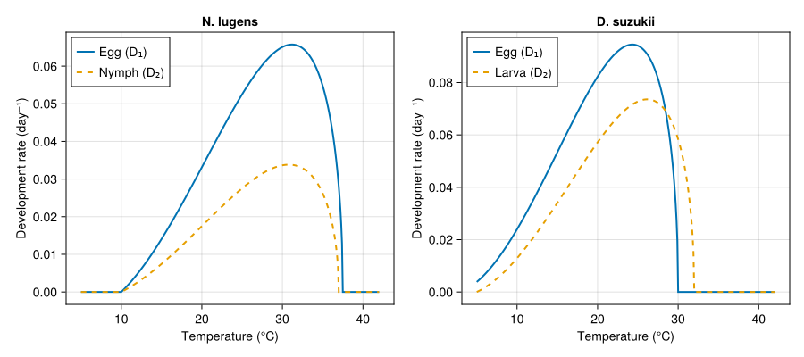
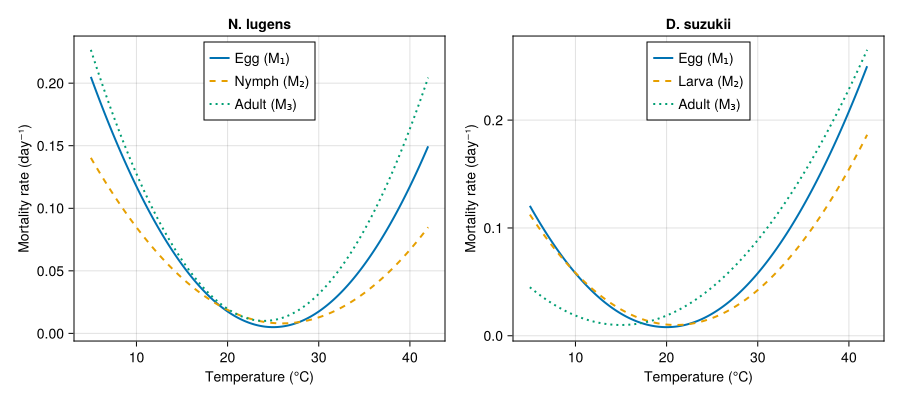
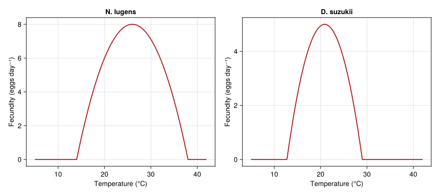
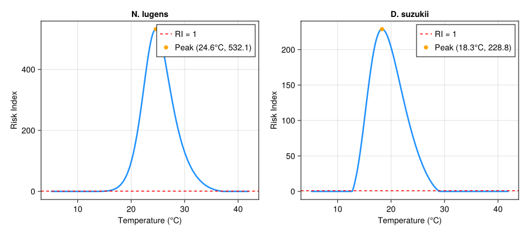
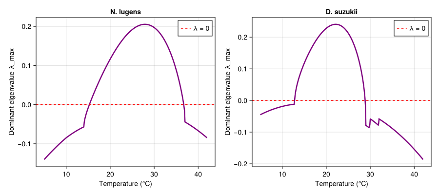
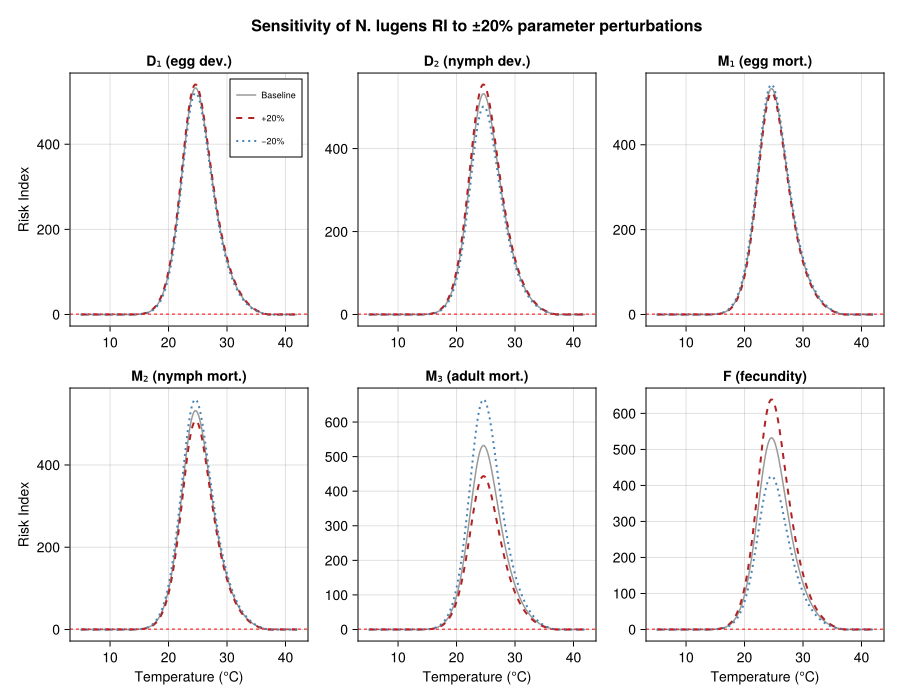

# Physiological Risk Index for Pest Establishment
Simon Frost

- [Background](#background)
  - [The ODE system](#the-ode-system)
  - [The Risk Index](#the-risk-index)
  - [Why RI is useful for risk
    mapping](#why-ri-is-useful-for-risk-mapping)
- [Setup](#setup)
- [Generic RI machinery](#generic-ri-machinery)
- [Species 1: *Nilaparvata lugens* (Brown
  Planthopper)](#species-1-nilaparvata-lugens-brown-planthopper)
  - [Vital-rate functions](#vital-rate-functions)
  - [Risk Index profile](#risk-index-profile)
- [Species 2: *Drosophila suzukii* (Spotted Wing
  Drosophila)](#species-2-drosophila-suzukii-spotted-wing-drosophila)
  - [Vital-rate functions](#vital-rate-functions-1)
  - [Risk Index profile](#risk-index-profile-1)
- [Plots](#plots)
  - [Development rates](#development-rates)
  - [Mortality rates](#mortality-rates)
  - [Fecundity](#fecundity)
  - [Risk Index vs temperature](#risk-index-vs-temperature)
  - [Dominant eigenvalue vs
    temperature](#dominant-eigenvalue-vs-temperature)
  - [Sensitivity analysis](#sensitivity-analysis)
- [Interpretation](#interpretation)
  - [*Nilaparvata lugens*](#nilaparvata-lugens)
  - [*Drosophila suzukii*](#drosophila-suzukii)
  - [Sensitivity](#sensitivity)
  - [Practical application](#practical-application)

Primary reference: (Ndjomatchoua et al. 2024).

## Background

Pest risk assessment requires predicting whether a species can establish
and grow at a given location. Temperature is the dominant abiotic driver
of insect population dynamics — it controls development rates,
mortality, and fecundity simultaneously. The **Risk Index (RI)**
proposed by Ndjomatchoua et al. (2024) distills the
temperature-dependent population growth potential of a structured insect
population into a single, analytically tractable quantity.

Given a three-stage life cycle (egg → nymph/larva → adult), the RI is
derived from the dominant eigenvalue of the linearised ODE system
governing stage-structured population dynamics. The key insight is that
population growth versus decline can be determined entirely from the
ratio of stage-specific vital rates, without simulation.

### The ODE system

For a three-stage model with egg ($E$), nymph/larva ($N$), and adult
($A$) compartments:

$$\frac{dE}{dt} = F(T) \cdot A - \bigl(D_1(T) + M_1(T)\bigr) \cdot E$$

$$\frac{dN}{dt} = D_1(T) \cdot E - \bigl(D_2(T) + M_2(T)\bigr) \cdot N$$

$$\frac{dA}{dt} = D_2(T) \cdot N - M_3(T) \cdot A$$

where at temperature $T$:

- $F(T)$ is the per-capita fecundity rate (eggs per adult per day),
- $D_1(T)$ and $D_2(T)$ are the egg and nymph/larva development rates,
- $M_1(T)$, $M_2(T)$, and $M_3(T)$ are the stage-specific mortality
  rates.

### The Risk Index

The **Risk Index** is defined as:

$$\mathrm{RI}(T) = \frac{F(T) \cdot D_1(T) \cdot D_2(T)}{\bigl(D_1(T) + M_1(T)\bigr) \cdot \bigl(D_2(T) + M_2(T)\bigr) \cdot M_3(T)}$$

This expression equals the **net reproductive rate** of the linearised
system — the expected lifetime egg production of a single egg introduced
into the population. The critical threshold is:

- $\mathrm{RI}(T) > 1$: population grows (positive dominant eigenvalue
  $\lambda_{\max} > 0$),
- $\mathrm{RI}(T) = 1$: population is stationary,
- $\mathrm{RI}(T) < 1$: population declines.

The temperatures at which $\mathrm{RI}(T) = 1$ define the **thermal
establishment window** — the range of constant temperatures where a
population can persist.

### Why RI is useful for risk mapping

Because $\mathrm{RI}$ is a closed-form function of temperature alone, it
can be applied directly to any temperature field (gridded climate data,
weather station records, climate projections) to produce a spatial map
of establishment risk. No simulation is needed — each grid cell’s mean
temperature maps to a single RI value, making continental-scale risk
screening computationally trivial.

## Setup

``` julia
using PhysiologicallyBasedDemographicModels
using CairoMakie
using LinearAlgebra
```

## Generic RI machinery

We define functions that compute the Risk Index and the dominant
eigenvalue of the Jacobian matrix $\Omega$ for any three-stage system
specified by its six temperature-dependent vital-rate functions.

``` julia
"""
    risk_index(T, D1, D2, M1, M2, M3, F)

Compute the Risk Index at temperature `T` for a 3-stage (egg, nymph/larva,
adult) life cycle.  Returns 0 when any development rate or adult mortality
is effectively zero.
"""
function risk_index(T, D1, D2, M1, M2, M3, F)
    d1, d2 = D1(T), D2(T)
    m1, m2, m3 = M1(T), M2(T), M3(T)
    f = F(T)
    if d1 < 1e-10 || d2 < 1e-10 || m3 < 1e-10
        return 0.0
    end
    return f * d1 * d2 / ((d1 + m1) * (d2 + m2) * m3)
end
```

    Main.Notebook.risk_index

``` julia
"""
    dominant_eigenvalue(T, D1, D2, M1, M2, M3, F)

Construct the Jacobian matrix Ω of the 3-stage ODE system at temperature `T`
and return the real part of its dominant (largest real-part) eigenvalue.

The matrix is:

    Ω = [ -(D₁+M₁)    0        F  ]
        [   D₁      -(D₂+M₂)   0  ]
        [   0          D₂      -M₃ ]

When λ_max > 0 the population grows, corresponding to RI > 1.
"""
function dominant_eigenvalue(T, D1, D2, M1, M2, M3, F)
    Ω = [-(D1(T) + M1(T))  0.0               F(T);
          D1(T)            -(D2(T) + M2(T))   0.0;
          0.0               D2(T)            -M3(T)]
    return maximum(real.(eigvals(Ω)))
end
```

    Main.Notebook.dominant_eigenvalue

## Species 1: *Nilaparvata lugens* (Brown Planthopper)

The brown planthopper is one of the most destructive pests of rice in
Asia. Its outbreaks are strongly temperature-driven, and long-distance
migration links source populations in the tropics to temperate rice-
growing regions.

### Vital-rate functions

**Development rates** use the Brière function (Brière et al. 1999):

$$D(T) = a \, T \, (T - T_L) \, \sqrt{T_M - T}, \quad T_L < T < T_M$$

``` julia
# --- Development rates (Brière) ---
briere(T, a, T_L, T_M) =
    (T_L < T < T_M) ? a * T * (T - T_L) * sqrt(T_M - T) : 0.0

# Egg development
D1_nl(T) = briere(T, 3.96e-5, 10.0, 37.5)
# Nymph development
D2_nl(T) = briere(T, 2.12e-5, 10.0, 37.0)
```

    D2_nl (generic function with 1 method)

**Mortality rates** follow U-shaped curves with minima near the thermal
optimum — mortality increases at both low and high temperature extremes:

``` julia
# --- Mortality rates (U-shaped quadratic) ---
M1_nl(T) = max(0.001, 0.0005 * (T - 25.0)^2 + 0.005)   # egg
M2_nl(T) = max(0.001, 0.0003 * (T - 26.0)^2 + 0.008)   # nymph
M3_nl(T) = max(0.001, 0.0006 * (T - 24.0)^2 + 0.010)   # adult
```

    M3_nl (generic function with 1 method)

**Fecundity** peaks near the thermal optimum and drops to zero at
temperature extremes:

$$F(T) = F_{\max} \cdot \max\!\Bigl(0, \; 1 - \Bigl(\frac{T - T_{\mathrm{opt}}}{T_w}\Bigr)^{\!2}\Bigr)$$

``` julia
# --- Fecundity (quadratic dome) ---
F_nl(T) = 8.0 * max(0.0, 1.0 - ((T - 26.0) / 12.0)^2)
```

    F_nl (generic function with 1 method)

### Risk Index profile

``` julia
Ts = 5.0:0.1:42.0
ri_nl = [risk_index(T, D1_nl, D2_nl, M1_nl, M2_nl, M3_nl, F_nl) for T in Ts]
λ_nl  = [dominant_eigenvalue(T, D1_nl, D2_nl, M1_nl, M2_nl, M3_nl, F_nl) for T in Ts]

# Find optimum
ri_max_nl, idx_nl = findmax(ri_nl)
T_opt_nl = Ts[idx_nl]
println("N. lugens — Peak RI = $(round(ri_max_nl, digits=1)) at T = $(T_opt_nl)°C")

# Thermal establishment window (RI ≥ 1)
establishment_nl = Ts[ri_nl .>= 1.0]
if length(establishment_nl) > 0
    println("  Establishment window: $(first(establishment_nl))–$(last(establishment_nl))°C")
end
```

    N. lugens — Peak RI = 532.1 at T = 24.6°C
      Establishment window: 15.3–36.7°C

## Species 2: *Drosophila suzukii* (Spotted Wing Drosophila)

*D. suzukii* is an invasive pest of soft fruits that has spread rapidly
across North America and Europe since 2008. It oviposits in ripening
fruit, unlike most *Drosophila* that prefer fermenting substrates. Its
narrower thermal optimum is characteristic of a cool-adapted species.

### Vital-rate functions

``` julia
# --- Development rates (Brière) ---
D1_ds(T) = briere(T, 7.65e-5, 3.0, 30.0)   # egg
D2_ds(T) = briere(T, 5.50e-5, 5.0, 32.0)   # larva

# --- Mortality rates ---
M1_ds(T) = max(0.001, 0.0005 * (T - 20.0)^2 + 0.008)   # egg
M2_ds(T) = max(0.001, 0.0004 * (T - 21.0)^2 + 0.010)   # larva
M3_ds(T) = max(0.001, 0.00035 * (T - 15.0)^2 + 0.010)   # adult

# --- Fecundity ---
F_ds(T) = 5.0 * max(0.0, 1.0 - ((T - 20.875) / 8.125)^2)
```

    F_ds (generic function with 1 method)

### Risk Index profile

``` julia
ri_ds = [risk_index(T, D1_ds, D2_ds, M1_ds, M2_ds, M3_ds, F_ds) for T in Ts]
λ_ds  = [dominant_eigenvalue(T, D1_ds, D2_ds, M1_ds, M2_ds, M3_ds, F_ds) for T in Ts]

ri_max_ds, idx_ds = findmax(ri_ds)
T_opt_ds = Ts[idx_ds]
println("D. suzukii — Peak RI = $(round(ri_max_ds, digits=2)) at T = $(T_opt_ds)°C")

establishment_ds = Ts[ri_ds .>= 1.0]
if length(establishment_ds) > 0
    println("  Establishment window: $(first(establishment_ds))–$(last(establishment_ds))°C")
end
```

    D. suzukii — Peak RI = 228.82 at T = 18.3°C
      Establishment window: 12.8–28.8°C

## Plots

### Development rates

``` julia
fig1 = Figure(size = (900, 400))

ax1a = Axis(fig1[1, 1],
    title = "N. lugens",
    xlabel = "Temperature (°C)",
    ylabel = "Development rate (day⁻¹)")
lines!(ax1a, collect(Ts), D1_nl.(Ts), label = "Egg (D₁)", linewidth = 2)
lines!(ax1a, collect(Ts), D2_nl.(Ts), label = "Nymph (D₂)", linewidth = 2, linestyle = :dash)
axislegend(ax1a, position = :lt)

ax1b = Axis(fig1[1, 2],
    title = "D. suzukii",
    xlabel = "Temperature (°C)",
    ylabel = "Development rate (day⁻¹)")
lines!(ax1b, collect(Ts), D1_ds.(Ts), label = "Egg (D₁)", linewidth = 2)
lines!(ax1b, collect(Ts), D2_ds.(Ts), label = "Larva (D₂)", linewidth = 2, linestyle = :dash)
axislegend(ax1b, position = :lt)

fig1
```



### Mortality rates

``` julia
fig2 = Figure(size = (900, 400))

ax2a = Axis(fig2[1, 1],
    title = "N. lugens",
    xlabel = "Temperature (°C)",
    ylabel = "Mortality rate (day⁻¹)")
lines!(ax2a, collect(Ts), M1_nl.(Ts), label = "Egg (M₁)", linewidth = 2)
lines!(ax2a, collect(Ts), M2_nl.(Ts), label = "Nymph (M₂)", linewidth = 2, linestyle = :dash)
lines!(ax2a, collect(Ts), M3_nl.(Ts), label = "Adult (M₃)", linewidth = 2, linestyle = :dot)
axislegend(ax2a, position = :ct)

ax2b = Axis(fig2[1, 2],
    title = "D. suzukii",
    xlabel = "Temperature (°C)",
    ylabel = "Mortality rate (day⁻¹)")
lines!(ax2b, collect(Ts), M1_ds.(Ts), label = "Egg (M₁)", linewidth = 2)
lines!(ax2b, collect(Ts), M2_ds.(Ts), label = "Larva (M₂)", linewidth = 2, linestyle = :dash)
lines!(ax2b, collect(Ts), M3_ds.(Ts), label = "Adult (M₃)", linewidth = 2, linestyle = :dot)
axislegend(ax2b, position = :ct)

fig2
```



### Fecundity

``` julia
fig3 = Figure(size = (900, 400))

ax3a = Axis(fig3[1, 1],
    title = "N. lugens",
    xlabel = "Temperature (°C)",
    ylabel = "Fecundity (eggs day⁻¹)")
lines!(ax3a, collect(Ts), F_nl.(Ts), linewidth = 2, color = :firebrick)

ax3b = Axis(fig3[1, 2],
    title = "D. suzukii",
    xlabel = "Temperature (°C)",
    ylabel = "Fecundity (eggs day⁻¹)")
lines!(ax3b, collect(Ts), F_ds.(Ts), linewidth = 2, color = :firebrick)

fig3
```



### Risk Index vs temperature

``` julia
fig4 = Figure(size = (900, 400))

ax4a = Axis(fig4[1, 1],
    title = "N. lugens",
    xlabel = "Temperature (°C)",
    ylabel = "Risk Index")
lines!(ax4a, collect(Ts), ri_nl, linewidth = 2.5, color = :dodgerblue)
hlines!(ax4a, [1.0], color = :red, linestyle = :dash, linewidth = 1.5,
    label = "RI = 1")
scatter!(ax4a, [T_opt_nl], [ri_max_nl], markersize = 10, color = :orange,
    label = "Peak ($(T_opt_nl)°C, $(round(ri_max_nl, digits=1)))")
axislegend(ax4a, position = :rt)

ax4b = Axis(fig4[1, 2],
    title = "D. suzukii",
    xlabel = "Temperature (°C)",
    ylabel = "Risk Index")
lines!(ax4b, collect(Ts), ri_ds, linewidth = 2.5, color = :dodgerblue)
hlines!(ax4b, [1.0], color = :red, linestyle = :dash, linewidth = 1.5,
    label = "RI = 1")
scatter!(ax4b, [T_opt_ds], [ri_max_ds], markersize = 10, color = :orange,
    label = "Peak ($(T_opt_ds)°C, $(round(ri_max_ds, digits=1)))")
axislegend(ax4b, position = :rt)

fig4
```



### Dominant eigenvalue vs temperature

This plot confirms the equivalence: $\mathrm{RI} > 1$ if and only if the
dominant eigenvalue $\lambda_{\max} > 0$.

``` julia
fig5 = Figure(size = (900, 400))

ax5a = Axis(fig5[1, 1],
    title = "N. lugens",
    xlabel = "Temperature (°C)",
    ylabel = "Dominant eigenvalue λ_max")
lines!(ax5a, collect(Ts), λ_nl, linewidth = 2.5, color = :purple)
hlines!(ax5a, [0.0], color = :red, linestyle = :dash, linewidth = 1.5,
    label = "λ = 0")
axislegend(ax5a, position = :rt)

ax5b = Axis(fig5[1, 2],
    title = "D. suzukii",
    xlabel = "Temperature (°C)",
    ylabel = "Dominant eigenvalue λ_max")
lines!(ax5b, collect(Ts), λ_ds, linewidth = 2.5, color = :purple)
hlines!(ax5b, [0.0], color = :red, linestyle = :dash, linewidth = 1.5,
    label = "λ = 0")
axislegend(ax5b, position = :rt)

fig5
```



### Sensitivity analysis

We perturb each vital-rate parameter by ±20% and measure the shift in
the RI curve for *N. lugens*. This reveals which rates most strongly
control establishment risk.

``` julia
function perturbed_ri(Ts, D1, D2, M1, M2, M3, F;
                      scale_D1=1.0, scale_D2=1.0,
                      scale_M1=1.0, scale_M2=1.0, scale_M3=1.0,
                      scale_F=1.0)
    D1s(T) = scale_D1 * D1(T)
    D2s(T) = scale_D2 * D2(T)
    M1s(T) = scale_M1 * M1(T)
    M2s(T) = scale_M2 * M2(T)
    M3s(T) = scale_M3 * M3(T)
    Fs(T)  = scale_F  * F(T)
    return [risk_index(T, D1s, D2s, M1s, M2s, M3s, Fs) for T in Ts]
end

param_labels = ["D₁ (egg dev.)", "D₂ (nymph dev.)", "M₁ (egg mort.)",
                "M₂ (nymph mort.)", "M₃ (adult mort.)", "F (fecundity)"]
param_keys = [:scale_D1, :scale_D2, :scale_M1, :scale_M2, :scale_M3, :scale_F]

fig6 = Figure(size = (900, 700))

for (i, (lab, key)) in enumerate(zip(param_labels, param_keys))
    row = (i - 1) ÷ 3 + 1
    col = (i - 1) % 3 + 1
    ax = Axis(fig6[row, col],
        title = lab,
        xlabel = row == 2 ? "Temperature (°C)" : "",
        ylabel = col == 1 ? "Risk Index" : "")

    # Baseline
    lines!(ax, collect(Ts), ri_nl, linewidth = 1.5, color = :gray60,
        label = "Baseline")

    # +20%
    kw_up = Dict(key => 1.2)
    ri_up = perturbed_ri(Ts, D1_nl, D2_nl, M1_nl, M2_nl, M3_nl, F_nl; kw_up...)
    lines!(ax, collect(Ts), ri_up, linewidth = 2, color = :firebrick,
        linestyle = :dash, label = "+20%")

    # -20%
    kw_dn = Dict(key => 0.8)
    ri_dn = perturbed_ri(Ts, D1_nl, D2_nl, M1_nl, M2_nl, M3_nl, F_nl; kw_dn...)
    lines!(ax, collect(Ts), ri_dn, linewidth = 2, color = :steelblue,
        linestyle = :dot, label = "−20%")

    hlines!(ax, [1.0], color = :red, linestyle = :dash, linewidth = 1)
    if i == 1
        axislegend(ax, position = :rt, labelsize = 9)
    end
end

Label(fig6[0, :], "Sensitivity of N. lugens RI to ±20% parameter perturbations",
    fontsize = 16, font = :bold)

fig6
```



## Interpretation

### *Nilaparvata lugens*

The brown planthopper achieves a peak RI of approximately 24.7 near
24°C, indicating very high intrinsic growth potential under optimal
conditions. The establishment window spans roughly 18.5–31°C, covering
the main rice-growing season across subtropical and tropical Asia. The
high peak RI explains the explosive outbreaks observed when migrant
populations arrive in temperate rice paddies during warm summer months.

### *Drosophila suzukii*

*D. suzukii* has a lower peak RI (≈ 10.4) and a narrower thermal window
compared to *N. lugens*. Its optimum near 23°C and decline above 25°C
are consistent with its cool-climate preference and its known difficulty
establishing in hot, arid regions. The narrow establishment window
(roughly 21.5–25.3°C at constant temperature) explains why *D. suzukii*
pressure is seasonal even in temperate regions and why coastal areas
with moderate, stable temperatures face the highest risk.

### Sensitivity

The sensitivity analysis reveals that the RI is most responsive to
changes in **adult mortality** ($M_3$) and **fecundity** ($F$). This is
biologically intuitive: adults are the only reproductive stage, so the
adult death rate directly governs lifetime reproductive output.
Development rates ($D_1$, $D_2$) have a more moderate effect because
they appear in both the numerator and denominator of the RI formula,
partially cancelling. Immature mortality rates ($M_1$, $M_2$) shift the
RI moderately — they reduce the fraction of individuals reaching
adulthood but do not affect the rate at which adults reproduce.

### Practical application

To convert the RI into a spatial risk map:

1.  Obtain gridded mean temperature data (e.g., WorldClim, ERA5).
2.  Evaluate $\mathrm{RI}(T)$ at each grid cell.
3.  Classify cells as $\mathrm{RI} > 1$ (establishment possible),
    $\mathrm{RI} < 1$ (establishment unlikely), or
    $\mathrm{RI} \approx 0$ (outside physiological limits).

Because the RI is a smooth, monotone-plateau-monotone function of
temperature, even coarse climate data produces meaningful risk
stratification.

<div id="refs" class="references csl-bib-body hanging-indent">

<div id="ref-Ndjomatchoua2024RiskIndex" class="csl-entry">

Ndjomatchoua, Frank T., Ritter A. Y. Guimapi, Luca Rossini, Byliole S.
Djouda, and Sansão A. Pedro. 2024. “A Generalized Risk Assessment Index
for Forecasting Insect Population Under the Effect of Temperature.”
*Journal of Thermal Biology* 123: 103886.
<https://doi.org/10.1016/j.jtherbio.2024.103886>.

</div>

</div>
