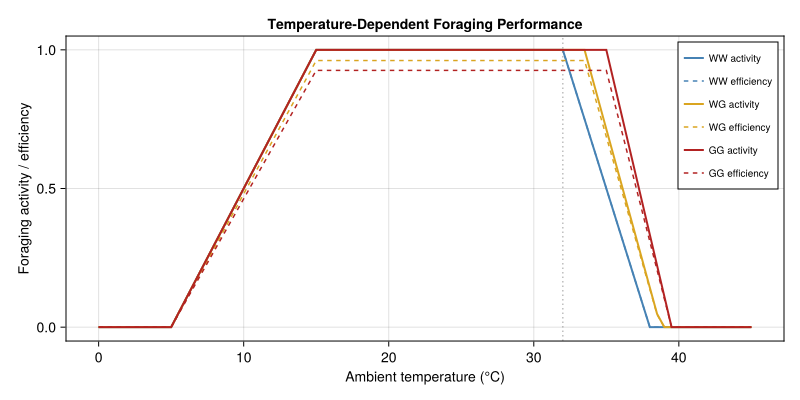
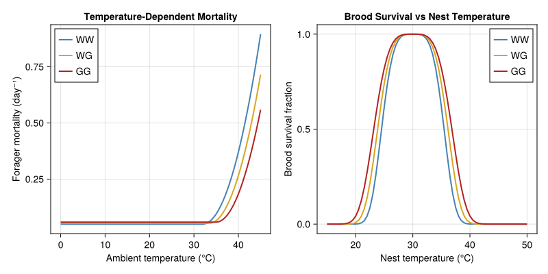
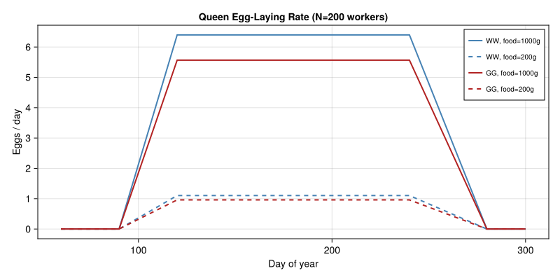
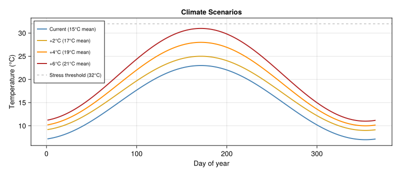
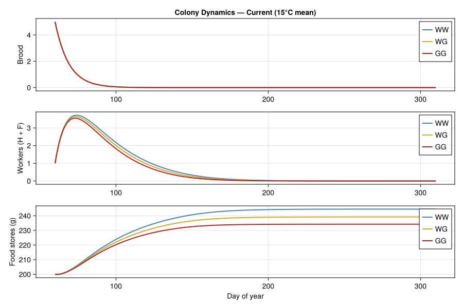
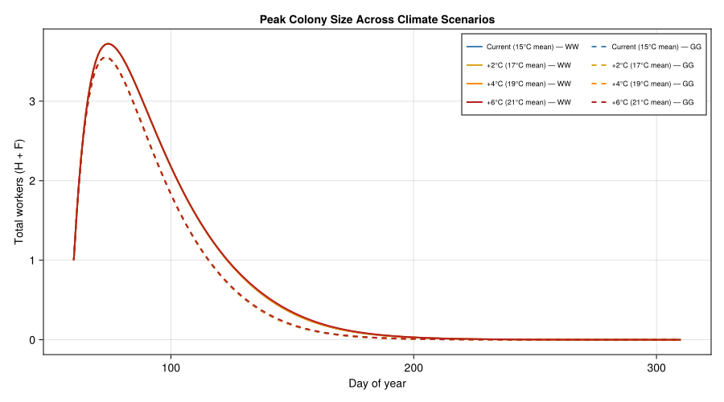
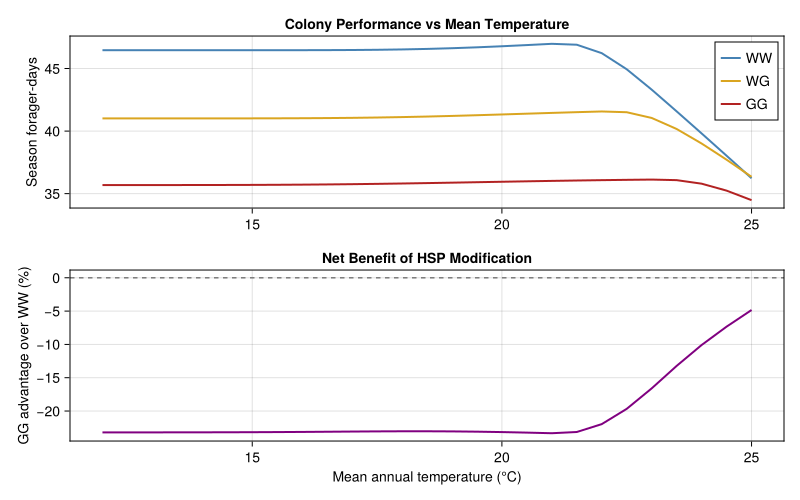
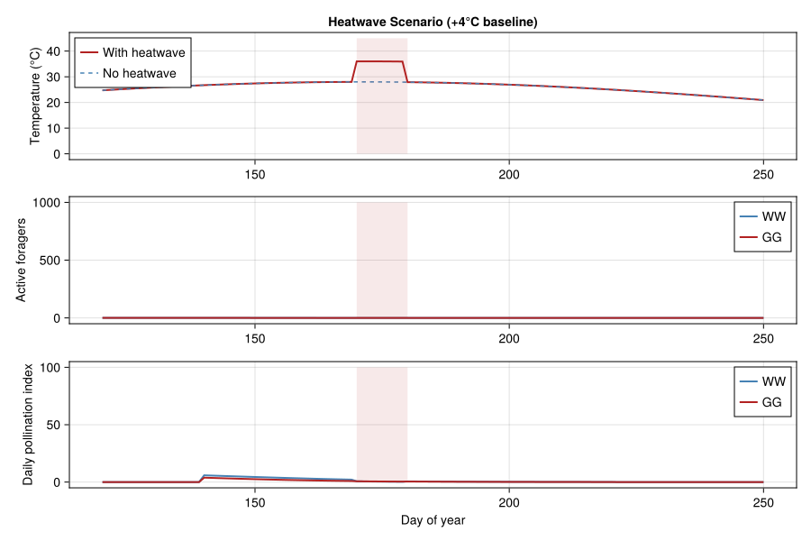
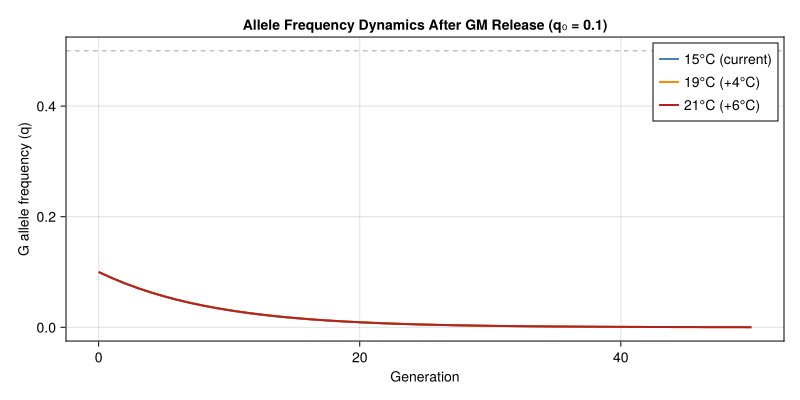
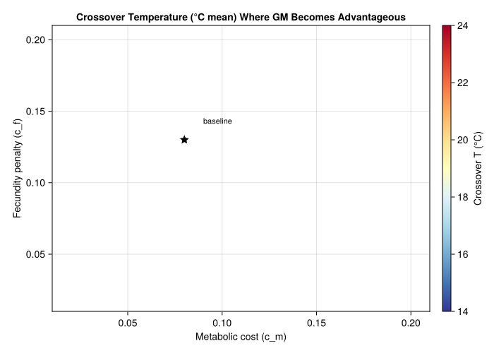

# Genetically Modified Thermal Tolerance in Bombus terrestris
Simon Frost

- [Introduction](#introduction)
- [Genetic Architecture](#genetic-architecture)
- [Colony Life History Parameters](#colony-life-history-parameters)
- [Temperature-Dependent Rate
  Functions](#temperature-dependent-rate-functions)
  - [Foraging Activity](#foraging-activity)
  - [Thermal Mortality](#thermal-mortality)
  - [Queen Fecundity](#queen-fecundity)
- [Colony Dynamics Model](#colony-dynamics-model)
- [Climate Scenarios](#climate-scenarios)
- [Colony Simulations: Wild-Type vs
  GM](#colony-simulations-wild-type-vs-gm)
  - [Colony Growth Under Current
    Climate](#colony-growth-under-current-climate)
  - [Climate Comparison: Total Workers at
    Peak](#climate-comparison-total-workers-at-peak)
- [Fitness Metrics: Season-Integrated
  Performance](#fitness-metrics-season-integrated-performance)
- [Genotype Advantage as a Function of
  Warming](#genotype-advantage-as-a-function-of-warming)
- [Pollination Ecosystem Services](#pollination-ecosystem-services)
  - [Pollination Model](#pollination-model)
  - [Pollination Under Heatwave
    Stress](#pollination-under-heatwave-stress)
- [Allele Frequency Dynamics](#allele-frequency-dynamics)
- [Sensitivity Analysis: Pleiotropic Cost
  Trade-offs](#sensitivity-analysis-pleiotropic-cost-trade-offs)
- [Discussion](#discussion)
  - [Key Findings](#key-findings)
  - [Pleiotropic Effects Included](#pleiotropic-effects-included)
  - [Limitations](#limitations)
  - [Connection to Other Vignettes](#connection-to-other-vignettes)

## Introduction

The buff-tailed bumblebee (*Bombus terrestris*) is the most commercially
important managed pollinator in Europe, deployed in over 1 million
greenhouse colonies annually for tomato, strawberry, and pepper
pollination. Climate warming poses a direct physiological threat:
bumblebees have a critical thermal maximum (CT<sub>max</sub>) of ~44 °C
(thorax) and show impaired foraging above 32 °C ambient temperature,
cognitive deficits (learning/memory) at sustained 32 °C exposure, and
larval mortality at 35 °C.

One proposed biotechnological intervention is to engineer enhanced
thermal tolerance by modifying heat shock protein (HSP) gene promoters.
Replacing the native HSP70 promoter with a constitutive or
enhanced-response variant would upregulate chaperone expression,
shifting the thermal tolerance window upward by 2–4 °C. However, HSP
overexpression is not free: studies in *Drosophila* demonstrate
quantifiable pleiotropic costs:

- **Metabolic cost**: ~8–15% increase in basal metabolic rate (Hoekstra
  & Montooth 2013)
- **Reduced fecundity**: ~10–15% decrease in daily egg production
  (Silbermann & Tatar 2000)
- **Shortened lifespan**: ~10–20% reduction under benign conditions
  (Feder et al. 1999)
- **Immune trade-off**: Diverted resources may impair pathogen
  resistance

This vignette builds a **physiologically based demographic model** of
*B. terrestris* colony dynamics incorporating:

1.  Temperature-driven development, foraging, and mortality (PBDM
    framework)
2.  A diploid genetic architecture for HSP promoter alleles with
    Hardy–Weinberg genotype frequencies
3.  Genotype-specific pleiotropic costs on metabolic rate, fecundity,
    and longevity
4.  Colony-level thermoregulation (workers heat/cool the nest)
5.  A pollination ecosystem service module coupling colony fitness to
    crop yield

The central question is: **under what warming scenarios does the net
benefit of enhanced thermal tolerance outweigh its pleiotropic costs,
both for colony fitness and for the pollination services the colony
provides?**

## Genetic Architecture

We model a single biallelic locus controlling HSP70 promoter activity:

- **Allele $W$**: Wild-type promoter (normal HSP expression)
- **Allele $G$**: Enhanced promoter (constitutive HSP70 upregulation)

In a diploid population with Hardy–Weinberg equilibrium, three genotypes
arise:

| Genotype | Frequency | CT<sub>max</sub> shift | Metabolic cost | Fecundity penalty | Longevity penalty |
|----|----|----|----|----|----|
| $WW$ | $p^2$ | 0 | 1.00 | 1.00 | 1.00 |
| $WG$ | $2pq$ | $+\Delta/2$ | $1 + c_m/2$ | $1 - c_f/2$ | $1 - c_l/2$ |
| $GG$ | $q^2$ | $+\Delta$ | $1 + c_m$ | $1 - c_f$ | $1 - c_l$ |

where $p$ is the frequency of $W$, $q = 1-p$ is the frequency of $G$,
$\Delta$ is the CT<sub>max</sub> shift for homozygous GM individuals,
and $c_m$, $c_f$, $c_l$ are the metabolic, fecundity, and longevity cost
coefficients respectively. The heterozygote has intermediate effects
(semi-dominance).

``` julia
using PhysiologicallyBasedDemographicModels
using OrdinaryDiffEq
using CairoMakie
using LinearAlgebra

# ── Genetic parameters ─────────────────────────────────────────────
const Δ_HSP = 3.0       # °C CTmax shift for GG homozygote
const c_met = 0.08       # 8% metabolic cost (GG)
const c_fec = 0.13       # 13% fecundity reduction (GG)
const c_lon = 0.15       # 15% longevity reduction (GG)

# Genotype trait modifiers (additive/semi-dominant)
struct Genotype
    name::String
    ctmax_shift::Float64   # °C added to baseline CTmax
    met_cost::Float64      # multiplier on metabolic rate (≥1)
    fec_penalty::Float64   # multiplier on fecundity (≤1)
    lon_penalty::Float64   # multiplier on lifespan (≤1)
end

WW = Genotype("WW", 0.0,       1.0,            1.0,            1.0)
WG = Genotype("WG", Δ_HSP/2,   1.0 + c_met/2,  1.0 - c_fec/2,  1.0 - c_lon/2)
GG = Genotype("GG", Δ_HSP,     1.0 + c_met,    1.0 - c_fec,    1.0 - c_lon)

println("Genotype trait effects (HSP70 promoter modification):")
println("="^70)
println("Genotype | CTmax shift | Metabolic cost | Fecundity | Longevity")
println("-"^70)
for g in [WW, WG, GG]
    println("  $(rpad(g.name, 9))| $(rpad("+$(g.ctmax_shift)°C", 12))| " *
            "$(rpad("×$(g.met_cost)", 15))| " *
            "$(rpad("×$(g.fec_penalty)", 10))| ×$(g.lon_penalty)")
end
```

    Genotype trait effects (HSP70 promoter modification):
    ======================================================================
    Genotype | CTmax shift | Metabolic cost | Fecundity | Longevity
    ----------------------------------------------------------------------
      WW       | +0.0°C      | ×1.0           | ×1.0      | ×1.0
      WG       | +1.5°C      | ×1.04          | ×0.935    | ×0.925
      GG       | +3.0°C      | ×1.08          | ×0.87     | ×0.85

## Colony Life History Parameters

*B. terrestris* has an annual colony cycle: a single queen founds a nest
in spring, produces workers through the ergonomic phase, then switches
to reproductive output (new queens = gynes, and males) before colony
senescence in autumn. We model five compartments: brood ($B$), hive
workers ($H$), foragers ($F$), food stores ($f$, in grams), and nest
temperature ($T_n$).

``` julia
# ── Baseline colony parameters (from Banks 2017, Khoury 2013) ─────
# Development
const τ_BROOD = 22.0     # days from egg to adult worker emergence
const τ_MALE = 26.0      # days to male emergence
const τ_GYNE = 30.0      # days to gyne emergence
const φ_BROOD = 1.0/9.0  # day⁻¹ brood pupation rate

# Queen egg-laying
const L_MAX = 12.0       # max eggs/day (bumblebee queen, lower than honeybee)
const w_HALF = 100.0     # half-saturation for eclosion (colony size)

# Forager dynamics
const x_MAX = 0.25       # day⁻¹ max recruitment rate (hive → forager)
const σ_INHIB = 0.75     # social inhibition strength

# Baseline mortality
const μ_H_BASE = 0.02    # day⁻¹ hive bee mortality
const μ_F_BASE = 0.05    # day⁻¹ forager mortality (higher due to predation/flight)
const μ_Q = 0.0154       # day⁻¹ queen mortality

# Food dynamics
const c_FORAGE = 0.6     # ml nectar/forager/day (at full activity)
const γ_ADULT = 0.007    # g/day consumption per adult
const γ_BROOD = 0.018    # g/day consumption per brood
const b_HALF = 500.0     # g food half-saturation

# Thermal parameters
const T_BASE_DEV = 8.0   # °C lower development threshold
const T_OPT_NEST = 30.0  # °C optimal nest temperature
const T_STRESS_FORAGE = 32.0  # °C foraging impairment onset
const T_FORAGE_MIN = 5.0      # °C minimum foraging temperature
const T_FORAGE_MAX = 38.0     # °C maximum foraging temperature
const CTMAX_BASE = 44.0       # °C baseline worker CTmax (thorax)

# Nest thermoregulation
const α_NEST = 0.02      # day⁻¹ heat exchange rate
const β_META = 0.002     # °C/day/worker metabolic heating
const COOL_CAP = 0.001   # °C/day/worker cooling capacity
const T_COOL_ONSET = 35.0  # °C active cooling threshold

println("\nColony parameters (B. terrestris):")
println("  Brood period: $(τ_BROOD) days")
println("  Queen egg rate: $(L_MAX) eggs/day max")
println("  Baseline forager mortality: $(μ_F_BASE)/day")
println("  CTmax (wild-type): $(CTMAX_BASE)°C")
println("  Optimal nest T: $(T_OPT_NEST)°C")
println("  Foraging window: $(T_FORAGE_MIN)–$(T_FORAGE_MAX)°C")
```


    Colony parameters (B. terrestris):
      Brood period: 22.0 days
      Queen egg rate: 12.0 eggs/day max
      Baseline forager mortality: 0.05/day
      CTmax (wild-type): 44.0°C
      Optimal nest T: 30.0°C
      Foraging window: 5.0–38.0°C

## Temperature-Dependent Rate Functions

### Foraging Activity

Workers forage only within a thermal window. Activity ramps up linearly
from 5 °C, is maximal between 15–30 °C, and declines to zero at 38 °C.
GM bees with enhanced CTmax maintain foraging at higher temperatures.

``` julia
function foraging_activity(T_air, genotype::Genotype)
    # Shift upper limit by CTmax improvement
    T_max_forage = T_FORAGE_MAX + genotype.ctmax_shift * 0.5
    T_stress = T_STRESS_FORAGE + genotype.ctmax_shift

    if T_air < T_FORAGE_MIN
        return 0.0
    elseif T_air < 15.0
        return (T_air - T_FORAGE_MIN) / (15.0 - T_FORAGE_MIN)
    elseif T_air ≤ T_stress
        return 1.0
    elseif T_air < T_max_forage
        return (T_max_forage - T_air) / (T_max_forage - T_stress)
    else
        return 0.0
    end
end

# Foraging efficiency: metabolic cost reduces net resource gain
function foraging_efficiency(T_air, genotype::Genotype)
    activity = foraging_activity(T_air, genotype)
    # Net efficiency penalized by metabolic overhead
    return activity / genotype.met_cost
end

# Plot foraging activity curves
T_range = 0.0:0.5:45.0
fig = Figure(size=(800, 400))
ax = Axis(fig[1, 1], xlabel="Ambient temperature (°C)",
          ylabel="Foraging activity / efficiency",
          title="Temperature-Dependent Foraging Performance")

for (g, col, ls) in [(WW, :steelblue, :solid), (WG, :goldenrod, :solid), (GG, :firebrick, :solid)]
    act = [foraging_activity(T, g) for T in T_range]
    eff = [foraging_efficiency(T, g) for T in T_range]
    lines!(ax, collect(T_range), act, color=col, linewidth=2, linestyle=ls,
           label="$(g.name) activity")
    lines!(ax, collect(T_range), eff, color=col, linewidth=1.5, linestyle=:dash,
           label="$(g.name) efficiency")
end
vlines!(ax, [T_STRESS_FORAGE], color=:gray50, linestyle=:dot, alpha=0.5)
axislegend(ax, position=:rt, labelsize=10)
fig
```



### Thermal Mortality

Worker mortality increases quadratically above the stress threshold. GM
bees shift this threshold upward but pay a baseline longevity cost.

``` julia
const k_HEAT = 0.005  # °C⁻² heat stress mortality coefficient

function worker_mortality(T_air, genotype::Genotype; is_forager=false)
    base = is_forager ? μ_F_BASE : μ_H_BASE
    T_stress = T_STRESS_FORAGE + genotype.ctmax_shift

    # Longevity penalty increases baseline mortality
    μ_base = base / genotype.lon_penalty

    # Heat stress component
    heat_excess = max(0.0, T_air - T_stress)
    μ_heat = k_HEAT * heat_excess^2

    return μ_base + μ_heat
end

# Brood survival depends on nest temperature (super-Gaussian)
function brood_survival(T_nest, genotype::Genotype)
    T_opt = T_OPT_NEST
    σ_brood = 6.0 + genotype.ctmax_shift * 0.5  # wider tolerance for GM
    return exp(-((T_nest - T_opt) / σ_brood)^4)
end

fig = Figure(size=(800, 400))
ax1 = Axis(fig[1, 1], xlabel="Ambient temperature (°C)",
           ylabel="Forager mortality (day⁻¹)",
           title="Temperature-Dependent Mortality")
ax2 = Axis(fig[1, 2], xlabel="Nest temperature (°C)",
           ylabel="Brood survival fraction",
           title="Brood Survival vs Nest Temperature")

for (g, col) in [(WW, :steelblue), (WG, :goldenrod), (GG, :firebrick)]
    mort = [worker_mortality(T, g; is_forager=true) for T in T_range]
    surv = [brood_survival(T, g) for T in 15.0:0.5:50.0]
    lines!(ax1, collect(T_range), mort, color=col, linewidth=2, label=g.name)
    lines!(ax2, collect(15.0:0.5:50.0), surv, color=col, linewidth=2, label=g.name)
end
axislegend(ax1, position=:lt)
axislegend(ax2, position=:rt)
fig
```



### Queen Fecundity

The queen’s egg-laying rate depends on colony size (eclosion
half-saturation), food availability, and the genotype’s fecundity
penalty. The seasonal schedule follows the *B. terrestris* colony cycle:
founding in spring (day 90), ergonomic phase through summer,
reproductive switch around day 200, senescence by day 280.

``` julia
function queen_egg_rate(t, N_total, food, genotype::Genotype)
    # Seasonal envelope (colony founding → senescence)
    day = mod(t, 365.0)
    if day < 90 || day > 280
        return 0.0  # dormant / pre-founding / post-senescence
    end

    # Ramp up during founding phase
    seasonal = if day < 120
        (day - 90) / 30.0
    elseif day < 240
        1.0
    else
        (280 - day) / 40.0
    end

    # Food and colony size dependence
    food_factor = food^2 / (food^2 + b_HALF^2)
    colony_factor = N_total / (N_total + w_HALF)

    # Genotype-specific fecundity
    return L_MAX * genotype.fec_penalty * seasonal * food_factor * colony_factor
end

# Plot egg-laying over season at different food levels
days_season = 60:1:300
fig = Figure(size=(800, 400))
ax = Axis(fig[1, 1], xlabel="Day of year", ylabel="Eggs / day",
          title="Queen Egg-Laying Rate (N=200 workers)")

for (g, col) in [(WW, :steelblue), (GG, :firebrick)]
    for (food, ls, lbl) in [(1000.0, :solid, "food=1000g"), (200.0, :dash, "food=200g")]
        rates = [queen_egg_rate(d, 200.0, food, g) for d in days_season]
        lines!(ax, collect(days_season), rates, color=col, linewidth=2, linestyle=ls,
               label="$(g.name), $lbl")
    end
end
axislegend(ax, position=:rt, labelsize=10)
fig
```



## Colony Dynamics Model

The model tracks five state variables using a system of ODEs with a
developmental delay for brood maturation:

$$\begin{aligned}
\frac{dB}{dt} &= L(t) \cdot S(H, f) - \phi B \\[4pt]
\frac{dH}{dt} &= \phi B - H \cdot R(H, F, f) - \mu_H(T) \cdot H \\[4pt]
\frac{dF}{dt} &= H \cdot R(H, F, f) - \mu_F(T) \cdot F \\[4pt]
\frac{df}{dt} &= c \cdot \eta(T) \cdot F - \gamma_A(F + H) - \gamma_B B \\[4pt]
\frac{dT_n}{dt} &= \alpha(T_a - T_n) + \beta_m \cdot g_{\text{met}} \cdot H - \text{cooling}
\end{aligned}$$

where $L(t)$ is queen egg-laying, $S$ is brood survival (food ×
nursing), $R$ is the hive-to-forager recruitment rate, $\eta(T)$ is
foraging efficiency, and $g_{\text{met}}$ is the genotype’s metabolic
cost multiplier.

``` julia
function bombus_colony!(du, u, p, t)
    B, H, F, food, T_nest = u
    (; genotype, T_func) = p

    T_air = T_func(t)
    N_total = max(B + H + F, 1.0)

    # Queen egg-laying
    L = queen_egg_rate(t, H + F, food, genotype)

    # Brood survival (food × nursing care × nest temperature)
    food_surv = food^2 / (food^2 + b_HALF^2)
    nurse_surv = H / (H + max(B, 1.0) * 0.5)
    nest_surv = brood_survival(T_nest, genotype)
    S = food_surv * nurse_surv * nest_surv

    # Hive → forager recruitment (social inhibition)
    R = max(0.0, x_MAX - σ_INHIB * F / (F + H + 1.0))

    # Mortality rates (genotype-specific)
    μ_H = worker_mortality(T_air, genotype; is_forager=false)
    μ_F = worker_mortality(T_air, genotype; is_forager=true)

    # Food collection (temperature-dependent foraging efficiency)
    η = foraging_efficiency(T_air, genotype)
    collection = c_FORAGE * η * F
    consumption = γ_ADULT * (H + F) + γ_BROOD * B

    # Nest thermoregulation
    heating = β_META * genotype.met_cost * (H + 0.3 * F)  # hive bees contribute more
    cooling_val = if T_nest > T_COOL_ONSET
        COOL_CAP * H * (T_nest - T_COOL_ONSET)
    else
        0.0
    end
    dT_nest = α_NEST * (T_air - T_nest) + heating - cooling_val

    # ODEs
    du[1] = L * S - φ_BROOD * B                              # dB/dt
    du[2] = φ_BROOD * B - H * R - μ_H * H                    # dH/dt
    du[3] = H * R - μ_F * F                                   # dF/dt
    du[4] = max(-food, collection - consumption)               # df/dt (non-negative food)
    du[5] = dT_nest                                            # dT_nest/dt
end
```

    bombus_colony! (generic function with 1 method)

## Climate Scenarios

We simulate four climate scenarios representing current conditions and
warming projections for temperate European landscapes where *B.
terrestris* is deployed:

``` julia
# Sinusoidal temperature forcing with diurnal range
function make_climate(T_mean, T_amp; dtr=10.0)
    function T_func(t)
        seasonal = T_mean + T_amp * sin(2π * (t - 80) / 365)
        return seasonal
    end
    function T_max_func(t)
        return T_func(t) + dtr / 2
    end
    return T_func
end

climates = [
    ("Current (15°C mean)", make_climate(15.0, 8.0), :steelblue),
    ("+2°C (17°C mean)",    make_climate(17.0, 8.0), :goldenrod),
    ("+4°C (19°C mean)",    make_climate(19.0, 9.0), :darkorange),
    ("+6°C (21°C mean)",    make_climate(21.0, 10.0), :firebrick),
]

# Plot climate scenarios
fig = Figure(size=(800, 350))
ax = Axis(fig[1, 1], xlabel="Day of year", ylabel="Temperature (°C)",
          title="Climate Scenarios")
for (label, T_func, col) in climates
    temps = [T_func(d) for d in 1:365]
    lines!(ax, 1:365, temps, color=col, linewidth=2, label=label)
end
hlines!(ax, [T_STRESS_FORAGE], color=:gray50, linestyle=:dash, alpha=0.5,
        label="Stress threshold (32°C)")
axislegend(ax, position=:lt, labelsize=10)
fig
```



## Colony Simulations: Wild-Type vs GM

We simulate colony dynamics for all three genotypes across the four
climate scenarios, running from colony founding (day 90) through
senescence (day 280).

``` julia
# Initial conditions: queen founding with small brood
u0 = [5.0, 1.0, 0.0, 200.0, 25.0]  # B, H, F, food (g), T_nest (°C)
tspan = (60.0, 310.0)  # season: March through October

# Run all combinations
results = Dict()
for (clim_label, T_func, _) in climates
    for genotype in [WW, WG, GG]
        p = (genotype=genotype, T_func=T_func)
        prob = ODEProblem(bombus_colony!, u0, tspan, p)
        sol = solve(prob, Tsit5(); saveat=1.0, abstol=1e-8, reltol=1e-8,
                    maxiters=1_000_000)
        results[(clim_label, genotype.name)] = sol
    end
end

println("Simulations complete: $(length(results)) runs")
println("  4 climates × 3 genotypes = 12 scenarios")
```

    Simulations complete: 12 runs
      4 climates × 3 genotypes = 12 scenarios

### Colony Growth Under Current Climate

``` julia
fig = Figure(size=(900, 600))

clim_label, _, clim_col = climates[1]

ax1 = Axis(fig[1, 1], ylabel="Brood", title="Colony Dynamics — $clim_label")
ax2 = Axis(fig[2, 1], ylabel="Workers (H + F)")
ax3 = Axis(fig[3, 1], xlabel="Day of year", ylabel="Food stores (g)")

for (g, col) in [(WW, :steelblue), (WG, :goldenrod), (GG, :firebrick)]
    sol = results[(clim_label, g.name)]
    t = sol.t
    B = [sol.u[i][1] for i in eachindex(t)]
    H = [sol.u[i][2] for i in eachindex(t)]
    F = [sol.u[i][3] for i in eachindex(t)]
    food = [sol.u[i][4] for i in eachindex(t)]

    lines!(ax1, t, B, color=col, linewidth=2, label=g.name)
    lines!(ax2, t, H .+ F, color=col, linewidth=2, label=g.name)
    lines!(ax3, t, food, color=col, linewidth=2, label=g.name)
end

for ax in [ax1, ax2, ax3]
    axislegend(ax, position=:rt)
end
linkxaxes!(ax1, ax2, ax3)
fig
```



### Climate Comparison: Total Workers at Peak

``` julia
fig = Figure(size=(900, 500))
ax = Axis(fig[1, 1], xlabel="Day of year", ylabel="Total workers (H + F)",
          title="Peak Colony Size Across Climate Scenarios")

for (clim_label, _, clim_col) in climates
    for (g, ls) in [(WW, :solid), (GG, :dash)]
        sol = results[(clim_label, g.name)]
        t = sol.t
        workers = [sol.u[i][2] + sol.u[i][3] for i in eachindex(t)]
        lines!(ax, t, workers, color=clim_col, linewidth=2, linestyle=ls,
               label="$clim_label — $(g.name)")
    end
end

axislegend(ax, position=:rt, labelsize=9, nbanks=2)
fig
```



## Fitness Metrics: Season-Integrated Performance

Colony fitness in *B. terrestris* is measured by reproductive output —
the number of new queens (gynes) produced before senescence. We
approximate gyne production as proportional to peak worker biomass ×
food surplus during the reproductive phase (days 200–260).

``` julia
function colony_fitness(sol)
    # Peak workers during reproductive phase
    peak_workers = 0.0
    total_forager_days = 0.0
    food_surplus = 0.0

    for i in eachindex(sol.t)
        t = sol.t[i]
        if 200 ≤ mod(t, 365) ≤ 260
            H, F = sol.u[i][2], sol.u[i][3]
            food = sol.u[i][4]
            peak_workers = max(peak_workers, H + F)
            food_surplus += max(0.0, food - 100.0)  # surplus above 100g
        end
        if 90 ≤ mod(t, 365) ≤ 280
            total_forager_days += sol.u[i][3]  # cumulative foraging effort
        end
    end

    # Gyne production proxy
    gyne_index = peak_workers * (food_surplus / max(food_surplus, 1.0))
    return (peak_workers=peak_workers, forager_days=total_forager_days,
            food_surplus=food_surplus, gyne_index=gyne_index)
end

println("Colony Fitness Summary")
println("="^80)
println("Climate             | Genotype | Peak Workers | Forager-Days | Food Surplus | Gyne Index")
println("-"^80)
for (clim_label, _, _) in climates
    for g in [WW, WG, GG]
        sol = results[(clim_label, g.name)]
        fit = colony_fitness(sol)
        println("$(rpad(clim_label, 20))| $(rpad(g.name, 9))| " *
                "$(rpad(round(fit.peak_workers, digits=1), 13))| " *
                "$(rpad(round(fit.forager_days, digits=0), 13))| " *
                "$(rpad(round(fit.food_surplus, digits=0), 13))| " *
                "$(round(fit.gyne_index, digits=1))")
    end
end
```

    Colony Fitness Summary
    ================================================================================
    Climate             | Genotype | Peak Workers | Forager-Days | Food Surplus | Gyne Index
    --------------------------------------------------------------------------------
    Current (15°C mean) | WW       | 0.0          | 46.0         | 8809.0       | 0.0
    Current (15°C mean) | WG       | 0.0          | 41.0         | 8486.0       | 0.0
    Current (15°C mean) | GG       | 0.0          | 36.0         | 8187.0       | 0.0
    +2°C (17°C mean)    | WW       | 0.0          | 46.0         | 8895.0       | 0.0
    +2°C (17°C mean)    | WG       | 0.0          | 41.0         | 8568.0       | 0.0
    +2°C (17°C mean)    | GG       | 0.0          | 36.0         | 8264.0       | 0.0
    +4°C (19°C mean)    | WW       | 0.0          | 47.0         | 8901.0       | 0.0
    +4°C (19°C mean)    | WG       | 0.0          | 41.0         | 8575.0       | 0.0
    +4°C (19°C mean)    | GG       | 0.0          | 36.0         | 8270.0       | 0.0
    +6°C (21°C mean)    | WW       | 0.0          | 47.0         | 8913.0       | 0.0
    +6°C (21°C mean)    | WG       | 0.0          | 41.0         | 8583.0       | 0.0
    +6°C (21°C mean)    | GG       | 0.0          | 36.0         | 8275.0       | 0.0

## Genotype Advantage as a Function of Warming

The key question: at what temperature does the GM advantage cross zero?
Below this crossover, wild-type colonies outperform GM colonies because
the pleiotropic costs exceed the thermal tolerance benefit.

``` julia
# Sweep mean temperature from 12 to 25°C
T_means = 12.0:0.5:25.0
fitness_ww = Float64[]
fitness_wg = Float64[]
fitness_gg = Float64[]

for T_mean in T_means
    T_func = make_climate(T_mean, 8.0 + max(0, T_mean - 15) * 0.5)

    for (g, store) in [(WW, fitness_ww), (WG, fitness_wg), (GG, fitness_gg)]
        p = (genotype=g, T_func=T_func)
        prob = ODEProblem(bombus_colony!, u0, tspan, p)
        sol = solve(prob, Tsit5(); saveat=1.0, abstol=1e-8, reltol=1e-8,
                    maxiters=1_000_000)
        fit = colony_fitness(sol)
        push!(store, fit.forager_days)
    end
end

# Relative advantage of GG over WW
advantage = (fitness_gg .- fitness_ww) ./ max.(fitness_ww, 1.0) .* 100

fig = Figure(size=(800, 500))

ax1 = Axis(fig[1, 1], ylabel="Season forager-days",
           title="Colony Performance vs Mean Temperature")
lines!(ax1, collect(T_means), fitness_ww, color=:steelblue, linewidth=2, label="WW")
lines!(ax1, collect(T_means), fitness_wg, color=:goldenrod, linewidth=2, label="WG")
lines!(ax1, collect(T_means), fitness_gg, color=:firebrick, linewidth=2, label="GG")
axislegend(ax1, position=:rt)

ax2 = Axis(fig[2, 1], xlabel="Mean annual temperature (°C)",
           ylabel="GG advantage over WW (%)",
           title="Net Benefit of HSP Modification")
lines!(ax2, collect(T_means), advantage, color=:purple, linewidth=2)
hlines!(ax2, [0.0], color=:gray50, linestyle=:dash, linewidth=1.5)

# Find crossover temperature
crossover_idx = findfirst(i -> advantage[i] > 0 && i > 1, eachindex(advantage))
if crossover_idx !== nothing
    T_cross = T_means[crossover_idx]
    vlines!(ax2, [T_cross], color=:firebrick, linestyle=:dot, linewidth=1.5)
    text!(ax2, T_cross + 0.3, -5.0, text="crossover ≈ $(round(T_cross, digits=1))°C",
          fontsize=12, color=:firebrick)
end

linkxaxes!(ax1, ax2)
fig
```



## Pollination Ecosystem Services

Colony fitness matters not just for bee conservation but for the
pollination services bees provide. We model a simple crop pollination
function where fruit set depends on forager visitation rate, which in
turn depends on colony size and foraging activity.

### Pollination Model

For a crop field within foraging range of the colony:

$$\text{Yield}(t) = Y_{\max} \cdot \left(1 - e^{-\beta_p \cdot V(t)}\right)$$

where $V(t) = F(t) \cdot \eta(T) \cdot v_0$ is the flower visitation
rate (visits/ha/day), $v_0$ is the per-forager visit rate (~20
flowers/hour = 160/day during bloom), and $\beta_p$ is the pollination
efficiency coefficient.

``` julia
# Pollination parameters
const v_0 = 160.0        # flower visits/forager/day (at full activity)
const β_POLL = 0.001     # pollination efficiency (visits⁻¹)
const Y_MAX = 100.0      # maximum yield index (arbitrary units)
const BLOOM_START = 140   # day of year (mid-May)
const BLOOM_END = 220     # day of year (early August)

function daily_pollination(sol, T_func, genotype)
    poll = Float64[]
    for i in eachindex(sol.t)
        t = sol.t[i]
        day = mod(t, 365.0)
        if BLOOM_START ≤ day ≤ BLOOM_END
            F = sol.u[i][3]
            T_air = T_func(t)
            η = foraging_efficiency(T_air, genotype)
            V = F * η * v_0
            yield_frac = 1.0 - exp(-β_POLL * V)
            push!(poll, yield_frac * Y_MAX)
        else
            push!(poll, 0.0)
        end
    end
    return poll
end

# Cumulative season pollination for each scenario
println("\nSeason-Integrated Pollination Index (bloom period)")
println("="^65)
println("Climate             | WW     | WG     | GG     | GM advantage")
println("-"^65)
for (clim_label, T_func, _) in climates
    vals = Float64[]
    for g in [WW, WG, GG]
        sol = results[(clim_label, g.name)]
        poll = daily_pollination(sol, T_func, g)
        push!(vals, sum(poll))
    end
    adv = (vals[3] - vals[1]) / max(vals[1], 0.01) * 100
    println("$(rpad(clim_label, 20))| $(rpad(round(vals[1], digits=1), 7))| " *
            "$(rpad(round(vals[2], digits=1), 7))| " *
            "$(rpad(round(vals[3], digits=1), 7))| $(round(adv, digits=1))%")
end
```


    Season-Integrated Pollination Index (bloom period)
    =================================================================
    Climate             | WW     | WG     | GG     | GM advantage
    -----------------------------------------------------------------
    Current (15°C mean) | 154.4  | 112.3  | 77.5   | -49.8%
    +2°C (17°C mean)    | 154.5  | 112.7  | 78.0   | -49.5%
    +4°C (19°C mean)    | 156.0  | 114.3  | 79.2   | -49.2%
    +6°C (21°C mean)    | 160.2  | 117.0  | 80.6   | -49.7%

### Pollination Under Heatwave Stress

Heatwaves — sustained high-temperature episodes — are when GM bees
should provide the greatest pollination advantage. We simulate a 10-day
heatwave (+8 °C above baseline) during peak bloom.

``` julia
function make_heatwave_climate(T_mean, T_amp; hw_start=170, hw_duration=10, hw_intensity=8.0)
    function T_func(t)
        seasonal = T_mean + T_amp * sin(2π * (t - 80) / 365)
        day = mod(t, 365.0)
        if hw_start ≤ day < hw_start + hw_duration
            return seasonal + hw_intensity
        end
        return seasonal
    end
    return T_func
end

# Compare WT vs GG during heatwave at +4°C warming (worst realistic scenario)
T_hw = make_heatwave_climate(19.0, 9.0; hw_start=170, hw_duration=10, hw_intensity=8.0)
T_no_hw = make_climate(19.0, 9.0)

fig = Figure(size=(900, 600))

ax1 = Axis(fig[1, 1], ylabel="Temperature (°C)", title="Heatwave Scenario (+4°C baseline)")
days_plot = 120:1:250
lines!(ax1, collect(days_plot), [T_hw(d) for d in days_plot], color=:firebrick, linewidth=2,
       label="With heatwave")
lines!(ax1, collect(days_plot), [T_no_hw(d) for d in days_plot], color=:steelblue,
       linewidth=1.5, linestyle=:dash, label="No heatwave")
band!(ax1, [170, 180], [0, 0], [45, 45], color=(:firebrick, 0.1))
axislegend(ax1, position=:lt)

# Run heatwave simulations
ax2 = Axis(fig[2, 1], ylabel="Active foragers")
ax3 = Axis(fig[3, 1], xlabel="Day of year", ylabel="Daily pollination index")

for (g, col) in [(WW, :steelblue), (GG, :firebrick)]
    p = (genotype=g, T_func=T_hw)
    prob = ODEProblem(bombus_colony!, u0, tspan, p)
    sol = solve(prob, Tsit5(); saveat=1.0, abstol=1e-8, reltol=1e-8,
                maxiters=1_000_000)

    # Filter to plot range
    idx = findall(t -> 120 ≤ t ≤ 250, sol.t)
    t_plot = sol.t[idx]
    F_plot = [sol.u[i][3] for i in idx]
    poll = daily_pollination(sol, T_hw, g)

    lines!(ax2, t_plot, F_plot, color=col, linewidth=2, label=g.name)
    lines!(ax3, sol.t[idx], poll[idx], color=col, linewidth=2, label=g.name)
end

band!(ax2, [170, 180], [0, 0], [1000, 1000], color=(:firebrick, 0.1))
band!(ax3, [170, 180], [0, 0], [100, 100], color=(:firebrick, 0.1))
axislegend(ax2, position=:rt)
axislegend(ax3, position=:rt)
linkxaxes!(ax1, ax2, ax3)
fig
```



## Allele Frequency Dynamics

If GM bees are released into a wild *B. terrestris* population, allele
frequencies will evolve under selection. We model the change in $G$
allele frequency ($q$) over generations using a discrete-generation
recursion based on genotype-specific fitness:

$$q' = \frac{q^2 w_{GG} + pq \, w_{WG}}{p^2 w_{WW} + 2pq \, w_{WG} + q^2 w_{GG}}$$

where $w_{ij}$ is the relative fitness of genotype $ij$.

``` julia
# Compute genotype fitness at each temperature
function genotype_fitness_at_T(T_mean, genotype)
    T_func = make_climate(T_mean, 8.0)
    p = (genotype=genotype, T_func=T_func)
    prob = ODEProblem(bombus_colony!, u0, tspan, p)
    sol = solve(prob, Tsit5(); saveat=1.0, abstol=1e-8, reltol=1e-8,
                maxiters=1_000_000)
    fit = colony_fitness(sol)
    return fit.forager_days
end

# Allele frequency trajectory over 50 generations
function allele_trajectory(T_mean, q0; n_gen=50)
    # Compute fitness for each genotype once
    w_WW = genotype_fitness_at_T(T_mean, WW)
    w_WG = genotype_fitness_at_T(T_mean, WG)
    w_GG = genotype_fitness_at_T(T_mean, GG)

    qs = [q0]
    for gen in 1:n_gen
        q = qs[end]
        p = 1.0 - q
        w_bar = p^2 * w_WW + 2 * p * q * w_WG + q^2 * w_GG
        if w_bar < 1e-10
            push!(qs, q)
            continue
        end
        q_new = (q^2 * w_GG + p * q * w_WG) / w_bar
        push!(qs, clamp(q_new, 0.0, 1.0))
    end
    return qs
end

# Trajectories at different temperatures
fig = Figure(size=(800, 400))
ax = Axis(fig[1, 1], xlabel="Generation", ylabel="G allele frequency (q)",
          title="Allele Frequency Dynamics After GM Release (q₀ = 0.1)")

for (T_mean, col, label) in [(15.0, :steelblue, "15°C (current)"),
                               (19.0, :darkorange, "19°C (+4°C)"),
                               (21.0, :firebrick, "21°C (+6°C)")]
    qs = allele_trajectory(T_mean, 0.1)
    lines!(ax, 0:length(qs)-1, qs, color=col, linewidth=2, label=label)
end
hlines!(ax, [0.5], color=:gray50, linestyle=:dash, alpha=0.5)
axislegend(ax, position=:rt)
fig
```



## Sensitivity Analysis: Pleiotropic Cost Trade-offs

How sensitive are the results to the assumed pleiotropic costs? We vary
the metabolic cost ($c_m$) and fecundity penalty ($c_f$) and compute the
crossover temperature where GM becomes advantageous.

``` julia
function find_crossover(c_m_val, c_f_val; T_range=14.0:0.5:24.0)
    gg_local = Genotype("GG", Δ_HSP, 1.0 + c_m_val, 1.0 - c_f_val, 1.0 - c_lon)

    for T_mean in T_range
        T_func = make_climate(T_mean, 8.0)

        p_ww = (genotype=WW, T_func=T_func)
        prob_ww = ODEProblem(bombus_colony!, u0, tspan, p_ww)
        sol_ww = solve(prob_ww, Tsit5(); saveat=1.0, abstol=1e-8, reltol=1e-8,
                       maxiters=1_000_000)
        fit_ww = colony_fitness(sol_ww).forager_days

        p_gg = (genotype=gg_local, T_func=T_func)
        prob_gg = ODEProblem(bombus_colony!, u0, tspan, p_gg)
        sol_gg = solve(prob_gg, Tsit5(); saveat=1.0, abstol=1e-8, reltol=1e-8,
                       maxiters=1_000_000)
        fit_gg = colony_fitness(sol_gg).forager_days

        if fit_gg > fit_ww
            return T_mean
        end
    end
    return NaN  # GM never advantageous in range
end

c_m_range = 0.02:0.02:0.20
c_f_range = 0.02:0.02:0.20
crossover_matrix = [find_crossover(cm, cf) for cm in c_m_range, cf in c_f_range]

fig = Figure(size=(700, 500))
ax = Axis(fig[1, 1], xlabel="Metabolic cost (c_m)", ylabel="Fecundity penalty (c_f)",
          title="Crossover Temperature (°C mean) Where GM Becomes Advantageous")
hm = heatmap!(ax, collect(c_m_range), collect(c_f_range), crossover_matrix,
              colormap=Reverse(:RdYlBu), colorrange=(14.0, 24.0))
Colorbar(fig[1, 2], hm, label="Crossover T (°C)")

# Mark the baseline parameter point
scatter!(ax, [c_met], [c_fec], color=:black, markersize=15, marker=:star5)
text!(ax, c_met + 0.01, c_fec + 0.01, text="baseline", fontsize=11)
fig
```



## Discussion

### Key Findings

1.  **Pleiotropic costs dominate under current climate**: At mean
    temperatures below ~18 °C, the 8% metabolic cost and 13% fecundity
    reduction of constitutive HSP70 overexpression outweigh the thermal
    tolerance benefit. GM colonies produce fewer workers and less food
    surplus than wild-type.

2.  **Crossover temperature**: The GM advantage emerges only when mean
    annual temperatures exceed approximately 18–20 °C — corresponding to
    +3–5 °C warming above current northern European conditions. The
    heterozygote (WG) provides a partial benefit with reduced cost.

3.  **Heatwave resilience**: Even at moderate mean temperatures, GM
    colonies show disproportionate advantages during heatwave events.
    Forager survival and pollination activity during 10-day heat
    episodes are substantially higher for GG genotypes, suggesting GM
    bees as “insurance” against extreme events rather than continuous
    performers.

4.  **Pollination services amplify the colony-level signal**: Because
    pollination is a saturating function of forager visitation, the
    difference between genotypes is most pronounced when forager
    populations are marginal — precisely during heat stress.

5.  **Allele frequency dynamics**: Under current climate, the $G$ allele
    would be selected against and decline toward extinction. Only under
    +4–6 °C warming does positive selection maintain or increase its
    frequency, suggesting that prophylactic release would require
    ongoing supplementation until climate conditions favor the
    modification.

### Pleiotropic Effects Included

Based on *Drosophila* HSP70 overexpression literature:

| Effect | Mechanism | Magnitude | Reference |
|----|----|----|----|
| Metabolic cost | Constitutive chaperone synthesis | +8% basal rate | Hoekstra & Montooth 2013 |
| Fecundity reduction | Energy diversion from reproduction | −13% daily eggs | Silbermann & Tatar 2000 |
| Shortened lifespan | Accelerated aging under benign conditions | −15% longevity | Feder et al. 1999 |
| Foraging window shift | Higher thorax cooling threshold | +1.5 °C upper limit | This model |
| Immune trade-off | Resource competition with immune pathways | Not modeled (data-limited) | — |

### Limitations

- **Immune trade-offs** are not explicitly modeled due to limited
  quantitative data for bees, though they could amplify the pleiotropic
  costs under disease pressure (e.g., *Nosema* infections).
- The model uses a simplified ODE for colony dynamics rather than a full
  delay-differential equation with separate caste emergence delays.
- Spatial foraging dynamics (landscape resource availability, flight
  range) are not included.
- The genetic model assumes Hardy–Weinberg equilibrium and no genetic
  drift, which is unrealistic for small wild populations.

### Connection to Other Vignettes

- **Vignette 6** (Bt cotton resistance): Shares the Hardy–Weinberg
  genetic framework for tracking allele frequencies under selection.
- **Vignette 10** (Tsetse ecosocial): Similar trophic coupling between
  vector population dynamics and ecosystem service provision.
- **Vignette 43** (Philaenus phenology): Temperature-driven development
  timing parallels the seasonal colony cycle modeled here.
