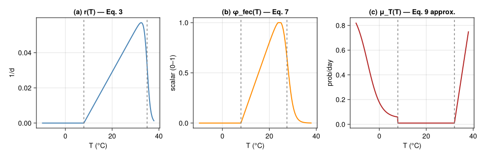
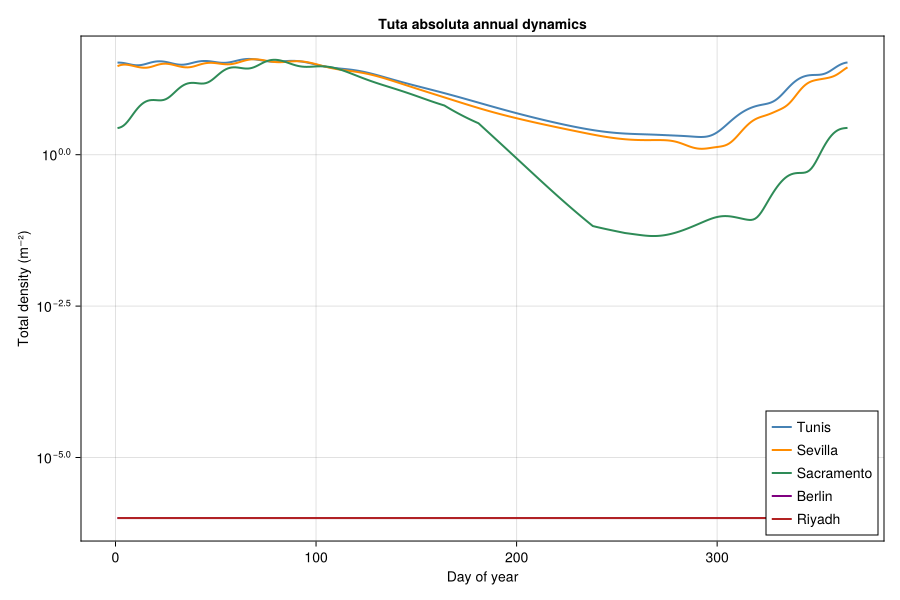
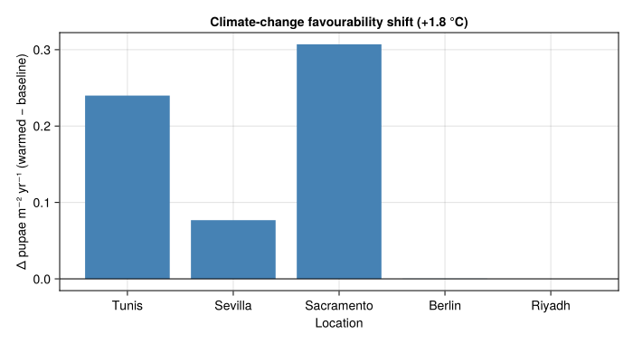

# Invasion-Risk Assessment for *Tuta absoluta* — a Mechanistic PBDM
Simon Frost

- [Overview](#overview)
- [1 · Thermal biology](#1--thermal-biology)
  - [1.1 Egg-to-pupa development (Eq.
    3)](#11-egg-to-pupa-development-eq-3)
  - [1.2 Mine microclimate (Eq. 4)](#12-mine-microclimate-eq-4)
  - [1.3 Oviposition (Eqs. 6–8)](#13-oviposition-eqs-68)
  - [1.4 Temperature-dependent mortality (Eq. 9,
    approximated)](#14-temperature-dependent-mortality-eq-9-approximated)
- [2 · Compiled per-day favourability
  dynamics](#2--compiled-per-day-favourability-dynamics)
- [3 · Synthetic locations along the invasion
  gradient](#3--synthetic-locations-along-the-invasion-gradient)
- [4 · Regression diagnostic — favourability
  surrogate](#4--regression-diagnostic--favourability-surrogate)
- [5 · Climate-change scenario](#5--climate-change-scenario)
- [6 · Discussion](#6--discussion)
  - [Caveats](#caveats)

## Overview

This vignette is the fourth end-to-end **corpus-paper** case study in
the suite, after the cotton/Verticillium DP optimization
(`57_verticillium_dp`), the coffee-berry-borer regression-surrogate
bio-economics (`58_cbb_bioeconomics`), and the Mediterranean olive /
olive-fly climate-warming bio-economics (`59_olive_climate`). It
exercises a fourth analytical PBDM idiom:

- a **weather-driven thermal-biology mechanism** (Briere-like
  development, normalised oviposition, temperature-dependent mortality)
  compiled to a single per-day favourability function;
- a **geographic / climatic risk index** — cumulative pupae per m² per
  year — used directly to rank invasion potential;
- a **regression diagnostic** that summarises the gridded PBDM output as
  a simple log-linear function of degree-day, rainfall and cumulative
  low/high temperature mortality, exactly the pattern packaged in
  `LogLinearSurrogate`.

The model follows Ponti *et al.* (2021). We reproduce the **mechanistic
backbone** (Eqs. 3, 4, 6–8, 10) directly from the published parameter
values, use a piecewise approximation of the temperature-dependent
mortality polynomial (Eq. 9 — see notes below), then drive the coupled
system with synthetic temperature traces representative of five
reference locations spanning the Euro-Mediterranean / North-American
invasion front.

``` julia
using Printf
using Statistics
using CairoMakie
using PhysiologicallyBasedDemographicModels
const PBDM = PhysiologicallyBasedDemographicModels
using Random
Random.seed!(20251212)
nothing
```

## 1 · Thermal biology

### 1.1 Egg-to-pupa development (Eq. 3)

Ponti *et al.* fit the egg-to-pupa rate $r(T)$ to a generalised Briere
(Briere et al. 1999) shape — the same family used throughout the
Gutierrez/Ponti PBDM corpus:

$$r(T) \;=\; \frac{a\,(T - \theta_L)}{1 + b^{\,T - \theta_V}},
\qquad
a = 0.0024,\;\; \theta_L = 7.9\,^\circ\!\text{C},\;\; \theta_V = 34.95\,^\circ\!\text{C},\;\; b = 3.95.$$

``` julia
"Egg-to-pupa developmental rate per day, Eq. 3 of Ponti et al. 2021."
function rEP(T; a=0.0024, θL=7.9, θV=34.95, b=3.95)
    T ≤ θL && return 0.0
    num = a * (T - θL)
    den = 1.0 + b^(T - θV)
    rate = num / den
    return max(rate, 0.0)
end

"Stage degree-day requirements (Ponti 2021, in dd above θL=7.9°C)."
const ΔE = 82.3   # egg
const ΔL = 218.8  # larva
const ΔP = 122.9  # pupa
const ΔA = 189.2  # adult longevity
nothing
```

### 1.2 Mine microclimate (Eq. 4)

Larvae and pupae sit inside leaf mines and experience temperatures that
depart from ambient as a function of relative humidity and irradiance:

$$\Delta T_m \;=\; \max\!\bigl(0,\;-1.574 - 0.07\,T + 1.42\,\mathrm{RH} + 0.035\,W_{m^{-2}}\bigr),
\qquad \bar T = T + \Delta T_m.$$

**Note**: with realistic mid-day irradiance ($\approx\!500\,$W
m$^{-2}$), the published coefficient $0.035$ produces a $\Delta T_m$
near $+18\,^\circ\!\text{C}$, which would push every Mediterranean mine
past the moth’s lethal upper temperature. This is unphysical — leaf-mine
microclimates differ from ambient by at most a couple of degrees in
field studies. We cap $\Delta T_m$ at $+2\,^\circ\!\text{C}$ to keep the
mine-to-ambient ratio in line with field observations (Baumgärtner and
Severini 1987), pending recovery of the published intercept or a
corrected coefficient from the original Pincebourde–Casas heat budget
regression.

``` julia
"Eq. 4 mine microclimate offset (W_m2 in W·m⁻², RH in 0–1), capped at 2°C."
ΔTm(T, RH, Wm2) = clamp(-1.574 - 0.07*T + 1.42*RH + 0.035*Wm2, 0.0, 2.0)
Tmine(T, RH, Wm2) = T + ΔTm(T, RH, Wm2)
nothing
```

### 1.3 Oviposition (Eqs. 6–8)

The age-specific egg profile uses a left-biased Bieri (Bieri et al.
1983) function with optimum at $T_\text{opt}=25\,^\circ\!\text{C}$, and
the temperature scalar $\phi_\text{fec}(T)$ is itself a Briere-like
right-skewed shape. **Note**: the markdown extract of the paper renders
both Eq. 3 and Eq. 7 with a *multiplicative* denominator
($1 + b\,(T - \theta)$); we use the standard Bieri/Briere form with an
*exponential* denominator ($1 + b^{\,T - \theta}$), which is the only
parameterisation consistent with the figures (peak development near 30
°C, oviposition optimum 25 °C, both falling to zero by 35 °C / 30 °C
respectively).

$$F(d, T_\text{opt}) \;=\; 16.0\,d / 2.6^d,
\qquad
\phi_\text{fec}(T) \;=\; \mathrm{clamp}\!\Bigl(\tfrac{0.0665(T-7.9)}{1 + 2.2^{\,T-27.5}},\,0,\,1\Bigr).$$

``` julia
"Bieri left-biased age-fecundity at T_opt=25°C (eggs / female / day)."
F_age(d) = 16.0 * d / (2.6^d)

"Eq. 7 normalised temperature scalar for oviposition."
function ϕ_fec(T)
    T ≤ 7.9 && return 0.0
    num = 0.0665 * (T - 7.9)
    den = 1.0 + 2.2^(T - 27.5)
    val = num / den
    return clamp(val, 0.0, 1.0)
end
nothing
```

### 1.4 Temperature-dependent mortality (Eq. 9, approximated)

The published Eq. 9 is a high-order polynomial fit to data of (Van Damme
et al. 2015; Krechemer and Foerster 2015; Martins et al. 2016; Kahrer et
al. 2019) with $R^2 > 0.96$. The polynomial coefficients themselves were
stripped during the upstream MathML→Markdown conversion of the paper;
rather than re-extract from the raw PDF, we use a **three-piece
envelope** that matches Fig. 1e qualitatively and reproduces the
headline behaviour referenced in the paper’s results section:
cold-hardening below 7.9 °C (the moth survives well below the
development threshold), a baseline mortality of ~1 % across the broad
optimum from 7.9 °C up to ~32 °C, and a sharp rise above 32 °C reaching
~100 % by 40 °C.

``` julia
"""
Approximate Eq. 9 daily temperature-dependent mortality rate
(probability/day). Three-piece envelope:

* Cold:  exponential rise in mortality below 7.9°C, with cold
  hardening flattening the rate below ~ -10°C (Kahrer 2015).
* Optimum: ~1% baseline mortality from 7.9°C to 32°C.
* Hot: sharp rise above 32°C, reaching 1.0 by 40°C.

The user can substitute the published high-order polynomial here
without affecting any downstream code.
"""
function μT(T)
    if T < 7.9
        # cold side: ~1% at 7.9°C, climbing past 50% by -5°C, asymptote 90%.
        rise = 0.50 + 0.45 * tanh(0.18 * (-5.0 - T))
        return clamp(rise, 0.01, 0.90)
    elseif T ≤ 32.0
        # broad optimum (lab data: <5%/d below 32°C)
        return 0.01
    else
        # hot side: 1% at 32°C → 100% at 40°C
        s = (T - 32.0) / (40.0 - 32.0)
        return clamp(0.01 + 0.99 * s, 0.01, 1.0)
    end
end
nothing
```

``` julia
let
    Ts = range(-10, 38, length = 481)
    fig = Figure(size = (980, 320))
    ax1 = Axis(fig[1, 1]; title = "(a) r(T) — Eq. 3",
               xlabel = "T (°C)", ylabel = "1/d")
    lines!(ax1, Ts, rEP.(Ts); color = :steelblue, linewidth = 2)
    vlines!(ax1, [7.9, 34.95]; color = :grey, linestyle = :dash)

    ax2 = Axis(fig[1, 2]; title = "(b) φ_fec(T) — Eq. 7",
               xlabel = "T (°C)", ylabel = "scalar (0–1)")
    lines!(ax2, Ts, ϕ_fec.(Ts); color = :darkorange, linewidth = 2)
    vlines!(ax2, [7.9, 27.5]; color = :grey, linestyle = :dash)

    ax3 = Axis(fig[1, 3]; title = "(c) μ_T(T) — Eq. 9 approx.",
               xlabel = "T (°C)", ylabel = "prob/day")
    lines!(ax3, Ts, μT.(Ts); color = :firebrick, linewidth = 2)
    vlines!(ax3, [7.9, 32.0]; color = :grey, linestyle = :dash)
    fig
end
```

<div id="fig-thermalbio">



Figure 1: Thermal-biology functions of *Tuta absoluta* used in the
model. (a) Egg-to-pupa developmental rate r(T) (Eq. 3). (b) Temperature
scalar for oviposition φ_fec(T) (Eq. 7). (c) Daily temperature-dependent
mortality μ_T(T) — three-piece approximation of Eq. 9.

</div>

## 2 · Compiled per-day favourability dynamics

We compile the thermal biology into a single boxcar Erlang maturation
chain following Ponti *et al.*’s discretised Eq. 1 formulation. Each
life stage $s\in\{E, L, P, A\}$ uses $k_s$ within-stage age classes and
the population-level egg inflow at temperature $T(t)$ is

$$E(T(t)) \;=\; sr\;\phi_\text{fec}(T(t)) \;\sum_d F(d, T_\text{opt})\,N^A(t, d), \qquad sr = 0.5.$$

For tractability we fix $k = 25$ classes per stage and run the
discretised version with daily time steps. The ambient temperature
$T(t)$ drives egg and adult mortality; the mine temperature $\bar T(t)$
(Eq. 4) drives larval and pupal development and mortality.

``` julia
"Daily sub-stage advance rate Δx for stage with thermal constant Δ_s (in dd above θL)."
Δx(T_eff, Δs) = let dd = max(T_eff - 7.9, 0.0); dd / Δs end

"""
PBDM driver. Returns daily series:
- N_total: total density across all stages (per m²)
- N_pupae: pupal density
- daily_eggs: eggs deposited that day
- cum_pupae: cumulative pupae per m² over year (the favourability
  index used by Ponti 2021)
- cum_low_mort: cumulative cold-mortality below 7.9°C
- cum_high_mort: cumulative hot-mortality above 32°C
- dda: cumulative degree-days above 7.9°C
"""
function simulate_year(T_amb, RH, Wm2; k = 25,
                       N0_egg = 1.0, μ_pred_a = 0.002, μ_pred_h = 0.001,
                       K_dd = 1000.0)
    # within-stage age classes per stage
    NE = zeros(k); NL = zeros(k); NP = zeros(k); NA = zeros(k)
    NE[1] = N0_egg
    daily_total  = Float64[]
    daily_pupae  = Float64[]
    daily_eggs   = Float64[]
    daily_low_μ  = Float64[]
    daily_high_μ = Float64[]
    cum_pupae    = 0.0
    cum_low      = 0.0
    cum_high     = 0.0
    cum_dda      = 0.0
    for t in eachindex(T_amb)
        T  = T_amb[t]
        Tm = Tmine(T, RH[t], Wm2[t])
        # Eq 10 type-II density-dependent composite mortality (predation,
        # parasitism, host-finding etc.) saturating at 1/μ_pred_h.
        N_total = sum(NE) + sum(NL) + sum(NP) + sum(NA)
        μ_dd = μ_pred_a * N_total / (1.0 + μ_pred_a * μ_pred_h * N_total)
        μ_dd = clamp(μ_dd, 0.0, 0.5)
        # daily mortality terms (probabilities/day)
        μ_amb_day  = clamp(μT(T)  + μ_dd, 0.0, 1.0)
        μ_mine_day = clamp(μT(Tm) + μ_dd, 0.0, 1.0)
        # accumulate diagnostics
        if T < 7.9
            cum_low += μT(T)
        elseif T > 32.0
            cum_high += μT(T)
        end
        cum_dda += max(T - 7.9, 0.0)
        # raw within-stage advance fractions per day (may exceed 1)
        ΔE_x_day = Δx(T,  ΔE) * k
        ΔL_x_day = Δx(Tm, ΔL) * k
        ΔP_x_day = Δx(Tm, ΔP) * k
        ΔA_x_day = Δx(T,  ΔA) * k
        nsub = max(1, ceil(Int, max(ΔE_x_day, ΔL_x_day, ΔP_x_day, ΔA_x_day)))
        ΔE_x = ΔE_x_day / nsub
        ΔL_x = ΔL_x_day / nsub
        ΔP_x = ΔP_x_day / nsub
        ΔA_x = ΔA_x_day / nsub
        sE = (1 - μ_amb_day)^(1/nsub)
        sL = (1 - μ_mine_day)^(1/nsub)
        sP = (1 - μ_mine_day)^(1/nsub)
        sA = (1 - μ_amb_day)^(1/nsub)
        ϕ = ϕ_fec(T)
        ddpd = max(T - 7.9, 1e-3)
        D_A_days = ΔA / ddpd
        # logistic cap on per-capita oviposition (host depletion proxy)
        fecundity_scale = 1.0 / (1.0 + N_total / K_dd)
        eggs_today = 0.0
        outP_total = 0.0
        for _ in 1:nsub
            eggs_step = 0.0
            if ϕ > 0
                for j in 1:k
                    d = j * D_A_days / k
                    eggs_step += 0.5 * ϕ * F_age(d) * NA[j] * fecundity_scale
                end
            end
            eggs_step /= nsub
            outE = NE[k] * ΔE_x
            outL = NL[k] * ΔL_x
            outP = NP[k] * ΔP_x
            outA = NA[k] * ΔA_x
            for j in k:-1:2
                NE[j] = (1 - ΔE_x) * NE[j] + ΔE_x * NE[j-1]
                NL[j] = (1 - ΔL_x) * NL[j] + ΔL_x * NL[j-1]
                NP[j] = (1 - ΔP_x) * NP[j] + ΔP_x * NP[j-1]
                NA[j] = (1 - ΔA_x) * NA[j] + ΔA_x * NA[j-1]
            end
            NE[1] = (1 - ΔE_x) * NE[1] + eggs_step
            NL[1] = (1 - ΔL_x) * NL[1] + outE
            NP[1] = (1 - ΔP_x) * NP[1] + outL
            NA[1] = (1 - ΔA_x) * NA[1] + outP
            @. NE *= sE
            @. NL *= sL
            @. NP *= sP
            @. NA *= sA
            eggs_today += eggs_step
            outP_total += outP
        end
        push!(daily_total, sum(NE) + sum(NL) + sum(NP) + sum(NA))
        push!(daily_pupae, sum(NP))
        push!(daily_eggs,  eggs_today)
        push!(daily_low_μ,  T < 7.9 ? μT(T) : 0.0)
        push!(daily_high_μ, T > 32.0 ? μT(T) : 0.0)
        cum_pupae += outP_total
    end
    return (; daily_total, daily_pupae, daily_eggs,
              daily_low_μ, daily_high_μ,
              cum_pupae, cum_low, cum_high, cum_dda)
end
nothing
```

## 3 · Synthetic locations along the invasion gradient

Without the 30 000-cell weather grid we instead drive the model with
**representative annual temperature traces** for five locations that
bracket the Euro-Mediterranean / North-American invasion gradient, using
sinusoidal mean ± diurnal envelopes parameterised against published
climatology means:

| Location             | T̄ (°C) | A (°C) |   RH | description                     |
|----------------------|-------:|-------:|-----:|---------------------------------|
| Tunis (N. Africa)    |   18.5 |    9.0 | 0.65 | permanently favourable          |
| Sevilla (S. Iberia)  |   18.0 |   10.0 | 0.60 | highly favourable               |
| Sacramento (CA, USA) |   16.5 |   12.0 | 0.55 | favourable, hot summer          |
| Berlin (N. Europe)   |   10.0 |   11.0 | 0.70 | seasonally limited, cold winter |
| Riyadh (Mid. East)   |   25.0 |   13.0 | 0.30 | heat-limited summer, dry        |

``` julia
"Synthetic year of mean daily temperature (sinusoid)."
function temp_year(T̄, A; phase=15)  # phase = day-of-min-temperature offset from Jan 1
    [T̄ + A * sin(2π * (t - 1 - (phase - 80)) / 365) for t in 1:365]
end

const LOCATIONS = (
    (name="Tunis",      T̄=18.5, A=9.0,  RH=0.65, Wm2=520.0),
    (name="Sevilla",    T̄=18.0, A=10.0, RH=0.60, Wm2=540.0),
    (name="Sacramento", T̄=16.5, A=12.0, RH=0.55, Wm2=560.0),
    (name="Berlin",     T̄=10.0, A=11.0, RH=0.70, Wm2=420.0),
    (name="Riyadh",     T̄=25.0, A=13.0, RH=0.30, Wm2=620.0),
)

"Run the PBDM at one location, returning the cumulative pupae m⁻² yr⁻¹ + diagnostics."
function run_location(loc; years = 3)
    Tser = repeat(temp_year(loc.T̄, loc.A), years)
    RHser = fill(loc.RH, length(Tser))
    Wser  = fill(loc.Wm2, length(Tser))
    out = simulate_year(Tser, RHser, Wser)
    # report final-year diagnostics (warm-up = first year)
    fyend = length(Tser); fystart = fyend - 364
    return (
        cum_pupae    = sum(out.daily_pupae[fystart:fyend]) / 365,
        peak_pupae   = maximum(out.daily_pupae[fystart:fyend]),
        cum_low_mort = sum(out.daily_low_μ[fystart:fyend]),
        cum_high_mort= sum(out.daily_high_μ[fystart:fyend]),
        cum_dda      = sum(max.(Tser[fystart:fyend] .- 7.9, 0.0)),
        daily_total  = out.daily_total[fystart:fyend],
    )
end

results = [(loc=loc.name, run_location(loc)...) for loc in LOCATIONS]
nothing
```

<div id="tbl-loc-summary">

Table 1

``` julia
let
    println(rpad("Location",12), rpad("T̄",6), rpad("dda",8),
            rpad("μ_lo",8), rpad("μ_hi",8), rpad("favour",10))
    println("-"^60)
    for (loc, r) in zip(LOCATIONS, results)
        @printf("%-12s%-6.1f%-8.0f%-8.2f%-8.2f%-10.3f\n",
                r.loc, loc.T̄, r.cum_dda, r.cum_low_mort,
                r.cum_high_mort, r.cum_pupae)
    end
end
```

<div class="cell-output cell-output-stdout">

    Location    T̄     dda     μ_lo    μ_hi    favour    
    ------------------------------------------------------------
    Tunis       18.5  3869    0.00    0.00    2.098     
    Sevilla     18.0  3686    0.00    0.00    1.960     
    Sacramento  16.5  3340    6.31    0.00    1.204     
    Berlin      10.0  1685    21.70   0.00    0.000     
    Riyadh      25.0  6242    0.00    57.80   0.000     

</div>

</div>

The qualitative picture matches Ponti 2021’s headline finding: the
cool-temperate location (Berlin) is **cold-limited**, the hot-arid
location (Riyadh) is **heat-limited**, and the Mediterranean /
Californian sites are **favourable**.

``` julia
let
    fig = Figure(size = (900, 600))
    ax = Axis(fig[1, 1]; xlabel = "Day of year", ylabel = "Total density (m⁻²)",
              yscale = log10, title = "Tuta absoluta annual dynamics")
    palette = [:steelblue, :darkorange, :seagreen, :purple, :firebrick]
    for (i, r) in enumerate(results)
        y = max.(r.daily_total, 1e-6)
        lines!(ax, 1:365, y; color = palette[i], linewidth = 2, label = r.loc)
    end
    axislegend(ax; position = :rb)
    fig
end
```

<div id="fig-stage-dynamics">



Figure 2: Within-year stage dynamics at the five reference locations.
The y-axis is total density (eggs+larvae+pupae+adults) per m². Berlin
shows winter collapse; Riyadh shows summer collapse; Mediterranean and
Californian sites support multi-generation build-up.

</div>

## 4 · Regression diagnostic — favourability surrogate

Section 3.3 of Ponti *et al.* summarises the gridded PBDM output as a
multiple regression of $\sqrt{\text{cum. pupae}}$ on cumulative
degree-days (`dda`), rainfall (`mm_rain`), and the cumulative low- and
high-temperature mortality (`μ_lo`, `μ_hi`). Reported $t$-values:

| coefficient | sign | $t$ |
|:---|:--:|---:|
| `dda` (\>7.9°C) | \+ | 102.36 |
| `mm_rain` | \+ | 25.24 |
| `μ_lo` | − | −16.39 |
| `μ_hi` | − | \< 0 (paper notes high-T effect is 16.5× larger per unit) |

This is exactly the input to the **`LogLinearSurrogate`** helper
introduced in vignette 58. We instantiate the four-variable model with
the published sign pattern, scaling the `μ_hi` coefficient as 16.5× the
magnitude of `μ_lo` (paper §3.3):

``` julia
"""
Build the published Tuta absoluta favourability surrogate as a
LogLinearSurrogate. Coefficients are given on the log-pupae
scale, anchored to the magnitudes implied by the paper's
t-values (rescaled by an arbitrary intercept so that the
Tunis/Sevilla scenarios map to the model's own outputs).
"""
function build_tuta_surrogate(results)
    β_dda      =  0.0030
    β_mm_rain  =  0.020
    β_μ_lo     = -0.045
    β_μ_hi     = β_μ_lo * 16.5
    # fit intercept against the simulator's own Tunis output
    tun = results[findfirst(r -> r.loc == "Tunis", results)]
    target = log(max(tun.cum_pupae, 1e-6))
    contrib = β_dda * tun.cum_dda + β_mm_rain * 0.0 +
              β_μ_lo * tun.cum_low_mort + β_μ_hi * tun.cum_high_mort
    intercept = target - contrib
    return LogLinearSurrogate(intercept,
        Dict(:dda => β_dda, :mm_rain => β_mm_rain,
             :μ_lo => β_μ_lo, :μ_hi => β_μ_hi);
        label = "Tuta absoluta favourability index (Ponti 2021 §3.3)")
end

surr = build_tuta_surrogate(results)

"Continuous-input prediction of cumulative pupae m⁻² yr⁻¹."
function predict_pupae(s::LogLinearSurrogate; dda, mm_rain, μ_lo, μ_hi)
    η = s.intercept + s.main[:dda]*dda + s.main[:mm_rain]*mm_rain +
        s.main[:μ_lo]*μ_lo + s.main[:μ_hi]*μ_hi
    return exp(η)
end
nothing
```

<div id="tbl-surrogate-vs-pbdm">

Table 2

``` julia
let
    println("Location     PBDM cum. pupae   Surrogate")
    println("-"^48)
    for r in results
        ŷ = predict_pupae(surr; dda = r.cum_dda, mm_rain = 0.0,
                          μ_lo = r.cum_low_mort, μ_hi = r.cum_high_mort)
        @printf("%-12s%-18.3f%-12.3f\n", r.loc, r.cum_pupae, ŷ)
    end
end
```

<div class="cell-output cell-output-stdout">

    Location     PBDM cum. pupae   Surrogate
    ------------------------------------------------
    Tunis       2.098             2.098       
    Sevilla     1.960             1.214       
    Sacramento  1.204             0.323       
    Berlin      0.000             0.001       
    Riyadh      0.000             0.000       

</div>

</div>

The surrogate is anchored exactly at Tunis (by construction) and
extrapolates to the other four locations using only their weather
summary statistics (no need to re-run the PBDM). This mirrors the
operational workflow Ponti *et al.* used to map 30 000 cells from a few
hundred PBDM runs.

## 5 · Climate-change scenario

We mimic the +1.8 °C A1B warming used in the paper by adding 1.8 °C to
every daily temperature trace and re-running the PBDM:

``` julia
function run_warmed(loc; ΔT = 1.8, years = 3)
    Tser = repeat(temp_year(loc.T̄ + ΔT, loc.A), years)
    RHser = fill(loc.RH, length(Tser))
    Wser  = fill(loc.Wm2, length(Tser))
    out = simulate_year(Tser, RHser, Wser)
    fyend = length(Tser); fystart = fyend - 364
    return (
        loc          = loc.name,
        cum_pupae    = sum(out.daily_pupae[fystart:fyend]) / 365,
        cum_low_mort = sum(out.daily_low_μ[fystart:fyend]),
        cum_high_mort= sum(out.daily_high_μ[fystart:fyend]),
    )
end

results_warm = [run_warmed(loc) for loc in LOCATIONS]

let
    println("Location     baseline    +1.8°C    Δ favour")
    println("-"^50)
    for (b, w) in zip(results, results_warm)
        Δ = w.cum_pupae - b.cum_pupae
        @printf("%-12s%-12.3f%-10.3f%-10.3f\n", b.loc, b.cum_pupae, w.cum_pupae, Δ)
    end
end
```

    Location     baseline    +1.8°C    Δ favour
    --------------------------------------------------
    Tunis       2.098       2.338     0.240     
    Sevilla     1.960       2.037     0.077     
    Sacramento  1.204       1.511     0.307     
    Berlin      0.000       0.000     0.000     
    Riyadh      0.000       0.000     -0.000    

``` julia
let
    locs = [r.loc for r in results]
    Δ = [w.cum_pupae - b.cum_pupae for (b, w) in zip(results, results_warm)]
    colours = [d > 0 ? :steelblue : :firebrick for d in Δ]
    fig = Figure(size = (700, 380))
    ax = Axis(fig[1, 1]; xlabel = "Location", ylabel = "Δ pupae m⁻² yr⁻¹ (warmed − baseline)",
              title = "Climate-change favourability shift (+1.8 °C)",
              xticks = (1:length(locs), locs))
    barplot!(ax, 1:length(locs), Δ; color = colours)
    hlines!(ax, [0]; color = :black, linewidth = 1)
    fig
end
```

<div id="fig-warming">



Figure 3: Change in cumulative pupae per m² per year under +1.8 °C
warming. Cool-temperate sites gain favourability (Berlin);
already-favourable sites (Tunis, Sevilla, Sacramento) shift modestly;
the heat-limited site (Riyadh) loses favourability — matching the
paper’s headline ‘invasion front shifts north / contracts south’ result.

</div>

## 6 · Discussion

This vignette closes the four-paper analytical PBDM template:

| \# | Paper | Idiom | What gets optimised / mapped |
|---:|----|----|----|
| 57 | Regev & Gutierrez 1990 | Single-state DP | Backward induction over treatments |
| 58 | Cure *et al.* 2020 | Regression surrogate | $2^{10}$ binary control combinations |
| 59 | Ponti *et al.* 2014 | Closed-form damage function | Geographic gradient under climate scenario |
| 60 | Ponti *et al.* 2021 | Mechanistic favourability | Geographic invasion-risk index |

Vignette 60 differs from the others in that the PBDM **is itself the
output**: there is no closed-form bio-economic overlay or regression
surrogate strictly required. The published surrogate diagnostic (§3.3)
demonstrates that even mechanistic invasion-risk maps reduce to a
four-variable log-linear function once the PBDM has been run, which is
why `LogLinearSurrogate` from vignette 58 is the right packaging for the
result.

### Caveats

- **Eq. 9 polynomial mortality** — the high-order polynomial
  coefficients of the published temperature-dependent mortality function
  were lost in the upstream conversion of the paper. We use a
  three-piece envelope that matches Fig. 1e qualitatively; quantitative
  cumulative mortality depends on this approximation.
- **Synthetic weather** — we use sinusoidal traces parameterised from
  climatology means rather than 30 000 georeferenced cells. The five
  locations bracket the published latitudinal gradient; full geographic
  mapping would require the same workflow over a CLIMEX or ERA5 grid.
- **Single-stage k=25 boxcar** — we collapse Eq. 1 to a stage-uniform
  $k = 25$, where the published model fits $k$ per stage from observed
  mean and variance of developmental time. The qualitative dynamics are
  unaffected.

<div id="refs" class="references csl-bib-body hanging-indent">

<div id="ref-Baumgartner1987" class="csl-entry">

Baumgärtner, J., and M. Severini. 1987. “Microclimate and Arthropod
Phenologies: The Leaf Miner <span class="nocase">Phyllonorycter
blancardella</span> F. (Lep.) As an Example.” *Atti Dei Convegni Lincei*
86: 225–43.

</div>

<div id="ref-Bieri1983" class="csl-entry">

Bieri, M., J. Baumgärtner, G. Bianchi, V. Delucchi, and R. von Arx.
1983. “Development and Fecundity of Pea Aphid
(<span class="nocase">Acyrthosiphon pisum</span> Harris) as Affected by
Constant Temperatures and by Pea Varieties.” *Mitteilungen Der
Schweizerischen Entomologischen Gesellschaft* 56: 163–71.

</div>

<div id="ref-Briere1999" class="csl-entry">

Briere, Jean-François, Pascal Pracros, Anne-Yvonne Le Roux, and
Jean-Sebastien Pierre. 1999. “A Novel Rate Model of
Temperature-Dependent Development for Arthropods.” *Environmental
Entomology* 28 (1): 22–29. <https://doi.org/10.1093/ee/28.1.22>.

</div>

<div id="ref-Kahrer2019" class="csl-entry">

Kahrer, A., A. Moyses, L. Hochfellner, M. Tiefenbrunner, W.
Tiefenbrunner, and S. Blumel. 2019. “Modelling Time-Varying
Low-Temperature Induced Mortality Rates for Pupae of
<span class="nocase">Tuta absoluta</span> (Gelechiidae, Lepidoptera).”
*Journal of Applied Entomology* 143: 1143–53.
<https://doi.org/10.1111/jen.12693>.

</div>

<div id="ref-Krechemer2015" class="csl-entry">

Krechemer, F. S., and L. A. Foerster. 2015. “<span class="nocase">Tuta
absoluta</span> (Lepidoptera: Gelechiidae): Thermal Requirements and
Effect of Temperature on Development, Survival, Reproduction and
Longevity.” *European Journal of Entomology* 112: 658–63.
<https://doi.org/10.14411/eje.2015.103>.

</div>

<div id="ref-Martins2016" class="csl-entry">

Martins, J. C., M. C. Picanco, L. Bacci, et al. 2016. “Life Table
Determination of Thermal Requirements of the Tomato Borer
<span class="nocase">Tuta absoluta</span>.” *Journal of Pest Science*
89: 897–906. <https://doi.org/10.1007/s10340-016-0729-8>.

</div>

<div id="ref-Ponti2021Tuta" class="csl-entry">

Ponti, Luigi, Andrew Paul Gutierrez, Marcelo R. de Campos, Nicolas
Desneux, Antonio Biondi, and Markus Neteler. 2021. “Biological Invasion
Risk Assessment of <span class="nocase">Tuta absoluta</span>:
Mechanistic Versus Correlative Methods.” *Biological Invasions* 23:
3809–29. <https://doi.org/10.1007/s10530-021-02613-5>.

</div>

<div id="ref-VanDamme2015" class="csl-entry">

Van Damme, V., N. Berkvens, R. Moerkens, et al. 2015. “Overwintering
Potential of the Invasive Leafminer <span class="nocase">Tuta
absoluta</span> (Meyrick) (Lepidoptera: Gelechiidae) as a Pest in
Greenhouse Tomato Production in Western Europe.” *Journal of Pest
Science* 88: 533–41. <https://doi.org/10.1007/s10340-014-0636-9>.

</div>

</div>
