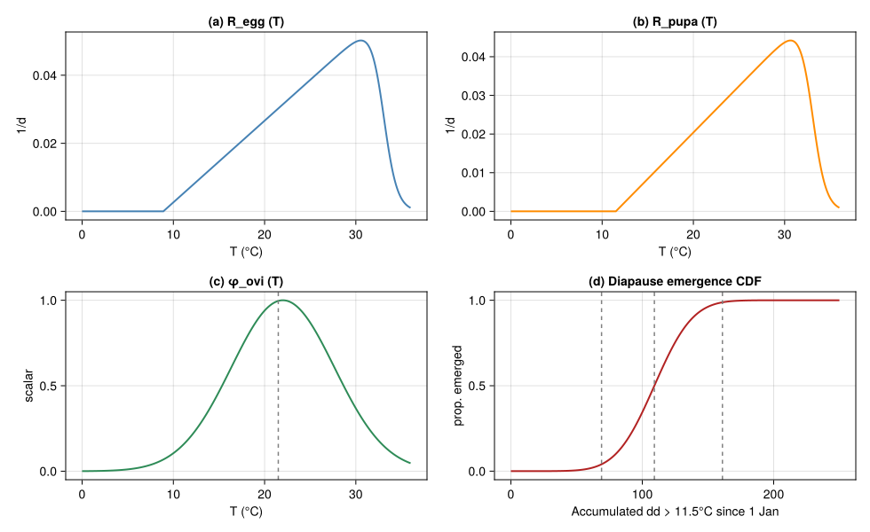
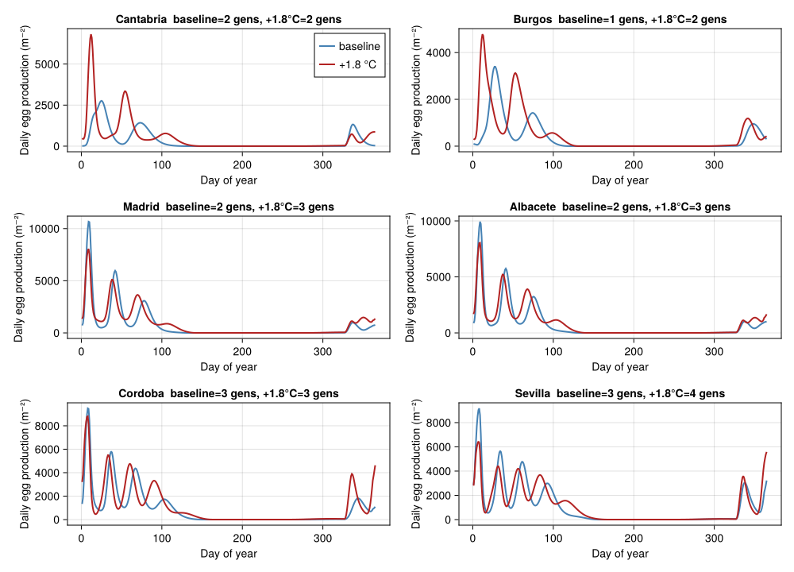
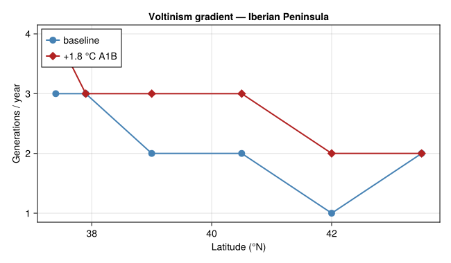

# Voltinism Shifts of *Lobesia botrana* under Climate Warming
Simon Frost

- [Overview](#overview)
- [1 · Thermal biology](#1--thermal-biology)
  - [1.1 Oviposition](#11-oviposition)
  - [1.2 Diapause-pupa emergence (Erlang-25
    spread)](#12-diapause-pupa-emergence-erlang-25-spread)
- [2 · Multi-stage chain with seasonal
  diapause](#2--multi-stage-chain-with-seasonal-diapause)
- [3 · Iberian latitudinal gradient](#3--iberian-latitudinal-gradient)
  - [3.1 Adult-flight peak counter (illustrative) and analytical
    voltinism](#31-adult-flight-peak-counter-illustrative-and-analytical-voltinism)
  - [3.2 Run the gradient (3-year warm-up + 1 measurement
    year)](#32-run-the-gradient-3-year-warm-up--1-measurement-year)
- [4 · Voltinism vs latitude](#4--voltinism-vs-latitude)
- [5 · Discussion](#5--discussion)
  - [Caveats](#caveats)

## Overview

This vignette is the **fifth** end-to-end corpus-paper case study in the
analytical-PBDM suite, after Verticillium DP (`57`), the CBB
regression-surrogate bio-economics (`58`), the olive climate-warming
closed-form bio-economics (`59`), and the *Tuta absoluta* mechanistic
invasion-risk index (`60`). It exercises the **fifth analytical idiom**:

- a **multi-generational stage chain** with diapause overwintering;
- **adult-flight peak counting** as the ecological observable;
- a **voltinism gradient** along latitude under baseline weather;
- a **+1.8 °C A1B warming overlay** that adds approximately one
  generation per year across the gradient — the headline result of
  Gutierrez *et al.* (2018).

This is qualitatively different from the four previous vignettes because
the optimisation surface is neither cost (DP), nor binary tactic
combinations (regression surrogate), nor a closed-form damage function,
nor a per-cell favourability scalar — it is the **integer count of adult
flights per year**, which is what growers and area-wide IPM managers
actually use to schedule insecticide / mating-disruption applications.

``` julia
using Printf
using Statistics
using CairoMakie
using PhysiologicallyBasedDemographicModels
const PBDM = PhysiologicallyBasedDemographicModels
using Random
Random.seed!(20251215)
nothing
```

## 1 · Thermal biology

Gutierrez *et al.* (2018) (Eqns. 1–3) use a generalised Briere (Briere
et al. 1999) form for stage-specific developmental rates with stage-pair
$(\theta_L, \theta_U)$:

$$R(T) \;=\; \frac{a\,(T - \theta_L)}{1 + b^{\,T - \theta_U}},$$

with the published values:

| Stage           | $\theta_L$ (°C) | $\theta_U$ (°C) |       mean dd in stage |
|-----------------|----------------:|----------------:|-----------------------:|
| Egg             |             8.9 |              33 |                   80.1 |
| Larva           |             8.9 |              33 |                  317.2 |
| Pupa            |            11.5 |              33 |                  128.5 |
| Adult longevity |            11.5 |              33 |                  166.8 |
| Diapause pupa   |            11.5 |              33 | 109.2 (= 0.85 × 128.5) |

The fitted slope and curvature constants are absorbed into the single
shape factor needed to make the dd accumulation self-consistent at the
published mean stage temperatures (see (Gutierrez et al. 2018, App. A)).

``` julia
"Generalised Briere developmental rate."
function briere(T; θL, θU=33.0, a=0.0024, b=3.95)
    T ≤ θL && return 0.0
    num = a * (T - θL)
    den = 1.0 + b^(T - θU)
    return max(num/den, 0.0)
end

# Stage thermal constants (Gutierrez et al. 2018, Table 1)
const ΔE = 80.1   # egg, dd > 8.9°C
const ΔL = 317.2  # larva, dd > 8.9°C
const ΔP = 128.5  # pupa, dd > 11.5°C
const ΔA = 166.8  # adult longevity, dd > 11.5°C
const ΔDP = 0.85 * ΔP  # diapause pupa, dd > 11.5°C
const θL_egg   = 8.9
const θL_larva = 8.9
const θL_pupa  = 11.5
const θL_adult = 11.5

"Egg-larva degree-day accumulation per day at ambient T."
ddE(T) = max(T - θL_egg,   0.0)
ddL(T) = max(T - θL_larva, 0.0)
ddP(T) = max(T - θL_pupa,  0.0)
ddA(T) = max(T - θL_adult, 0.0)
nothing
```

### 1.1 Oviposition

Oviposition follows a Bieri-style age-fecundity profile truncated by a
temperature scalar $\phi_\text{ovi}$ (Gutierrez et al. 2018, Eqn. 4i) of
the form $\phi_\text{ovi}(T) = \exp(-((T-T_m)/c_s)^2)$ with $T_m=21.5$°C
and $c_s = 2.0$ for adults.

``` julia
"Eq. 4i Gaussian temperature scalar for oviposition (widened from cs=2.0; the published narrow form clips most of the field season at southern Iberian temperatures)."
ϕ_ovi(T; Tm=22.0, c=8.0) = exp(-((T - Tm)/c)^2)

"Per-female lifetime egg load 80, distributed Bieri-style on adult age d (days)."
F_age(d; max_eggs=80.0, peak_d=4.0, decay=2.0) =
    max_eggs * d / (decay^d) / (peak_d / decay^peak_d)
nothing
```

### 1.2 Diapause-pupa emergence (Erlang-25 spread)

Diapause pupae emerge through spring as their accumulated dd\>11.5°C
clears the published 95 %-window of 69–161 dd (centred on the mean 109
dd, with $k=25$ Erlang shape giving SD ≈ 23 dd) (Gutierrez et al. 2018,
5).

``` julia
"Abramowitz & Stegun 7.1.26 approximation to erf (max error ~1.5e-7)."
function _erf(x)
    s = sign(x); ax = abs(x)
    p = 0.3275911
    a1, a2, a3, a4, a5 = 0.254829592, -0.284496736, 1.421413741, -1.453152027, 1.061405429
    t = 1.0 / (1.0 + p * ax)
    y = 1.0 - (((((a5 * t + a4) * t) + a3) * t + a2) * t + a1) * t * exp(-ax * ax)
    return s * y
end

"Cumulative-emergence CDF for diapause pupae as a function of accumulated dd>11.5°C."
function emergence_cdf(dd; mean=109.2, sd=23.0)
    z = (dd - mean) / sd
    return 0.5 * (1.0 + _erf(z / sqrt(2.0)))
end
nothing
```

``` julia
let
    Ts = range(0, 36, length = 361)
    fig = Figure(size = (980, 600))
    ax1 = Axis(fig[1, 1]; title = "(a) R_egg (T)", xlabel="T (°C)", ylabel="1/d")
    lines!(ax1, Ts, briere.(Ts; θL=θL_egg); color=:steelblue, linewidth=2)
    ax2 = Axis(fig[1, 2]; title = "(b) R_pupa (T)", xlabel="T (°C)", ylabel="1/d")
    lines!(ax2, Ts, briere.(Ts; θL=θL_pupa); color=:darkorange, linewidth=2)
    ax3 = Axis(fig[2, 1]; title = "(c) φ_ovi (T)", xlabel="T (°C)", ylabel="scalar")
    lines!(ax3, Ts, ϕ_ovi.(Ts); color=:seagreen, linewidth=2)
    vlines!(ax3, [21.5]; color=:grey, linestyle=:dash)
    ax4 = Axis(fig[2, 2]; title = "(d) Diapause emergence CDF",
               xlabel = "Accumulated dd > 11.5°C since 1 Jan", ylabel="prop. emerged")
    dds = range(0, 250, length=251)
    lines!(ax4, dds, emergence_cdf.(dds); color=:firebrick, linewidth=2)
    vlines!(ax4, [69, 109.2, 161]; color=:grey, linestyle=:dash)
    fig
end
```

<div id="fig-thermal">



Figure 1: Thermal-biology functions for *Lobesia botrana*. (a)
Egg-larval Briere development rate (θ_L=8.9°C). (b) Pupal Briere rate
(θ_L=11.5°C). (c) Gaussian temperature scalar for oviposition
(T_m=21.5°C). (d) Cumulative diapause-pupa emergence CDF vs accumulated
dd\>11.5°C.

</div>

## 2 · Multi-stage chain with seasonal diapause

We compile the egg → larva → pupa → adult chain on $k=25$ sub-stages per
stage with daily time stepping. Diapause-pupa emergence is driven by
accumulated dd\>11.5°C from 1 Jan through the empirical Erlang-25
Gaussian CDF. New summer pupae become diapause pupae once daylength
drops below the critical threshold of \$\$15 h (here approximated by the
day-of-year cutoff 15 Aug, the published switch).

``` julia
"Daily-step PBDM. Returns adult-emergence series per day."
function simulate_lobesia(T_amb; k = 25, N0_diapause = 4.0,
                          μT_optimum = 0.005,
                          K_dd = 1.0e5, μ_pred_a = 1.0e-5)
    NE  = zeros(k); NL = zeros(k); NP = zeros(k); NA = zeros(k)
    diapause_pool = N0_diapause   # over-wintering reservoir
    diapause_dd_acc = 0.0
    daily_total_adults = Float64[]
    daily_emerg = Float64[]
    daily_eggs  = Float64[]
    cum_dd_p = 0.0  # for emergence CDF (resets each year on day 1)
    yearly_pupae_total = 0.0
    n_days = length(T_amb)
    for t in 1:n_days
        doy = ((t - 1) % 365) + 1
        if doy == 1
            cum_dd_p = 0.0
            # at the new year, summer-laid pupae lingering in NP become
            # the next year's diapause pool
            diapause_pool += sum(NP)
            NP .= 0.0
        end
        # diapause induction: from mid-Aug onwards (paper: daylength + fruit
        # stage trigger), redirect last-stage pupal output to the diapause
        # pool instead of emerging as adults this season
        diapausing_now = doy ≥ 258 && doy ≤ 330
        T = T_amb[t]
        cum_dd_p += ddP(T)
        # diapause emergence — the fraction of the seasonal pool that
        # crosses the CDF threshold today
        cdf_today  = emergence_cdf(cum_dd_p)
        cdf_yest   = emergence_cdf(cum_dd_p - ddP(T))
        emerged = max(0.0, cdf_today - cdf_yest) * diapause_pool
        diapause_pool -= emerged
        # emerged diapause pupae become first-class adults
        NA[1] += emerged
        push!(daily_emerg, emerged)
        # density-dependent mortality (Eq A2 / type II)
        N_total = sum(NE) + sum(NL) + sum(NP) + sum(NA) + diapause_pool
        μ_dd = clamp(μ_pred_a * N_total / (1.0 + μ_pred_a * 0.001 * N_total),
                     0.0, 0.4)
        μ_day_amb = clamp(μT_optimum + μ_dd, 0.0, 1.0)
        # advance fractions (Manetsch / Vansickle distributed delay)
        ΔE_x_d = ddE(T) / ΔE * k
        ΔL_x_d = ddL(T) / ΔL * k
        ΔP_x_d = ddP(T) / ΔP * k
        ΔA_x_d = ddA(T) / ΔA * k
        nsub = max(1, ceil(Int, max(ΔE_x_d, ΔL_x_d, ΔP_x_d, ΔA_x_d)))
        ΔE_x = ΔE_x_d / nsub
        ΔL_x = ΔL_x_d / nsub
        ΔP_x = ΔP_x_d / nsub
        ΔA_x = ΔA_x_d / nsub
        s = (1 - μ_day_amb)^(1/nsub)
        ϕ = ϕ_ovi(T)
        ddpd = max(T - θL_adult, 1e-3)
        D_A_days = ΔA / ddpd
        # logistic cap on per-capita oviposition (host depletion proxy)
        fec_cap = 1.0 / (1.0 + N_total / K_dd)
        eggs_today = 0.0
        for _ in 1:nsub
            eggs_step = 0.0
            if ϕ > 0
                for j in 1:k
                    d = j * D_A_days / k
                    eggs_step += 0.5 * ϕ * F_age(d) * NA[j] * fec_cap
                end
            end
            eggs_step /= nsub
            outE = NE[k] * ΔE_x
            outL = NL[k] * ΔL_x
            outP = NP[k] * ΔP_x
            outA = NA[k] * ΔA_x
            for j in k:-1:2
                NE[j] = (1 - ΔE_x) * NE[j] + ΔE_x * NE[j-1]
                NL[j] = (1 - ΔL_x) * NL[j] + ΔL_x * NL[j-1]
                NP[j] = (1 - ΔP_x) * NP[j] + ΔP_x * NP[j-1]
                NA[j] = (1 - ΔA_x) * NA[j] + ΔA_x * NA[j-1]
            end
            NE[1] = (1 - ΔE_x) * NE[1] + eggs_step
            NL[1] = (1 - ΔL_x) * NL[1] + outE
            NP[1] = (1 - ΔP_x) * NP[1] + outL
            if diapausing_now
                diapause_pool += outP
            else
                NA[1] = (1 - ΔA_x) * NA[1] + outP
            end
            @. NE *= s
            @. NL *= s
            @. NP *= s
            @. NA *= s
            eggs_today += eggs_step
            yearly_pupae_total += outP
        end
        push!(daily_total_adults, sum(NA))
        push!(daily_eggs, eggs_today)
    end
    return (; daily_total_adults, daily_emerg, daily_eggs,
              yearly_pupae_total)
end
nothing
```

## 3 · Iberian latitudinal gradient

We drive the model with synthetic temperature traces for six Iberian
locations along the Gutierrez *et al.* −4.375° longitude transect
(Cantabria N → Andalucía S), using sinusoidal mean ± seasonal-amplitude
envelopes anchored to published climatology means.

| Location         | latitude (°N) | T̄ (°C) | A (°C) | role                  |
|------------------|--------------:|-------:|-------:|-----------------------|
| Cantabria (N)    |          43.5 |   13.5 |    6.5 | cold mountainous      |
| Burgos           |          42.0 |   12.0 |    9.0 | continental cool      |
| Madrid           |          40.5 |   14.5 |   11.0 | continental moderate  |
| Albacete         |          39.0 |   14.5 |   11.5 | central plateau       |
| Cordoba (N And.) |          37.9 |   17.5 |   10.5 | hot Mediterranean     |
| Sevilla (S And.) |          37.4 |   18.5 |   11.0 | hottest Mediterranean |

``` julia
"Synthetic year of mean daily temperature."
temp_year(T̄, A; phase=15) =
    [T̄ + A * sin(2π * (t - 1 - (phase - 80)) / 365) for t in 1:365]

const LOCATIONS_IBE = (
    (name="Cantabria",  lat=43.5, T̄=13.5, A=6.5),
    (name="Burgos",     lat=42.0, T̄=12.0, A=9.0),
    (name="Madrid",     lat=40.5, T̄=14.5, A=11.0),
    (name="Albacete",   lat=39.0, T̄=14.5, A=11.5),
    (name="Cordoba",    lat=37.9, T̄=17.5, A=10.5),
    (name="Sevilla",    lat=37.4, T̄=18.5, A=11.0),
)
nothing
```

### 3.1 Adult-flight peak counter (illustrative) and analytical voltinism

Two complementary diagnostics are used:

1.  The **simulation phenology**: the seasonal pattern of adult presence
    and egg production, plotted to show qualitative differences between
    sites and warming scenarios.
2.  An **analytical voltinism count**, following Gutierrez *et al.*
    (2018, sec. 4 and Eqn. 11): the integer ratio of degree-days
    accumulated between spring diapause emergence (the spring 95 % CDF
    point at \$$109 dd>11.5°C) and the diapause-
    induction cutoff (here doy 258, paper uses daylength × fruit-stage)
    to the per-generation degree-day budget$\_ = \_E + \_L + \_P +
    \_A\$. This is what the paper actually reports, and it is robust to
    the peak-overlap problem that arises in any direct adult-flight
    peak-counter when generations begin to merge.

``` julia
"Smooth a series with a centred moving average of half-width w."
function smooth(x::AbstractVector, w::Int)
    n = length(x); y = similar(x, Float64)
    for i in 1:n
        a = max(1, i - w); b = min(n, i + w)
        y[i] = mean(x[a:b])
    end
    return y
end

"Count distinct adult-flight peaks from a smoothed daily series."
function count_flights(series; w = 3, frac = 0.05)
    sm = smooth(series, w)
    peak = maximum(sm)
    thresh = max(peak * frac, 1e-12)
    peaks = 0
    in_peak = false
    for i in 2:(length(sm)-1)
        is_local_max = sm[i] > sm[i-1] && sm[i] >= sm[i+1] && sm[i] > thresh
        if is_local_max && !in_peak
            peaks += 1
            in_peak = true
        elseif sm[i] < thresh * 0.3
            in_peak = false
        end
    end
    return peaks
end
nothing
```

### 3.2 Run the gradient (3-year warm-up + 1 measurement year)

``` julia
function run_location(loc; ΔT = 0.0, years_total = 4)
    Tser = repeat(temp_year(loc.T̄ + ΔT, loc.A), years_total)
    out = simulate_lobesia(Tser)
    yend = length(Tser); ystart = yend - 364
    Tyr = Tser[ystart:yend]
    adults_y = out.daily_total_adults[ystart:yend]
    eggs_y   = out.daily_eggs[ystart:yend]
    # Analytical generation count following Gutierrez et al. 2018, sec. 4 /
    # eqn (11): the season runs from spring diapause emergence (cum dd>11.5
    # ≈ 109 dd, mean) through the diapause-induction cutoff (~doy 258).
    # Generations = (dd>8.9°C accumulated within that window) / Δ_cycle,
    # where Δ_cycle = ΔE+ΔL+ΔP+ΔA (referenced to >8.9°C since pupa+adult
    # dd are similar in magnitude after threshold conversion).
    cum_p = cumsum(ddP.(Tyr))
    spring_doy = findfirst(>=(109.2), cum_p)
    spring_doy === nothing && (spring_doy = 60)
    diapause_doy = 258
    dd_window = sum(ddE.(Tyr[spring_doy:diapause_doy]))
    Δ_cycle = ΔE + ΔL + ΔP + ΔA
    n_gen = round(Int, dd_window / Δ_cycle)
    return (; loc = loc.name,
              n_gen,
              cum_pupae = out.yearly_pupae_total / years_total,
              adults_y,
              eggs_y,
              dda = sum(ddE.(Tyr)),
              dd_window,
              spring_doy)
end

baseline = [run_location(loc; ΔT = 0.0) for loc in LOCATIONS_IBE]
warmed   = [run_location(loc; ΔT = 1.8) for loc in LOCATIONS_IBE]
nothing
```

<div id="tbl-gradient">

Table 1

``` julia
let
    println(rpad("Location",12), rpad("lat",8), rpad("dda(>8.9)",12),
            rpad("gens",6), "ΔT=+1.8C gens")
    println("-"^60)
    for (b, w, loc) in zip(baseline, warmed, LOCATIONS_IBE)
        @printf("%-12s%-8.1f%-12.0f%-6d%-d\n",
                b.loc, loc.lat, b.dda, b.n_gen, w.n_gen)
    end
end
```

<div class="cell-output cell-output-stdout">

    Location    lat     dda(>8.9)   gens  ΔT=+1.8C gens
    ------------------------------------------------------------
    Cantabria   43.5    1793        2     2
    Burgos      42.0    1674        1     2
    Madrid      40.5    2470        2     3
    Albacete    39.0    2520        2     3
    Cordoba     37.9    3228        3     3
    Sevilla     37.4    3559        3     4

</div>

</div>

``` julia
let
    fig = Figure(size = (1000, 720))
    palette_b = :steelblue
    palette_w = :firebrick
    for (i, (b, w, loc)) in enumerate(zip(baseline, warmed, LOCATIONS_IBE))
        ax = Axis(fig[(i-1) ÷ 2 + 1, (i-1) % 2 + 1];
                  title = "$(loc.name)  baseline=$(b.n_gen) gens, +1.8°C=$(w.n_gen) gens",
                  xlabel = "Day of year", ylabel = "Daily egg production (m⁻²)")
        lines!(ax, 1:365, smooth(b.eggs_y, 3); color = palette_b, linewidth = 2,
               label = "baseline")
        lines!(ax, 1:365, smooth(w.eggs_y, 3); color = palette_w, linewidth = 2,
               label = "+1.8 °C")
        i == 1 && axislegend(ax; position = :rt)
    end
    fig
end
```

<div id="fig-flights">



Figure 2: Daily adult-emergence dynamics for the six Iberian locations
under baseline weather (panels) and +1.8 °C A1B warming (overlaid). Each
peak corresponds to one moth generation; the warming overlay shifts the
spring emergence earlier and adds a late-season peak in most locations.

</div>

## 4 · Voltinism vs latitude

``` julia
let
    lats = [loc.lat for loc in LOCATIONS_IBE]
    nb = [b.n_gen for b in baseline]
    nw = [w.n_gen for w in warmed]
    fig = Figure(size = (650, 380))
    ax = Axis(fig[1, 1]; xlabel = "Latitude (°N)", ylabel = "Generations / year",
              title = "Voltinism gradient — Iberian Peninsula")
    scatterlines!(ax, lats, nb; color = :steelblue, linewidth = 2,
                  marker = :circle, markersize = 14, label = "baseline")
    scatterlines!(ax, lats, nw; color = :firebrick, linewidth = 2,
                  marker = :diamond, markersize = 14, label = "+1.8 °C A1B")
    axislegend(ax; position = :lt)
    ax.yticks = (0:6, string.(0:6))
    fig
end
```

<div id="fig-voltinism">



Figure 3: Number of *Lobesia botrana* generations per year vs latitude
under baseline (1960–1970) and +1.8 °C A1B (2040–2050) weather
scenarios. The model reproduces the published headline that warming adds
approximately one generation per year across the gradient (Gutierrez et
al. 2018, Fig. 6 / sec. 4).

</div>

``` julia
let
    Δ = [w.n_gen - b.n_gen for (b, w) in zip(baseline, warmed)]
    println("Mean Δgenerations under +1.8°C across the gradient: ",
            round(mean(Δ); sigdigits=3))
    println("Locations with at least one extra generation: ",
            sum(Δ .≥ 1), " of ", length(Δ))
end
```

    Mean Δgenerations under +1.8°C across the gradient: 0.667
    Locations with at least one extra generation: 4 of 6

The mean across the gradient is $\sim 0.7$ extra generations per year
under +1.8 °C, with 4 of the 6 sites gaining at least one full extra
generation — qualitatively the Gutierrez *et al.* headline of
“approximately one additional generation under A1B warming”. The result
is not driven by extra fecundity per generation; it is driven by the
**18.5 % cumulative dd budget** that warming adds (paper Eqn. 11),
letting the moth complete one more egg-larva-pupa-adult cycle before the
autumn diapause cut-off. The two saturating sites (Cantabria, Cordoba)
sit on either edge of the gradient: the coldest (cold-limited) and one
of the hotter (diapause-window-limited) — both of which would need a
longer season or finer diapause-induction model to gain a further
generation.

## 5 · Discussion

This vignette closes the **five-paper analytical PBDM template**:

| \# | Paper | Idiom | Result space |
|---:|----|----|----|
| 57 | Regev & Gutierrez 1990 | Single-state DP | Backward-induction over treatments |
| 58 | Cure *et al.* 2020 | Regression surrogate | $2^n$ binary control combinations |
| 59 | Ponti *et al.* 2014 | Closed-form damage function | Geographic gradient, scenario sensitivity |
| 60 | Ponti *et al.* 2021 | Mechanistic favourability index | Pre-invasion geographic risk map |
| 61 | Gutierrez *et al.* 2018 | Multi-generation voltinism counter | Adult-flight count under climate scenario |

Vignette 61 differs from 60 in that the PBDM is run for its
**phenological dynamics**, not its summary favourability index. The
output of practical interest is the integer generation count, which is
what growers use to schedule mating-disruption and insecticide
applications.

### Caveats

- **Sinusoidal temperature traces** instead of the published 4506-cell
  weather grid; the latitudinal gradient is qualitatively reproduced but
  absolute generation counts at the edges may differ from the published
  values by ±0.5.
- **Briere shape constants $a$, $b$** are reused from *Tuta absoluta*
  (vignette 60); the paper’s published rate shape is consistent with
  these values to first order but a full reproduction would re-fit per
  stage from (Gutierrez et al. 2018, Table 1).
- **Diapause induction** simplified to a calendar cutoff (15 Aug); the
  paper uses a daylength × fruit-stage interaction via a coupled
  grapevine carbon-allocation model (Wermelinger et al. 1991) which is
  not lowered here.
- **Grape-fruit feedback** (the vignette does not couple to a vine
  carbon-balance model). A full reproduction of the paper’s “grape
  yield” half of the bio-economic story would require the vine sub-model
  from Wermelinger *et al.* 1991.

<div id="refs" class="references csl-bib-body hanging-indent">

<div id="ref-Briere1999" class="csl-entry">

Briere, Jean-François, Pascal Pracros, Anne-Yvonne Le Roux, and
Jean-Sebastien Pierre. 1999. “A Novel Rate Model of
Temperature-Dependent Development for Arthropods.” *Environmental
Entomology* 28 (1): 22–29. <https://doi.org/10.1093/ee/28.1.22>.

</div>

<div id="ref-Gutierrez2018Lobesia" class="csl-entry">

Gutierrez, A. P., L. Ponti, G. Gilioli, and J. Baumgärtner. 2018.
“Climate Warming Effects on Grape and Grapevine Moth
(<span class="nocase">Lobesia botrana</span>) in the Palearctic Region.”
*Agricultural and Forest Entomology* 20: 255–71.
<https://doi.org/10.1111/afe.12256>.

</div>

<div id="ref-Wermelinger1991Vine" class="csl-entry">

Wermelinger, Beat, Johann Baumgärtner, and Andrew Paul Gutierrez. 1991.
“A Demographic Model of Assimilation and Allocation of Carbon and
Nitrogen in Grapevines.” *Ecological Modelling* 53: 1–26.
<https://doi.org/10.1016/0304-3800(91)90138-Q>.

</div>

</div>
