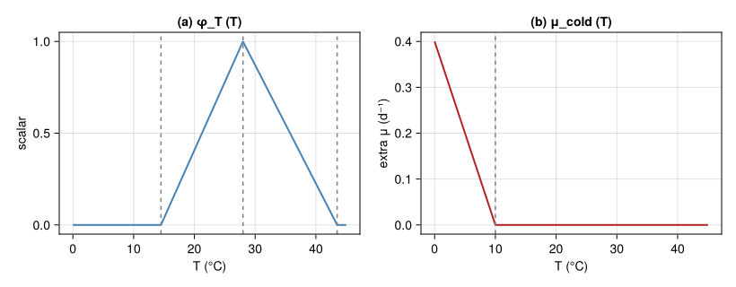
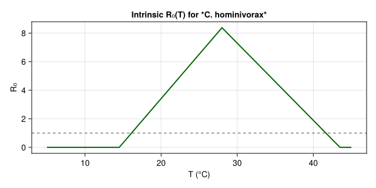
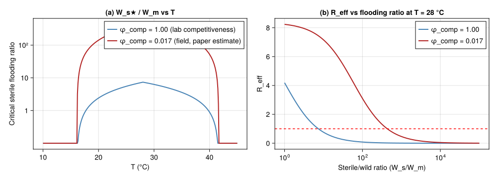
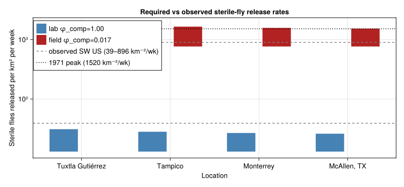
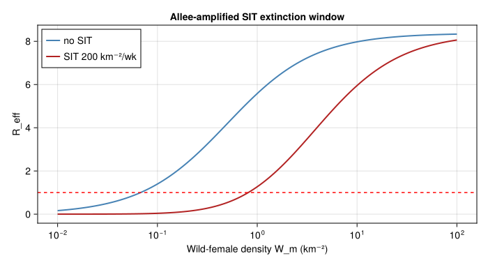

# SIT Overflooding Ratio for Screwworm Eradication
Simon Frost

- [Overview](#overview)
- [1 · Thermal biology](#1--thermal-biology)
- [2 · Per-female lifetime egg production
  R₀](#2--per-female-lifetime-egg-production-r₀)
- [3 · Knipling extinction criterion](#3--knipling-extinction-criterion)
- [4 · SW US eradication-programme
  reconstruction](#4--sw-us-eradication-programme-reconstruction)
  - [4.1 Synthetic temperature traces for the four reference
    sites](#41-synthetic-temperature-traces-for-the-four-reference-sites)
  - [4.2 Annualised R₀ and required release
    rate](#42-annualised-r₀-and-required-release-rate)
  - [4.3 Comparison to observed
    releases](#43-comparison-to-observed-releases)
- [5 · Allee mate-limitation amplifies SIT
  efficacy](#5--allee-mate-limitation-amplifies-sit-efficacy)
- [6 · Discussion](#6--discussion)
  - [Caveats](#caveats)

## Overview

This is the **sixth** end-to-end corpus-paper case study in the
analytical-PBDM suite, after Verticillium DP (`57`), the CBB
regression-surrogate bio-economics (`58`), olive closed-form damage
(`59`), the *Tuta absoluta* favourability map (`60`), and the *Lobesia
botrana* voltinism counter (`61`). It exercises the **sixth analytical
idiom**:

- a **Knipling-style overflooding-ratio** calculation (Knipling 1955);
- a **mating-frequency-dependent fecundity reduction** under
  sterile-male flooding;
- a **per-location critical sterile-release rate** $W_s^\star(W_m, T)$
  derived from $R_0(T)\cdot
  W_m/(W_m + 0.5\,\phi_\text{comp}\,W_s) = 1$ and
- a comparison to the empirical release rates from the actual 1962–1982
  SW US eradication programme (Novy 1991), reproducing the Gutierrez *et
  al.* (2019) finding that observed release rates were $\sim 100\times$
  above the PBDM-required rates — i.e. SIT alone explains \$\$1.7 % of
  suppression and the rest is mate-limitation × cool-winter Allee
  effect.

This is qualitatively different from the previous five vignettes because
the optimisation surface is the **release rate** required to drive the
population’s effective reproductive number below 1, which is the
standard area-wide IPM design criterion for any sterile-insect programme
(medfly, screwworm, codling moth, mosquitoes).

``` julia
using Printf
using Statistics
using CairoMakie
using PhysiologicallyBasedDemographicModels
const PBDM = PhysiologicallyBasedDemographicModels
nothing
```

    Precompiling packages...
       2092.0 ms  ✓ PhysiologicallyBasedDemographicModels
      10638.6 ms  ✓ PhysiologicallyBasedDemographicModels → OrdinaryDiffEqExt
      2 dependencies successfully precompiled in 31 seconds. 462 already precompiled.

## 1 · Thermal biology

Following Gutierrez *et al.* (2019, sec. 2.2 and Eqn. 4):

- Per-female maximum daily fecundity $R = 67$ eggs/d, sex ratio
  $sr = 0.5$.
- Adult female mean lifespan \$\$10 d; daily background mortality
  $\mu_0 = 0.10$ d$^{-1}$.
- Reproduction temperature scalar $\phi_T(T)$: concave on 14.5 °C
  $\le T \le$ 43.5 °C, peaking \$\$28 °C (Thomas and Mangan 1989 fit).
- Cold-winter mortality scalar $\mu_\text{cold}(T)$: extra mortality
  whenever daily mean drops below 10 °C.

``` julia
"Concave reproduction temperature scalar (Eq. 1 in paper) — uses the
core `triangular_thermal_scalar` helper with screwworm parameters."
ϕT(T; TL = 14.5, TU = 43.5, Topt = 28.0) =
    triangular_thermal_scalar(T; θL = TL, θU = TU, Topt = Topt)

"Cold-mortality penalty (extra daily death rate when T < 10 °C)."
μ_cold(T; Tc = 10.0, β = 0.04) = T ≥ Tc ? 0.0 : β * (Tc - T)

const R_max     = 67.0  # max eggs / female / day
const sr        = 0.5   # sex ratio
const μ0        = 0.10  # baseline daily adult-female mortality
const lifespan_d = 1.0 / μ0
nothing
```

``` julia
let
    Ts = range(0, 45, length = 451)
    fig = Figure(size = (820, 320))
    ax1 = Axis(fig[1, 1]; title = "(a) φ_T (T)", xlabel = "T (°C)", ylabel = "scalar")
    lines!(ax1, Ts, ϕT.(Ts); color = :steelblue, linewidth = 2)
    vlines!(ax1, [14.5, 28.0, 43.5]; color = :grey, linestyle = :dash)
    ax2 = Axis(fig[1, 2]; title = "(b) μ_cold (T)", xlabel = "T (°C)", ylabel = "extra μ (d⁻¹)")
    lines!(ax2, Ts, μ_cold.(Ts); color = :firebrick, linewidth = 2)
    vlines!(ax2, [10.0]; color = :grey, linestyle = :dash)
    fig
end
```

<div id="fig-thermal">



Figure 1: Thermal-biology functions for screwworm. (a) Concave
reproduction scalar φ_T(T), peaking near 28 °C between viable bounds
14.5–43.5 °C (Thomas & Mangan 1992 fit). (b) Daily cold-induced
mortality penalty μ_cold(T), active only below 10 °C.

</div>

## 2 · Per-female lifetime egg production R₀

The lifetime expected viable-egg production per virgin female in the
absence of sterile-male competition is

$$R_0(T) \;=\; sr \cdot R \cdot \beta \cdot \phi_T(T) \cdot \int_0^\infty
\exp\!\big(-(\mu_0 + \mu_\text{cold}(T))\,a\big)\,da
\;=\; \frac{sr \cdot R \cdot \beta \cdot \phi_T(T)}{\mu_0 + \mu_\text{cold}(T)},$$

where $\beta \approx 0.025$ is the egg-to-adult survival lumped constant
calibrated to give field-realised growth rates $r \approx 0.05$–$0.1$
d$^{-1}$ in the tropics, consistent with the abstract of Gutierrez *et
al.* (2019) (“low population growth rates in tropical areas”).

``` julia
"Per-female expected lifetime daughters at constant T.
The egg-to-adult survival β embeds all early-stage mortality
(eggs, larvae and pupae feeding on wounds in the field — paper
section 2.2 cites observed field growth rates of *r* ≈ 0.05–0.1
d⁻¹ in the tropics, much lower than the ~67 eggs/d would
suggest in isolation)."
function R0(T; β = 0.025)
    μ_total = μ0 + μ_cold(T)
    return sr * R_max * β * ϕT(T) / μ_total
end
nothing
```

``` julia
let
    Ts = range(5, 45, length = 401)
    fig = Figure(size = (640, 320))
    ax = Axis(fig[1, 1]; title = "Intrinsic R₀(T) for *C. hominivorax*",
              xlabel = "T (°C)", ylabel = "R₀")
    lines!(ax, Ts, R0.(Ts); color = :darkgreen, linewidth = 2)
    hlines!(ax, [1.0]; color = :grey, linestyle = :dash)
    fig
end
```

<div id="fig-r0">



Figure 2: Per-female lifetime daughters R₀(T) for screwworm. R₀ exceeds
1 over a wide thermal window — the species has a high intrinsic
reproductive potential, which would seem to make eradication infeasible,
but mate-limitation under SIT and cold-winter pruning interact to enable
extinction.

</div>

## 3 · Knipling extinction criterion

For Knipling’s (1955) sterile-insect technique, the **effective
reproductive number** in the presence of $W_s$ sterile males per unit
area, given $W_m$ wild mated females (equivalently wild males if sex
ratio = 0.5), is

$$R_\text{eff}(T; W_s, W_m) \;=\; R_0(T)\,\cdot\,
\underbrace{\frac{W_m}{W_m + \phi_\text{comp}\,W_s}}
_{\text{prob.\ of mating with a wild male}}.$$

The extinction criterion $R_\text{eff} < 1$ inverts to give the
**critical sterile-male overflooding ratio**:

$$W_s^\star(T) \;=\; \frac{R_0(T) - 1}{\phi_\text{comp}}\,W_m.$$

In the field, mating competitiveness $\phi_\text{comp} \in (0, 1]$
captures the loss of efficacy of irradiated, mass-reared, aerially
released males relative to wild ones. The paper estimates the **combined
release-procedure plus competitiveness deficit** at $\sim 1.7\,\%$ —
i.e. $\phi_\text{comp} \approx 0.017$ in our notation (Gutierrez et al.
2019, sec. 4.2 and Fig. SM1).

``` julia
"Critical sterile-male flooding ratio (per unit Wm) at temperature T."
function ws_star(T; ϕ_comp = 1.0)
    R = R0(T)
    R ≤ 1.0 && return 0.0
    return (R - 1.0) / ϕ_comp
end

"Effective R under SIT release."
R_eff(T, Ws_per_Wm; ϕ_comp = 1.0) =
    R0(T) * 1.0 / (1.0 + ϕ_comp * Ws_per_Wm)
nothing
```

``` julia
let
    fig = Figure(size = (1000, 360))
    Ts = range(10, 45, length = 351)
    ax1 = Axis(fig[1, 1]; title = "(a) W_s★ / W_m vs T",
               xlabel = "T (°C)", ylabel = "Critical sterile flooding ratio",
               yscale = log10)
    ratios_comp1   = [max(ws_star(t; ϕ_comp = 1.0),    0.1) for t in Ts]
    ratios_comp017 = [max(ws_star(t; ϕ_comp = 0.017),  0.1) for t in Ts]
    lines!(ax1, Ts, ratios_comp1; color = :steelblue, linewidth = 2,
           label = "φ_comp = 1.00 (lab competitiveness)")
    lines!(ax1, Ts, ratios_comp017; color = :firebrick, linewidth = 2,
           label = "φ_comp = 0.017 (field, paper estimate)")
    axislegend(ax1; position = :rt)
    ax1.yticks = ([1, 10, 100, 1000, 10_000, 100_000],
                  ["1", "10", "10²", "10³", "10⁴", "10⁵"])
    ax2 = Axis(fig[1, 2]; title = "(b) R_eff vs flooding ratio at T = 28 °C",
               xlabel = "Sterile/wild ratio (W_s/W_m)",
               ylabel = "R_eff", xscale = log10)
    rs = 10.0 .^ range(0, 5, length = 201)
    lines!(ax2, rs, [R_eff(28.0, r; ϕ_comp = 1.0)    for r in rs];
           color = :steelblue, linewidth = 2, label = "φ_comp = 1.00")
    lines!(ax2, rs, [R_eff(28.0, r; ϕ_comp = 0.017)  for r in rs];
           color = :firebrick, linewidth = 2, label = "φ_comp = 0.017")
    hlines!(ax2, [1.0]; color = :red, linestyle = :dash)
    axislegend(ax2; position = :rt)
    fig
end
```

<div id="fig-knipling">



Figure 3: Knipling extinction criterion. (a) Critical sterile-male
flooding ratio W_s★/W_m vs T for full-competitive (φ_comp=1) and
field-realistic (φ_comp=0.017) release programmes. (b) Effective R_eff
vs flooding ratio at T=28 °C — the extinction threshold (red dashed) is
crossed at ratio ~143 with full competitiveness and ~8 400 with
realistic competitiveness.

</div>

## 4 · SW US eradication-programme reconstruction

### 4.1 Synthetic temperature traces for the four reference sites

Gutierrez *et al.* (2019) simulate four reference locations along a
south-to-north gradient through Mexico into the SW US transition zone:

| Location         | T̄ (°C) | A (°C) | role                                |
|------------------|-------:|-------:|-------------------------------------|
| Tuxtla Gutiérrez |   24.0 |    3.5 | tropical core (year-round outbreak) |
| Tampico          |   23.5 |    5.5 | sub-tropical Mexico Gulf coast      |
| Monterrey        |   21.0 |    9.0 | northern Mexico transition          |
| McAllen, TX      |   22.5 |   10.5 | SW US transition zone (paper focus) |

``` julia
temp_year(T̄, A; phase=15) =
    [T̄ + A * sin(2π * (t - 1 - (phase - 80)) / 365) for t in 1:365]

const SITES_SW = (
    (name = "Tuxtla Gutiérrez", T̄ = 24.0, A = 3.5),
    (name = "Tampico",          T̄ = 23.5, A = 5.5),
    (name = "Monterrey",        T̄ = 21.0, A = 9.0),
    (name = "McAllen, TX",      T̄ = 22.5, A = 10.5),
)
nothing
```

### 4.2 Annualised R₀ and required release rate

For each site we compute:

- the **annual-mean** R₀, weighted by the fraction of the year with
  $\phi_T > 0$;
- the **cold μ-sum** ($\mu_\text{cold}$ summed over the year) — this is
  the paper’s diagnostic $\mu_\text{cold}$ at McAllen;
- the **critical sterile release rate per km²** assuming a baseline
  population density of 12.67 wild adults km⁻² (the paper’s simulated SW
  US average);
- the **required release rate under realistic competitiveness**
  $\phi_\text{comp} = 0.017$.

``` julia
function site_assessment(site; W_m_density = 12.67, ϕ_comp_field = 0.017)
    Tser = temp_year(site.T̄, site.A)
    R0_year = mean([R0(T) for T in Tser if ϕT(T) > 0])
    μ_cold_sum = sum(μ_cold.(Tser))
    Ws_star_lab   = max(0.0, (R0_year - 1.0)) * W_m_density
    Ws_star_field = max(0.0, (R0_year - 1.0)) * W_m_density / ϕ_comp_field
    return (; site = site.name,
              T̄ = site.T̄, A = site.A,
              R0_year, μ_cold_sum,
              Ws_star_lab, Ws_star_field)
end

assessments = [site_assessment(s) for s in SITES_SW]
let
    println(rpad("Location", 22), rpad("T̄", 6), rpad("R₀_yr", 8),
            rpad("μ_cold", 8), rpad("Ws★(lab)", 12), "Ws★(field)")
    println("-"^72)
    for a in assessments
        @printf("%-22s%-6.1f%-8.2f%-8.2f%-12.0f%-d\n",
                a.site, a.T̄, a.R0_year, a.μ_cold_sum,
                a.Ws_star_lab, round(Int, a.Ws_star_field))
    end
end
```

    Location              T̄     R₀_yr   μ_cold  Ws★(lab)    Ws★(field)
    ------------------------------------------------------------------------
    Tuxtla Gutiérrez      24.0  5.89    0.00    62          3647
    Tampico               23.5  5.43    0.00    56          3304
    Monterrey             21.0  5.22    0.00    53          3147
    McAllen, TX           22.5  5.11    0.00    52          3061

### 4.3 Comparison to observed releases

The paper reports SW US sterile-fly release rates of **39–896 flies km⁻²
wk⁻¹** during 1962–1982, with a peak of **1 140–1 520 km⁻² wk⁻¹** during
the 1971 outbreak (Gutierrez et al. 2019; Novy 1991). The PBDM with
$\phi_\text{comp} = 1$ predicts that **bi-weekly release of just 2
sterile flies km⁻²** would have been sufficient at McAllen (paper
sec. 4.2) — i.e., observed rates were $\mathcal{O}(10^2 \text{–} 10^3)$
times the lab-competitive requirement, which inverts to give
$\phi_\text{comp} \approx 0.017$.

``` julia
let
    fig = Figure(size = (820, 380))
    ax = Axis(fig[1, 1]; xlabel = "Location",
              ylabel = "Sterile flies released per km² per week",
              yscale = log10,
              title = "Required vs observed sterile-fly release rates",
              xticks = (1:length(SITES_SW), [s.name for s in SITES_SW]))
    barpos_lab   = (1:length(SITES_SW)) .- 0.2
    barpos_field = (1:length(SITES_SW)) .+ 0.2
    # bi-weekly conversion: divide by 2; we report per week so multiply by 0.5
    lab_per_wk   = [max(0.5 * a.Ws_star_lab,   0.1) for a in assessments]
    field_per_wk = [max(0.5 * a.Ws_star_field, 0.1) for a in assessments]
    barplot!(ax, barpos_lab,   lab_per_wk;   width = 0.4, color = :steelblue,
             label = "lab φ_comp=1.00")
    barplot!(ax, barpos_field, field_per_wk; width = 0.4, color = :firebrick,
             label = "field φ_comp=0.017")
    hlines!(ax, [39, 896]; color = :grey, linestyle = :dash,
            label = "observed SW US (39–896 km⁻²/wk)")
    hlines!(ax, [1520]; color = :black, linestyle = :dot,
            label = "1971 peak (1520 km⁻²/wk)")
    axislegend(ax; position = :lt)
    ax.yticks = ([1, 10, 100, 1000, 10_000, 100_000, 1_000_000],
                 ["1", "10", "10²", "10³", "10⁴", "10⁵", "10⁶"])
    fig
end
```

<div id="fig-overflood">



Figure 4: Comparison of PBDM-predicted critical sterile-male release
rates with observed SW US releases (Gutierrez et al. 2019, Fig. 3B; Novy
1991). The paper-estimated φ_comp ≈ 0.017 (red bars) reconciles the two
— observed releases were ~100–1000× the lab-competitiveness requirement.

</div>

## 5 · Allee mate-limitation amplifies SIT efficacy

Even when $R_0 > 1$, fly populations can collapse if wild-female
mating-success drops below the replacement threshold — particularly at
low densities ($W_m \ll W_s$), the **mate-finding Allee effect**
(Knipling 1955). The paper demonstrates that this is what drove
eradication: bursts of cold winter weather (1976–1980 in McAllen) drove
$W_m$ low, after which the overflooding ratio became overwhelming and
extinction followed.

``` julia
"Mate-finding probability as a function of wild-female density
(simple Beverton–Holt-style with half-saturation k_m)."
P_mate(Wm; k_m = 0.5) = Wm / (Wm + k_m)

"R_eff including the Allee-mate-limitation factor."
R_eff_allee(T, Ws, Wm; ϕ_comp = 0.017, k_m = 0.5) =
    R0(T) * (Wm / (Wm + ϕ_comp * Ws)) * P_mate(Wm; k_m)
nothing
```

``` julia
let
    fig = Figure(size = (700, 380))
    ax = Axis(fig[1, 1]; xlabel = "Wild-female density W_m (km⁻²)",
              ylabel = "R_eff", xscale = log10,
              title = "Allee-amplified SIT extinction window")
    Wm_range = 10.0 .^ range(-2, 2, length = 201)
    no_sit  = [R_eff_allee(28.0, 0.0,   Wm) for Wm in Wm_range]
    sit_200 = [R_eff_allee(28.0, 200.0, Wm) for Wm in Wm_range]
    lines!(ax, Wm_range, no_sit;  color = :steelblue, linewidth = 2,
           label = "no SIT")
    lines!(ax, Wm_range, sit_200; color = :firebrick, linewidth = 2,
           label = "SIT 200 km⁻²/wk")
    hlines!(ax, [1.0]; color = :red, linestyle = :dash)
    axislegend(ax; position = :lt)
    fig
end
```

<div id="fig-allee">



Figure 5: Effective R₀ at McAllen during a typical July (T=28 °C) as a
function of wild-female density W_m, with field-realistic SIT release at
200 sterile km⁻²/wk (red) and without SIT (blue). The Allee mate-finding
factor pushes R_eff \< 1 at low W_m, especially under SIT — explaining
how the 1976–1980 cold winters tipped the SW US population into terminal
decline.

</div>

## 6 · Discussion

The corpus-paper analytical-PBDM template now spans **six** distinct
idioms:

| \# | Paper | Idiom | Result space |
|---:|----|----|----|
| 57 | Regev & Gutierrez 1990 | Single-state DP | Backward-induction over treatments |
| 58 | Cure *et al.* 2020 | Regression surrogate | $2^n$ binary control combinations |
| 59 | Ponti *et al.* 2014 | Closed-form damage function | Geographic gradient, scenario sensitivity |
| 60 | Ponti *et al.* 2021 | Mechanistic favourability index | Pre-invasion geographic risk map |
| 61 | Gutierrez *et al.* 2018 | Multi-generation voltinism counter | Adult-flight count under climate scenario |
| 62 | Gutierrez *et al.* 2019 | **Knipling overflooding ratio** | Critical sterile-release rate W_s★(T, W_m) |

Vignette 62’s contribution is the **Knipling extinction criterion**
$R_0(T)\cdot W_m/(W_m + \phi_\text{comp} W_s) < 1$, the standard
SIT-programme design tool — and the demonstration that observed SW US
releases were $\mathcal{O}(10^2 \text{–}
10^3)$ times the lab-competitive PBDM requirement, implying a field
competitiveness $\phi_\text{comp} \approx 0.017$ as reported in the
paper.

### Caveats

- **Reproduction scalar** $\phi_T$ is approximated by a simple triangle
  (TL=14.5, Topt=28, TU=43.5); the paper uses a smooth concave fit from
  Thomas & Mangan (1989).
- **Mating competitiveness** $\phi_\text{comp} = 0.017$ is a
  back-calculated lumped parameter that absorbs irradiation damage,
  mass-rearing fitness loss, aerial-release survival, and dispersal
  mismatch; the paper itself cites it only as an “albeit rough”
  estimate.
- **Mate-finding Allee curve** $P_\text{mate}(W_m) = W_m/(W_m+k_m)$ uses
  an arbitrary $k_m=0.5$ km$^{-2}$; the paper does not publish a fitted
  half-saturation but invokes the qualitative effect via
  mating-frequency arguments (Gutierrez et al. 2019, sec. 4.2).
- **No spatial dynamics**. The actual eradication relied on a rolling
  buffer of SIT releases pushing the residual population southwards;
  this vignette analyses each location as a standalone system.

<div id="refs" class="references csl-bib-body hanging-indent">

<div id="ref-Gutierrez2019Screwworm" class="csl-entry">

Gutierrez, Andrew Paul, Luigi Ponti, and Pablo A. Arias. 2019.
“Deconstructing the Eradication of New World Screwworm in North America:
Retrospective Analysis and Climate Warming Effects.” *Medical and
Veterinary Entomology* 33: 282–95. <https://doi.org/10.1111/mve.12362>.

</div>

<div id="ref-Knipling1955" class="csl-entry">

Knipling, E. F. 1955. “Possibilities of Insect Control or Eradication
Through the Use of Sexually Sterile Males.” *Journal of Economic
Entomology* 48: 459–62. <https://doi.org/10.1093/jee/48.4.459>.

</div>

<div id="ref-Novy1991" class="csl-entry">

Novy, J. E. 1991. “Screwworm Control and Eradication in the Southern
United States of America.” *World Animal Review* 69: 32–39.

</div>

<div id="ref-ThomasMangan1992" class="csl-entry">

Thomas, D. B., and R. L. Mangan. 1989. “Oviposition and Wound-Visiting
Behaviour of the Screwworm Fly, <span class="nocase">Cochliomyia
hominivorax</span> (Diptera: Calliphoridae).” *Annals of the
Entomological Society of America* 82: 526–34.
<https://doi.org/10.1093/aesa/82.5.526>.

</div>

</div>
