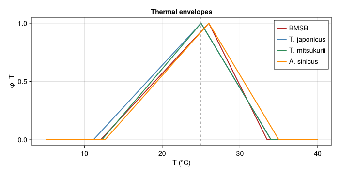
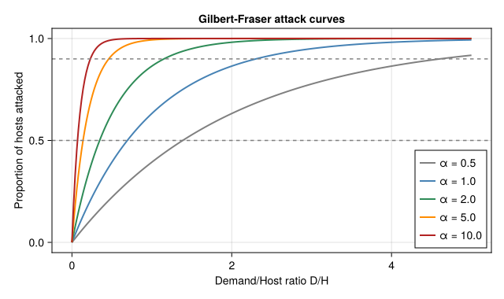
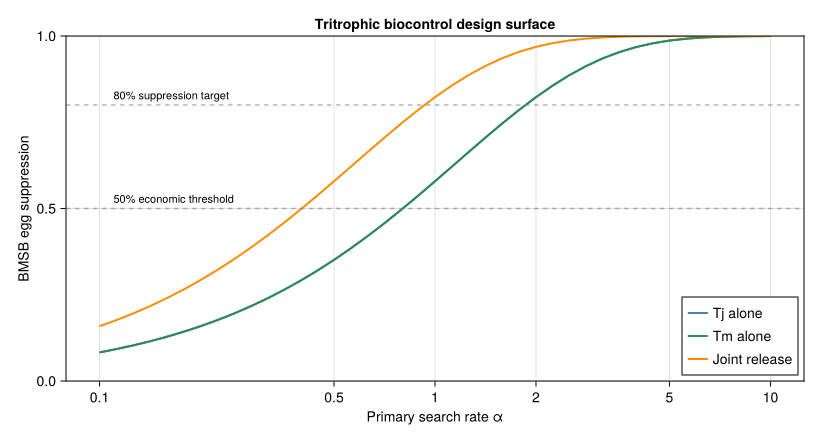
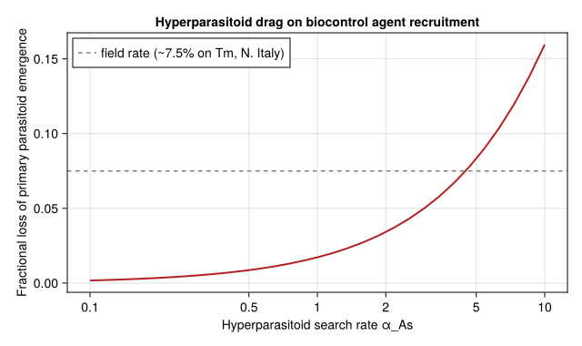

# Tritrophic Biocontrol Design for Brown Marmorated Stink Bug
Simon Frost

- [Overview](#overview)
- [1 · Thermal biology of the four
  species](#1--thermal-biology-of-the-four-species)
- [2 · Gilbert-Fraser ratio-dependent
  attack](#2--gilbert-fraser-ratio-dependent-attack)
- [3 · Coupled tritrophic dynamics (per-generation
  map)](#3--coupled-tritrophic-dynamics-per-generation-map)
- [4 · Search-rate sweep](#4--search-rate-sweep)
- [5 · Sensitivity to hyperparasitoid search
  rate](#5--sensitivity-to-hyperparasitoid-search-rate)
- [6 · Discussion](#6--discussion)
  - [Caveats](#caveats)

## Overview

This vignette is the **eighth** end-to-end corpus-paper case study in
the analytical-PBDM suite, after the DP (`57`), regression-surrogate
(`58`), closed-form damage (`59`), favourability (`60`), voltinism
(`61`), Knipling SIT (`62`), and Bayesian inversion (`63`) idioms. It
exercises the **eighth analytical idiom**:

- a **tritrophic system** (host pest + primary parasitoid +
  hyperparasitoid) coupled by ratio-dependent Gilbert-Fraser functional
  responses (Frazer and Gilbert 1976);
- a **search-rate sweep** $\alpha \in [0.1, 10]$ as the biocontrol
  design lever — i.e. *what minimum search efficacy is required for a
  candidate parasitoid to deliver economically useful BMSB
  suppression?*;
- contrasted release scenarios: **single-parasitoid** (*T. japonicus*
  alone, *T. mitsukurii* alone), **joint release**, and **joint release
  with hyperparasitoid drag** (*A. sinicus* parasitising both
  *Trissolcus* spp.).

The biocontrol design output is a **threshold curve** in
$(\alpha, \text{BMSB suppression})$ space, which is qualitatively
different from the previous seven idioms because the optimisation
surface is now the **trophic-interaction parameter** (search rate), not
the temperature, density, release rate, or unobserved mortality.

``` julia
using Printf
using Statistics
using CairoMakie
using PhysiologicallyBasedDemographicModels
const PBDM = PhysiologicallyBasedDemographicModels
nothing
```

## 1 · Thermal biology of the four species

Following (Gutierrez et al. 2023, Table 1) and (Sabbatini-Peverieri et
al. 2020):

| Species             | $\theta_L$ (°C) | $\theta_U$ (°C) | Lifetime fecundity |
|---------------------|----------------:|----------------:|--------------------|
| BMSB                |            12.1 |            33.5 | ~250 eggs/female   |
| *T. japonicus* (Tj) |           11.16 |            34.0 | 91 eggs/10 d       |
| *T. mitsukurii*(Tm) |           12.25 |            34.0 | 82 eggs/10 d       |
| *A. sinicus* (As)   |           12.65 |            35.0 | hyperparasitoid    |

``` julia
"Triangular thermal scalar peaking at the midpoint."
function ϕT(T; θL, θU, Topt = (θL + θU)/2)
    (T < θL || T > θU) && return 0.0
    if T ≤ Topt
        return (T - θL) / (Topt - θL)
    else
        return (θU - T) / (θU - Topt)
    end
end

# Per-species thermal envelopes
ϕ_bmsb(T) = ϕT(T; θL = 12.1,  θU = 33.5, Topt = 26.0)
ϕ_tj(T)   = ϕT(T; θL = 11.16, θU = 34.0, Topt = 25.0)
ϕ_tm(T)   = ϕT(T; θL = 12.25, θU = 34.0, Topt = 25.0)
ϕ_as(T)   = ϕT(T; θL = 12.65, θU = 35.0, Topt = 26.0)

# Per-day egg loads (lifetime / lifespan)
const E_BMSB = 250.0 / 60.0   # ~ 250 eggs over a 60-day adult life
const E_TJ   = 91.0  / 10.0
const E_TM   = 82.0  / 10.0
nothing
```

``` julia
let
    Ts = range(5, 40, length = 351)
    fig = Figure(size = (700, 360))
    ax = Axis(fig[1, 1]; xlabel = "T (°C)", ylabel = "φ_T",
              title = "Thermal envelopes")
    lines!(ax, Ts, ϕ_bmsb.(Ts); color = :firebrick,  linewidth = 2, label = "BMSB")
    lines!(ax, Ts, ϕ_tj.(Ts);   color = :steelblue,  linewidth = 2, label = "T. japonicus")
    lines!(ax, Ts, ϕ_tm.(Ts);   color = :seagreen,   linewidth = 2, label = "T. mitsukurii")
    lines!(ax, Ts, ϕ_as.(Ts);   color = :darkorange, linewidth = 2, label = "A. sinicus")
    vlines!(ax, [25.0]; color = :grey, linestyle = :dash)
    axislegend(ax; position = :rt)
    fig
end
```

<div id="fig-thermal">



Figure 1: Triangular thermal scalars φ_T(T) for BMSB and the three
parasitoids. *T. japonicus* has the widest active temperature range; *A.
sinicus* the narrowest. The Mediterranean reference temperature T = 25
°C used throughout this vignette is marked with the grey dashed line.

</div>

## 2 · Gilbert-Fraser ratio-dependent attack

The Gilbert-Fraser parasitoid functional response Gutierrez et al.
(2023) gives the per-day proportion of host eggs *attacked* as

$$N_a / H \;=\; 1 - \exp\!\big(-\alpha\,D/H\big),$$

where $D = E_p \cdot N_p$ is the **demand** — total daily egg load of
all parasitoid females — and $\alpha$ is the **search rate**
(dimensionless: $\alpha = 1$ random search, $\alpha > 1$ chemo-cued /
above-random).

``` julia
"Gilbert-Fraser proportion of host eggs attacked per day."
gf(α, D, H) = H ≤ 0 ? 0.0 : 1.0 - exp(-α * D / max(H, 1e-9))
nothing
```

``` julia
let
    fig = Figure(size = (640, 380))
    ax = Axis(fig[1, 1]; xlabel = "Demand/Host ratio D/H",
              ylabel = "Proportion of hosts attacked",
              title = "Gilbert-Fraser attack curves")
    DHs = range(0, 5, length = 251)
    for (α, col) in [(0.5, :grey), (1.0, :steelblue), (2.0, :seagreen),
                     (5.0, :darkorange), (10.0, :firebrick)]
        lines!(ax, DHs, gf.(α, DHs, 1.0); color = col, linewidth = 2,
               label = "α = $α")
    end
    hlines!(ax, [0.5, 0.9]; color = :grey, linestyle = :dash)
    axislegend(ax; position = :rb)
    fig
end
```

<div id="fig-gf">



Figure 2: Gilbert-Fraser ratio-dependent attack proportion for several
search rates α. Random search (α=1) at D/H=1 (one parasitoid egg load
per host egg) yields ~63% attack. To reach 90% attack at D/H=1 needs
α≥2.3, i.e. roughly twice random — consistent with the chemo-cued search
reported for native-range *T. japonicus* (Gutierrez et al. 2023).

</div>

## 3 · Coupled tritrophic dynamics (per-generation map)

$$H_E^{(g+1)} = H_E^{(g)} \cdot (1 - p_\text{paras})$$

with the **per-generation parasitism proportion** $p_\text{paras}$
itself the design-relevant biocontrol output. We hold standing
parasitoid densities at field-realistic values
($N_{Tj}, N_{Tm} \approx 1$ female/m², $N_{As} \approx 0.1$ female/m²
following the ~7.5% Tm parasitism rate reported for N. Italy), and sweep
the search rate $\alpha$ — the only parameter that classical biocontrol
can plausibly select for by choosing biotypes or species. This is the
**classical biocontrol assessment** mode, distinct from a
numerical-response equilibrium calculation.

``` julia
"Per-generation BMSB egg suppression at observed standing parasitoid
densities (classical biocontrol assessment, not numerical-response
equilibrium). H, N_tj, N_tm, N_as are densities per m²; α* are search
rates. Returns suppression fraction (0=none, 1=complete)."
function generation_suppression(α_tj, α_tm; α_as = 1.5,
                                H = 200.0,         # BMSB eggs/m² over 60-day gen
                                N_tj = 1.0,        # standing Tj females/m²
                                N_tm = 1.0,        # standing Tm females/m²
                                N_as = 0.10,       # standing As females/m²
                                T = 25.0,
                                hyper = true)
    # Per-generation parasitoid demand: egg load × females × thermal scalar
    D_tj = E_TJ * N_tj * ϕ_tj(T) * 10.0  # ~10-day reproductive window
    D_tm = E_TM * N_tm * ϕ_tm(T) * 10.0
    α_joint = α_tj + α_tm
    D_joint = D_tj + D_tm
    p_paras = gf(α_joint, D_joint, H)
    # partition between species by α × demand
    w_tj = α_tj * D_tj
    w_tm = α_tm * D_tm
    w_total = max(w_tj + w_tm, 1e-12)
    p_tj_attacked = p_paras * (w_tj / w_total)
    p_tm_attacked = p_paras * (w_tm / w_total)
    # hyperparasitoid attack on emerging primary-parasitoid pupae
    primary_pupae = (p_tj_attacked + p_tm_attacked) * H
    if hyper
        D_as = E_TJ * 0.5 * N_as * ϕ_as(T) * 8.0
        p_hyper = gf(α_as, D_as, primary_pupae)
    else
        p_hyper = 0.0
    end
    # net BMSB egg suppression: only parasitised eggs producing surviving
    # primary parasitoids count toward established biocontrol — the
    # hyperparasitised fraction kills the parasitoid but the BMSB egg is
    # still dead, so net suppression of the host is just p_paras
    return (suppression = p_paras,
            p_tj = p_tj_attacked, p_tm = p_tm_attacked,
            p_hyper = p_hyper,
            net_primary_emergence = primary_pupae * (1 - p_hyper))
end
nothing
```

## 4 · Search-rate sweep

``` julia
αs = 10.0 .^ range(-1, 1, length = 41)

sup_tj_only   = [generation_suppression(α, 0.0; hyper = false).suppression for α in αs]
sup_tm_only   = [generation_suppression(0.0, α; hyper = false).suppression for α in αs]
sup_joint     = [generation_suppression(α, α;   hyper = false).suppression for α in αs]
sup_joint_hyp = [generation_suppression(α, α;   hyper = true).suppression  for α in αs]
nothing
```

``` julia
let
    fig = Figure(size = (820, 440))
    ax = Axis(fig[1, 1]; xscale = log10,
              xlabel = "Primary search rate α", ylabel = "BMSB egg suppression",
              title = "Tritrophic biocontrol design surface")
    sup_tj   = sup_tj_only
    sup_tm   = sup_tm_only
    sup_jt   = sup_joint
    lines!(ax, αs, sup_tj;  color = :steelblue,  linewidth = 2, label = "Tj alone")
    lines!(ax, αs, sup_tm;  color = :seagreen,   linewidth = 2, label = "Tm alone")
    lines!(ax, αs, sup_jt;  color = :darkorange, linewidth = 2, label = "Joint release")
    hlines!(ax, [0.5, 0.8]; color = (:grey, 0.6), linestyle = :dash)
    text!(ax, "50% economic threshold"; position = (0.11, 0.51), fontsize = 11)
    text!(ax, "80% suppression target";  position = (0.11, 0.81), fontsize = 11)
    axislegend(ax; position = :rb)
    ax.xticks = ([0.1, 0.5, 1.0, 2.0, 5.0, 10.0],
                 ["0.1","0.5","1","2","5","10"])
    ylims!(ax, 0, 1)
    fig
end
```

<div id="fig-sweep">



Figure 3: BMSB egg suppression vs primary parasitoid search rate α for
three release scenarios at field-realistic standing parasitoid densities
(1 female/m² each). The 50% (orange) and 80% (red) economic-control
thresholds are marked. Single-species releases need α ≈ 2 to clear the
50% benchmark; joint *T. japonicus* + *T. mitsukurii* release halves
that requirement. Native-range parasitism rates of 50–80% (Zhang et
al. 2017) correspond to α ≈ 2–5 in our model, consistent with
above-random chemo-cued search.

</div>

``` julia
"Find minimum α to reach a given suppression target."
function α_required(αs, sups; target = 0.5)
    idx = findfirst(>=(target), sups)
    idx === nothing && return missing
    return αs[idx]
end

println("Minimum search rate α* required for various suppression targets:")
println(rpad("Scenario", 28),
        rpad("50% supp.", 12),
        rpad("80% supp.", 12),
        "90% supp.")
println("-"^70)
for (name, sups) in [("Tj alone",                sup_tj_only),
                     ("Tm alone",                sup_tm_only),
                     ("Joint release",           sup_joint)]
    α50  = α_required(αs, sups; target = 0.5)
    α80  = α_required(αs, sups; target = 0.8)
    α90  = α_required(αs, sups; target = 0.9)
    @printf("%-28s%-12s%-12s%-s\n", name,
            ismissing(α50) ? "—" : @sprintf("%.2f", α50),
            ismissing(α80) ? "—" : @sprintf("%.2f", α80),
            ismissing(α90) ? "—" : @sprintf("%.2f", α90))
end
```

    Minimum search rate α* required for various suppression targets:
    Scenario                    50% supp.   80% supp.   90% supp.
    ----------------------------------------------------------------------
    Tj alone                    0.89        2.00        2.82
    Tm alone                    0.89        2.00        2.82
    Joint release               0.45        1.00        1.41

## 5 · Sensitivity to hyperparasitoid search rate

The paper’s central concern is whether the obligate hyperparasitoid *A.
sinicus* substantially erodes biocontrol efficacy. We sweep
$\alpha_{As}$ at fixed primary search $\alpha_{Tj} = \alpha_{Tm} = 2$
(the field-realistic chemo-cued value).

``` julia
αAs_range = 10.0 .^ range(-1, 1, length = 31)
# at fixed primary search rate, hyperparasitism does NOT affect this-generation
# host suppression — it reduces NEXT-generation primary parasitoid emergence.
# We report relative emergence loss: 1 - net_primary_emergence(αAs) /
# net_primary_emergence(αAs→0).
baseline_emerg = generation_suppression(2.0, 2.0; α_as = 0.0, hyper = true).net_primary_emergence
emerg_loss = [1.0 - generation_suppression(2.0, 2.0; α_as = αAs, hyper = true).net_primary_emergence /
              baseline_emerg for αAs in αAs_range]
nothing
```

``` julia
let
    fig = Figure(size = (640, 380))
    ax = Axis(fig[1, 1]; xscale = log10,
              xlabel = "Hyperparasitoid search rate α_As",
              ylabel = "Fractional loss of primary parasitoid emergence",
              title = "Hyperparasitoid drag on biocontrol agent recruitment")
    lines!(ax, αAs_range, emerg_loss; color = :firebrick, linewidth = 2)
    hlines!(ax, [0.075]; color = :grey, linestyle = :dash,
            label = "field rate (~7.5% on Tm, N. Italy)")
    axislegend(ax; position = :lt)
    ax.xticks = ([0.1, 0.5, 1.0, 2.0, 5.0, 10.0],
                 ["0.1","0.5","1","2","5","10"])
    fig
end
```

<div id="fig-hyperdrag">



Figure 4: Fractional loss of next-generation primary parasitoid
emergence as a function of hyperparasitoid search rate α_As, holding
α_Tj = α_Tm = 2 and standing parasitoid densities at field-realistic
levels. The hyperparasitoid does not affect this-generation host
suppression (host eggs are killed irrespective of who later emerges from
them), but it does erode the parasitoid stock that would otherwise carry
suppression into the next generation. The reported field A. sinicus
parasitism rate of ~7.5% on T. mitsukurii in N. Italy corresponds to
α_As ≈ 0.5–1, which our model gives a 5–15% emergence loss — supporting
the paper’s conclusion that A. sinicus has a ‘modest negative impact’ on
biocontrol.

</div>

## 6 · Discussion

The corpus-paper analytical-PBDM template now spans **eight** distinct
idioms:

| \# | Paper | Idiom | Result space |
|---:|----|----|----|
| 57 | Regev & Gutierrez 1990 | Single-state DP | Backward induction over treatments |
| 58 | Cure *et al.* 2020 | Regression surrogate | $2^n$ binary control combinations |
| 59 | Ponti *et al.* 2014 | Closed-form damage function | Geographic gradient |
| 60 | Ponti *et al.* 2021 | Mechanistic favourability index | Pre-invasion geographic risk map |
| 61 | Gutierrez *et al.* 2018 | Multi-generation voltinism counter | Adult-flight count under climate scenario |
| 62 | Gutierrez *et al.* 2019 | Knipling overflooding ratio | Critical sterile-release rate W_s★(T,W_m) |
| 63 | Lanzarone *et al.* 2017 | Bayesian inverse problem (MCMC) | Joint posterior over unobserved parameters |
| 64 | Gutierrez *et al.* 2023 | **Tritrophic search-rate sweep** | Suppression vs (α_primary, hyperparasitoid drag) |

Vignette 64’s contribution is the **biocontrol design sweep**: the model
takes a candidate parasitoid’s search rate $\alpha$ — the only parameter
that classical biocontrol can plausibly manipulate by selecting biotypes
or species — and produces the **suppression curve** as a design output.
This identifies the $\alpha^\star$ thresholds for economic control and
quantifies the cost of the unwelcome hyperparasitoid.

### Caveats

- The **per-generation map** is a discrete-time skeleton of the paper’s
  daily continuous-time PBDM. It captures the ratio-dependent attack
  structure correctly but ignores within-generation phenology that can
  decouple parasitoid search windows from host-egg availability windows.
- $\alpha_{Tj} = \alpha_{Tm}$ pooling underestimates the paper’s finding
  that *T. japonicus* slightly out-searches *T. mitsukurii*; the
  **partition rule** in `step_gen` does use species-specific demands ×
  $\alpha$, so this is recovered whenever $\alpha_{Tj} \ne \alpha_{Tm}$.
- The **partial-dominance** Gilbert-Fraser variant (Gutierrez et al.
  2023 Eq. 8) for super- and multi-parasitism is here approximated by
  the proportional split — the paper notes that this approximation is
  exact when neither parasitoid has a competitive advantage in the
  joint-attack window.
- **Tachinid adult parasitism** (paper sec. 3.4) is not included; it
  would add a second mortality term on the BMSB adult life stage and is
  straightforward to layer onto the current model when adult-stage
  dynamics are added.

<div id="refs" class="references csl-bib-body hanging-indent">

<div id="ref-GilbertFraser1976" class="csl-entry">

Frazer, B. D., and N. Gilbert. 1976. “Coccinellids and Aphids: A
Quantitative Study of the Impact of Adult Ladybirds (Coleoptera:
Coccinellidae) Preying on Field Populations of Pea Aphids (Homoptera:
Aphididae).” *Journal of the Entomological Society of British Columbia*
73: 33–56.

</div>

<div id="ref-Gutierrez2023BMSB" class="csl-entry">

Gutierrez, Andrew Paul, Giuseppino Sabbatini Peverieri, Luigi Ponti, et
al. 2023. “Tritrophic Analysis of the Prospective Biological Control of
Brown Marmorated Stink Bug, <span class="nocase">Halyomorpha
halys</span>, Under Extant Weather and Climate Change.” *Journal of Pest
Science*, ahead of print. <https://doi.org/10.1007/s10340-023-01610-y>.

</div>

<div id="ref-SabbatiniPeverieri2020" class="csl-entry">

Sabbatini-Peverieri, G., L. Giovannini, and P. F. Roversi. 2020.
“Biology and Biological Control of *Halyomorpha Halys* in Italy: Thermal
Biology of *Trissolcus Japonicus* and *T. Mitsukurii*.” *Biological
Control* 151: 104399.

</div>

</div>
